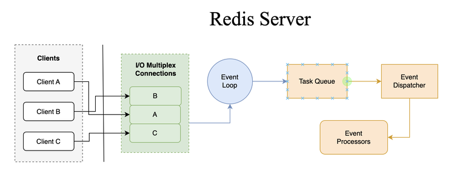

# Today I Learned

## 인증/인가는 어디에 구현해야 할까?

- [인증/인가는 어디에 어떻게 구현해야 할까?](https://dev.gmarket.com/45)

## 쿠폰 발급 시스템

- [효율적인 쿠폰 발급 시스템 구현을 위한 기술적 접근](https://f-lab.kr/insight/efficient-coupon-system-20240909)
- [쿠폰 발급 시스템 디자인](https://velog.io/@pranne1224/%EC%BF%A0%ED%8F%B0-%EB%B0%9C%EA%B8%89-%EC%8B%9C%EC%8A%A4%ED%85%9C-%EB%94%94%EC%9E%90%EC%9D%B8)

# Today I Interview

## Redis가 싱글 스레드로 만들어진 이유를 설명해주세요.

> Redis가 단일 스레드(single-threaded)로 설계된 이유는 주로 **성능 최적화**, **복잡성 감소**, 그리고 **데이터 일관성** 유지에 있습니다.
>
> 단일 스레드 모델은 멀티스레드 모델에 비해 **설계와 구현이 상대적으로 간단**합니다. 멀티스레드 환경에서는 **동시성 문제**(레이스 컨디션, 데드락 등)를 처리하기 위해 복잡한 동기화 메커니즘이 필요하지만, 단일 스레드 환경에서는 이런 문제를 자연스럽게 회피할 수 있습니다.
>
> 동시에 여러 스레드가 동일한 데이터를 수정하려고 할 때 발생할 수 있는 **데이터 불일치 문제를 방지**합니다. 모든 명령어가 순차적으로 처리되기 때문에, 복잡한 락(lock) 메커니즘 없이도 데이터의 일관성을 자연스럽게 유지할 수 있습니다.
>
> Redis는 주로 메모리 내에서 빠르게 수행되는 I/O 작업을 처리하는 인메모리 데이터베이스로 설계되어, **매우 빠른 응답 시간**을 제공합니다. 단일 스레드 이벤트 루프(event loop)를 사용함으로써 컨텍스트 스위칭(Context Switching)에 소요되는 오버헤드를 최소화할 수 있습니다.
>
> Redis는 **이벤트 기반(event-driven) 아키텍처**를 채택하여 네트워크 요청을 효율적으로 처리합니다. 단일 스레드 이벤트 루프는 비동기적으로 여러 클라이언트의 요청을 처리할 수 있으며, 이를 통해 높은 동시성을 구현할 수 있습니다. 멀티스레드 모델에서는 이러한 비동기 처리의 이점을 충분히 활용하기 어려울 수 있습니다.
>
> 
>
> Redis 6.0 부터 클라이언트로 부터 전송된 네트워크를 읽는 부분과 전송하는 I/O 부분은 멀티 스레드를 지원합니다. 하지만 실행하는 부분은 싱글 스레드로 동작하기 때문에 기존과 같이 Atomic을 보장합니다.

## 추가 학습 자료

- [Redis - Diving Into Redis 6.0](https://redis.io/blog/diving-into-redis-6/)
- [Why the heck Single-Threaded Redis is Lightning fast? Beyond In-Memory Database Label](https://www.linkedin.com/pulse/why-heck-single-threaded-redis-lightning-fast-beyond-in-memory-kapur/)
- [[입 개발] Redis 6.0 – ThreadedIO를 알아보자.](https://charsyam.wordpress.com/2020/05/05/%EC%9E%85-%EA%B0%9C%EB%B0%9C-redis-6-0-threadedio%EB%A5%BC-%EC%95%8C%EC%95%84%EB%B3%B4%EC%9E%90/)
