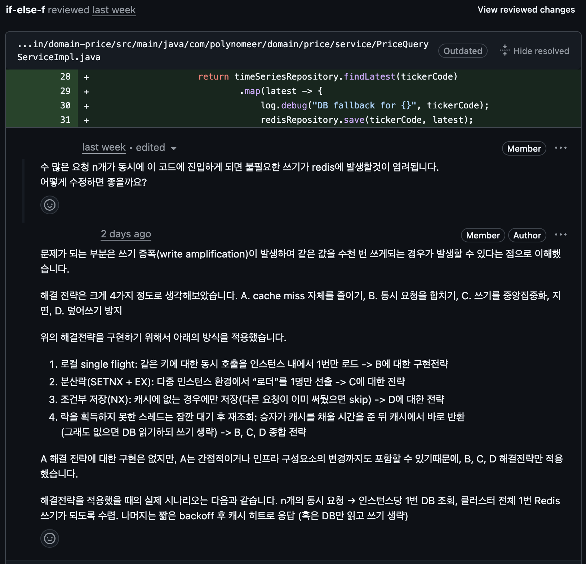

## 에프랩(F-Lab) 코스명 2개월 후기

에프랩(F-Lab)에서 코스명을 시작한 지 벌써 2개월이 지났다. 지난 기간 동안 가장 크게 느낀 점은 **체계적인 학습 환경과 꾸준한 피드백의 힘**이었다. 혼자 공부할 때는 놓치기 쉬운 기본기와 습관들을 다시 다잡을 수 있었고, 작은 성과들이 쌓이면서 확실한 성장감을 얻을 수 있었다. 단순히 지식을 쌓는 것을 넘어서, 문제를 접근하는 사고방식과 태도 자체가 많이 달라졌다.

처음에는 빠르게 결과를 내는 데에만 집중하다 보니, 기초를 소홀히 했던 부분이 있었다. 하지만 멘토링 과정에서 반복적으로 강조되는 기본 개념들을 다시 점검하면서, **“탄탄한 기초 없이는 결코 멀리 갈 수 없다”**는 사실을 절실히 깨달았다. 덕분에 작은 실수 하나하나가 앞으로의 큰 성장 밑거름이 될 수 있다는 점을 배웠다.

### 멘토님에 대한 만족도

멘토님의 실력과 성실함에는 항상 놀랐다. 단순히 정답을 알려주는 것이 아니라, 스스로 생각해보고 답을 찾아갈 수 있도록 유도해주시는 방식이 인상 깊었다. 가끔은 답답하기도 했지만, 시간이 지나면서 그 과정이 얼마나 중요한지 알게 되었다. 덕분에 **‘문제를 해결하는 힘’**이 길러지고 있다는 걸 실감했다.

또한 멘토님은 **TCP/IP, DB, OS, Spring**처럼 변하지 않는 것들을 학습하는 것이 중요하다고 하셨다. 이 말은 기본 원리가 아주 잘 설계되어 있어서 현대의 애플리케이션이나 Kafka, Redis, MongoDB 같은 새로운 것들이 계속 나오더라도, 근본적으로는 이런 변하지 않는 것들의 원리를 차용한다는 뜻이었다. 실제로 OS의 멀티스레딩 개념이 다양한 애플리케이션이나 서버 기술에 그대로 적용되는 것처럼 말이다. 이 이야기를 들으면서 눈앞의 유행을 쫓는 것보다, **근본적인 원리**를 이해하는 것이 장기적으로 훨씬 가치 있다는 사실을 깨달았다.

### 면접 스킬과 Deep-Dive 경험

지난 2개월 동안 특히 인상 깊었던 부분은 **면접 스킬 관련 멘토링**이었다. 내 답변을 통해 면접 방향을 제 쪽으로 유도하는 방법, 그리고 자신 있는 기술 위주로 시간을 쓸 수 있도록 이끌어주는 전략이 정말 인상적이었다. 실제 면접 상황에서 “내가 주도권을 쥔다”는 것이 어떤 의미인지 몸소 느낄 수 있었다.

또한 deep-dive 방향 선정에 있어서도 큰 도움을 받았다. 이전에는 면접형식의 질의응답에서 2~3 depth 이상 꼬리 질문이 들어오면 제대로 답변하지 못하곤 했다. 하지만 멘토링을 통해 어떤 부분을 깊이 파야 하고, 어떤 부분은 불필요하게 시간을 쓰지 말아야 하는지 구체적인 가이드를 얻을 수 있었다. 덕분에 부족한 지점을 정확히 파악하고 보완 학습을 할 수 있었고, 지금은 훨씬 자신감 있는 태도로 면접을 준비할 수 있게 되었다.

### 최근 1개월간 좋았던 점

지난 1개월 동안은 실전과 가까운 프로젝트 경험이 가장 좋았다. 실제 상황을 반영한 과제를 수행하면서, 단순한 학습이 아닌 **현업 감각**을 익힐 수 있었다.

프로젝트 과정에서 가장 유익했던 부분 중 하나는 **코드 리뷰**였다. 생각 없이 추가했던 의존성이나 라이브러리 사용, 그리고 캐싱 전략 같은 부분까지 멘토님이 꼼꼼하게 짚어주셨다. 덕분에 단순히 동작하는 코드를 작성하는 것에서 벗어나, **왜 이 선택이 맞는지, 장기적으로 어떤 영향을 미칠 수 있는지**를 진지하게 고민해볼 기회를 가질 수 있었다. 이런 피드백을 통해 단순한 학습이 아닌 **실무적 감각과 설계적 사고**까지 체득할 수 있었다.

또 멘토님과 동료 학습자들과의 코드 리뷰 과정을 통해 다양한 시각을 접할 수 있었고, 내 접근 방식의 장단점을 객관적으로 파악할 수 있었다.

### 앞으로..

짧다면 짧은 2개월이었지만, 돌아보면 정말 많은 성장을 했다. 단순히 기술적인 부분뿐만 아니라, 문제를 대하는 태도, 꾸준함의 가치, 그리고 함께 성장하는 즐거움을 배울 수 있었다. 특히 면접 준비와 프로젝트 리뷰 과정에서 얻은 **전략적 사고와 실무적 감각**은 앞으로의 커리어에서 큰 자산이 될 거라고 확신했다.

앞으로 남은 과정도 성실하게 임해서 끝까지 완주하고 싶다. 무엇보다 이런 기회를 만들어주신 에프랩(F-Lab)과 멘토님께 진심으로 감사하다!
