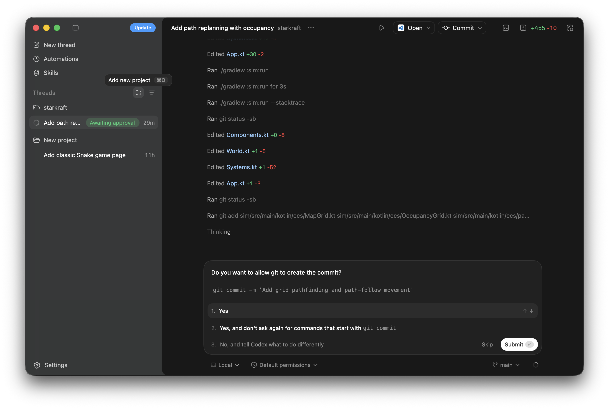

최근에 Codex를 본격적으로 사용해보았다. 나는 AI 에이전트를 능숙하게 다루지는 못하기 때문에 Claude Code보다는 오히려 Codex가 UI/UX 측면에서는 훌륭하다고 느꼈다. 현시점에서 가장 큰 차이점은 Claude Code에서 GUI기반의 데스크톱 앱을 지원하지 않는다는 것이다. 나는 개인적으로 GUI로 충분히 가능한 기능을 CLI를 통해서 익히는 것을 선호하지 않는다.

그리고 새로운 프로젝트를 시작하지보다는 기존의 프로젝트를 AI 에이전트로 읽고 이어서 개발을 진행하는 경우가 더 많을 것 같은데, 이런 측면에서 소규모의 프로젝트에서는 Codex가 유리하다는 글도 있다. 이 부분은 나중에 직접 테스트 해봐야겠다.

기존에 존재하는 프로젝트를 import하고 ChatGPT로 영문 프롬프트를 작성해달라고 해보았다. 그 프롬프트를 입력했는데 현재의 프로젝트와 구조가 달라서 그대로 진행할 수 없다고 했다. 결국 그냥 프로젝트를 읽어서 알아서 다음 스텝을 진행해달라고 했더니 아주 청산유수로 개발을 한다.

기능면에서는 Claude Code와 거의 차이가 없는것 같다. 개인적으로 입문 단계에서는 Codex가 압도적으로 훌륭하다. 정교함에 있어서 Claude Code가 우수하다는 평가가 많은데, 이 부분에 있어서도 Codex가 어느정도는 따라잡지 않을까싶다. 결국에는 Claude는 UI/UX 친화적으로 개선될거고, Codex도 성능과 퀄리티면에서 개선되지 않을까?

> - Claude Code → 시니어 개발자처럼 설명하며 작성
>
> - Codex → 빠르게 코드를 쓰는 인턴 같은 스타일
>
>   [출처] https://www.codegpt.co/blog/claude-code-vs-openai-codex

