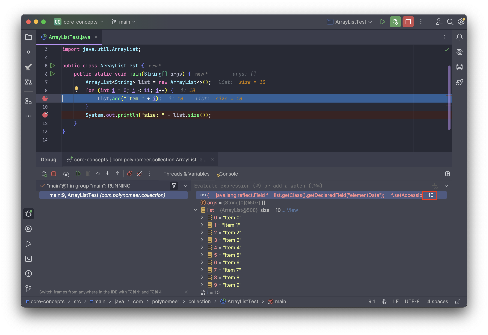
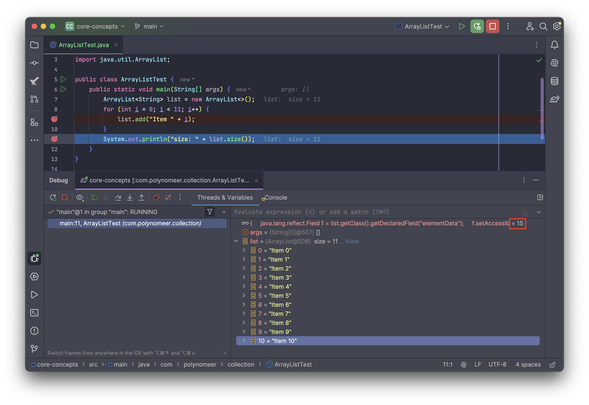
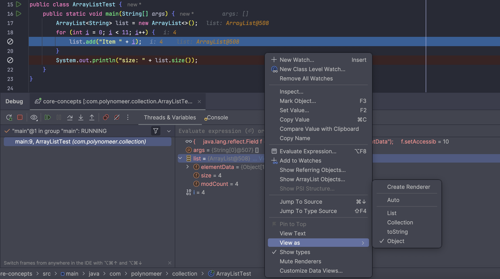

## ArrayList 배열확장

`ArrayList`는 내부적으로 **배열**(`Object[] elementData`)을 사용하여 요소를 저장한다. 이 배열은 고정 크기이기 때문에, `ArrayList`는 **동적으로 크기를 늘리는 방식**으로 작동한다. 이 과정에서 **배열의 용량(capacity)**이 가득 차면 **기존 배열보다 더 큰 새로운 배열을 생성**하고, **기존 요소들을 복사**하여 저장하게 된다.

이제 “**두 배가 되면 어떻게 동작하는가?**”를 정확히 이해하기 위해 `ArrayList`의 **확장 로직**을 JDK 소스 기반으로 단계별로 설명하려고 한다. 단, 여기서 주의할 점은 JDK 배포판과 버전에 따라 일부 최적화 코드나 확장전략이 달라질 수 있다는 점이다. 따라서 이 구현을 설명할때는 JDK 배포판의 종류와 버전을 명시하는 것이 혼란을 줄일 수 있다.

------

## OpenJDK 1.8 (Java8)

macOS의 M1아키텍처에서 OpenJDK 1.8이 지원되지는 않는것으로 확인되어서, 가장 OpenJDK 표준을 따르는 구현체인 `Azul Zulu 1.8.0_452 - aarch64`를 사용하였다.

### 기본 구조

```java
public class ArrayList<E> extends AbstractList<E>
        implements List<E>, RandomAccess, Cloneable, java.io.Serializable
{
    private static final long serialVersionUID = 8683452581122892189L;

    /**
     * Default initial capacity.
     */
    private static final int DEFAULT_CAPACITY = 10;

    /**
     * Shared empty array instance used for empty instances.
     */
    private static final Object[] EMPTY_ELEMENTDATA = {};

    /**
     * Shared empty array instance used for default sized empty instances. We
     * distinguish this from EMPTY_ELEMENTDATA to know how much to inflate when
     * first element is added.
     */
    private static final Object[] DEFAULTCAPACITY_EMPTY_ELEMENTDATA = {};

    /**
     * The array buffer into which the elements of the ArrayList are stored.
     * The capacity of the ArrayList is the length of this array buffer. Any
     * empty ArrayList with elementData == DEFAULTCAPACITY_EMPTY_ELEMENTDATA
     * will be expanded to DEFAULT_CAPACITY when the first element is added.
     */
    transient Object[] elementData; // non-private to simplify nested class access

    /**
     * The size of the ArrayList (the number of elements it contains).
     *
     * @serial
     */
    private int size;
  
    /**
     * Constructs an empty list with the specified initial capacity.
     *
     * @param  initialCapacity  the initial capacity of the list
     * @throws IllegalArgumentException if the specified initial capacity
     *         is negative
     */
    public ArrayList(int initialCapacity) {
        if (initialCapacity > 0) {
            this.elementData = new Object[initialCapacity];
        } else if (initialCapacity == 0) {
            this.elementData = EMPTY_ELEMENTDATA;
        } else {
            throw new IllegalArgumentException("Illegal Capacity: " + initialCapacity);
        }
    }

    /**
     * Constructs an empty list with an initial capacity of ten.
     */
    public ArrayList() {
        this.elementData = DEFAULTCAPACITY_EMPTY_ELEMENTDATA;
    }
```

구현체를 보면 List 인터페이스를 포함한 필수 인터페이스를 구현하고 있다.

DEFAULT_CAPACITY는 10으로 설정되어있다. 참고로, 이 값은 메모리 낭비를 최소화하면서도 대부분의 일반적인 용도에서 리사이징을 피하기 위한 적절한 값이라고 한다. 하지만 이에 대한 정확한 근거가 있는것은 아닌것 같고, 그냥 초창기에 자바의 개발당시 제한된 메모리에서 너무 크지도, 너무 작지도 않게 효율적인 값이라고 경험적으로 선택한 것 같다.

EMPTY_ELEMENTDATA는 ArrayLIst가 비어있을 때 내부 배열을 가리키는 용도로 사용된다. 하지만 `new ArrayList(0)`처럼 명시적으로 초기 용량을 0으로 생성할때만 사용된다.

DEFAULTCAPACITY_EMPTY_ELEMENTDATA는 기본 생성자 (`new ArrayList()`)에서 사용. 향후 **기본 용량 (10)**으로 확장될 준비 상태로 사용된다.

따라서 `EMPTY_ELEMENTDATA`는 정말로 비워 두는 용도이고, `DEFAULTCAPACITY_EMPTY_ELEMENTDATA`는 *지연 초기화*를 위한 용도이다.

왜 이런식으로 구현했을까? 이는 성능과 메모리 최적화를 위해서이다. `new ArrayList()`라고 했을 때, 바로 내부 배열을 10칸 할당하지 않는다. `EMPTY_ELEMENTDATA` 또는 `DEFAULTCAPACITY_EMPTY_ELEMENTDATA`를 통해 메모리를 절약한 채로 시작한다. 실제로 요소가 추가되는 시점에서 비로소 배열을 할당한다. 이는 **lazy initialization (지연 초기화)** 전략이다.

------

## 배열의 확장 과정

```java
/**
 * Appends the specified element to the end of this list.
 *
 * @param e element to be appended to this list
 * @return <tt>true</tt> (as specified by {@link Collection#add})
 */
public boolean add(E e) {
    ensureCapacityInternal(size + 1);  // Increments modCount!!
    elementData[size++] = e;
    return true;
}
```

add에서 ensureCapacityInternal에 size + 1을 인자로 호출하는데, 이 메소드를 타고 들어가보면 calulateCapacity 메소드를 호출하여 계산한다.

`ArrayList`의 **11번째 요소 추가 시 동작**을 JDK 내부 소스 코드 관점에서 상세히 살펴보자.

### 분석 대상 메서드 흐름

우리가 호출하는 것은 단순한 `list.add(element)`, 내부적으로는 다음 메서드들이 연쇄적으로 호출된다.

```
add(E e)
└── ensureCapacityInternal(size + 1)
    └── ensureExplicitCapacity()
        └── grow(minCapacity)
            └── Arrays.copyOf()
```

1. `add(E e)` – 요소 추가 시작

```java
public boolean add(E e) {
    ensureCapacityInternal(size + 1);  // 11일 경우: ensureCapacityInternal(11)
    elementData[size++] = e;
    return true;
}
```

add 내부를 보면 ensureCapacityInternal라는 메소드를 호출한다. 이 메소드는 추가하려는 요소를 넣기 전에 충분한 용량이 있는지 확인하는 메소드이다.

2. `ensureCapacityInternal(int minCapacity)`

```java
private void ensureCapacityInternal(int minCapacity) {
    ensureExplicitCapacity(calculateCapacity(elementData, minCapacity));
}
```

내부에서 연쇄적으로 호출하는데, 우선 가장 안쪽의 인자로 넘겨지는 calculateCapacity()를 살펴보자.

`calculateCapacity(...)`

```java
private static int calculateCapacity(Object[] elementData, int minCapacity) {
    if (elementData == DEFAULTCAPACITY_EMPTY_ELEMENTDATA) {
        return Math.max(DEFAULT_CAPACITY, minCapacity); // 10 또는 요청한 값 중 큰 값
    }
    return minCapacity;
}
```

ArrayList가 기본 생성자로 생성된 초기의 빈 상태일 경우, `DEFAULT_CAPACITY = 10`을 기준으로 설정된다. 우리가 이미 10개 넣은 후 11번째를 넣는 상황이므로, 그냥 `minCapacity = 11`이 넘어간다.

3. `ensureExplicitCapacity(int minCapacity)`

```java
private void ensureExplicitCapacity(int minCapacity) {
    modCount++;
    // 확장 필요한 경우 grow() 호출
    if (minCapacity - elementData.length > 0)
        grow(minCapacity);
}
```

현재 `elementData.length = 10`이고, `minCapacity = 11`이다. 이때 조건을 만족하며, 이에 따라 확장이 필요하다고 판단한다. 즉, `grow(11)`이 호출된다.

4. `grow(int minCapacity)`

```java
private void grow(int minCapacity) {
    int oldCapacity = elementData.length;        // 10
    int newCapacity = oldCapacity + (oldCapacity >> 1); // 10 + 5 = 15

    if (newCapacity - minCapacity < 0)
        newCapacity = minCapacity;
    if (newCapacity - MAX_ARRAY_SIZE > 0)
        newCapacity = hugeCapacity(minCapacity);

    elementData = Arrays.copyOf(elementData, newCapacity); // 배열 확장
}
```

순서대로 살펴보면 다음과 같다.

- 기존 용량(oldCapacity)는 10이다.
- `oldCapacity >> 1`: `oldCapacity`를 2로 나눈 값 → 즉, **1.5배 증가** (`n + n/2`)
- 만약 1.5배로도 부족하면 `minCapacity`만큼 확장하는데, 최소 용량인 minCapacity은 11이므로 if문은 건너뛴다.
- `Arrays.copyOf()`를 이용해 **새로운 배열을 만들고 기존 데이터를 복사**한다. 이때 기존의 10개 요소는 복사된다.

요소 저장 후 `size++`하여 `size`는 11이 된다. 내부적으로는 11번째 요소가 새로 할당된 배열(크기 15)의 index 10에 저장된다. API를 통해 `size()` 호출 시 보여지는 값은 11이지만, 내부적으로 사용하는 공간의 크기는 15이다.

정리하면, 11번째 요소를 추가할 때 ArrayList는 내부 배열을 1.5배인 15로 확장하고, 기존 배열을 복사하여 새 배열로 교체한다. 이는 `ArrayList`가 **성장하면서 동작하는 방식의 핵심 로직**이다.


### 실행 결과

ArrayList의 내부 필드인 objectData의 크기를 보려면 추가적인 설정이 필요하다. 기본적으로 인텔리제이에서 디버깅 모드로 실행해도 JDK 내부 필드까지 보여주지는 않는다.

방법 1. 디버깅 창의 Thread & Variables 탭에 아래의 리플렉션 표현식을 등록해서 내부(private) 데이터인 elementData 크기를 볼 수 있다. 

```java
{
    java.lang.reflect.Field f = list.getClass().getDeclaredField("elementData");
    f.setAccessible(true);
    ((Object[]) f.get(list)).length;
}
```





방법 2. 디버깅 창의 Thread & Variables 탭에서 list에 우클릭 후, View as > Object를 선택하면 내부값이 일부 보인다.



---

## 성능 측면에서의 배열 확장

### 배열 크기 변화 시뮬레이션

초기 `ArrayList` 생성 시:

```java
List<String> list = new ArrayList<>();
```

기본 초기 용량은 **0**, 첫 번째 추가 시 초기 용량은 **10**으로 설정됨:

```java
private static final int DEFAULT_CAPACITY = 10;
```

추가에 따라 용량 변화는 다음과 같이 일어납니다:

| 요소 수 (`size`) | 기존 용량 (`capacity`) | 새 용량 (`newCapacity`) | 비고         |
| ---------------- | ---------------------- | ----------------------- | ------------ |
| 0 → 10           | 0 → 10                 | 최초 10으로 설정        | 처음 추가 시 |
| 11               | 10                     | 15 (10 + 10/2)          | 1.5배 확장   |
| 16               | 15                     | 22 (15 + 7)             | 1.5배 확장   |
| 23               | 22                     | 33 (22 + 11)            | 1.5배 확장   |

### "두 배 확장"이 아닌 이유

- 초기에는 `1.5배`씩 증가함
- `Vector`는 과거에 **2배 증가** 방식을 사용했지만, 메모리 낭비 문제로 `ArrayList`는 점진적으로 늘리는 방식 사용
- `ArrayList`는 메모리와 성능 사이의 균형을 위해 `1.5배`를 채택

### 성능 비용

- `grow()`는 `O(n)` 시간복잡도 (전체 요소 복사)
- 빈번한 확장은 성능 저하 발생 가능 → 대량 데이터 예상 시 `ensureCapacity()`를 통해 미리 확보

```java
ArrayList<Integer> list = new ArrayList<>();
list.ensureCapacity(100000); // 초기 용량 확보
```

### 메모리 및 성능 측면에서 요약

| 항목                | 값                 |
| ------------------- | ------------------ |
| 기존 용량           | 10                 |
| 추가 시도 요소 수   | 11                 |
| 확장 후 용량        | 15                 |
| 배열 복사 발생 여부 | ✅ (10개 복사됨)    |
| 시간 복잡도         | `O(n)` (복사 비용) |

**11번째 요소를 추가하면 `ArrayList`는 내부 배열을 1.5배(10 → 15) 확장하고 기존 데이터를 복사한다.** 이 작업은 성능에 영향을 줄 수 있으므로, 많은 요소를 다룰 예정이라면 미리 용량을 지정하는 것이 좋다.

```java
List<Integer> list = new ArrayList<>(100); // 확장 없이 100개 저장 가능
```

------

## JDK 21 기준 `ArrayList.add()` 구조

Java 21 기준의 ArrayList 구현분석은 업데이트 예정입니다.