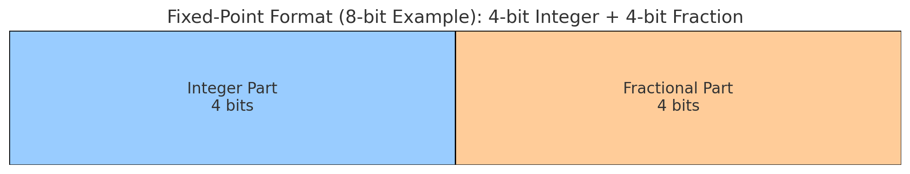
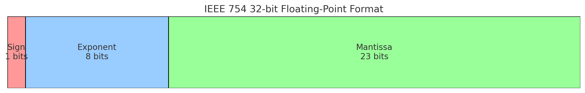
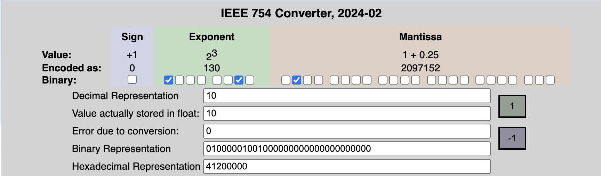

## **부동소수점**(浮動小數點, floating point)

**부동소수점(浮動小數點, floating point)**은 컴퓨터에서 실수를 표현하는 방식 중 하나이다. 정수만으로는 표현할 수 없는 소수점이 있는 숫자 (e.g. 3.14, -0.0001, 2.71828... 등)를 저장하고 계산할 수 있도록 만든 방식이다. 여기서 "부동(floating)"이라는 말은 소수점의 위치가 고정되어 있지않고 자유롭게 이동할 수 있다는 의미이다.

> 여기서의 **부동(浮動)**은 떠다니며 움직인다는 뜻으로 움직이지 않는다는 의미의 **부동(不動)**과 헷갈리지 않도록 주의하자. 실제로 **고정소수점(固定小數點, Fixed-point arithmetic)**이라는 개념이 존재한다.
{: .prompt-warning }

## Fixed point 구조



위 이미지는 **Fixed-Point (고정 소수점)**의 8비트 표현 구조를 보여준다.

| 구간       | 비트 수 | 설명                            |
| ---------- | ------- | ------------------------------- |
| **정수부** | 4비트   | 소수점 왼쪽, 정수 부분을 표현   |
| **소수부** | 4비트   | 소수점 오른쪽, 소수 부분을 표현 |

예를 들어, 이진수가 `01101000`이라면

- `0110` → 정수부 = 6
- `1000` → 소수부 = 0.5 (이진수 `1×2⁻¹`)

전체 숫자는 `6.5`가 된다.

## Floating point 구조

대부분의 시스템은 IEEE 754 표준을 사용하며, `float`(32비트) 또는 `double`(64비트) 형식으로 표현한다. IEEE 754의 최신 버전은 IEEE 754-2019이다. [공식문서](https://ieeexplore.ieee.org/document/8766229)는 학회 소속이나 관련 연구기관 소속이라는 인증을 해야 받아볼 수 있는듯하다.



32비트 `float`의 구조는 위와 같다.

- **1비트**: 부호 비트 (sign bit) – 양수/음수 구분
- **8비트**: 지수부 (exponent) – 소수점의 위치를 나타냄
- **23비트**: 가수부 (mantissa or significand) – 실제 숫자 정보

즉, 다음과 같이 표현된다:

```
(-1)^sign × 1.mantissa × 2^(exponent - bias)
```

---

## 부동소수점 표현식 해석

### 1.  sign(부호 비트)

숫자가 **양수인지 음수인지를 나타내는 비트**이다.

- `sign = 0` → 양수 
- `sign = 1` → 음수

따라서 식에서 `(-1)^sign`는 **부호를 결정**하는 부분이다.

- `(-1)^0 = +1` → 양수
- `(-1)^1 = -1` → 음수

### 2. mantissa(가수부 또는 유효숫자부)

실제 **숫자의 주요한 값**(유효 숫자)을 담고 있는 부분이다.

이진수로 표현될 때는 **항상 1.XXXX 형태로 표현**되므로, 앞의 1은 생략하고 `소수 부분만 저장`한다.

- 예를 들어, `1.10101` → mantissa에는 `10101...` 만 저장된다.
- 실제 계산 시에는 `1.`을 붙여서 `1.mantissa` 형태로 쓴다.

※ 이 부분이 수의 **정밀도**를 좌우하므로 이 범위를 최대한으로 확보하는 것이 중요하다.

### 3. exponent(지수부)

이 숫자가 **얼마나 크거나 작은지를 결정하는 지수**이다. 2진수의 지수니까 **2의 몇 제곱**인지에 대한 자릿수를 나타낸다.

하지만 **지수에는 음수도 나와야 하므로**, 실제 저장할 땐 `bias`를 더한 값을 저장한다. 예를 들어, 실제 지수 `-2` → 저장 값은 `bias + (-2)`

### 4. bias(편향값)

**음수 지수를 표현**하기 위해 지수에 더해지는 고정된 값이다.

- 32비트 `float`에서는 `bias = 127`
- 64비트 `double`에서는 `bias = 1023`

예를 들어,

- 저장된 `exponent = 130`이라면 실제 지수는 `130 - 127 = 3`
- 저장된 `exponent = 124`라면 실제 지수는 `124 - 127 = -3`

32비트 float에서

- `sign = 0` → 양수
- `exponent = 130` → 실제 지수는 `130 - 127 = 3`
- `mantissa = 01000000000000000000000` (실제로는 소수 부분만 저장됨)

예를 들어, 실수 `3.14`를 컴퓨터는 다음과 같이 저장한다.

```
sign = 0 (양수)
exponent = 128 (지수 1)
mantissa = 1.570796...
```

---

## 실제 계산과정

실수값 `10.0`의 **IEEE 754 32비트 float 메모리 구조**에서 아래의 바이너리 값으로 저장한다.

```
[0][10000010][01000000000000000000000]
```

| 구간         | 비트 값                   | 설명                                |
| ------------ | ------------------------- | ----------------------------------- |
| **Sign**     | `0`                       | 양수                                |
| **Exponent** | `10000010` (10진수: 130)  | 실제 지수 = 130 - 127 = **3**       |
| **Mantissa** | `01000000000000000000000` | 실제 값: `1.010` (2진수) = **1.25** |

이때 계산식은 다음과 같다.

```
(-1)^0  × 1.25  ×  2^3 = 1.25  ×  8 = 10.0
```

실제로 컴퓨터는 실수 `10.0`을 32비트 메모리로 분해해서 저장하고, 계산 시 위 수식을 사용한다.

이 과정을 이해하기 쉽게 [시뮬레이션 해볼 수 있는 사이트](https://www.h-schmidt.net/FloatConverter/IEEE754.html)도 있다. 10진수로 10을 입력하면 10.0의 실제 저장되는 값이 표현된다.



---

## 정리

부동소수점 방식의 장점은 다음과 같다.

- **아주 큰 수 또는 아주 작은 수**를 저장할 수 있음
- 실수 계산에 유리함

하지만 이 방식의 한계점도 존재하므로 주의해야한다.

- **정확하지 않은 근사값**을 저장 (ex. `0.1`은 정확히 표현 불가)
- **오차 누적** 가능성 존재 → 금융, 과학 계산에서 주의 필요

---

## 참고자료

- [IEEE 754 - Wikipedia](https://en.wikipedia.org/wiki/IEEE_754)
- [Floating-point arithmetic - Wikipedia](https://en.wikipedia.org/wiki/Floating-point_arithmetic)
- [Fixed-point arithmetic](https://en.wikipedia.org/wiki/Fixed-point_arithmetic)
- [IEEE Standard 754 Floating Point Numbers](https://www.geeksforgeeks.org/ieee-standard-754-floating-point-numbers/)
