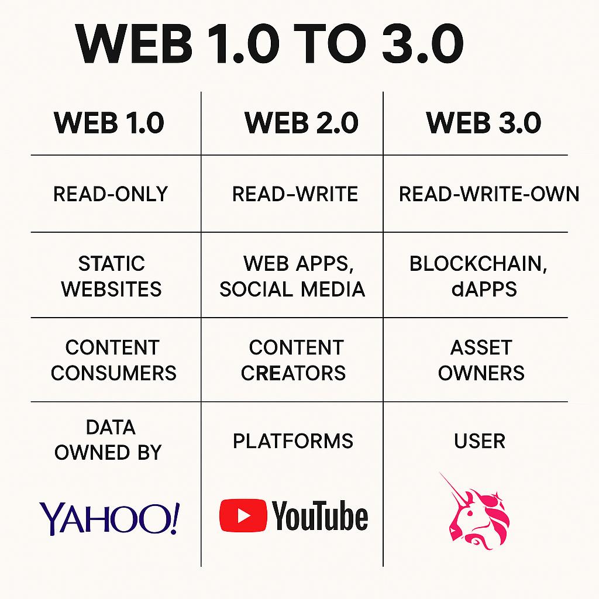

최근 Web 3.0이라는 말이 많이 들리고, 이미 관련 세미나부터 이를 활용한 서비스를 개발하는 기업까지 등장하고 있다. 그렇다면 Web 3.0은 무엇일까? 그전에 Web 1.0과 2.0부터 알아보자.

## Web 1.0 ~ 3.0

### 📜 Web 1.0 (읽기 전용 웹)

* 정적 HTML 페이지
* 하드코딩된 링크 중심
* 사용자 간 상호작용 거의 없음
* 대표: 야후 디렉토리, 초기 네이버, 개인 홈페이지

> 📌 "인터넷 책장" 같은 존재

### 🧑‍🤝‍🧑 Web 2.0 (참여의 웹)

* 블로그, 댓글, 위키, SNS 등장
* AJAX와 모바일로 UX 개선
* 사용자가 직접 콘텐츠를 만들고 공유
* 그러나 플랫폼이 데이터를 소유하고 수익도 가져감

> 📌 "사용자가 콘텐츠를 만들지만, 플랫폼이 통제"

### 🔗 Web 3.0 (탈중앙화 웹)

* 데이터와 자산 소유권이 **사용자에게 있음**
* 블록체인으로 **신뢰와 보안 확보**
* 지갑 주소와 스마트 계약으로 직접 상호작용
* DAO, NFT, DeFi 등 새로운 경제 모델 가능
* AI와 의미 기반 웹(Semantic Web)도 포함

> 📌 "플랫폼 없이도 인터넷을 운영하는 세계"

### 📊 진화 흐름 요약 인포그래픽

```
Web 1.0    →    Web 2.0     →     Web 3.0
읽기 전용   →   사용자 참여   →   사용자 주권

Static HTML → AJAX, Mobile → Blockchain, dApp
콘텐츠 소비 → 생산과 소비 → 자산의 소유 및 거래
야후, AOL  → YouTube, Facebook → OpenSea, Uniswap
```

### 🎯 핵심 포인트

* Web 1.0은 "정보"
* Web 2.0은 "소통"
* Web 3.0은 "소유권과 자유"

### 🌐 Web 1.0 → 2.0 → 3.0 변화 요약

| 구분          | Web 1.0                 | Web 2.0                          | Web 3.0                                    |
| ------------- | ----------------------- | -------------------------------- | ------------------------------------------ |
| 📅 시대        | 1990년대 \~ 초 2000년대 | 2000년대 중반 \~ 현재            | 현재 \~ 미래                               |
| 🧭 중심 개념   | **읽기(Read)**          | **읽기 + 쓰기(Read + Write)**    | **읽기 + 쓰기 + 소유(Read + Write + Own)** |
| 👤 사용자 역할 | 정보 소비자             | 정보 생산자/소비자               | 주권을 가진 참여자                         |
| 🖥️ 기술        | HTML, 웹 페이지         | AJAX, 모바일 앱, 클라우드        | 블록체인, 스마트 컨트랙트, AI              |
| 🏢 구조        | 정적 웹사이트           | 동적 웹앱 + 중앙 서버            | 분산형 앱 (dApp), 탈중앙화                 |
| 🔐 데이터 소유 | 웹사이트 소유자         | 플랫폼 기업(Google, Facebook 등) | 사용자 본인 (DID, 지갑)                    |
| 💰 수익 구조   | 없음 또는 광고주 중심   | 플랫폼 수익 독점                 | 사용자 보상 구조 (토큰 이코노미)           |
| 📦 예시        | 개인 블로그, 신문사 웹  | YouTube, Instagram, Facebook     | Uniswap, OpenSea, Lens Protocol            |

---

## 🌐 Web 3.0이란?

> Web 3.0은 **탈중앙화(Decentralization)**, **데이터 소유권**, **스마트 계약(Smart Contract)**, AI 및 의미적 웹(Semantic Web)을 통해 **더 지능적이고 자율적인 인터넷**을 지향한다.

### 🔑 핵심 특징

| 특징               | 설명                                                                    |
| ---------------- | --------------------------------------------------------------------- |
| **탈중앙화**         | 데이터가 중앙 서버가 아닌 블록체인 또는 분산 네트워크에 저장되어, 기업이 아닌 사용자가 통제함                 |
| **데이터 소유권**      | 사용자가 자신의 데이터를 소유하고, 필요 시만 공유함 (예: DID, SSI)                           |
| **스마트 계약**       | 조건에 따라 자동 실행되는 계약 – 신뢰 없는 환경에서도 거래 가능                                 |
| **암호화 자산**       | 토큰 경제를 통한 보상 구조 – 사용자가 활동에 따라 수익을 얻음 (Play to Earn, Create to Earn 등) |
| **Semantic Web** | AI가 데이터 간 의미를 이해하고 연관성 있는 정보를 제공함                                     |
| **분산 신원(DID)**   | 중앙 기관 없이 개인 신원을 증명할 수 있음                                              |

### 🧱 관련 기술 스택

* **블록체인**: Ethereum, Solana, Polkadot 등
* **IPFS / Filecoin**: 분산 스토리지
* **스마트 컨트랙트 플랫폼**: Solidity, Vyper
* **Web3 라이브러리**: Web3.js, Ethers.js
* **지갑**: MetaMask, WalletConnect
* **토큰 표준**: ERC-20, ERC-721 (NFT), ERC-1155

### ⚖️ Web 2.0 vs Web 3.0

| 항목      | Web 2.0                  | Web 3.0                     |
| ------- | ------------------------ | --------------------------- |
| 데이터 소유권 | 기업이 보유                   | 사용자가 보유                     |
| 중심 구조   | 중앙 서버                    | 분산 네트워크                     |
| 수익 모델   | 플랫폼 중심                   | 사용자 참여 보상                   |
| 인증 방식   | 이메일/비밀번호                 | 지갑 + 서명 (예: MetaMask)       |
| 대표 기업   | Facebook, Google, Amazon | Ethereum, IPFS, Chainlink 등 |

### 🧩 Web 3.0의 적용 예시

* **DeFi** (탈중앙화 금융): Aave, Uniswap
* **NFT 마켓플레이스**: OpenSea, Blur
* **DAO** (탈중앙화 자율조직): MakerDAO, ConstitutionDAO
* **메타버스**: Decentraland, The Sandbox
* **탈중앙 ID**: Ceramic Network, Sovrin

### ⚠️ Web 3.0의 한계와 과제

* 사용자 진입 장벽 (지갑, 키 관리 어려움)
* 확장성(트랜잭션 속도, 수수료 문제)
* 규제 불확실성
* 보안 문제 (DeFi 해킹 사례 등)
* UX 미성숙

---

## 🧠 요약

Web 3.0은 **"사용자에게 권한을 돌려주는 탈중앙화된 지능형 웹"**이다. 이를 구현하기 위한 기술로 블록체인, 스마트 컨트랙트, NFT 등이 등장하였다.

