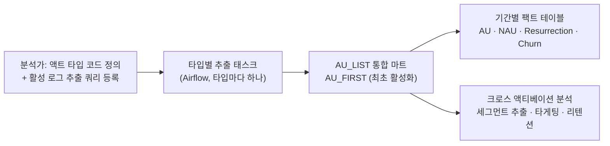

| | |
| --- | --- |
| 발표 | SLASH 21 |
| 연사 | 유승민 (토스 Data Service Team Leader) |
| 자료 | [발표 영상](https://www.youtube.com/watch?v=6CZwKUp1ozw) · [SLASH 21](https://toss.im/slash-21) |

토스가 처음 연 개발자 컨퍼런스에서 데이터 팀이 한 발표다. 규모로는 이미 스타트업이라 하기 어려운 시점이었지만, 몇 년 전만 해도 작은 조직이었고 그동안 DW를 만들며 겪은 것을 여섯 키워드로 정리했다. DB 리뷰, 디멘션 테이블, ODS, 협업 도구, 메타 정보, 데이터 품질. 발표 3년 뒤 토스증권이 SLASH 24에서 발표한 [액트 타입 DW 모델](/posts/slash24-dw-active-user-tables/)의 원형이 여기에 있다. 내용은 발표 영상과 자동 생성 자막을 근거로 했고, 표현은 내 말로 바꿨다. 2021년 영상이라 자막 품질이 낮아 세부 수치보다 구조에 집중했다.

## 전제: 사일로가 빠르게 움직이는 조직에서 데이터를 통합한다는 것

토스는 서비스마다 "사일로"라는 작은 스타트업 같은 조직이 실험과 학습을 반복하며 자율적으로 움직인다. 빠른 실험과 저렴한 실패에서 혁신을 얻으려는 구조인데, 데이터 관점에서는 어렵다. 전사 차원의 인사이트를 내려면 데이터를 표준화하고 통합해야 하는데, 빠른 변화 속에서 메타 정보와 품질을 관리하는 것 자체가 과제다. 발표는 이 긴장 위에서 "무엇을 통제하고 무엇을 놓아줄지"를 키워드마다 정한다.

## 1. DB 리뷰: 속도를 중시하는 문화에서 유일하게 생략하지 않는 것

서버 개발자가 테이블을 만들거나 바꾸면 반드시 DBA 리뷰를 거친다. 지정 채널로 변경을 요청하면 DBA가 컴플라이언스(개인정보 암호화, 권한), 성능·운영 효율(인덱스, 파티션 설계), 그리고 **데이터 모델과 코멘트, 기본 용어 표준**을 본다. 마지막 항목에는 필요하면 데이터 엔지니어도 참여한다.

발표자가 강조한 지점은 두 가지다. 명확한 데이터 모델과 최소한의 표준이 불필요한 커뮤니케이션 비용을 줄이는 첫걸음이라 속도를 중시하는 문화에서도 이 과정은 지킨다는 것, 그리고 과도한 표준과 통제로 개발 속도를 저해하지 않도록 **높은 우선순위로 최대한 빨리** 리뷰한다는 것이다. 바쁘다고 리뷰를 생략하지 않는다.

## 2. 디멘션 테이블: 자동화의 선행 조건

주요 행위나 서비스의 정의, 수수료·매출·계약 정보 같은 차원 정보가 쿼리 안의 `CASE WHEN`으로 하드코딩돼 있으면 당장은 편해도 장기적으로 비효율이다. 디멘션 테이블로 빼야 자동화가 가능해진다.

문제는 관리 도구다. 수정할 때마다 DB를 직접 바꾸는 것이 번거로워 선뜻 못 한다. 발표자의 팁은 **Google 스프레드시트**다. 데이터 시트(디멘션 테이블과 같은 형태로 입력)와 DB 동기화 설정 시트(필드와 DB 매핑) 두 장을 만들고, Python으로 Google API를 읽어 MySQL에 delete-insert로 넣는다. MySQL에는 PK 같은 무결성과 DML이 있고, Sqoop으로 Hadoop에도 적재해 분석에 쓴다. 제대로 된 관리 시스템이 최선이지만, 스타트업에서는 당장의 효과를 놓고 가장 쉬운 방법으로 빠르게 대응한 뒤 적절한 시점에 제대로 갖추는 것이 좋은 선택이라고 했다. 지금은 "테이블 센터"라는 메타 정보 시스템이 주요 디멘션을 관리한다.

## 3. ODS: 액트 타입과 AU 리스트

ODS(Operational Data Store)는 집계를 위한 중간 가공 저장소다. 운영 시스템의 복잡한 형태를 단순화하거나 표준에 맞게 전처리하고, 필요하면 중간 집계로 요약한다.

예시는 AARRR의 activation 단계다. 각 서비스가 공통으로 보는 지표(AU, 신규 AU, 이탈 후 복귀, 이탈)를 일·주·월과 7·14·30일 같은 기간별로 정의한다. DW가 없던 시절 각 사일로의 분석가는 이 지표를 만드는 데 많은 시간을 썼고, 결과는 사일로 안에서만 쓰였다.

해법이 **액트 타입** 코드 체계다. 각 서비스의 activation 행위를 코드로 정의하고 디멘션 테이블로 관리한다. 분석가가 코드를 정의하고 활성 로그 추출 쿼리를 등록하면, 타입별 추출 결과가 `AU_LIST`라는 통합 마트로 모이고, 서비스별 최초 activation을 기록하는 `AU_FIRST`도 생긴다. 이 마트에서 크로스 액티베이션 분석, 세그먼트 추출과 타게팅, 리텐션 집계가 단순한 쿼리로 가능해진다. Airflow DAG에서는 새 액트 타입이 등록되면 왼쪽에 태스크가 하나 추가되고, AU 마트 집계가 끝나면 기간별 팩트 테이블 집계가 이어진다. 재집계가 필요하면 backfill로 처리한다.

발표자의 정리는 이렇다. 사일로마다 분석가가 비슷한 일을 반복하는 것은 비효율이고 관리도 어렵다. 공통 부분을 ODS 마트로 자동화하면 지표 산출 시간이 줄고, 계보와 품질 관리에 유리하며, 무엇보다 사일로의 데이터를 토스팀 전체 관점에서 쓸 수 있다.

## 4. 협업 도구: Jenkins 앞의 배치 센터

분석가는 DW가 자동으로 집계해 주는 것 외에도 실험과 분석을 위해 직접 배치를 등록하고 싶어 한다. 처음엔 엔지니어 도움 없이 등록할 수 있도록 Jenkins를 줬다. 쓰기 쉽고 플러그인이 많지만 관리 기능이 부족했다. 그래서 사용자와 Jenkins 사이에 **배치 센터**를 만들었다.

배치 센터는 Jenkins 앞단의 웹 서비스다. UI로 입력받아 Jenkins API로 잡을 생성·수정·삭제·중지하고, 누가 언제 왜 만들었는지를 자체 저장소에 남겨 담당자를 명확히 하며, Git과 연계해 형상 관리한다. Jenkins는 잡 제목만 검색됐는데 잡 내용까지 검색되게 했고, 시스템에 부하를 줄 만한 **헤비 쿼리 패턴이 탐지되면 경고와 함께 생성이 중지**된다. Airflow는 분석가보다 데이터 엔지니어 위주로, 단편적 잡보다 체계적 워크플로 설계가 필요한 곳에 쓰고, 분석가가 원하면 구조와 규칙에 대한 이해가 충분하다고 판단될 때 권한을 준다. 도구의 특성에 맞게 나눈 것이다.

## 5. 메타 정보: 테이블 센터

최소한의 설명으로 데이터의 의미를 효율적으로 공유하는 것이 전사 데이터 활용 역량을 좌우한다. 그래서 **테이블 센터**를 만들었고 2.0을 개발 중이었다. Uber의 Databook과 유사하다. 테이블 명세와 설명을 온라인으로 공유하고, 태그로 사용자별 연관 테이블을 그룹핑한다. DB 리뷰 단계에서 입력한 코멘트가 기본으로 보이고, 테이블 센터에서 추가 설명을 넣으면 그것이 우선한다. 특정 테이블을 바꿔야 할 때 **어디에 어떻게 쓰이는지 영향도**를 미리 볼 수 있게 메타 정보를 수집해 저장하고, 2.0의 핵심 기능으로 키우고 있다. 설명이 부족하면 테이블 페이지에 질문을 남기고, 관련 채널로 알림이 가서 답변이 기록으로 남는다. Airflow와 양방향으로 연동돼 DAG에서 테이블 정보로, 테이블에서 관련 DAG와 Jenkins 잡으로 이동한다.

## 6. 데이터 품질: DQ 센터

초기 DW에서는 DQ 시스템까지 갖추지 못한다. 데이터가 늘수록 품질의 중요성은 커지는데, 간단한 흉내로 시작할 수 있다. 탐지 SQL을 받아 결과를 Slack으로 알리는 Python 프로그램을 만들고 Jenkins에 룰마다 잡을 등록한다. 빠른 탐지·대응에는 좋지만 룰이 늘면 관리가 어려워 결국 제대로 된 시스템이 필요하다.

Apache Griffin을 검토했다가 필요 기능과 맞지 않아 컨셉만 가져와 **DQ 센터**를 자체 개발 중이었다. 축은 둘이다. **DQ 타입**은 완전성·유일성·유효성(RDB 제약 조건에 해당하지만 Hadoop이라 DQ로 구현해야 하고, 메타 정보로 단순화할 수 있다)과 적시성·정확성·일관성(각각 탐지 로직이 필요), 그리고 분포 기반 이상 탐지까지 여섯이다. **DQ 레이어**는 수행 시점이다. 앞단의 스트림·RDB DQ는 실시간 탐지, ETL DQ는 배치로 적재 시점에, DW DQ는 ODS 집계 과정의 오류를 잡는다.

## 마무리에서 말한 것

빠르게 성장하는 스타트업에서는 꼭 필요한 경우를 빼면 **통제보다 빠른 탐지와 대응**이 중심이 된다. 빠른 속도와 변화 속에서도 적절한 시점에 자동화와 체계화를 추진해야 하는데, 판단 기준은 전사 차원의 효율성이다. 장기적 이득이 크다고 판단되면 적극적으로 협조를 구하고 과감하게 추진한다. 상용 제품이나 오픈소스가 있어도 필요한 기능이 맞지 않아 직접 만들어야 할 수 있는데, 처음부터 완성도를 추구하기보다 핵심 기능을 가장 쉬운 방법으로 빠르게 만들고 여유가 될 때 제대로 개선하는 방식이 좋다. 돌이켜보면 적절한 선택으로 이득을 본 것도 있지만 더 빠른 타이밍에 추진했으면 좋았을 것도 있다고 했다.

## 리뷰

**"통제보다 탐지"가 여섯 키워드를 관통한다.** DB 리뷰는 통제지만 "최대한 빨리"라는 단서가 붙고, DQ는 사후 탐지이고, 배치 센터의 헤비 쿼리 차단은 사전 통제지만 패턴 탐지에 기반한다. 사일로의 속도를 해치지 않으면서 전사 데이터를 지키는 방법으로 "막지 말고 빨리 알아채자"를 고른 것이다. 이 원칙이 이후 토스증권 [실시간 alert 플랫폼](/posts/tmc25-realtime-alert-platform/) 같은 발표에서도 반복된다.

**액트 타입은 2021년에 이미 있었다.** SLASH 24에서 토스증권이 발표한 액트 타입 DW 모델의 첫 버전(공통 컬럼만 담는 `AU_LIST`)이 이 발표에 그대로 나온다. 3년 뒤 발표는 그 모델이 "타입별 고유 지표를 담지 못했다"고 진단하고 고치는 이야기였다. 두 발표를 이어 읽으면 같은 설계가 규모에 따라 어떻게 한계에 닿는지 보인다.

**Google 스프레드시트를 디멘션 관리 도구로 쓴 것이 이 발표의 태도다.** 완성도 대신 "당장 가장 쉬운 방법"을 골랐고, 그것이 나중에 테이블 센터로 대체됐다. 스타트업의 데이터 인프라를 만드는 사람에게 가장 실용적인 조언이 여기 있다.

## 남는 질문

- DB 리뷰의 처리 시간. "최대한 빨리"라고 했는데 SLA가 있었는지, 리뷰 대기가 배포를 막은 적은 없는지.
- 헤비 쿼리 패턴의 정의. 어떤 패턴을 잡았고 오탐은 어떻게 다뤘는지.
- 테이블 센터 2.0의 영향도 분석은 쿼리 로그를 파싱해야 한다. Impala·Hive·Airflow·Jenkins 전부에서 로그를 모았는지, 커버리지가 얼마였는지.
- DQ 센터의 이상 탐지(분포 기반)가 실제로 잡은 사례.

## 참고

- [발표 영상](https://www.youtube.com/watch?v=6CZwKUp1ozw)
- [SLASH 21](https://toss.im/slash-21)
- 3년 뒤의 같은 모델: [SLASH 24 전천후 데이터 분석을 위한 DW 설계 리뷰](/posts/slash24-dw-active-user-tables/)
