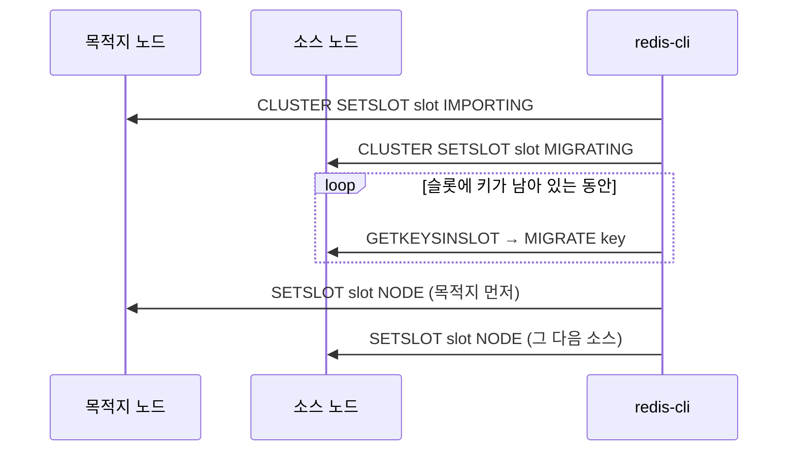
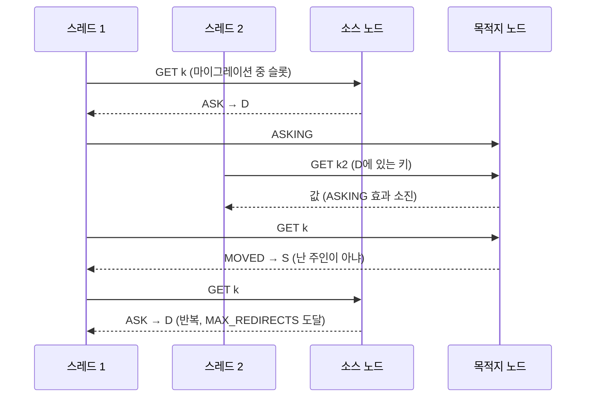

| | |
| --- | --- |
| 발표 | SLASH 21 |
| 연사 | 조규희 (토스 서버 플랫폼팀, Site Reliability Engineer) |
| 자료 | [발표 영상](https://www.youtube.com/watch?v=Tu0MMBgdyTw) · [SLASH 21](https://toss.im/slash-21) |

토스 서버 플랫폼팀이 운영 중에 겪은 문제 세 개를 분석 과정 위주로 풀어낸 발표다. Redis Cluster 리밸런싱 중의 타임아웃과 ASK 리다이렉션 에러, Memcached 노드 장애 때 일부 요청이 재분배되지 않은 사고, Prometheus 메트릭 수집을 켜자 GC 패턴이 무너진 사례다. 세 사례 모두 "가설을 세우고 재현해서 검증한다"는 같은 뼈대로 진행돼서 트러블슈팅 교재로 읽힌다. 내용은 발표 영상과 자동 생성 자막을 근거로 했고, 표현은 내 말로 바꿨다.

## 1. Redis Cluster 리밸런싱

### 슬롯 마이그레이션의 순서

Redis Cluster는 16384개의 해시 슬롯을 샤드가 나눠 갖고, 키는 해시 함수로 하나의 슬롯에 매핑된다. 노드를 추가하고 슬롯을 옮기는 절차는 다음과 같다.

목적지를 먼저 IMPORTING으로, 그 다음 소스를 MIGRATING으로 바꾸고, 마지막에 주인을 바꿀 때도 목적지부터 바꾼다. 이 순서가 왜 중요한지는 뒤의 가설 검증에서 나온다. `redis-cli --cluster rebalance`로 자동화할 수 있지만 발표자는 시간이 허락하고 안정성이 중요하다면 슬롯을 하나씩 수동으로 옮기기를 권했다. 도중에 끊기면 `cluster fix`로 복구할 수 있는데, 마이그레이션 중이던 슬롯의 키를 최대한 잃지 않는 방향으로 복구하지만 상태가 깨진 사이 여러 노드에 같은 키가 쓰였다면 마이그레이션되는 값으로 덮어쓰일 수 있다.

### 두 가지 증상과 두 가지 가설

리밸런싱 중에 겪은 증상은 둘이다. 첫째, 갑자기 Redis 커맨드 타임아웃이 대량 발생했다. 메트릭을 보니 순간적으로 큰 데이터가 전송됐고, 큰 컬렉션을 가진 **빅 키**가 포함된 슬롯이 옮겨질 때였다. 둘째, 간헐적으로 ASK 관련 에러가 났다. Lettuce 클라이언트가 `MAX_REDIRECTS`에 도달해서 낸 에러였다.

ASK를 이해하려면 마이그레이션 중 클라이언트 동작을 알아야 한다. 소스 노드에 키가 있으면 평소처럼 응답하고, 없으면 `ASK` 리다이렉션을 돌려준다. 클라이언트는 목적지 노드에 `ASKING` 명령을 보낸 뒤 원래 명령을 이어서 보낸다. 어떤 노드가 어떤 키를 갖는지 정확히 알 수 없으니 없으면 마이그레이션 상대에게 물어보는 구조다.

발표자는 두 가설을 세웠다. (1) 키가 MIGRATE되는 바로 그 시점에 요청이 오면 양쪽 노드 모두 키가 없다고 판단해 에러가 나지 않을까. (2) 슬롯 상태를 바꾸는 순서 때문에 타이밍 이슈가 나지 않을까.

가설 1을 검증하려면 MIGRATE가 오래 걸려야 한다. MIGRATE는 DUMP → RESTORE → DEL을 거치므로 값이 크면 된다. 리스트에 아이템 200만 개를 넣으니 약 400MB, 3초 정도 걸렸다. 한쪽에서 `LRANGE`를 계속 실행하고 다른 쪽에서 MIGRATE를 실행하니 락 때문에 타임아웃은 났지만 ASK 리다이렉션 에러는 나지 않았다. 빅 키가 타임아웃을 만든다는 것은 검증됐고, ASK 에러와는 무관하다는 것도 확인됐다.

가설 2는 상태 변경 순서의 모든 조합을 시나리오로 따져봤다. 문제가 생기는 경우는 **소스 노드부터** 상태를 바꿨을 때이고, 이때는 MOVED 리다이렉션 에러가 날 수 있다. 실제로 마이그레이션 중 한두 번 봤다. 하지만 ASK 에러의 원인은 아니었다.

### 결론은 Lettuce 버그

혼자 틀을 깨기 어려워 마이그레이션 과정을 동료에게 설명하며 도움을 구했고, 결론은 Lettuce의 버그였다. Lettuce는 Redis 노드당 커넥션 하나를 여러 스레드가 공유한다. `ASKING` 다음에 원래 명령이 연속해서 도달해야 하는데, 그 사이에 다른 스레드의 명령이 끼어들 수 있었다.

ASKING의 효과는 바로 다음 명령 하나에만 적용되므로, 끼어든 명령이 효과를 소진하면 목적지 노드는 "내가 주인이 아니다"라며 MOVED로 소스에 돌려보내고, 소스는 다시 ASK를 돌려주는 핑퐁이 리다이렉트 한도까지 반복된다. 이 버그의 수정은 5.2.2에 들어갔지만 그 수정이 명령을 중복 실행하는 다른 버그를 만들었고, 발표자가 PR을 올려 머지됐다. Lettuce로 리밸런싱한다면 **5.3.1 이상**을 써야 한다.

정리하면: 작업 전 자료를 충분히 읽고, 빅 키를 먼저 확인해서(빅 키가 있는 슬롯만 제외하고 옮길 수는 있다) 마이그레이션 가능 여부를 검증하고, 덤프 데이터로 리허설 클러스터에서 연습하고, redis-cli가 중단되면 `cluster fix`로 복구하고, 한 번에 MIGRATE하는 키 수를 줄이고, 무엇보다 **쓰고 있는 클라이언트 라이브러리를 깊이 이해한 상태에서** 진행하라는 것이다.

## 2. Memcached 노드 장애 때 재분배되지 않은 요청

Memcached 노드 넷 중 하나에서 장비 문제가 났다. spymemcached 클라이언트에 redistribute 설정을 해뒀으니 타임아웃이 잠깐 나고 정상 노드 셋으로 재분배될 거라 예상했다. 장비가 hang 상태라 클라이언트 입장에서는 커넥션이 끊기지 않은 상태였다. 대부분의 요청은 예상대로 정상화됐지만, 일부 요청은 "재분배할 수 없다"는 로그를 남기며 계속 타임아웃이 났다.

노드를 정상화한 뒤 spymemcached 코드를 읽었다. 재분배를 담당하는 것은 Ketama 해싱의 `getSequence` 함수인데, 주석에 **7분의 1의 7제곱, 약 0.78% 확률로 같은 죽은 노드를 가리킨다**고 적혀 있다. 그리고 그 경우 코드는 다시 비활성 상태의 primary 노드를 할당한다. 실패할 것을 알면서 문제 노드로 한 번 더 보내는 이유는 이해되지 않았다고 했다. 간단한 테스트 프로그램으로 랜덤 문자열을 생성해 확인하니 항상 같은 노드로 가는 키가 실제로 존재했고, 그 키를 뽑아 iptables DROP 정책으로 한 노드를 죽이니 장애 때와 같은 에러 메시지가 재현됐다.

교훈은 Memcached 노드 장애 때 대부분은 재분배되지만 일부는 계속 죽은 노드로 간다는 것, 그래서 타임아웃을 적당히 짧게 잡아둬야 한다는 것이다.

## 3. Prometheus 메트릭 수집이 GC를 망가뜨린 사례

발단은 Prometheus가 아니었다. 특정 서버에서 가끔 Memcached 타임아웃이 나기 시작했다. Memcached 클라이언트 타임아웃은 500ms이고 대부분 1ms 안에 응답하므로 타임아웃은 문제의 징후다. 애플리케이션 메트릭을 보니 Young GC 시간이 길어지고 Old 영역의 증감 패턴이 이상했다. 토스는 두 데이터센터를 액티브-액티브로 운영하는데, **한쪽 데이터센터에서만** 증상이 났다.

정리하면 (1) Memcached 타임아웃, (2) Young GC 지연과 Old 영역 톱니 패턴, (3) 한쪽 DC만, (4) 1월 17일부터. 그러면 1월 17일부터 한쪽 DC에만 적용한 변화가 무엇인가. Prometheus 메트릭 수집이었다. 롤백하니 GC 패턴이 돌아왔다.

원인은 **humongous allocation**이다. Spring Boot의 Prometheus 엔드포인트는 StringWriter에 메트릭을 모두 포맷팅해 append하고 마지막에 `toString`으로 하나의 문자열을 만든다. 엔드포인트를 직접 호출하니 응답이 수 MB, 클 때는 10MB 가까이 됐다. 배포 직후에는 히스토그램과 URI별 메트릭이 아직 쌓이지 않아 작았기 때문에 문제가 없다가, 시간이 지나 메트릭이 불어나자 G1 리전 크기의 절반을 넘는 객체가 되어 Young에 할당되지 못하고 Old의 humongous 영역에 바로 할당됐다. 이것이 반복되면서 Old가 차고 Full GC까지 갔다.

해법은 셋이다. 불필요한 메트릭을 빼서 응답을 몇 KB 수준으로 줄이면 해결된다(실제로 해결됐다). 리전 크기를 키울 수도 있지만 장단점이 있다. 발표자가 택한 것은 전체 메트릭은 크지만 개별 메트릭은 작다는 점을 이용해 **스트림 형식으로 응답**하도록 바꾼 것이다. 그 뒤로는 메트릭이 많아도 GC 패턴이 무너지지 않았다.

## 문제를 분석할 때 필요한 세 가지

발표 마무리는 세 단어다. **변화** — 배포, 데이터 마이그레이션, 네트워크·인프라·DB·DevOps 변경 중 언제 무엇이 바뀌었는지가 원인 찾기의 핵심이다. **로그** — 어떤 문제가 언제 났는지 확인할 수 있어야 한다. **메트릭** — "과유불급"이 메트릭에는 해당하지 않는다. 이걸 쌓아야 하나 싶은 메트릭도 언젠가 쓰인다. 스토리지와 보관 기간을 고민하되 가능한 한 많은 종류를 남기고, 중요한 것은 남기고 불필요한 것은 빼며 발전시켜 가면 된다.

## 리뷰

**세 사례가 같은 형식으로 진행된다.** 증상 → 가설 → 재현 → 가설 기각 또는 채택 → 코드 읽기. 첫 사례에서는 두 가설이 모두 기각되고 나서야 동료의 도움으로 라이브러리 버그에 닿는다. 기각된 가설도 발표에서 뺀 것이 아니라 "문제 케이스에 대한 검증 차원에서 의미가 있었다"고 남겨둔다. 발표 자체가 트러블슈팅 기록의 좋은 예다.

**세 사례의 공통 원인은 "클라이언트 라이브러리를 몰랐다"에 가깝다.** Lettuce의 커넥션 공유, spymemcached의 Ketama 재분배 확률, Spring Boot 액추에이터의 문자열 생성 방식. 모두 서버가 아니라 애플리케이션 쪽 라이브러리의 구현 세부다. "쓰는 클라이언트를 깊이 이해한 상태에서 작업하라"는 정리는 세 사례 전체에 적용된다.

**Prometheus 사례는 관측 도구가 관측 대상을 바꾼 사례다.** 메트릭을 많이 남기라는 마무리와 메트릭 응답이 GC를 망가뜨린 사례가 한 발표 안에 있는 것이 흥미롭다. 답은 메트릭을 줄이는 것이 아니라 응답 방식을 바꾸는 것이었다. 관측 비용을 관측 범위를 줄여서 갚지 않았다는 점이 SRE다운 선택이다.

## 남는 질문

- Lettuce 5.3.1 이후에도 ASKING과 다음 명령의 원자성은 커넥션 공유 구조에서 어떻게 보장하는지. 명령을 하나의 배치로 묶는지, 잠시 다른 스레드를 막는지.
- spymemcached의 "실패할 노드로 한 번 더" 동작이 의도인지 결함인지. 발표자도 이해되지 않는다고 했는데 이후 이슈나 패치가 있었는지.
- Prometheus 응답을 스트림으로 바꾼 것을 Spring Boot에 기여했는지, 토스 내부 패치로 유지했는지.
- 한쪽 DC에만 적용한 것은 카나리 성격이었는지. 그렇다면 DC 단위 카나리가 이 문제를 잡아준 셈이다.

## 참고

- [발표 영상](https://www.youtube.com/watch?v=Tu0MMBgdyTw)
- [SLASH 21](https://toss.im/slash-21)
- [Redis Cluster 사양 - ASK 리다이렉션](https://redis.io/docs/reference/cluster-spec/)
- [G1 GC humongous objects](https://docs.oracle.com/en/java/javase/17/gctuning/garbage-first-g1-garbage-collector1.html)
