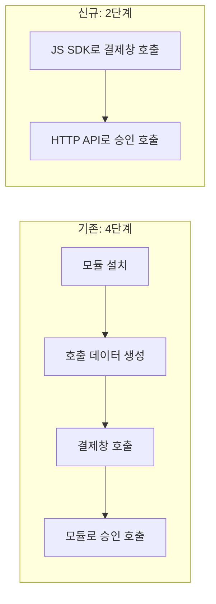

| | |
| --- | --- |
| 발표 | SLASH 21 |
| 연사 | 이홍채 (토스페이먼츠 Technical Product Owner), 박순영 (토스페이먼츠 Server Developer), 이현섭 (토스페이먼츠 Frontend Developer) |
| 자료 | [발표 영상](https://www.youtube.com/watch?v=E4_0WWqmF3M) · [SLASH 21](https://toss.im/slash-21) |

토스페이먼츠가 기존 PG 인수 뒤 새 연동 인터페이스를 만들면서 무엇을 어떤 원칙으로 정했는지 세 사람이 이어서 발표한다. TPO가 기존 PG 연동의 불편과 새 흐름을, 서버 개발자가 API 설계 원칙 셋을, 프론트엔드 개발자가 JavaScript SDK를 맡았다. 이 리뷰는 서버 파트인 API 설계를 중심에 두고 앞뒤 파트는 맥락으로 요약했다. 내용은 발표 영상과 자동 생성 자막을 근거로 했고, 표현은 내 말로 바꿨다.

## 기존 PG 연동의 불편

온라인 쇼핑몰이 카드 결제를 받으려면 PG를 통해 카드사 인증 호출, 승인, 매입까지 이어지는 연동 개발을 해야 한다. 국내 PG 대부분은 비슷한 형태를 지원해 왔고 쇼핑몰은 거기에 맞춰왔다. 불편은 세 가지였다.

- **언어별 모듈**: JSP, ASP, PHP 등 백엔드 언어별 모듈을 서버 인스턴스의 특정 위치에 설치하고 설정 파일까지 요구한다. 클라우드 환경에서는 내부 의존성 하나가 더 늘어나는 셈이고, Python이나 Node 같은 언어는 모듈이 없는 경우도 있다.
- **이해되지 않는 파라미터**: 화면의 form input에 `mid`, `oid`, `cashdata`, `switchingtype` 같은 이름이 들어가는데 직관적으로 용도를 알기 어렵다.
- **긴 흐름**: 모듈 설치 → 결제 금액·주문번호를 해싱한 결제창 호출 데이터 사전 생성 → 프론트로 전달해 결제창 스크립트 실행 → 카드사 인증 후 콜백으로 돌아오면 서버 모듈로 최종 승인 호출. 네 단계다.

이미 수만 개 가맹점이 붙어 있고 10년 넘은 레거시와 데이터센터가 있어 큰 변경은 불가능했다. 그래서 신규 연동 가맹점에만 새 SDK를 점차 제공하는 방식을 택했다. 기존 가맹점이 하던 모듈 연동과 HTML 폼 전송을 새 SDK와 서비스 서버 레이어가 대신 하고, 외부 인터페이스만 잘 포장하는 것이다.

새 흐름에서는 모듈 설치와 사전 데이터 생성이 사라지고 JavaScript SDK로 바로 결제창을 연다. 승인은 모듈 대신 HTTP API라 HTTP 클라이언트만 있으면 언어에 상관없이 된다. 가맹점이 신경 쓸 포인트는 둘로 줄었다. 연동 흐름 단계별로 로그를 수집해 연동 개발에 걸리는 시간을 추정하고 있고, 연동 개발 데이터까지 수집하는 PG는 자기들뿐인 것으로 안다고 했다.

## API 설계 원칙 셋

새 API를 설계하는 입장에서 원칙 없이 시작하면 인터페이스가 중구난방이 되거나 의사결정이 어려워질 것 같아 설계 시점에 셋을 정했다. (1) 고객 편의가 우선이다. (2) 많은 설명이 필요 없는 디자인을 고려한다. (3) 웹 표준 이외의 것을 적용하지 않는다.

### 원칙 1: 고객 편의 — RESTful을 어디까지

가장 중요한 원칙이다. API는 가맹점, 정확히는 가맹점 개발자가 쓰므로 조금이라도 연동이 어려운 상황을 만들지 않으려 했다. 쟁점은 RESTful 디자인을 그대로 적용할 수 있는가였다. 순수한 REST라면 CRUD가 HTTP 메서드에 직관적으로 대응한다. 그런데 **생각보다 많은 가맹점이 DELETE와 PUT을 쓰지 못하는 환경**에 있었다. GET·POST 외에는 익숙하지 않거나, 이미 쓰는 레거시 HTTP 클라이언트 모듈이 제대로 지원하지 않거나, 추가 구현이 필요하거나, 방화벽에서 막히기도 한다. 가맹점 개발자에게는 스트레스다.

원칙 1에 따라 DELETE·PUT을 배제하고 GET·POST만 쓰기로 했다. 고민할 필요가 없는 선택이었다. 대신 일관성이 떨어질 수 있으니 기준을 세웠다. **GET은 리소스 상태를 바꾸지 않는 동작, POST는 상태를 바꾸는 동작**이다.

메서드가 둘뿐이면 한 도메인에 상태 처리가 둘 이상일 때 경로가 충돌한다. 결제 승인과 결제 취소가 둘 다 `payments` 경로에 POST가 된다. 그래서 **경로 마지막에 동사**를 붙이는 기준을 뒀다. 리소스를 처리하는 기본 동작(승인)은 동사를 쓰지 않고, 승인 이후 추가 처리를 요구하는 인터페이스(취소)에만 마지막에 `cancel` 같은 동사를 붙인다. 당연해 보이지만 원칙과 기준을 단순하고 이해하기 쉽게 정리해 두면 담당자가 바뀌거나 여러 명이 개발해도 일관성이 유지되고, 그 예측 가능한 일관성이 고객에게 전달된다. RESTful은 고객 편의를 해치지 않는 선에서만 적용한다는 기준이 여기서 나왔다.

### 원칙 2: 많은 설명이 필요 없는 디자인

API를 path, request, response 세 구성 요소로 나눠 가이드라인을 정했다.

| 구성 요소 | 규칙 |
| --- | --- |
| path | `/v{버전}/{도메인=리소스}/{id}?/{동사}?`. 리소스를 특정하지 않는 조건은 GET이면 쿼리 파라미터, POST면 JSON 필드 |
| request/response | JSON. 반복되는 개념(카드 정보, 현금영수증 정보)은 루트에 여러 필드로 펼치지 않고 하나의 객체로 묶는다 |
| 응답 재사용 | 한 도메인의 API는 같은 객체를 재사용한다. 결제 승인·조회·취소의 응답 객체가 모두 동일 |
| enum | 코드 대신 **한글**로 표현. `Accept-Language` 헤더로 `ko`(기본)·`en` 응답 |
| 결과 | HTTP 상태 코드 여섯 개(200, 400, 401, 403, 404, 500)로 단순화. 200이 아니면 응답 바디에 오류 객체 |

객체로 묶으면 현금영수증처럼 요청했을 때만 채워지는 정보를 미발급이면 `null`, 발급이면 객체로 내려줄 수 있어 null 체크가 편하고 중복 표현을 피한다. 같은 도메인의 응답을 재사용하면 개발자가 알아야 할 정보가 줄고 가맹점 코드도 준다.

enum의 한글 표현이 이 발표에서 가장 눈에 띄는 결정이다. 기존에는 `SC0010` 같은 코드나 영단어, 은행은 숫자 번호였고, 현금영수증 타입 `1`만 보고 "소득공제"를 떠올리기는 어렵다. 한글로 쓰면 코드표 자체가 없어진다. 한국어를 쓰지 않는 고객사가 있어 `Accept-Language` 헤더로 로컬라이제이션을 붙였고, 오류 메시지도 같은 방식으로 다룬다.

오류 처리는 두 종류의 가맹점을 함께 고려했다. 오류 핸들링에 시간을 쓰고 싶지 않은 곳은 오류 객체의 `message`를 소비자에게 그대로 보여주는 것으로 끝낼 수 있고, 상세한 자체 메시지를 내려주고 싶은 곳은 `code`로 분기한다.

### 원칙 3: 웹 표준만 쓴다

TLS 1.2 이상을 강제하고, `Authorization` 헤더로 Basic 인증과 토큰 인증을 표준대로 지원한다. 자체 암호화 방식을 만들면 가맹점 구현 난이도가 오르고, 자체적인 취약점을 갖거나 실수로 취약점이 생길 여지가 있다. 신뢰성과 대표성이 있는 표준을 적용하고 강제한다.

웹 표준만으로 보안을 높이기 위해 설계 시점부터 **2단계: 요청과 승인** 기준을 세웠다. 보안 검증이 필요한 API는 처음 시도는 브라우저에서 호출하되, 마지막 승인은 반드시 가맹점 서버를 통해 호출한다. 결제창 호출과 입력은 브라우저에서 이루어지지만 결제가 성공하려면 항상 가맹점 서버의 API 호출이 있어야 하고, 이 과정에서 FDS로 금액 변조 여부와 정보 이상을 검사한다.

## JavaScript SDK

프론트엔드 파트는 "결제창을 여는 것이 결제 연동의 온보딩"이라는 전제에서 출발한다. 앱 온보딩이 나쁘면 유저가 이탈하듯, 결제창을 열기까지가 복잡하면 개발자가 이탈한다. 결제창을 여는 동작 자체는 어렵지 않지만 DOM 라이프사이클 관리, 크로스 브라우징 대응이 번거롭다. 이를 SDK(`tosspayments.js`)가 대신 한다. 스크립트 태그 하나로 로드하면 전역 `TossPayments`가 생기고 인스턴스에서 `requestPayment`를 호출하면 결제창이 열린다. 외부 의존성 없이 웹 표준 API만 쓰고 CDN으로 제공한다.

그 위에 더한 것이 셋이다. 결제 수단을 메서드 이름이 아니라 **인자**로 받아 라디오 버튼·select로 결제 수단을 고르는 흔한 가맹점 코드에서 분기가 필요 없게 했고, 한글 enum과 줄임말 없는 선언적 네이밍을 썼다. ES 모듈 방식의 import를 위해 npm 패키지를 제공하는데, 이 패키지는 전체 구현이 아니라 스크립트 태그를 동적으로 주입하는 로더다(`loadTossPayments`가 Promise로 인스턴스를 돌려준다). TypeScript 타이핑을 포함해 npm에 등록했고 로더 소스는 GitHub에 공개돼 있다.

## 리뷰

**"DELETE·PUT을 쓰지 않는다"는 결정이 이 발표의 핵심이다.** REST 원칙보다 고객의 실제 환경을 우선했고, 그 대가로 잃는 일관성을 GET/POST 의미 규칙과 경로 끝 동사 규칙으로 되찾았다. API 설계 논쟁에서 자주 나오는 "RESTful하게 vs 실용적으로"에 대해, 원칙을 먼저 정하고 그 원칙으로 결론을 내린 뒤 결론이 만드는 부작용을 다시 규칙으로 막는 순서가 잘 보인다.

**한글 enum은 대담하지만 근거가 있다.** 코드표를 없애는 것이 목적이고, 다국어는 표준 헤더로 풀었다. 국내 가맹점이 대부분인 PG의 API에서 개발자 경험을 최우선으로 뒀을 때 나올 수 있는 답이다. 다만 enum 값이 표시 문자열과 같아지면 값 변경이 곧 계약 변경이 되는데, 이 부분은 발표에서 다루지 않았다.

**2단계 요청·승인 구조는 이후 토스페이먼츠 발표의 전제가 된다.** 브라우저에서 시작하되 승인은 서버에서만 가능하게 하고 그 사이에 FDS를 두는 구조는 [결제 시스템의 20년 레거시](/posts/tmc25-payments-20-year-legacy/)나 [결제창 시스템 전면 재작성](/posts/tmc25-payment-window-rewrite/) 같은 후속 발표를 읽을 때 기준점이 된다.

## 남는 질문

- 한글 enum 값이 바뀌어야 할 때(용어 변경, 오타) 하위 호환을 어떻게 다루는지. `Accept-Language`를 안 보내면 한글이 기본인데 영문 코드가 기본이었다면 이 문제가 없었을 것이다.
- 상태 코드 여섯 개 중 409(중복 승인)나 429(과다 호출)가 빠진 이유. 멱등성은 어떻게 표현하는지.
- 연동 단계별 로그로 추정한 연동 개발 시간이 실제로 얼마였는지, 기존 방식 대비 얼마나 줄었는지.
- 신규 가맹점에만 새 SDK를 제공하면서 기존 가맹점의 마이그레이션은 어떤 계획이었는지.

## 참고

- [발표 영상](https://www.youtube.com/watch?v=E4_0WWqmF3M)
- [SLASH 21](https://toss.im/slash-21)
- [토스페이먼츠 개발자 문서](https://docs.tosspayments.com/)
