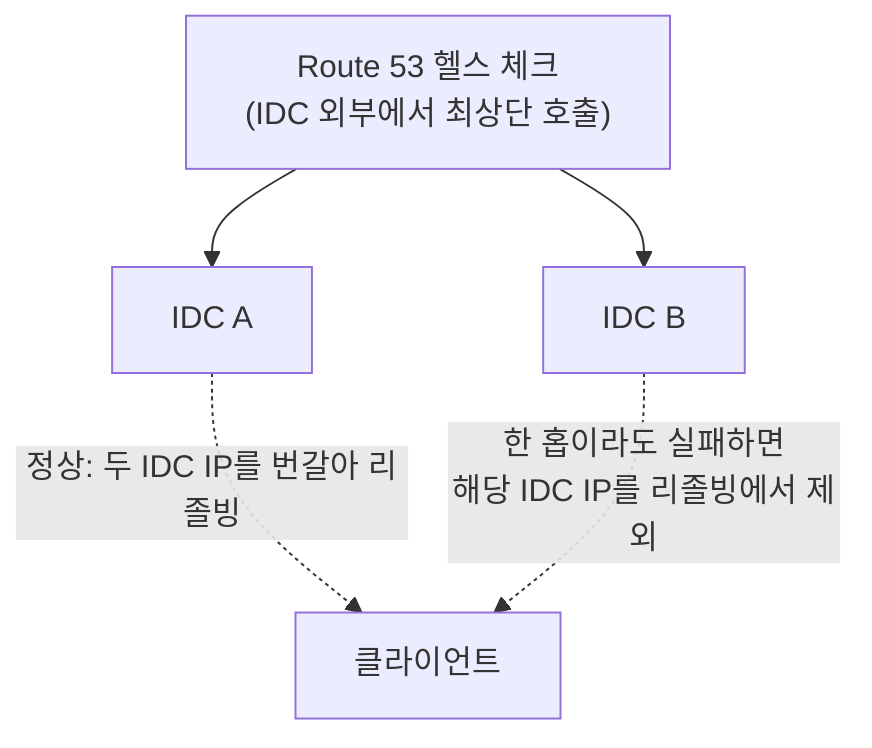
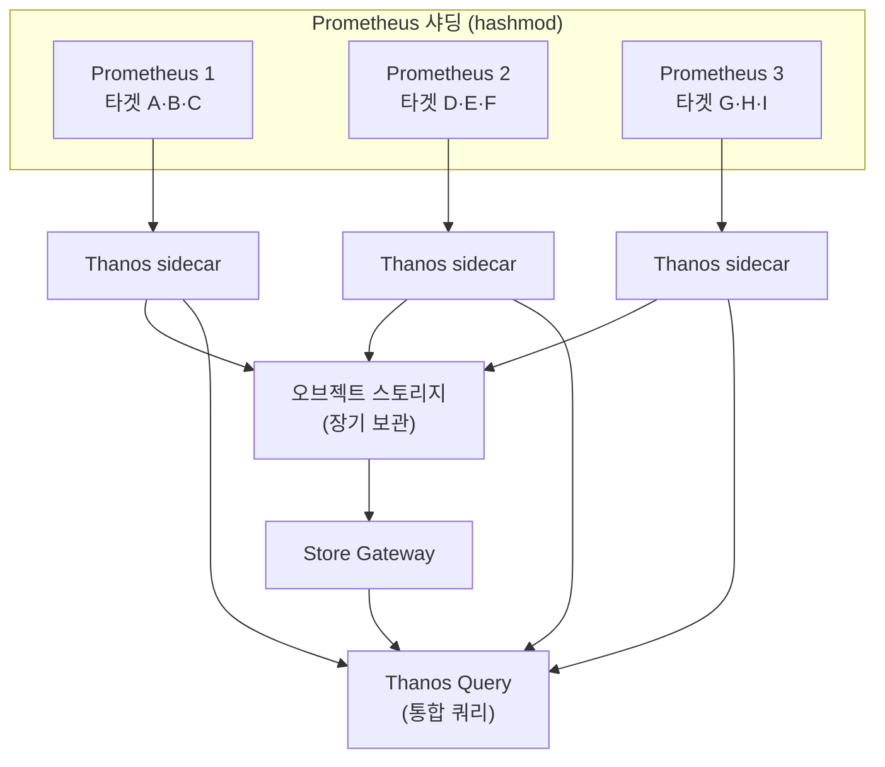

| | |
| --- | --- |
| 발표 | SLASH 21 |
| 연사 | 이재성 (토스 DevOps Engineer) |
| 자료 | [발표 영상](https://www.youtube.com/watch?v=rxurfKT2lD8) · [SLASH 21](https://toss.im/slash-21) |

토스 서버 인프라가 2019년 DC/OS + Vamp에서 Istio + Kubernetes로 옮겨가면서 모니터링 체계가 어떻게 바뀌었는지 정리한 발표다. 모니터링 영역을 애플리케이션·네트워크·OS 세 레이어로 나누고 각 레이어에서 이슈와 메트릭의 상관관계를 높인 방법, 그리고 모니터링 인프라 자체(Prometheus)의 한계와 스케일 아웃까지 다룬다. 내용은 발표 영상과 자동 생성 자막을 근거로 했고, 표현은 내 말로 바꿨다.

## DC/OS + Vamp에서 Istio + Kubernetes로

발표자가 입사한 2019년 마이크로서비스는 130개 정도였고 발표 시점에는 236개였다. 서비스가 늘면서 도메인 간 요청의 트랜잭션이 길어지고 복잡도가 올랐다. 2019년 중반까지는 DC/OS(컨테이너 오케스트레이션)와 Vamp(서비스 디스커버리를 담당하는 API 게이트웨이 컴포넌트) 기반이었는데 운영 비용이 높고 서비스 디스커버리에 한계가 있었다. 마침 PoC 중이던 Istio + Kubernetes가 대규모에 맞게 설계돼 있어 마이그레이션을 결정했고, 액티브-액티브 IDC 두 곳이 모두 옮겨가기까지 9개월이 걸렸다.

마이그레이션에서 늘 겪는 문제는 신규 시스템이 기존과 다른 새 문제를 만든다는 것이다. 그래서 신규 인프라의 가시성을 프로덕션 레벨로 빠르게 올려야 했고, 그 과정에서 모니터링이 InfluxDB + Telegraf에서 Prometheus로 바뀌었다. Kubernetes 생태계가 기본으로 내놓는 메트릭이 Prometheus 형식이었고, Thanos 같은 도구가 운영 편의를 도왔다.

Istio에서 두드러진 것은 서비스 디스커버리다. Vamp API 게이트웨이는 장애 하나가 전면 장애가 됐지만, 서비스 메시는 분산 API 게이트웨이 구조로 **클라이언트 사이드 로드밸런싱**을 하므로 게이트웨이 하나가 죽어도 영향이 적다. 사이드카가 서비스의 인바운드·아웃바운드 트래픽 통제권을 가지므로 mTLS, 서킷브레이커, 재시도 같은 네트워크 구성을 애플리케이션 코드에서 분리할 수 있었다.

## 세 레이어

보통 오류 로그를 보고 이슈를 알게 되는데, 로직이 복잡하거나 트랜잭션이 길면 로그만으로는 원인을 파악하기 어렵다. 잘 동작하다가 갑자기 오류가 나는 이슈가 까다롭고 흔하다. 이때 메트릭이 원인 규명을 돕는다. 전체 장애를 보고 어느 애플리케이션의 문제인지 판단한 뒤, 네트워크와 애플리케이션이 실행된 머신을 본다.

| 레이어 | 보는 것 | 로그와의 상관관계 |
| --- | --- | --- |
| 애플리케이션 | Spring 기반이 대다수라 JVM, Tomcat 메트릭. Node·Go·Python도 필요에 따라 지원 | 가장 높음. 여기부터 본다 |
| 네트워크 | 서비스 간 통신, 인그레스까지의 모든 네트워크 홉 | 애플리케이션에서 특이점이 없으면 |
| OS | 리소스가 얼마나 부족한지, 에러가 있는지 | 가장 낮음. 마지막 판단 근거 |

## 네트워크 레이어: Istio가 준 것

서비스 메시로 네트워크 제어권이 강화되면서 메트릭도 풍부해졌다. 어떤 소스 애플리케이션의 어떤 버전이 어떤 목적지의 어떤 버전에 요청했는지 알 수 있고, `reporter` 속성으로 소스와 목적지가 다른 응답으로 처리한 경우도 인지할 수 있다. 특히 **response flag**가 한 요청 플로 안에서 업스트림과 다운스트림 사이의 비정상을 파악하는 데 도움이 됐다.

| 플래그 | 상황 |
| --- | --- |
| UH | 타겟 서비스에 인스턴스 IP가 없거나 헬스 체크 실패로 정상 대상이 없음 (No Healthy upstream) |
| UO | 요청이 계속 실패해 서킷이 열림 (Upstream Overflow) |
| DC | 리드 타임아웃으로 클라이언트가 먼저 끊음 (Downstream Connection termination) |
| UC | 서버가 요청에 제대로 응답하지 않음 (Upstream Connection termination) |

클라이언트 사이드 로드밸런싱이라 A가 B에 요청하려면 B의 모든 타겟 인스턴스 IP를 갖고 있어야 하고, 서비스 디스커버리 이슈가 곧 UH로 드러난다. 요청이 오래 걸리거나 커넥션 문제가 났을 때 로그에 남지 않는 상황도 있는데, 그런 것이 DC·UC 플래그로 메트릭에 남는다. UC·DC·UH 알림으로 원인에 접근하는 것이 쉬워졌다.

### 블랙박스 모니터링과 IDC 페일오버

사용자가 애플리케이션까지 도달하려면 여러 네트워크 홉을 거치고, 특정 홉에서 문제가 나면 서비스까지 트래픽이 오지 않는다. 서버에는 오류 로그가 나지 않고 트래픽만 줄어들기 때문에 가시성이 없으면 "트래픽이 적었나 보다"로 오판한다. 그래서 IDC 외부에서 최상단을 지속적으로 찔러 애플리케이션까지의 도달 여부를 판단하는 블랙박스 모니터링을 AWS Route 53으로 구성했다.

정상이면 양쪽 IDC IP를 번갈아 리졸빙하고, 어느 홉에 문제가 생겨 헬스 체크가 실패하면 해당 IP를 리졸빙하지 않아 다른 IDC로 페일오버된다. DNS 기반이라 클라이언트 캐싱 때문에 완벽하지는 않지만 외부 통신 확인에는 충분했다.

## OS 레이어: USE 메서드

OS는 복잡한 소프트웨어라 메트릭 종류가 많고, 하드웨어 리소스 메트릭과 애플리케이션 오류의 상관관계를 찾기 어렵다. CPU 사용률이 높다고 애플리케이션이 제대로 동작하지 못했다고 단정할 수 없다. 경험에 의존하던 중 Netflix의 Brendan Gregg가 만든 **USE 메서드**(Utilization, Saturation, Errors)에서 영감을 얻었다. 각 리소스의 사용률·포화·에러를 보고 문제를 배제해 나가는 방식이다.

| 리소스 | Utilization | Saturation | Errors / 대응 |
| --- | --- | --- | --- |
| CPU | 컨테이너 CPU 사용량 | CFS throttling 양 | 스로틀링이 있으면 CPU가 원인에 기여했다고 판단. CPU를 더 줄지 스레드·프로세스 설정을 바꿀지 결정 |
| 메모리 | 컨테이너 메모리 사용량, 애플리케이션이 영역을 나눈다면 그 메트릭 | 직관적 메트릭을 못 찾아 OOM 이벤트로 판단 | OOM이 아니면 메모리 이슈로 보지 않음. OS 캐시 문제는 주기적으로 비움 |
| 디스크 | 애플리케이션별 read/write | I/O time 증가 | 에러 여부. 서버 인프라는 보통 디스크에 저장하지 않으므로 애플리케이션이 왜 디스크를 쓰는지 원인을 찾음 |
| 네트워크 | 애플리케이션별 패킷 양 | 호스트 OS 관점의 drop·overrun | 특정 애플리케이션이 대역폭을 점유해 다른 애플리케이션이 통신하지 못하면 사용을 제한 |

컨테이너 오케스트레이션에서는 한 호스트에 여러 컨테이너가 뜬다. CPU와 메모리는 최대한 독립적으로 쓸 수 있지만 네트워크와 디스크는 독립되기 어려워 같은 머신의 애플리케이션이 서로 성능에 영향을 준다. 네트워크 포화는 컨테이너 소켓에는 잘 잡히지 않아 호스트 OS 관점에서 본다. 이 인사이트를 하나의 대시보드로 묶었다.

IDC에서는 하드웨어 문제로 머신이 꺼지거나 사람의 실수로 내려갈 수 있다. 그러면 서비스 디스커버리에서 그 인스턴스의 타겟을 빠르게 제거해야 트래픽이 문제 장비로 흐르지 않는다. Kubernetes 옵션은 클러스터링 관점이라 노드 헬스 체크도 판단해야 하고 애플리케이션을 내리는 시간이 지연된다. 그래서 **1초마다 ping**을 날려 메트릭을 만들고, 특정 임계값을 넘으면 그 머신의 애플리케이션을 제거해 장애 시간을 최소화했다.

## 모니터링 인프라 자체의 문제: Prometheus

Prometheus가 내려가면 메트릭을 전혀 볼 수 없다. 단점은 둘이다. 스스로 스크래핑하는 방식이라 죽으면 수집이 중단되고 그 시간의 메트릭은 누락된다. 그리고 메모리 이슈가 많았다. 프로파일링 결과 수집되는 메트릭 양과 TSDB로 로드되는 양에 비례했다. 메트릭이 갑자기 늘면 OOM으로 내려가고 그동안 메트릭을 볼 수 없었다.

첫 접근은 양 줄이기다. 수집한 메트릭을 다 보는지, 카디널리티가 적합한지 판단해서 불필요한 메트릭은 없애고 카디널리티가 넓은 메트릭은 집계로 축소했다. 효과는 있었지만 유지해야 하는 가시성이 있어 한계에 닿았다.

그래서 스케일 아웃했다. Prometheus의 `hashmod` 옵션으로 타겟을 Prometheus 개수만큼 나눠 스크래핑하면 부하가 고르게 분산된다. 이전 InfluxDB에서는 메트릭 종류마다 분리해 쌓았기 때문에 특정 메트릭이 급증하면 분리 로직을 고민하고 애플리케이션에 반영해야 했는데, 타겟 샤딩은 운영 측면에서 훨씬 낫다. Thanos Query가 통합 쿼리를 제공하므로 사용자 입장에서 달라지는 것은 없다. Thanos sidecar가 TSDB를 오브젝트 스토리지로 올리고 Store Gateway로 조회하므로 Prometheus의 로컬 TSDB는 최소로 유지하면서 보관 기간은 더 길게 가져갈 수 있다.

## 리뷰

**레이어 나누기가 발표의 뼈대이고, 각 레이어에서 "로그와 상관관계가 높은 메트릭"을 찾은 것이 내용이다.** 네트워크 레이어의 답은 Istio response flag, OS 레이어의 답은 USE 메서드였다. 메트릭을 많이 모으는 것이 아니라 오류와 연결되는 메트릭을 고르는 문제로 정의한 점이 같은 날 [SRE 사례 발표](/posts/slash21-sre-cases/)의 "메트릭은 많을수록 좋다"와 대비된다. 둘 다 맞다. 많이 남기되 볼 때는 상관관계 순서로 본다.

**클라이언트 사이드 로드밸런싱의 함의를 짚은 점이 좋다.** 게이트웨이 단일 장애점이 사라진 대신 "모든 호출자가 모든 타겟 IP를 알아야" 하고, 그것이 안 되면 UH로 나타난다. 서비스 메시의 장점과 그 장점이 만드는 새 장애 모드를 같은 메트릭으로 설명했다. 이 발표의 Istio는 2년 뒤 SLASH 23의 [Istio 제로 트러스트](/posts/slash23-istio-zero-trust/)와 [토스 게이트웨이](/posts/slash23-toss-gateway/) 발표로 이어진다.

**Prometheus 샤딩 → Thanos는 2021년의 표준 답이고, 여기서는 "왜 그 답에 이르렀는지"가 기록됐다.** 메트릭 줄이기로 버티다가 "유지해야 할 가시성" 때문에 한계에 닿아 스케일 아웃으로 간 순서가 현실적이다.

## 남는 질문

- 1초 ping 기반 노드 제거의 임계값과 오탐. 네트워크 순단으로 정상 머신의 애플리케이션을 제거한 적은 없는지.
- Route 53 헬스 체크의 주기와 DNS TTL. 페일오버까지 실제로 몇 분이 걸렸는지.
- hashmod 샤딩에서 Prometheus 하나가 죽으면 그 샤드의 타겟은 누락된다. 샤드마다 복제본을 두었는지.
- 메모리 포화의 직관적 메트릭을 못 찾았다고 했는데, 이후 PSI(Pressure Stall Information) 같은 지표를 도입했는지.

## 참고

- [발표 영상](https://www.youtube.com/watch?v=rxurfKT2lD8)
- [SLASH 21](https://toss.im/slash-21)
- [Brendan Gregg - The USE Method](https://www.brendangregg.com/usemethod.html)
- [Envoy response flags](https://www.envoyproxy.io/docs/envoy/latest/configuration/observability/access_log/usage#config-access-log-format-response-flags)
