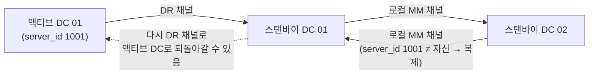
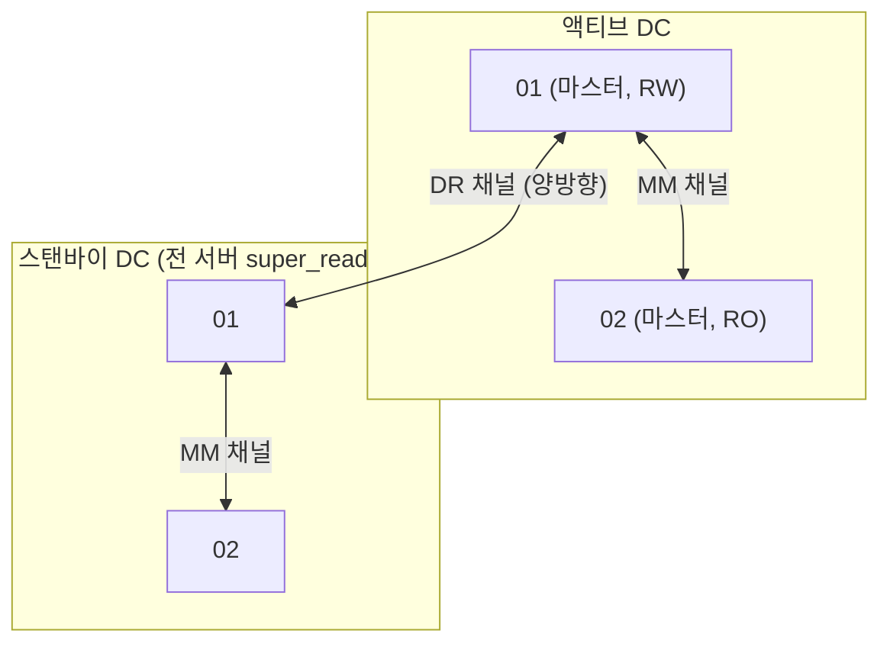

| | |
| --- | --- |
| 발표 | SLASH 21 |
| 연사 | 김피터 (토스 코어 데이터 서비스팀, Database Administrator) |
| 자료 | [발표 영상](https://www.youtube.com/watch?v=t96l6ry_qmw) · [SLASH 21](https://toss.im/slash-21) |

토스 MySQL의 HA 솔루션 MMM과 두 데이터센터 사이의 DR 토폴로지가 어떻게 바뀌었는지 설명하는 발표다. 단방향 DR을 완전 대칭 양방향으로 바꾸면서 만난 바이너리 로그 무한 루프 문제와 MMM의 멀티 소스 복제 미지원 문제, 그 해법, 그리고 장애 케이스별 페일오버 시나리오와 "복구 불가능한 불일치"를 막는 super_read_only 안전장치까지 이어진다. 내용은 발표 영상과 자동 생성 자막을 근거로 했고, 표현은 내 말로 바꿨다.

## MMM

MMM은 Multi-Master Replication Manager for MySQL의 약자로, 토스 MySQL의 HA 솔루션이다. Google에서 개발됐고 버전 업데이트는 중지돼 필요에 따라 자체 수정하며 쓴다. 토스는 마스터-마스터 01·02 노드 한 쌍만 MMM이 관리하도록 구성한다. 슬레이브를 MMM 관리에 포함할 수도 있지만 신규 마스터로 페일오버하는 과정에서 대응되지 않는 케이스가 있어 쓰지 않는다.

구성은 모니터링 데몬, 에이전트 데몬, 서비스 IP다. 모니터링 데몬은 별도 호스트에서 모든 모니터링·의사결정·명령을 수행하고, 에이전트 데몬은 각 DB 서버에서 명령을 실행하며, 서비스 IP는 DB 롤 변경에 따라 이동해 애플리케이션 서버의 페일오버를 만든다. 모니터링 항목은 넷이다.

| 항목 | 확인하는 것 |
| --- | --- |
| ping | 호스트가 살아 있는지 |
| mysql | MySQL 인스턴스가 살아 있는지 |
| rep_threads | 복제 스레드가 정상 작동하는지 |
| rep_backlog | 복제 지연이 임계값을 넘는지 |

이 중 이상이 있으면 MMM이 스탠바이 마스터로 페일오버한다.

## 단방향 DR의 부담

처음 DR을 구성했을 때는 액티브 DC의 마스터 → 스탠바이 DC의 마스터가 단방향 복제였고, 스탠바이 DC 안의 로컬 마스터 간에도 단방향이었다. 그래서 DC 페일오버를 하려면 롤 전환 작업이 필요했다. 신규 액티브 DC를 마스터-마스터로 전환하고, DC 간 마스터-슬레이브 관계를 뒤집고, 신규 스탠바이 DC를 단방향으로 전환한다. 하나하나는 어렵지 않지만 번거롭고 부담스럽다.

DR의 목적이 재난 시 비즈니스 연속성이라 DC 페일오버가 거의 없을 거라 봤는데, 간편결제 파트너사가 늘면서 **무중단 운영**의 필요가 커졌다. 대규모 네트워크 작업이 무중단 DC 롤링으로 계획됐고 DB도 DC 페일오버가 필요했다. 롤링 때마다 롤 전환 부담이 컸고 작업 실수로 복제가 깨지기도 했다. 다운타임이 필요하거나 온라인으로 하기엔 위험한 작업도 생기므로 DC 전환을 최대한 간소화해야 했다.

## 대칭 구성을 만들며 만난 두 문제

원하는 모습은 양쪽 DC를 대칭으로 만들어 DC 페일오버 때 애플리케이션 커넥션만 넘기고 DB 레벨에서는 할 일이 없는 구조다. 기존 단방향 DR 채널과 DR 센터의 마스터-슬레이브 채널이 모두 마스터-마스터 양방향이 되는 완전 대칭이다. 여기서 두 이슈가 생겼다.

### 바이너리 로그 중복 전송(무한 루프)

01·02는 `log_slave_updates`를 켜고 운영한다. SQL 스레드가 적용한 트랜잭션도 바이너리 로그에 기록하는 옵션이다.

액티브 01에서 생성된 트랜잭션의 바이너리 로그는 DR 채널을 따라 스탠바이 01에 적용되고, 스탠바이 01이 다시 바이너리 로그를 만들면 슬레이브인 스탠바이 02가 적용한다. 여기까지는 단방향과 같다. 그런데 02가 적용한 로그가 자체 바이너리 로그로 생성되고, 01은 02의 마스터이자 슬레이브이므로 이 로그를 복제할지 판단한다. 판단은 **로그가 처음 생성된 서버의 server_id와 자기 server_id가 다른지**로 한다. 이 로그의 server_id는 액티브 01의 것이라 스탠바이 01과 다르고, 그래서 다시 복제된다. 실제 변경이 없으면 로그가 생성되지 않아 네 번째 단계까지 갈 확률은 낮지만 이론적으로는 무한 루프가 가능하다.

GTID로 중복 적용을 막는 방법이 있지만 당시 바로 전환하기는 어려웠고, GTID로 가도 전송 자체의 핑퐁은 생기며, 바이너리 로그 포지션 방식으로 되돌릴 때 문제가 되므로 **중복 전송 자체를 막을** 방법이 필요했다. 해법은 바이너리 로그 필터로 루프를 끊는 것이다.

### MMM이 복제 채널을 구분하지 못한다

각 DC의 01 서버는 DR 양방향 채널이 추가되면서 DR 채널과 로컬 마스터-마스터 채널이 동시에 있는 **멀티 소스 복제** 상태가 된다. MMM은 어느 채널을 모니터링해야 하는지 모른다. MMM 소스를 수정해 MM 채널만 모니터링하도록 했다.

## 현재 DR 구성

각 DC의 01에서 생성된 DR 채널과 MM 채널에 필터가 걸려 있다. **DR 채널**은 로컬 DC에서 발생한 트랜잭션의 로그를 받지 않는다. **DR 채널이 있는 마스터의 MM 채널**은 원격 DC에서 발생한 트랜잭션의 로그를 받지 않는다. 이 조건이면 중복 전송이 방지되고 각 DC의 로컬 MM 구조와 DC 간 MM 구조가 유지된다. 이제 DC 페일오버 때 DB 레이어에서는 커넥션 모니터링 외에 할 일이 없고, 예전에는 로컬 DC 안의 롤링만 고려했는데 적은 부담으로 DC 페일오버가 가능해지면서 더 많은 무중단 작업을 할 수 있게 됐다. 단, 스탠바이 DC는 DR 역할이므로 양쪽에서 동시에 쓰기를 받지 않도록 **DR 센터의 모든 서버를 super_read_only**로 유지해 깨질 가능성을 차단한다.

## 장애 케이스별 페일오버

| 케이스 | 상황 | 동작 |
| --- | --- | --- |
| 액티브 DC 마스터 인스턴스 장애 | 01 장애 | MMM 모니터가 감지 → 스탠바이 마스터가 전송받은 로그를 모두 적용했는지 확인 → read_only 해제 → 01의 서비스 IP를 스탠바이 마스터로 이동 → 커넥션이 넘어오며 정상화 |
| 액티브·스탠바이 마스터 모두 장애 | DC 장애와 동급 | MMM이 감지하지만 스탠바이도 장애라 페일오버 불가. 평시 L7을 통한 DB 접속은 하지 않아 DNS 도메인 변경으로 페일오버. 애플리케이션이 재접속할 때 리졸빙이 바뀌어 스탠바이 DC 마스터로 붙음 |
| 계획된 DC 페일오버 | 무중단 작업 | 평시 커넥션 도메인은 서비스 IP를 직접 가리킴. L7 VIP가 서비스 IP로 라우팅되도록 설정하고 커넥션 도메인을 L7으로 DNS 변경 → 모든 커넥션이 L7 경유임을 확인 → 계획된 시점에 L7 페일오버로 한 번에 스탠바이 DC로 전환. 애플리케이션 영향은 커넥션이 한 번 끊겼다 다시 맺어지는 정도 |
| 데이터 삭제 등 논리적 장애 | 시점 복구 필요 | 각 DC에 백업 인스턴스가 지연 복제로 존재(액티브 1시간, 스탠바이 3시간). 02에 당일 백업본 유지. 장애가 빨리 공유될수록 빠르게 복구 가능. 시점 복구 후 라이브에 적용 |

## 복구 불가능한 불일치를 막는 장치

MMM 운영 중 발생할 수 있는 시나리오를 테스트한 내용이다. 드물지만 실제로 나면 복구가 힘든 최악의 상황이다.

- T1: 01이 RW, 02가 RO, 정상 복제로 싱크 유지.
- T2: 02에 장애가 나 인스턴스가 재시작되고 복제가 중지. 01로 쓰기는 계속 들어오고 01·02의 불일치가 커진다.
- T3: 02의 복제 중지가 해결되지 않은 상태에서 02 장애의 원인이 된 쿼리가 01에도 들어와 01이 재시작. MMM은 01이 죽었으니 02 상태와 무관하게 02로 페일오버한다. 02는 01의 변경 내역을 싱크하지 못한 채 쓰기를 받는다. **불일치 데이터를 수동으로 모두 복구해야 하는 상황**이다.

두 가지를 적용했다. (1) DB 인스턴스가 장애로 재시작될 때 **super_read_only 상태로 올라오도록** 설정. (2) MMM 페일오버 때 대상 DB가 super_read_only면 **해제하지 못하고 페일오버 대기 상태**에 머물도록 패치.

같은 시나리오를 다시 돌리면 T2에서 02가 super_read_only로 올라오고, T3에서 01도 super_read_only로 올라오며, MMM은 02로 페일오버를 시도하다가 super_read_only임을 확인하고 실행하지 않고 "페일오버 불가"만 로그에 남긴 채 대기한다. 애플리케이션의 쓰기가 막히고 장애가 지속되지만, 불일치 상태에서의 쓰기로 인한 **복구 불가능한 불일치**는 막는다. 이때 운영자가 개입해 상황을 해결하고 서비스를 정상화한다.

## 리뷰

**"장애를 길게 두더라도 복구 불가능은 막는다"는 트레이드오프가 이 발표의 핵심이다.** 자동 페일오버는 가용성을 위한 것인데, 마지막 시나리오는 자동 페일오버를 일부러 멈춘다. 불일치 상태에서 쓰기를 받는 것보다 쓰기가 막힌 채 사람을 기다리는 것이 낫다는 판단이다. 금융 DB의 HA에서 가용성과 정합성 중 어느 쪽이 우선인지 명확히 보여준다.

**바이너리 로그 필터로 루프를 끊은 것은 GTID 전환이 어려운 현실에서의 답이다.** server_id 비교만으로는 삼각 구조에서 루프를 막을 수 없다는 것을 흐름으로 설명하고, GTID의 한계(전송 핑퐁, 포지션 방식 회귀 문제)까지 짚었다. MySQL 복제 토폴로지를 설계할 때 `log_slave_updates`가 만드는 전파 경로를 그려보라는 교훈이다.

**MMM 소스를 고쳐 쓰는 것이 자연스러운 조직이다.** 업데이트가 멈춘 오픈소스를 멀티 소스 복제와 super_read_only 대기 로직으로 확장했다. 같은 해 다른 발표들에서 Lettuce PR, Prometheus 스트리밍 응답 같은 패치가 나오는 것과 같은 태도다.

## 남는 질문

- 이후 MMM을 Orchestrator나 MySQL Group Replication 같은 것으로 교체했는지. 발표 시점에 이미 "필요에 따라 자체 업데이트"였다.
- GTID 전환은 결국 했는지. 했다면 필터 구성이 어떻게 바뀌었는지.
- DR 채널 양방향인데 스탠바이 전 서버가 super_read_only라면 스탠바이 → 액티브 방향의 로그는 평시에는 비어 있다. 액티브-액티브 쓰기를 고려한 적은 없는지.
- 지연 복제 1시간·3시간은 어떤 근거로 정했는지. 논리적 장애를 1시간 안에 인지하지 못한 사례가 있었는지.

## 참고

- [발표 영상](https://www.youtube.com/watch?v=t96l6ry_qmw)
- [SLASH 21](https://toss.im/slash-21)
- [MySQL Multi-Source Replication](https://dev.mysql.com/doc/refman/8.0/en/replication-multi-source.html)
- [MySQL super_read_only](https://dev.mysql.com/doc/refman/8.0/en/server-system-variables.html#sysvar_super_read_only)
