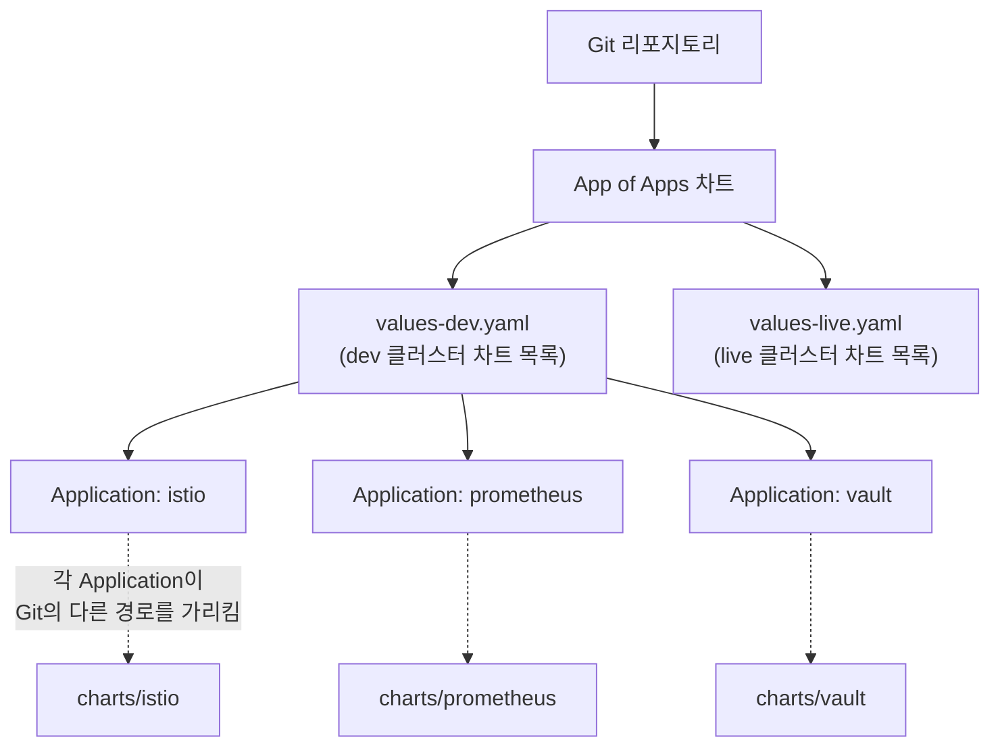
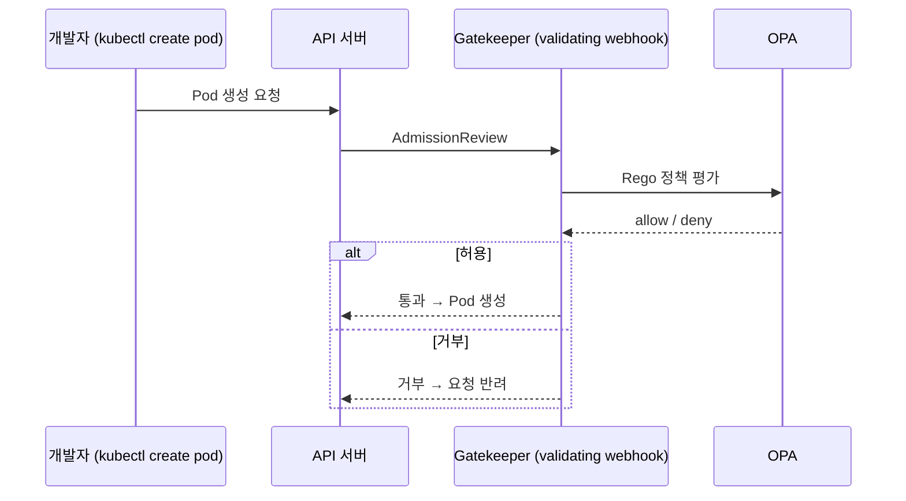

| | |
| --- | --- |
| 발표 | SLASH 21 |
| 연사 | 김형록 (토스 서버 플랫폼팀, DevOps Engineer) |
| 자료 | [발표 영상](https://www.youtube.com/watch?v=gF1wfTCDyI8) · [SLASH 21](https://toss.im/slash-21) |

네트워크나 모니터링 같은 기능적 운영이 아니라, 쿠버네티스를 관리하는 엔지니어가 어떻게 하면 실수하지 않고 편하게 작업할 수 있는지 그 환경 구성에 대한 발표다. 답은 둘이다. 멀티 클러스터 형상을 Git 하나로 관리하는 GitOps(Argo CD, App of Apps, Vault 오퍼레이터), 그리고 잘못된 변경을 API 서버 앞에서 막는 OPA Gatekeeper. 내용은 발표 영상과 자동 생성 자막을 근거로 했고, 표현은 내 말로 바꿨다.

## 왜 이런 고민을 하게 됐나

쿠버네티스에서 컨테이너는 격리로 높은 보안성을 갖는다고 생각하지만, 네트워크 안에 얽힌 수많은 서비스의 복잡도가 가시성을 떨어뜨려 휴먼 에러나 보안 구멍이 생길 기회를 준다. 가시성이 낮고 안전장치가 없으면 간단한 설정 변경으로도 예상치 못한 장애가 난다. 자신은 특정 실수를 하지 않을 확신이 있어도 다른 팀원에게 그것을 바라는 것은 항상 비용이 따르고, 새 팀원은 늘 생긴다.

토스는 세 종류의 클러스터를 운영한다. 트래픽이 없는 테스트베드, 개발·테스트 트래픽이 들어오는 dev, 그리고 라이브다. Istio 버전 업그레이드라면 테스트베드 → dev에서 검증한 뒤 라이브에 점진 적용한다. 라이브는 멀티 데이터센터 멀티 클러스터 액티브-액티브라 상단 트래픽을 조절해 사이드 이펙트를 쉽게 제거하고 언제나 graceful하게 인프라 변경을 적용할 수 있다.

문제는 너무 쉽게 튜닝과 벤치마킹을 할 수 있다 보니 **양 클러스터의 리소스 형상이 달라지는** 경우가 생긴다는 것이다. 극단적으로는 Istio·Prometheus 같은 주요 인프라 설정이 두 클러스터에서 동시에 다를 수 있다. 반복되면 예상치 못한 사이드 이펙트가 생기고, 어떤 변경이 어느 클러스터에 선적용됐고 어디까지 전파됐는지 일상적으로 확인하게 된다. 여기에 계열사 인프라까지 있으니 효율적인 멀티 클러스터 형상 관리가 꼭 필요했다.

## GitOps: Argo CD

GitOps는 Git을 애플리케이션의 single source of truth로 여기는 것이다. 생성·삭제·수정 등 배포 관점의 모든 작업을 Git을 통해 적용한다. 구현은 Argo CD다. Git에 있는 배포 정보(Helm 차트, Kustomize 등)를 쿠버네티스 커스텀 리소스로 표현하고 실제 배포 상태와 싱크하는 오퍼레이터 패턴의 오픈소스다. 컴포넌트는 API 서버, 타겟 Git 리포지토리를 클론받아 매니페스트를 관리하는 repo 서버, 생성된 매니페스트와 실제 클러스터를 비교·싱크하는 컨트롤러 셋이다.

`Application` 커스텀 리소스에는 클러스터와 네임스페이스 쌍으로 배포 위치를 나타내는 `destination`과 차트를 만드는 데 필요한 정보를 담는 `source`가 있다. 이 리소스는 현재 상태가 아니라 **의도된 상태**를 표현한다. 이것이 사용 패턴에 큰 영향을 준다. auto-sync를 켜지 않으면 Application 리소스를 배포하는 단계와 그 템플릿을 실제로 적용하는 단계가 분리되어, 변경을 Git 템플릿과 UI·클러스터에서 두 번 체크할 수 있다. 토스는 대부분의 리소스에 auto-sync를 쓰지 않는다. Git과 클러스터 형상이 달라지는 문제가 생길 수 있지만 작업자가 빠르게 맞추는 것을 원칙으로 삼고, Git을 "현재 배포 상태"가 아니라 **"의도된 배포 상태"의 single source of truth**로 여긴다. 그 편이 더 안전했다.

## App of Apps

모든 쿠버네티스 리소스는 Helm 차트로 패키징한다. 차트 단위가 아니라 **클러스터 단위**의 변경 사항을 체크하려면 App of Apps 구조가 필요했다. 특정 클러스터에 배포되는 모든 차트를 부트스트래핑하는 차트다.

리포지토리 안에 app-of-apps, istio, prometheus, vault 폴더가 각각 Helm 차트로 있다면 App of Apps 차트 하나가 나머지 리소스의 배포 상태를 알려주는 Application 리소스를 만들어 준다. 각 Application이 Git의 다른 경로를 가리키게 해서 많은 차트를 한 번에 보고, App of Apps 배포 하나로 나머지를 부트스트래핑한다. 템플릿을 쓰면 values 파일에서 리소스를 추상화할 수 있어 템플릿 폴더는 평상시 접근할 필요가 없고 values 파일은 현재 클러스터에 배포된 차트 리스트만 갖는다. values 파일을 여러 개 두면 dev 클러스터는 `values-dev`로, live는 `values-live`로 부트스트래핑하면서 **하나의 App of Apps 차트, 하나의 리포지토리를 모든 클러스터가 공유**한다. 리포지토리 하나로 모든 인프라 리소스 설정을 보고, 설정 파일 하나로 특정 클러스터의 글로벌 형상을 추적한다. 실제로는 계열사와 클러스터 단위로 더 고도화한 형태를 운영한다.

## 시크릿: Vault 오퍼레이터

모든 리소스를 Git에 올리면 각종 오픈소스에 필요한 쿠버네티스 Secret도 노출된다. GitOps에서 늘 나오는 고민이라 시크릿 암복호화 오픈소스가 몇 있지만, 이미 HashiCorp Vault가 있어서 Vault로 풀었다. kubebuilder로 간단한 오퍼레이터와 `VaultSecret` 커스텀 리소스 정의를 만들어, 경로가 주어지면 오퍼레이터가 그 경로의 시크릿을 Vault에서 읽어 같은 이름의 쿠버네티스 Secret을 생성한다. 차트에 필요한 Secret을 VaultSecret으로 바꾸면 Git에 값을 노출하지 않고 GitOps를 구현할 수 있다.

## GitOps 운영 결과

장점은 넷이다. 튜닝한 App of Apps 통합 차트로 인프라 가시성이 크게 높아졌고, 신규 클러스터 세팅 속도가 크게 올랐으며, 같은 Application이면 같은 경로의 차트를 계속 써서 예상치 못한 구성 차이를 막았고, 가장 도움이 된 것은 **히스토리 추적**으로 커뮤니케이션 비용이 크게 줄었다는 점이다.

단점은 쿠버네티스 리소스 배포만으로 초기 세팅이 끝나지 않는 애플리케이션은 배포 내용을 Git에 전부 표현할 수 없다는 것이다. Vault는 첫 배포 후 사용 가능해지기까지 일련의 절차가 필요하고 내부 설정을 etcd가 아닌 자체 스토리지에 담아 Helm 차트로 다 표현할 수 없다. 이런 경우 Bank-Vaults나 Strimzi Kafka 오퍼레이터처럼 배포 라이프사이클에 맞춰 절차를 자동 처리하는 오퍼레이터로 해결했다.

## OPA: 휴먼 에러 방지

Open Policy Agent는 Rego라는 자체 언어로 정책을 정의하고 의사결정을 수행하는 컴포넌트다. Envoy 등 많은 시스템에 쓸 수 있지만 여기서는 쿠버네티스의 에러 방지 기능만 다룬다.

쿠버네티스에서 OPA는 admission controller로 쓴다. API 서버에 요청이 들어오면 처리 전 admission review로 특정 액션을 수행하는 컨트롤러다. mutating은 Istio 사이드카 인젝터처럼 리소스를 변형하고, validating은 요청을 허가하거나 거부한다. 둘 다 있으면 mutating이 모두 끝난 뒤 validating이 생성 가능 여부를 검증한다.

Rego 예시는 특정 Docker 레지스트리 사용을 막는 것이다. 요청 리소스가 Pod인지 확인하고 모든 컨테이너의 이미지 이름을 검사한다. 코드만으로는 스크립트일 뿐이므로 **OPA Gatekeeper** 컨트롤러를 설치하고 `ConstraintTemplate` 커스텀 리소스로 정책을 적용한다. 템플릿을 정의하면 Gatekeeper가 같은 이름의 커스텀 리소스를 만들고 어느 타입의 요청에 정책을 적용할지 정한다. 예시로 배포된 `PreventDelete`는 토스가 적용한 정책 중 하나로 **Istio 컨트롤 플레인의 삭제를 막는다**. 이 방식으로 단일 오브젝트에 이름과 필드 기반 조건을 자유롭게 걸 수 있다.

그러면 여러 리소스를 참조해야 하는 조건은 어떻게 하나. 예를 들어 "Istio VirtualService는 타겟 Service에 없는 포트를 가리키면 안 된다"(어기면 라우팅 이슈). Gatekeeper는 stateless라 생기는 문제인데, `Config` 커스텀 리소스로 OPA가 메모리에서 추적할 리소스 타입을 지정하면 된다. 클러스터의 모든 Service를 추적하게 하면 정책 안에서 Service를 참조할 수 있고, VirtualService 요청을 받아 모든 Service를 탐색하며 포트 정책을 적용할 수 있다. 위반하는 변경은 모두 반려된다.

장점은 설정상의 이슈를 막되 **개발자 권한 제어 없이** 방지턱 역할로 해결하므로 생산성을 해치지 않는다는 것이다. 단점은 admission controller 방식이라 일어날 수 있는 휴먼 에러에 비해 OPA가 해결하는 범위가 제한적이라는 것이다.

## 리뷰

**auto-sync를 끈 것이 이 발표에서 가장 토스다운 선택이다.** GitOps의 교과서적 구현은 Git과 클러스터를 자동으로 일치시키는 것인데, 토스는 일부러 두 단계로 나눠 사람이 한 번 더 보게 했다. 대신 "Git = 의도된 상태"로 정의를 바꿨다. 자동화의 편의보다 실수 방지를 우선한 것이고, 발표 제목과 정확히 맞는다.

**OPA의 위치가 좋다.** 권한을 뺏는 대신 잘못된 요청만 반려한다. 개발자가 `kubectl`을 자유롭게 쓰되 Istio 컨트롤 플레인 삭제나 존재하지 않는 포트로의 라우팅 같은 특정 실수만 막는다. "통제보다 방지턱"이라는 원칙이 같은 해 [DW 발표](/posts/slash21-startup-dw/)의 "통제보다 빠른 탐지"와 나란히 놓인다.

**GitOps의 한계를 오퍼레이터로 메운 것이 실용적이다.** Vault처럼 배포 후 절차가 필요한 것은 Git으로 표현할 수 없다는 한계를 숨기지 않고, 그 절차를 오퍼레이터가 대신하도록 했다. 이 구조는 2년 뒤 SLASH 23의 [배포 파이프라인 발표](/posts/slash23-deploy-pipeline/)와 SLASH 24의 [인프라 자동화 발표](/posts/slash22-infra-automation/)에서 확장된다.

## 남는 질문

- auto-sync를 끄면 Git과 클러스터가 다른 상태가 "허용된 일시 상태"가 된다. 그 드리프트를 얼마나 오래 방치할 수 있는지, 감지 알림은 있는지.
- VaultSecret 오퍼레이터는 Vault의 시크릿 로테이션을 어떻게 따라가는지. 생성 이벤트만 받는다면 갱신은 수동인지.
- Gatekeeper의 `Config`로 모든 Service를 메모리에 올리면 클러스터가 커질수록 admission 지연이 늘어난다. 정책 평가 시간이 문제가 된 적은 없는지.
- 이후 Kyverno나 ValidatingAdmissionPolicy(CEL)로 옮겼는지.

## 참고

- [발표 영상](https://www.youtube.com/watch?v=gF1wfTCDyI8)
- [SLASH 21](https://toss.im/slash-21)
- [Argo CD - App of Apps 패턴](https://argo-cd.readthedocs.io/en/stable/operator-manual/cluster-bootstrapping/)
- [OPA Gatekeeper](https://open-policy-agent.github.io/gatekeeper/website/)
