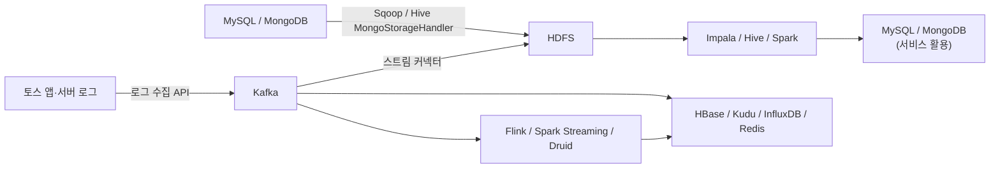
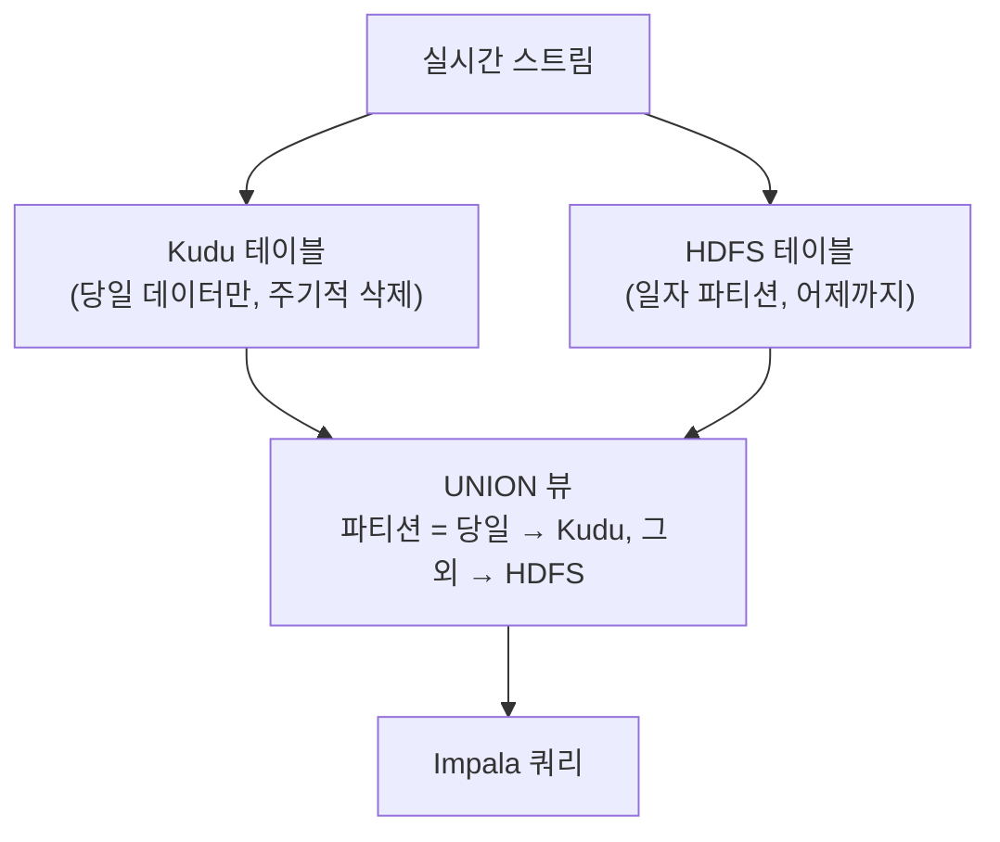

| | |
| --- | --- |
| 발표 | SLASH 21 |
| 연사 | 유결 (토스 Data Platform Team Leader) |
| 자료 | [발표 영상](https://www.youtube.com/watch?v=8ZhnUgylQgo) · [SLASH 21](https://toss.im/slash-21) |

토스 데이터 플랫폼 팀이 데이터의 정의 → 수집·저장 → 추출·가공·적재 → 분석·모니터링 → 활용까지 흐름을 따라 어떤 컴포넌트를 어떤 구조로 운영하는지 훑는 발표다. 같은 날 [DW 발표](/posts/slash21-startup-dw/)가 데이터 팀의 "원칙"이라면 이 발표는 "인프라 지도"다. 한 발표에 Sqoop, Kafka, HDFS, HBase, Kudu, Impala, Spark, Hive, Airflow, Jenkins, Flink, Druid, Elasticsearch, Prometheus, Grafana가 다 나온다. 내용은 발표 영상과 자동 생성 자막을 근거로 했고, 표현은 내 말로 바꿨다.

## 전체 흐름

DB 데이터는 Sqoop으로 HDFS에 적재되고, 앱과 서버 로그는 Kafka를 거쳐 HDFS로 적재되어 가공되거나 용도에 따라 스트리밍 처리된다.

## 데이터 정의: 로그 센터

토스 조직은 앞단에서 서비스를 만드는 사일로와 중앙의 데이터 플랫폼 팀으로 구성된다. 서비스 로그는 각 사일로의 클라이언트 개발자가 데이터 애널리스트와 논의해 SDK로 심는다. 초기에는 로그 입수 과정에 휴먼 에러가 많았고 히스토리를 찾기 어려웠다. 그래서 **로그 센터**라는 로그 정의 시스템을 만들었다. 신규 서비스나 변경 때 새 화면의 로그와 그 화면에서 발생하는 이벤트를 정의하고, 적용 앱 버전을 기록하고, 화면 디자인 이미지를 첨부하고, 각 로그의 필드와 파라미터를 정의하면 유니크한 **스키마 ID**가 생긴다.

클라이언트는 스키마 ID와 함께 로깅하고, 로그는 수집 API 서버를 통해 Kafka로 들어간다. 스트리밍 처리가 로그 센터의 스키마와 비교해 검증하고, 스키마를 캐시해 자동으로 채울 수 있는 값은 채워준다. 로그 정의 시점과 로그 이상 발생 시 Slack으로 자동 알림이 간다.

## 수집·저장

MySQL은 Sqoop으로 주기적으로, MongoDB는 Hive MongoStorageHandler로 HDFS에 적재한다. DB와 테이블을 선택해 등록만 하면 적재 스케줄이 등록되는 **배치 센터**를 만들어 쓰고, Hadoop 에코시스템의 인증·권한은 Apache Sentry로 관리하며, 작업은 Jenkins와 연동해 스케줄링한다.

Kafka는 세 클러스터다. 서비스 큐 용도, 로그 큐 용도, 그리고 분석과 ML 파이프라인을 위한 데이터 플랫폼 클러스터. 클러스터 간 미러링과 HDFS·Kudu·HBase·InfluxDB 등 스토리지 포맷별 적재는 스트리밍 애플리케이션이 담당하고, **토스 데이터 허브**라는 툴에서 설정만으로 자동 배포된다. DR을 위해 두 데이터센터에 액티브-액티브로 Kafka를 운영하고, 컨슈머는 액티브-스탠바이로 장애 시 페일오버하는데 이때 컨슈머 오프셋 싱크가 필요해 **자체 개발한 툴로 오프셋을 동기화**한다. 리전별 Kafka 토픽을 실시간 확인·샘플링·필터링하는 Kafka 뷰어도 만들었다.

HDFS는 heterogeneous storage로 SSD·디스크·NAS를 용도별로 나눈다. 시간이 갈수록 조회가 드문 보관 영역이 누적되고 실시간 서비스용 영역이 대용량 ETL의 I/O 간섭을 받아서다.

| 영역 | 저장 | 용도 |
| --- | --- | --- |
| Hot | SSD | 실시간 애플리케이션, HBase·HBase용 HDFS |
| Warm | 디스크, 3 replication + Hadoop 3의 erasure coding | 일반 데이터, Impala·Hive·Spark ETL |
| Cold | NAS | 백업, 장기 보관 로그 |

서비스와 밀접한 HBase는 별도 HDFS 클러스터로 구성해 리소스 간섭 없이 독립 운영한다.

## 배치 프로세싱: Impala를 주 엔진으로 쓰는 이유와 대가

HDFS·Kudu의 데이터는 Impala·Hive·Spark로 처리하고 워크플로는 Jenkins와 Airflow로 관리한다. 주로 쓰는 것은 **Impala**다. SQL로 제한적이거나 복잡도 높은 처리는 Spark, 처리 방식에 따라 Hive도 쓴다. Impala를 고른 이유는 멀티 유저 성능과 속도다. Cloudera 벤치마크에서 Hive보다 압도적으로, Spark보다도 빠르고, 상황에 따라 Spark나 Hive가 빠른 경우도 있었지만 일반적으로 Impala가 빨랐다.

구성은 catalog 서버(메타데이터 캐시, 변경을 statestore 통해 전달), statestore 서버(데몬 상태 모니터링, 메타데이터 브로드캐스트), impalad(실제 read/write, 쿼리 병렬화·분산; coordinator와 executor 역할 분리 가능)다. 한계와 대응을 정리하면 다음과 같다.

| 한계 | 대응 |
| --- | --- |
| graceful shutdown 없음 | Impala 3.1부터 지원, 버전 업 |
| 자체 쿼리 재시도 없음 | Airflow·Jenkins의 retry |
| impalad 간 메타데이터 싱크 필요 | `SYNC_DDL` 옵션 |
| Spark·Hive·MR로 처리한 결과가 Impala 메타에 반영 안 됨 | 워크플로 완료 후 `INVALIDATE METADATA`로 캐시 플러시 |
| catalog·statestore가 HA 미지원(SPOF) | 클러스터를 둘로 나눠 액티브-액티브. 작업·장애 시 HAProxy로 한쪽만 접근 |
| HDFS·YARN·Impala가 같은 장비의 소프트웨어 스택이라 리소스 간섭 | 위와 같이 클러스터 분리로 최소화 |
| 최대 메모리를 실제보다 크게 잡아야 쿼리 플랜이 거부되지 않음 → 메모리 초과 시 모든 쿼리 실패 | 아래 모니터링·차단 시스템 |
| 클러스터 통합 메트릭 없음 | 각 coordinator의 쿼리 프로파일을 수집해 Kafka로 적재, Druid로 실시간 집계, Grafana로 모니터링. 롱런 쿼리나 과다 리소스 쿼리를 **선제 차단**하는 시스템 개발 |

YARN은 capacity scheduler로 용도별 큐를 나누고 node label로 특정 큐의 태스크가 특정 노드에서만 돌게 한다. 장기간 백필이나 실험 목적의 대용량 작업은 **playground 큐**에 넣어 중요한 Impala·Spark ETL에 영향을 주지 않는 노드에서만 수행한다. 간단한 배치는 배치 센터 + Jenkins, 태스크 간 의존이 복잡한 주요 ETL 파이프라인은 Airflow다.

## 실시간 프로세싱

용도와 상황에 따라 고른다. 스트리밍 처리는 Flink, Spark Streaming, Druid, 자체 개발 스트림 커넥터. 실시간 적재·서빙은 InfluxDB, Redis, HBase, Kudu, Elasticsearch, Druid. 실시간 쿼리는 Druid, Elasticsearch, InfluxDB, Impala + Kudu 조합. 이걸로 실시간 가공·집계·모니터링을 하고 Datadog 오픈소스 계열 도구로 이상 징후 감지와 데이터 서비스 모니터링·알림을 수행한다.

### HDFS + Kudu 하이브리드

Impala를 주로 쓰는데, Impala가 아닌 컴포넌트로 HDFS에 실시간 적재되는 데이터는 Impala 메타와 싱크되지 않아 매번 `REFRESH`나 `INVALIDATE METADATA`가 필요했다. 실시간 데이터와 오랜 기간의 과거 데이터를 한 번에 조회하려는 요구는 많았다. Kudu만 쓰기에는 Kudu 클러스터가 HDFS보다 작아 데이터 크기가 부담이었다. 그래서 둘을 하이브리드로 쓰는 람다 아키텍처를 구성했다.

두 테이블 모두에 실시간 적재하되 Kudu는 당일만 보관하고, 당일 날짜 기준으로 나뉘는 UNION 뷰를 만든다. HDFS + Impala만 썼을 때의 메타데이터 문제를 피하면서 실시간 데이터를 바로 조회할 수 있게 됐다.

## 분석·모니터링·활용

분석가와 데이터 사이언티스트는 Jupyter나 Hue로 Impala·Hive·Spark에 접근한다. 모니터링은 쿠버네티스 위 애플리케이션은 Prometheus, 하드웨어·에코시스템·서비스 메트릭은 Druid·InfluxDB·Elasticsearch를 소스로 Kibana·Grafana, 알림은 Slack이다. 활용 측면에서 실시간 데이터는 스트리밍으로 Redis·HBase·MongoDB에 적재해 쓰고, 배치 데이터는 MySQL·MongoDB에 주기 적재해 서비스 애플리케이션이 쓴다.

자체 분석 툴 **토스 애널리틱스**는 유저 세그먼트를 UI 클릭만으로 AND/OR 조합해 만들고(쿼리 기반도 가능), 화면 분석(어느 화면에서 왔고 어디로 갔는지; 로그 센터의 디자인 이미지가 연동돼 별도 등록 없이 화면 검색으로 바로 확인), 선버스트 퍼널 트리, 퍼널 정의 후 수 초 내 일자별 트렌드, 세그먼트 기반 트리거(다이얼로그·바텀시트·푸시), A/B 테스트 설정과 자동 집계 요약, 메신저(푸시·SMS·알림톡 템플릿 발송, 샘플링 테스트, ML로 CTR을 예측해 클릭할 것 같은 유저에게 발송)까지 한 곳에서 세그먼트를 공유한다.

## 리뷰

**Impala 섹션이 발표의 가장 솔직한 부분이다.** 빠르지만 HA가 없고, 재시도가 없고, 메타데이터가 어긋나고, 메모리 초과 시 전부 실패한다. 그런데도 "속도와 생산성을 포기할 수 없어" 하나씩 극복한 표는, 오픈소스 엔진을 선택할 때 벤치마크 뒤에 따라오는 운영 비용을 그대로 보여준다. 특히 쿼리 프로파일을 Kafka → Druid → Grafana로 보내고 선제 차단까지 직접 만든 것은 "없으면 만든다"는 이 시리즈 전체의 패턴이다.

**자체 개발 툴이 많다.** 로그 센터, 배치 센터, 데이터 허브, Kafka 뷰어, 오프셋 싱크 툴, 쿼리 차단기, 토스 애널리틱스. 2021년 시점에 이미 데이터 플랫폼 팀이 "인프라 운영"보다 "내부 제품 개발"에 가까운 일을 하고 있었다. 4년 뒤 토스 메이커스 컨퍼런스의 [Data Mesh 발표](/posts/tmc25-data-mesh/)에서 이 중앙 집중 구조가 어떻게 바뀌는지 이어 볼 만하다.

**Kafka 액티브-액티브 + 컨슈머 오프셋 싱크는 이후 토스증권의 [Kafka IDC 이중화](/posts/slash23-kafka-idc-redundancy/) 발표와 같은 문제를 다룬다.** 여기서는 한 문장으로 지나가지만, 미러링된 토픽 사이의 오프셋 매핑은 그 자체로 발표 하나 분량의 문제다.

## 남는 질문

- 오프셋 싱크 툴의 동작 방식. 타임스탬프 기반인지, 미러링 시 오프셋 매핑 테이블을 기록하는지.
- Impala 클러스터를 둘로 나눈 액티브-액티브에서 catalog 메타데이터는 어떻게 양쪽에 맞추는지. 한쪽에서 DDL을 하면 다른 쪽은 `INVALIDATE METADATA`인지.
- Kudu에 당일 데이터만 두는 구조에서 자정 경계의 쿼리는 어떻게 되는지. 뷰의 파티션 조건이 바뀌는 순간 데이터가 양쪽에 다 있거나 다 없는 구간이 생기지 않는지.
- 로그 센터의 스키마 검증에서 실패한 로그는 버리는지, 별도 토픽에 격리하는지.

## 참고

- [발표 영상](https://www.youtube.com/watch?v=8ZhnUgylQgo)
- [SLASH 21](https://toss.im/slash-21)
- [Apache Impala](https://impala.apache.org/)
- [Apache Kudu](https://kudu.apache.org/)
