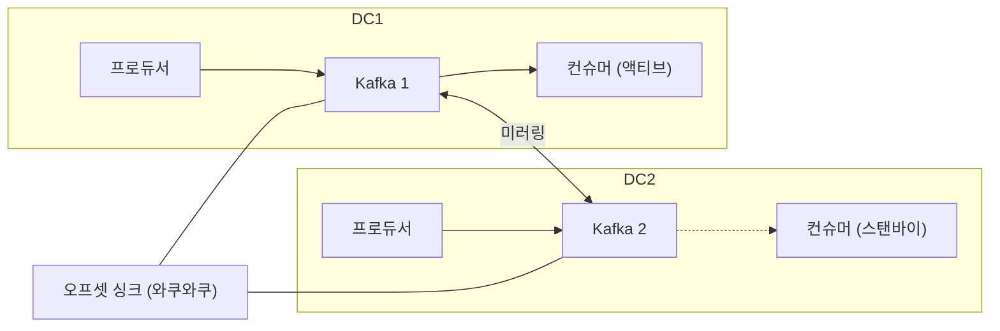

| | |
| --- | --- |
| 발표 | SLASH 21 |
| 연사 | 이항령 (토스 Server Platform Team Leader) |
| 자료 | [발표 영상](https://www.youtube.com/watch?v=YBXFRSAXScs) · [SLASH 21](https://toss.im/slash-21) |

누적 사용자 1,800만, 40여 개 서비스, 월 1,000만 명이 쓰는 토스의 서버 기술 스택을 서버 플랫폼 팀 리더가 한 바퀴 돈 발표다. 두 데이터센터 액티브-액티브 운영, DC/OS → Kubernetes + Istio 전환의 이유와 도입 후 실제로 인프라로 넘긴 것과 넘기지 못한 것, Spring Cloud Gateway, WebFlux + 코루틴, 모니터링, Kafka 두 클러스터 운영, Redis 클러스터 순서다. SLASH 21의 다른 서버 발표들([모니터링](/posts/slash21-server-infra-monitoring/), [쿠버네티스 운영](/posts/slash21-safe-kubernetes-operations/), [SRE 사례](/posts/slash21-sre-cases/))이 각각 깊이 들어간 주제를 이 발표가 한 장의 지도로 묶는다. 내용은 발표 영상과 자동 생성 자막을 근거로 했고, 표현은 내 말로 바꿨다.

## 스택 한눈에

| 영역 | 선택 | 비고 |
| --- | --- | --- |
| 오케스트레이션 | Kubernetes, Calico CNI, Istio 서비스 메시 | MSA라 서버가 많아 도입 |
| 내부 스토리지 | Ceph | 인감 자료 저장 등 |
| 캐시 | Redis Cluster | Memcached에서 이동. 데이터 보존과 낙관적 락 구현 편의 |
| 메시징 | Kafka 두 종류 | 로그 파이프라인 클러스터, 서비스 메시지 큐 클러스터 |
| 로깅·모니터링 | ELK, Prometheus + Thanos, Grafana, Pinpoint, Sentry | |
| 애플리케이션 | Spring 계열, Kotlin(최근), Java(과거) | 서비스 특성별 프로젝트 선택 |
| AWS | DNS, 이미지 검수, 정적 파일 서빙 | 일부 |

## 두 데이터센터 사이의 트래픽 이동

평소 트래픽은 50:50이지만 한쪽을 100%로 만드는 작업을 **자주** 한다. 자주 하기 때문에 DevOps 팀이 자동화도 많이 했다. 이유는 둘이다.

1. **장애 대응은 해결이 아니라 복구 중심.** 문제를 해결해야 복구된다면 장애 시간이 길어진다. 장애가 없는 반대편으로 트래픽을 옮기면 장애 시간이 준다.
2. **데이터센터 단위 카나리.** 새 시스템 도입이나 쿠버네티스 설정 변경은 테스트를 많이 해도 문제 가능성이 0은 아니다. 트래픽을 한쪽으로 옮기고 설정을 바꾼 뒤 1%만 돌려보내 문제가 없으면 점진적으로 늘리고, 문제가 나면 바로 빼서 장애를 겪는 고객 수를 최소화한다.

트래픽을 옮기는 지점은 L7과 Route 53 두 곳이다. L7에서 옮기면 모든 트래픽이 한 번에 옮겨져 대부분 L7을 쓴다. 쿠버네티스 작업이면 중간 L7에서, 중간 L7 작업이면 상단 L7에서, 상단 L7 작업이면 Route 53에서 옮긴다. Route 53은 변경이 다른 라우터에 전파된 뒤 반영되므로 시간이 오래 걸리는 단점이 있다.

## DC/OS → Kubernetes + Istio

2019년 중순에 결정했다. 컨테이너 오케스트레이션에서 가장 중요한 것은 서비스 디스커버리와 컨테이너 라이프사이클 관리인데, DC/OS에서 카나리 배포에 쓰던 Vamp는 서비스 디스커버리 기능에 한계가 있었다. 전환은 DC2에 쿠버네티스를 먼저 도입하고 DC1은 DC/OS를 그대로 운영 → DC1의 DC/OS 노드 일부를 제거하고 쿠버네티스 설치 → 두 DC에서 쿠버네티스 운영에 문제가 없음을 검증 → DC1 전체 설치 순이었다. 한 번에 DC1을 통째로 옮겼다가 문제가 나면 롤백이 불가능하니 조금씩 했다.

Istio를 함께 도입한 이유는 서비스 메시의 장점이 크다고 봤기 때문이다. MSA로 넘어가면서 여러 서버 호출로 하나의 서비스가 구성되고, 서킷브레이커·재시도·폴백을 애플리케이션에서 처리하고 있었다. Istio 프록시가 사이드카로 붙어 모든 네트워크를 프록시하면 애플리케이션이 하던 일을 언어와 상관없이 인프라 차원에서 한 번에 해결할 수 있다. 또 MSA는 외부→내부 요청보다 내부 서비스 간 요청이 많은데, 이를 중앙 집중으로 처리하면 장애에 취약한 지점이 생기고 부하가 몰린다. 클라이언트 사이드에서 처리하는 점이 매력이었다. 쿠버네티스가 DC/OS보다 넓은 생태계와 더 큰 규모의 검증을 가진 점도 이유였다.

### 도입 후: 예상대로였던 것과 달랐던 것

Istio 프록시(Envoy를 Istio가 래핑한 것)는 iptables로 모든 트래픽을 제어한다. Envoy의 탄생 배경 중 하나가 "프록시가 어떻게 동작하는지 명확히 보여주자"라 통계가 많다. 커넥션 풀 동작이나 어디서 커넥션이 끊겼는지가 통계로 보이고, 보내는 쪽과 받는 쪽을 합쳐 보면 문제 지점 파악이 쉽다. 예전에 네트워크 문제를 잡을 때 양쪽에서 tcpdump를 뜨던 것을 Envoy가 대신 해준다. 이것으로 전체 관측성이 높아졌다.

반면 **네트워크 처리를 인프라로 넘기려던 계획은 다 되지 않았다.** Istio의 서킷브레이커는 호스트별 설정이라 세부 설정이 힘들고, 재시도는 API의 트랜잭션 처리 방식과 응답 값에 따라 해야 할 때와 하지 말아야 할 때가 있는데 그런 세부 설정이 부족하고 된다 해도 설정이 많이 들어가야 해서 **여전히 애플리케이션에서 처리한다.** 대신 얻은 것은 mTLS 기반 서비스별 권한(A는 B를 호출할 수 있고 C는 못 하게), Envoy 필터로 애플리케이션 변경 없이 헤더 처리·접근 제어 같은 네트워크 기능을 동적으로 추가하는 것, 그리고 다음 두 가지다.

- **라우트 weight로 1% 카나리.** 인스턴스 단위 카나리는 10개 중 1개면 10%라 1%를 하려면 100개가 필요하다. Istio는 라우터 weight로 인스턴스 수와 무관하게 1%가 된다.
- **Fault injection과 squeeze 테스트.** 특정 조건의 요청을 실패시키거나 늦게 응답하게 해서 실패 처리가 제대로 되는지 확인한다. Squeeze는 한 인스턴스에 요청 비율을 높여 부하를 주는 테스트로, 라이브에서 하기 때문에 정확한 성능보다 어느 요청량부터 서비스가 부하를 느끼는지, 이번 배포로 성능 하락이 있는지를 지표 비교로 본다.

## API 게이트웨이

원래 클라이언트 인증과 암복호화를 담당하는 서비스가 있었는데 트래픽이 늘며 고성능 요구가 커졌다. Zuul, Kong, Spring Cloud Gateway 중 **Spring Cloud Gateway**를 택했다. WebFlux를 도입하면서 Netty 운영에 자신감이 생기고 성능이 검증됐기 때문이다. 커스텀 필터로 기존 인증과 암복호화를 구현했고, 라우팅은 static과 dynamic이 가능하지만 dynamic은 라우팅 검증 프로세스가 아직 확립되지 않아 대부분 static으로 추가한다. 내부는 Reactor지만 유지보수 편의를 위해 코루틴을 쓴다.

처음엔 게이트웨이 하나였는데 요청을 보내는 서비스가 다양해지며 클라이언트별 처리가 필요해지고 게이트웨이가 무거워지기 시작했다. 그래서 클라이언트별로 대응하고 로직을 분리하기 위해 게이트웨이를 추가했다. Netflix는 게이트웨이를 개발하며 어느 팀이 관리할지, 공통 로직을 어떻게 처리할지 고민이 많았다고 하는데, 토스는 **각 팀의 PR을 플랫폼 팀이 승인하는 구조**로 관리하고 공통 로직은 모듈로 처리한다. 이 게이트웨이는 2년 뒤 SLASH 23의 [토스 게이트웨이 발표](/posts/slash23-toss-gateway/)에서 자세히 나온다.

## WebFlux와 코루틴

많은 서비스가 MVC지만 홈 탭이나 내 소비처럼 여러 데이터를 모아 보여주는 I/O가 많은 프로젝트는 WebFlux를 쓴다. 최근에는 Spring이 Kotlin DSL을 잘 지원하고 R2DBC를 쓰면서 많은 프로젝트가 WebFlux로 시작한다. 초기엔 Reactor로 개발했지만 조직 이동이나 신규 입사 시 러닝 커브가 커서 **코루틴**을 도입했다. Reactor는 지금까지 알던 direct 스타일로 컨트롤 플로를 짜는 것이 아니라 오퍼레이터를 써야 하고, 어떤 경우에 어떤 오퍼레이터를 쓰는지 가이드를 보고 테스트로 의도대로 동작하는지 확인한 뒤 비즈니스 로직을 추가하다 보니 초기 비용이 높았다. 코루틴으로 다시 direct 스타일이 되면서 러닝 커브가 줄었다.

## 모니터링

MSA에서 서버가 여기저기 뜨니 로그 중앙화가 필요하다. Logback과 Filebeat로 애플리케이션 로그를 Kafka로 보내고 Kibana에서 검색한다. 로그에 담는 식별자가 핵심이다.

| 필드 | 용도 |
| --- | --- |
| 컨테이너 ID, 서비스 ID | 어느 DC의 어떤 컨테이너가 남겼는지. 특정 장비 문제인지 특정 서비스 문제인지 구분 |
| 배포 ID | 어느 배포 버전에서 발생했는지. **에러 로그가 신규 배포에만 발생하면 바로 롤백** |
| 요청 ID | 요청을 받는 쪽 문제인지 주는 쪽이 잘못 준 것인지, 여러 서비스 중 어디가 문제인지 |
| Pinpoint ID | APM인 Pinpoint의 어떤 요청과 매칭되는지 |

금융회사라 5년 장기 보관해야 하는 데이터는 Kafka에서 Hadoop으로 쌓는다. 로그는 DC 장애 상황에서도 개발자가 봐야 하므로 이중화돼 있다. Elasticsearch는 DC별 50대씩 100대, 하루 15TB 정도의 로그가 쌓인다. 메트릭은 Prometheus + Thanos이고 DC별 Thanos를 쿼리하는 글로벌 Thanos가 따로 있다. Grafana의 대시보드와 알림 데이터도 중요해서 저장소 MySQL을 서비스 DB처럼 이중화했다. 알림은 개별 서비스는 Sentry, 전체는 ES 로그를 활용하는 자체 프로젝트로 에러·워닝 급증이나 특정 로그 급증 시 Slack, Grafana에서 HTTP 에러 코드나 Istio 에러 플래그 발생 시 Slack, 그리고 응답 시간이 튀거나 실패율이 높아질 때 Slack이다.

## Kafka 두 클러스터

두 DC에서 Kafka를 어떻게 안정적으로 운영할지 고민했다. Kafka 자체 HA가 있으니 하나의 클러스터로 두 DC를 묶을지, 클러스터를 따로 두고 리플리케이션을 걸지. Uber의 방식을 보고 **두 클러스터**로 결정했다. 하나로 묶으면 DC급 장애 때 다른 DC의 서비스에도 일부 장애가 생길 수 있지만, 둘로 나누면 다른 DC에서는 장애가 없어 트래픽만 옮기면 빠르게 복구된다.

대신 추가 기능이 필요하다. 액티브-스탠바이 컨슈머가 다른 DC로 넘어갈 때 두 Kafka의 컨슈머 오프셋이 달라 어디부터 소비할지 모른다. 그래서 오프셋을 싱크하는 애플리케이션이 필요하고, 데이터 플랫폼 팀이 **와쿠와쿠**라는 이름으로 만들어 쓴다. 프로듀서는 액티브-액티브라 장애 시 추가 작업이 없고, 컨슈머는 평시 한쪽 Kafka를 보다가 장애 시 반대편을 보도록 바꾼다.

컨슈머의 처리 실패는 Uber의 토픽별 재시도와 데드 레터를 본떠 Spring Kafka를 래핑해 구현했다. 같은 토픽에서 재시도하면 뒤 메시지가 밀리므로 다른 토픽에서 재시도하는 것이 성능상 이득이고, 재시도에는 지연이 따라와야 한다(연동 서비스가 정상화되지 않았는데 바로 재큐하면 다시 에러). 토픽별로 자동 지연 재시도를 설정할 수 있고 데드 레터 토픽은 수동 배치로 재큐한다. 프로듀서는 Kafka 발행이 실패하면 다른 Kafka로 보내 재시도한다. 여러 종류의 Kafka를 운영하니 서로 백업이 된다. 대부분 즉시 발행을 원하므로 약간의 지연 후 자동 재시도하고, 그것도 실패하면 데드 레터로 옮겨 수동 재큐한다. 메시지 발행은 DB 처리 후 이벤트 발행에 많이 쓰이는데 DB와 Kafka 두 종류의 트랜잭션 문제를 이렇게 Kafka 이중화로 대응했다. 하지만 여전히 하나의 트랜잭션이 아니라서 완벽한 처리가 필요한 서비스는 **아웃박스 패턴**으로 같은 트랜잭션에서 처리한 뒤 별도 전송한다.

## Redis 클러스터

Memcached에서 Redis Cluster로 옮겼고, 클러스터라 데이터 보존이 되므로 장기 보관이 필요 없는 단발성 데이터 저장과 캐시로 쓴다. DC가 둘뿐이라 한쪽에 마스터가 많은 상황이고 DC 간 네트워크가 끊기면 양쪽이 마스터가 되는 스플릿 브레인이 생길 수 있다. 인프라 이중화로 대응하고 세 번째 DC를 준비 중이다. 한쪽 장애 시 반대편에서도 마스터 3·슬레이브 3을 구성하려고 DC당 6대, 총 12대로 클러스터 하나를 만들었다. 세 번째 DC가 생기면 DC별 마스터 1·슬레이브 2, 총 9대로 갈 계획이다. 메모리 확장은 슬롯 리밸런싱으로 대응하고([SRE 사례 발표](/posts/slash21-sre-cases/)의 그 리밸런싱이다), AWS에서는 분산 락으로 Redlock을 쓰며 DC는 세 번째 DC 완성 후 적용한다. 클라이언트는 Redisson과 Lettuce 중 WebFlux와 MVC에서 공통으로 쓸 수 있고 Spring 지원이 좋은 Lettuce를 택했다.

## 리뷰

**"Istio가 서킷브레이커와 재시도를 대신해 줄 것"이라는 기대가 절반만 맞았다는 고백이 이 발표에서 가장 값지다.** 서비스 메시 도입 이유로 가장 많이 드는 것이 네트워크 복원력 로직의 인프라 이관인데, 실제로 넘긴 것은 관측성·mTLS·카나리·fault injection이고 재시도와 서킷브레이커는 애플리케이션에 남았다. 재시도 여부가 API의 트랜잭션 의미론에 달려 있다는 이유는 정확하다.

**"해결보다 복구"가 트래픽 이동, Kafka 두 클러스터, 로그 이중화를 관통한다.** DC를 둘로 나눈 것의 의미는 재난 대비보다 "언제든 한쪽을 비울 수 있다"는 운영 자유도에 있다. 그래서 DC 단위 카나리가 가능하고, 그래서 [MySQL DR](/posts/slash21-mysql-ha-dr-topology/)도 대칭 구성이 필요했다.

**Kafka 오프셋 싱크(와쿠와쿠)는 이 발표에서 이름만 나오지만, 이 시리즈에서 세 번째 등장이다.** [데이터 흐름 발표](/posts/slash21-toss-data-flow/)에서 "자체 개발한 툴", 여기서 "와쿠와쿠", 2년 뒤 토스증권의 [Kafka IDC 이중화](/posts/slash23-kafka-idc-redundancy/)에서 같은 문제의 다른 해법. 두 DC 액티브-액티브 Kafka의 핵심 난제가 오프셋 매핑이라는 것이 세 발표에 걸쳐 확인된다.

## 남는 질문

- Istio 서킷브레이커가 "호스트별 설정"이라 부족했다는 것은 outlier detection을 말하는 것으로 보인다. 이후 버전에서 개선된 것을 다시 검토했는지.
- 게이트웨이 라우팅을 static으로만 추가한다면 서비스가 늘 때마다 게이트웨이 배포가 필요하다. 라우팅 검증 프로세스가 확립되어 dynamic으로 갔는지.
- Kafka 프로듀서가 실패 시 "다른 Kafka"로 보내면 컨슈머는 두 클러스터를 모두 소비해야 한다. 순서 보장이 필요한 토픽은 어떻게 다루는지.
- 세 번째 DC는 실제로 생겼는지. 생겼다면 Redis 9대 구성과 Redlock 적용이 이루어졌는지.

## 참고

- [발표 영상](https://www.youtube.com/watch?v=YBXFRSAXScs)
- [SLASH 21](https://toss.im/slash-21)
- [Uber - uReplicator와 Kafka 멀티 DC](https://www.uber.com/blog/ureplicator-apache-kafka-replicator/)
- [Spring Cloud Gateway](https://spring.io/projects/spring-cloud-gateway)
