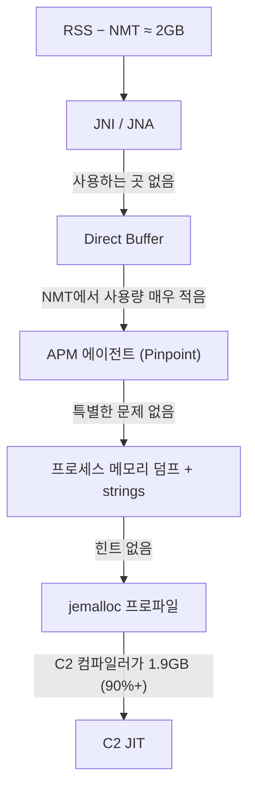

| | |
| --- | --- |
| 발표 | SLASH 22 |
| 연사 | 박동호 (토스페이먼츠 Server Developer) |
| 자료 | [발표 영상](https://www.youtube.com/watch?v=w4fWgLgop5U) · [SLASH 22](https://toss.im/slash-22) |

Slack에 OOM Killer 메시지가 뜬 것에서 시작해 JVM 힙 바깥의 정체 모를 2GB를 추적한 짧은 트러블슈팅 발표다. 의심 대상을 하나씩 지워가다가 jemalloc 프로파일로 C2 JIT 컴파일러를 지목하고, C1로 바꾸면 해결되지만 CPU가 오르는 딜레마를 Graal JIT로 푼다. 내용은 발표 영상과 자동 생성 자막을 근거로 했고, 표현은 내 말로 바꿨다.

## 시작: OOM Killer

토스페이먼츠는 오류 가능성이 있는 항목을 모니터링해 Slack으로 받는데, 시스템 로그 파일도 그중 하나다. OOM Killer가 발동하면 시스템 로그에 남고 그것이 Slack으로 온다. OOM Killer는 특정 프로세스가 메모리를 과도하게 써서 시스템 여유 메모리가 없을 때 OS가 불안정해지는 것을 막기 위해 그 프로세스를 희생시키는 리눅스 기능이다. Java 서버에서는 대개 Java 프로세스가 가장 많은 메모리를 쓰므로 그것이 죽는다.

문제 서버의 상황은 이렇다. Java 11.0.x, Docker Pod 최대 메모리 4GB, 최대 힙 1.5GB. OOM Killer가 죽였을 때 Java 프로세스의 메모리 사용량은 4GB였다. 힙이 1.5GB인데 OS 메모리가 바닥났다면 힙 외에 2.5GB가 쓰였다는 것이다. Metaspace와 기타 영역을 감안해도 2.5GB는 크게 이상한 수치다.

## RSS − NMT = 2GB

`-XX:NativeMemoryTracking` 옵션을 주고 `jcmd`로 JVM의 실제 메모리 사용량을 측정했다. 힙 1.5GB, 클래스 190MB, 스레드·코드·GC 등을 합쳐 **JVM 전체 2GB 정도**였다. 반면 `top`의 RSS는 3.1GB였다. 이미 1.1GB 차이가 있고, OOM 시점에는 4GB까지 올라갔을 테니 실제로는 **2GB 차이**가 났을 가능성이 있다. RSS 4GB에서 JVM 통계 2GB를 빼면 남는 2GB, 이것이 네이티브 메모리 누수일 가능성이 높다.

## 지워나간 의심 대상

JVM에서 네이티브 누수가 쉽게 나타나는 곳부터 확인했다.

1. **JNI/JNA.** C로 구현한 모듈을 Java에서 호출하는 기능이라 C 쪽에서 누수가 나면 JVM은 인지할 수 없다. 문제 서버에는 쓰는 곳이 없었다.
2. **Direct Buffer.** JDK 1.4부터의 기능으로 GC가 관리하지 않는 네이티브 메모리를 할당한다. NMT 결과에서 할당량을 볼 수 있는데 매우 적었다.
3. **APM 툴.** 보통 Java 에이전트로 붙어 인스트루먼트를 바꾸므로 혹시 네이티브를 쓰는 부분이 있을까 봤다. Pinpoint를 쓰고 있었고 특별한 문제는 없었다.

예상 범위 안에서는 원인이 보이지 않아 리눅스 프로세스 레벨로 범위를 넓혔다. 해볼 수 있는 건 다 해보기로 했다.

4. **프로세스 메모리 덤프.** `/proc/<pid>/maps`와 `smaps`, gdb로 덤프를 뜨고 `strings`로 문자열을 뽑아 힌트를 얻으려 했다. 힌트가 될 만한 것은 없었다.
5. **메모리 프로파일 툴.** 리눅스의 기본 할당자 malloc을 **jemalloc**으로 바꾸면 jemalloc의 프로파일 툴로 어떤 모듈이 얼마나 메모리를 쓰는지 볼 수 있다. 적용하고 문제 상황을 재현하니 다이어그램에 **C2 컴파일러가 프로세스 메모리의 90% 이상인 1.9GB**를 쓰고 있었다.

## C2 컴파일러

JIT 컴파일러가 메모리를 누수한다는 것이 애매해서 찾아보니 OpenJDK 버그 트래커에 C2 컴파일러 메모리 누수 이슈가 리포트된 것이 보였다. Java 파일을 컴파일하면 클래스 파일이 생기고, JVM이 구동하려면 기계어로 컴파일해야 하는데 이것을 JIT가 한다. JIT는 레벨 0부터 4까지 다섯 단계이고 마지막 레벨 4가 C2다. C1은 최적화를 줄이되 빠르게 컴파일하는 컴파일러로 앱을 빨리 띄우는 것이 중요한 클라이언트에 맞고, C2는 구동은 느리지만 최적화를 많이 해 연산이 빠르므로 보통 서버가 쓴다. `-XX:TieredStopAtLevel`로 레벨을 선택할 수 있다.

진짜 원인인지 확인은 간단하다. C2 대신 C1을 적용했더니 **문제가 발생하지 않았다.** 대신 예상대로 CPU 사용률이 40%대에서 70%대로 올랐다. 최적화가 약하기 때문이다.

## Graal JIT

문제는 없애고 CPU도 낮추고 싶다. CPU를 낮추려면 C2를 써야 한다. JDK 11 최신, JDK 17 최신으로 바꿔봤지만 해결되지 않았다. 그러던 중 OpenJDK 안에서 **Graal 컴파일러**를 쓸 수 있다는 것을 알았다. `-XX:+UnlockExperimentalVMOptions -XX:+UseJVMCICompiler`를 주면 Graal JIT가 적용된다. 실험적 기능이지만 토스페이먼츠는 이미 쿠버네티스 기반이고 카나리와 블루그린 배포가 갖춰져 있어 문제가 나도 영향을 최소화하고 빠르게 롤백할 수 있으므로 적용해 보기로 했다. 결과 **CPU 사용률이 70%대에서 40%대로** 떨어졌다. 문제 서버는 지금도 이 옵션으로 서비스 중이고, 실마리가 보일 만한 JDK 릴리스 노트가 나올 때마다 테스트하지만 아직 이 옵션 그대로다.

## 발표자의 정리

선택한 방법이 정답이 아닐 수 있다. 트러블슈팅에서 중요한 것은 정답보다 원인의 실마리를 찾아가는 과정이고, 그 시간이 짧을수록 좋다. 발표에는 빠졌지만 조금이라도 의심스러운 자체 구현 코드는 보이는 대로 많은 시간을 들여 살펴봤고 소득이 없었다. 원인을 찾는 일은 실마리가 보였을 때 급물살을 탄다. 비슷한 상황에서 실마리를 찾는 시간을 조금이라도 줄일 수 있다면 좋겠다고 했다.

## 리뷰

**"RSS − NMT"라는 한 줄의 산수가 이 발표의 출발점이자 가장 재사용 가치가 높은 부분이다.** JVM 메모리 문제를 힙 덤프로만 보는 습관에서 벗어나, JVM이 스스로 아는 메모리(NMT)와 OS가 아는 메모리(RSS)의 차이를 먼저 계산하면 힙 밖의 문제인지 즉시 갈린다.

**의심 대상을 지워가는 순서가 교과서적이다.** JNI → Direct Buffer → 에이전트 → 덤프 → 할당자 교체. 앞의 셋은 "JVM이 아는 네이티브", 뒤의 둘은 "JVM도 모르는 네이티브"다. jemalloc 프로파일은 glibc malloc으로는 볼 수 없는 호출자별 할당을 보여주므로 네이티브 누수 추적의 마지막 카드로 기억해 둘 만하다.

**해결책이 "우회"라는 점을 발표자가 숨기지 않는다.** C2의 누수 자체를 고친 것이 아니라 컴파일러를 바꿨고, 실험적 옵션을 프로덕션에 넣을 수 있었던 근거는 카나리와 빠른 롤백이라는 배포 인프라였다. 같은 SLASH 21의 [SRE 사례](/posts/slash21-sre-cases/)와 나란히 놓으면, 토스 계열의 트러블슈팅 발표는 대체로 "가설 → 재현 → 기각 → 라이브러리·런타임 레벨 원인"의 구조를 갖는다.

## 남는 질문

- C2가 1.9GB를 잡고 있었다면 컴파일 대상이 비정상적으로 많았을 가능성이 있다. 특정 라이브러리(리플렉션, 프록시 생성, 람다 대량 생성)가 코드 캐시를 계속 늘렸는지, 아니면 순수한 JDK 버그였는지.
- `-XX:ReservedCodeCacheSize`나 `-XX:CICompilerCount` 같은 C2 관련 튜닝은 시도했는지.
- Graal JIT 적용 후 웜업 시간과 배포 직후 지연은 어땠는지. Graal은 C2보다 웜업이 느린 경우가 있다.
- 이후 JDK 21 등에서 해당 이슈가 닫혔는지, 지금도 Graal 옵션을 유지하는지.

## 참고

- [발표 영상](https://www.youtube.com/watch?v=w4fWgLgop5U)
- [SLASH 22](https://toss.im/slash-22)
- [JVM Native Memory Tracking](https://docs.oracle.com/en/java/javase/17/vm/native-memory-tracking.html)
- [jemalloc heap profiling](https://github.com/jemalloc/jemalloc/wiki/Use-Case%3A-Heap-Profiling)
