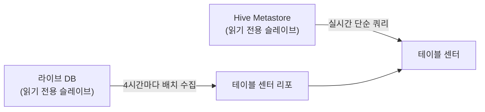

| | |
| --- | --- |
| 발표 | SLASH 22 |
| 연사 | 윤아서 (토스 데이터 서비스팀, Data Engineer) |
| 자료 | [발표 영상](https://www.youtube.com/watch?v=KUskYwqtPZM) · [SLASH 22](https://toss.im/slash-22) |

SLASH 21 [DW 발표](/posts/slash21-startup-dw/)에서 "테이블 센터 2.0을 개발 중"이라고 한 그 시스템을 1년 뒤 정면으로 다룬 발표다. 세 가지 고민(테이블을 어떻게 찾나, 어디서 쓰이고 만들어지나, 품질을 어떻게 관리하나)에 대한 테이블 센터의 답을 검색·영향도·DQ 세 기능으로 설명한다. 내용은 발표 영상과 자동 생성 자막을 근거로 했고, 표현은 내 말로 바꿨다.

## 세 가지 고민과 테이블 센터

서비스가 성장할수록 다양한 데이터와 수많은 테이블이 만들어진다. 토스 커뮤니티의 고민은 셋이다. (1) 테이블 정보를 효율적으로 검색하려면. (2) 테이블이 어디서 어떻게 사용되고 만들어지는지 알려면. (3) 데이터 품질을 효율적으로 관리하려면. 테이블 센터는 토스의 모든 테이블 정보를 가진 서비스로, 테이블 검색, 영향도 검색, 데이터 품질 관리가 주요 기능이다.

## 검색

세 가지 검색이 있다. 키워드 검색, DB 타입 → 서비스 → 테이블 스키마 → 테이블 순으로 점진적으로 좁히는 드릴다운 검색, SNS 해시태그처럼 같은 태그가 붙은 여러 테이블을 모아 보는 태그 검색.

키워드가 추상적일수록 결과가 많아지므로 우선순위를 뒀다.

| 순위 | 조건 |
| --- | --- |
| 1 | 키워드가 테이블명과 정확히 일치 |
| 2 | 테이블의 태그 또는 태그 동의어와 일치 |
| 3 | 테이블 설명과 일부 일치 |
| 4 | 테이블명과 일부 일치 |
| 5 | 컬럼명과 정확히 일치하거나 컬럼 설명과 일부 일치 |
| 동순위 | 조회수가 많은 테이블 우선 |

태그가 2순위인 이유는 작성자가 의도적으로 지정한 명칭이기 때문이고, 동순위에서 조회수 순인 이유는 많이 본 테이블일수록 중요도가 높을 것이라는 가정이다.

**태그 동의어**가 실용적인 부분이다. 토스팀은 약어를 많이 쓴다. "카드 맞춤 추천"보다 "카맞추"를 더 많이 쓰니 태그도 약어로 등록되는 경우가 적지 않다. 오래된 사람은 약어로 찾으니 문제가 없지만 새로 온 사람은 정식 명칭으로 찾다가 결과를 못 얻는다. 그래서 "카드 맞춤 추천" 태그에 "카맞추", "카드 맞춤", "카드 추천" 같은 동의어를 붙여 어느 쪽으로 검색해도 같은 결과가 나오게 했다.

### 두 데이터 소스

**라이브 테이블**(토스 서비스가 쓰는 테이블)은 읽기 전용 슬레이브에서 4시간마다 수집해 테이블 센터 리포에 저장한다. 배치인 이유는 슬레이브가 읽기 전용이어도 다른 운영 목적으로도 쓰이고, 업무상 실시간성이 필요하다는 판단이 들지 않아서다. **데이터 웨어하우스**(Hadoop)는 Hive Metastore 읽기 전용 슬레이브를 실시간으로, 성능에 문제가 되지 않을 정도의 단순한 쿼리로 조회한다. 분석 환경에서 테이블을 만들거나 바꿨을 때 즉각 확인하려는 니즈가 많아서다.

### 테이블 센터 리포

테이블 센터를 통해 테이블의 모든 정보를 제공하는 것이 목적이다. 라이브 테이블 기본 정보(서버 호스트, 스키마, 테이블명, 테이블 코멘트, 컬럼 코멘트, DDL), 테이블 센터가 관리하는 테이블·컬럼 코멘트, 표준 용어, 태그와 태그 동의어로 구성된다. 라이브 테이블을 DW로 적재하면 테이블·컬럼 코멘트가 따라오지 않아 아무 정보가 없는데, 테이블 센터에서 직접 입력하기 전까지는 라이브 테이블의 코멘트를 대신 가져와 보여준다. 라이브 테이블은 생성 시 코멘트가 의무([DB 리뷰](/posts/slash21-startup-dw/)에서 본다)지만 분석용 테이블은 생성 후 테이블 센터 리포에 등록한다.

**표준 용어**는 사내에서 표준처럼 쓰이는 컬럼에 모든 테이블에서 일관된 설명이 들어가게 하는 장치다. 표준 영문명, 한글명, 설명으로 구성되고, 예를 들어 `template_seq_no`에 "메시지 템플릿 설정 번호"를 등록하면 그 컬럼을 가진 모든 테이블에 자동으로 채워진다. 매번 설명을 달 필요가 없어진다. 그 외에 테이블 관련 스레드, 관심 등록한 사용자, DQ 정보도 제공한다.

## 영향도 검색

테이블이 어디서 사용되고 어떻게 만들어지는지 파악하는 것은 테이블 정보만큼 중요하다. 영향도 검색은 검색된 테이블이 어디에서 어떻게 쓰이거나 만들어지는지 보여주고, 사용처의 설명과 링크를 제공한다. 이 기능이 있기 전에는 사용처를 일일이 찾느라 몇 시간이 걸렸는데 이제 수 초 안에 결과가 나온다. 수동으로 찾다 일부를 놓치는 리스크도 줄어 영향도 관련 업무의 품질에 큰 영향을 줬다. 사례로, 토스 티머니 테이블을 더 이상 쓰지 않아 아카이브 요청이 왔을 때 영향도 검색으로 데이터 파이프라인에서 쓰이는 것을 확인해 파이프라인을 먼저 수정하고 아카이브했다.

구현은 두 단계다.

1. **수집.** SQL 쿼리, XML, 셸 스크립트, Python 스크립트 등 테이블을 사용하는 코드를 다양한 소스에서 매일 수집하고 필요하면 수동으로도 수집한다. 확장자에 따라 통째로 가져오거나(`.sql`, Python, 셸) 파싱해 일부만 가져온다(Jupyter 노트북은 특정 셀 제외, Tableau는 PostgreSQL 리포에서 XML을 파싱해 데이터 소스 정보와 워크북 ID).
2. **검색.** DB명과 테이블명을 받으면 영향도 테이블에서 **정규식 패턴 매칭**으로 찾는다. SQL에서 DB명·테이블명을 찾는 패턴부터 Python·셸 스크립트의 특성에 맞는 여러 패턴으로 구성되고, 여러 정규식을 OR로 수행하는 데 수 초가 걸리지만 업무상 충분히 감내할 수준이다.

## 데이터 품질

데이터 품질은 여섯 가지로 구분되는데, 그중 탐지 방식이 메타데이터인 완결성·유일성·유효성은 RDB에서 제약 조건으로 제공되지만 Hadoop 기반 DW에는 기본으로 없다. 테이블 센터의 DQ 관리 기능으로 푼다. 테이블 상세 페이지에서 테이블 레벨 또는 컬럼 레벨로 DQ를 설정하면 등록된 룰이 정기적으로 Spark로 실행되고, 이상치 조건을 만족하는 결과가 나오면 Slack으로 데이터 서비스팀에 알림이 간다. 알림이 오면 높은 우선순위로 즉각 대응한다. 알림이 와도 제때 대응하지 못하거나 방치하면 품질 관리의 의미가 퇴색되므로 이 부분을 중요하게 본다.

## 앞으로: 데이터 맵

검색으로 정확한 결과를 주려 했지만 사용자가 결과에 확신을 갖지 못하는 경우가 있었다. "송금"으로 검색해서 원하는 테이블이 높은 순위로 나와도 "이 테이블만 보면 충분한가, 다른 것도 봐야 하나"라는 의문이 남는다. **데이터 맵**은 중요 업무별로 어떤 테이블이 있는지 한눈에 보는 뷰를 제공하고, 그 안에서 테이블에 등급을 매겨 중요도를 구분하는 기능이다.

## 리뷰

**태그 동의어와 표준 용어가 이 발표의 핵심이다.** 데이터 카탈로그의 검색 품질은 인덱싱 기술이 아니라 조직의 언어 관리에서 갈린다. 약어 문화를 문제로 인식하고 동의어로 해결한 것, 반복되는 컬럼 설명을 표준 용어로 자동 전파한 것 모두 "사람이 입력하는 메타데이터의 양을 줄이면서 일관성을 올리는" 장치다.

**영향도 검색을 정규식으로 구현한 것은 의도적인 단순함이다.** SQL 파서나 Airflow 리니지 API로 정확한 계보를 만드는 대신 코드를 텍스트로 모아 패턴 매칭한다. 오탐은 있겠지만 미탐이 줄어들고("놓칠 리스크"), 수 초면 된다. 1년 전 [DW 발표](/posts/slash21-startup-dw/)의 "가장 쉬운 방법으로 빨리 만들고 나중에 개선"이 실제로 어떻게 구현되는지 보여주는 예다.

**DQ 섹션이 짧은 것이 아쉽다.** SLASH 21에서 예고한 DQ 센터의 여섯 타입 × 레이어 구조가 여기서는 "테이블 센터에 룰을 등록하면 Spark로 실행"으로 압축됐다. 이 주제는 토스증권의 [실시간 alert 플랫폼](/posts/tmc25-realtime-alert-platform/) 쪽에서 다른 형태로 이어진다.

## 남는 질문

- 라이브 테이블 4시간 배치는 그 사이에 생성된 테이블을 찾을 수 없다는 뜻이다. DB 리뷰 채널과 연동해 승인 시점에 등록하는 방법은 없었는지.
- 정규식 영향도 검색의 오탐률. 테이블명이 흔한 단어(`user`, `event`)일 때는 어떻게 되는지.
- 조회수 기반 동순위 정렬은 이미 많이 보는 테이블을 더 많이 보게 만드는 순환이 있다. 새 테이블이 노출될 기회는 어떻게 주는지.
- 데이터 맵의 "등급"은 누가 매기는지. 데이터 서비스팀이 중앙에서 매기는지, 각 사일로가 매기는지.

## 참고

- [발표 영상](https://www.youtube.com/watch?v=KUskYwqtPZM)
- [SLASH 22](https://toss.im/slash-22)
- 1년 전 테이블 센터의 예고: [SLASH 21 빠르게 성장하는 스타트업의 DW 리뷰](/posts/slash21-startup-dw/)
