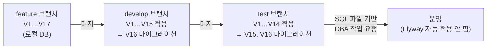
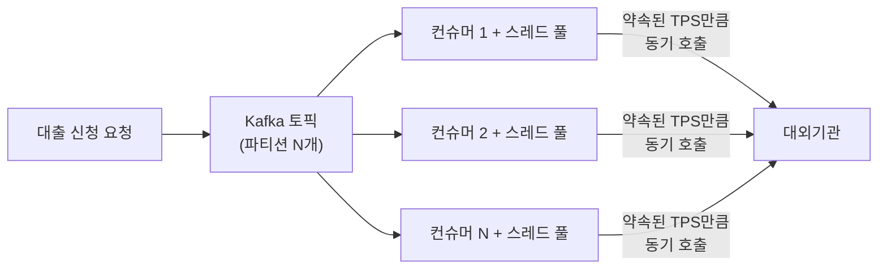

| | |
| --- | --- |
| 발표 | SLASH 22 |
| 연사 | 민재슬 (토스뱅크 Server Developer) |
| 자료 | [발표 영상](https://www.youtube.com/watch?v=SLamxuykpnw) · [SLASH 22](https://toss.im/slash-22) |

토스뱅크 대출 시스템이 전통 금융권 아키텍처와 어떻게 다른지를 세 층위로 설명하는 발표다. 코어뱅킹을 독립 API 서비스로 두고 마이크로서비스가 비즈니스 로직을 직접 처리하는 구조, 서비스별 독립 스키마를 협업 가능하게 만드는 Flyway + Hibernate validate 조합, 그리고 KCB·NICE·신용정보원 같은 대외기관과의 연동을 파이프라인·동적 스레드 풀·연동 서킷·대기열로 지키는 유량 제어 시스템. 2022년 1월 1일 대출 재개 때 이 시스템이 실제로 어떻게 동작했는지로 끝난다. 내용은 발표 영상과 자동 생성 자막을 근거로 했고, 표현은 내 말로 바꿨다.

## 전통 아키텍처와 다른 점

SI 차세대 시스템 기반의 전통 금융회사에서는 대부분의 비즈니스 로직이 강결합 모놀리식 코어뱅킹에 구현된다. "채널계"라 불리는 서비스 서버의 역할은 사용자 요청·응답을 코어뱅킹의 전문 규격으로 변환해 전달하는 데 그친다. 이 구조는 모놀리식의 단점을 그대로 갖는다. 신규 피처마다 영향도 분석에 많은 시간이 들고, 그 피처가 다시 코어뱅킹 안의 영향도 분석 대상이 되는 악순환이다. 토스처럼 제품이 빠르게 바뀌는 조직에는 맞지 않는다.

토스뱅크는 MSA로 구성된 서비스 서버와 모놀리식 코어뱅킹을 **각각 독립된 API 서비스**로 정의하고, 전문 방식이 아닌 HTTP API로 필요할 때만 코어뱅킹과 통신하면서 마이크로서비스가 비즈니스 로직을 직접 해결하게 했다. 대출 실행에 필요한 사용자 서버, 약관 서버, 상품 서버, 대출 서버가 각각 독립 스키마를 갖고 필요하면 API로 데이터를 요청한다. 스택은 MySQL(비즈니스 로직), Kafka(이벤트), Redis(유량 제어와 캐시), 그리고 모든 서비스 서버가 100% Kotlin이다.

## 협업을 위한 스키마 관리

독립 스키마는 관리 문제를 만든다. 서버마다 담당자가 있어도 협업 없이는 유지할 수 없다. 스키마를 언제든 복제해 생성할 수 있고, VCS와 연동돼 DDL이 버전 관리되고, 비즈니스 로직과 스키마가 동기화돼야 한다. 애자일 조직에서는 스키마가 끊임없이 바뀌는데 잦은 변경은 협업을 어렵게 하고 오류를 낳는다. 안정성과 속도를 둘 다 가져가기 위해 구축 초기부터 **Flyway**와 **Hibernate DDL validate**를 적용했다.

Flyway는 버전 기반 마이그레이션 스크립트를 SQL 파일로 관리하고 그 파일이 Git에서 소스 코드와 함께 관리된다. 그래서 DDL·DML을 서비스 로직과 함께 코드 리뷰할 수 있고 로직과 DB의 동기화를 VCS로 유지한다.

개발자 각자의 PC와 개발·테스트 스테이지가 각각 독립 DB를 갖는다. 피처 브랜치가 개발 브랜치에 머지되면 그 브랜치에만 있던 V16 SQL이 Flyway로 개발 DB에 적용되고, 개발 브랜치가 테스트에 머지되면 아직 적용되지 않은 V15·V16이 마이그레이션된다. 새 개발자가 로컬에 DB를 만들어 테스트하고 싶으면 서버만 구동하면 해당 브랜치 형상으로 세팅이 끝난다. 서비스 배포와 함께 마이그레이션이 진행되므로 DB 형상을 반영하지 않고 로직만 배포되는 참사를 막는다. CI의 통합 테스트에서도 마찬가지다. 마이그레이션 전략이 없으면 DB 연계 부분을 모킹하거나 인메모리로 돌려야 하지만, 테스트 시작 전 MySQL을 띄우고 Flyway용 테스트 스키마를 만들면 Spring 컨텍스트 로딩 시 최신 형상이 자동 생성돼 리포지토리 모킹 없이 트랜잭션·DB 처리를 반복 검증할 수 있다.

단, **운영에는 그대로 적용하지 않는다.** 개발자가 작성한 DDL·DML은 운영에서 치명적일 수 있으므로 VCS의 SQL 파일을 기반으로 DBA에게 작업을 요청하고 배포한다. 그러면 운영에서 DB 형상과 로직의 차이로 인한 참사를 어떻게 막나. **Hibernate `ddl-auto: validate`**다. Hibernate의 마이그레이션 기능은 Flyway로 정확한 SQL을 이미 적용했으니 무의미하고, 엔티티 정의와 DB 스키마가 동일한지 확인하는 validate만 쓴다. 맞지 않으면 서비스가 시작되지 않아 잘못된 서버로 요청이 들어가는 것을 사전에 막는다.

## 대외기관 연동

대출은 자체 서비스만으로 제공할 수 없다. 신용평가사(NICE, KCB), 소득 평가 데이터를 주는 신용정보원 등 많은 대외기관 연동이 필수다. 과거 새 은행이 오픈하면 대외기관이 트래픽을 감당하지 못해 한동안 대출 신청이 동작하지 않는 일이 비일비재했다. 기존 금융권은 여러 기관을 동시에 호출하는 비동기 처리로 심사 속도 문제를 풀었지만, 사용자가 급증하면 대외기관이 처리할 수 있는 양보다 많은 요청이 동시에 나가 상대 시스템이 마비되곤 했다.

### 파이프라인과 동적 스레드 풀

토스뱅크로 들어오는 요청을 그대로 대외기관에 보내면 과부하가 걸린다. 대외기관의 성능과 신청 시스템을 분리하기 위해 Kafka 파이프라인을 두었다. 파티션마다 1:1로 컨슈머를 배정하고 컨슈머마다 독립 스레드 풀을 두며, 풀 사이즈는 기본적으로 대외기관이 토스뱅크에 알려준 성능으로 세팅되고 상태에 따라 동적으로 조절된다. 많은 트래픽이 한꺼번에 들어와도 정해진 풀을 통해 나가므로 대외기관이 견딜 수 있는 TPS만 전달된다. 정확한 TPS 측정을 위해 API 호출은 **동기**로 구성했다. 스레드 풀은 코루틴의 `Executors.newFixedThreadPool` 계열을 크기별로 배열로 선언해 필요에 따라 큰 풀이나 작은 풀을 동적으로 선택한다. 기관마다 최적 요청 수가 다르므로 기관별로 다르게 세팅한다.

### 지표 수집

파이프라인이 있어도 사용자가 급증하면 심사 완료까지 오래 기다려야 하고, 대외기관 자체 장애도 있으므로 기관을 유동적으로 활용해야 한다. 일반적인 서킷은 실패율·요청 수 기반으로 열고 반쯤 열어 확인한다. 대출은 실행까지 여러 단계를 거치므로 **중간 단계의 서킷 동작이 앞 단계의 서킷과 연동**되어 고객이 불필요한 과정을 거치지 않게 했다. 이런 상호 연동 서킷은 단계별 정확한 통계가 있어야 동작한다.

지표 수집은 코루틴 + WebClient + Redis의 논블로킹 구조다. 수집 자체가 서비스에 영향을 주면 안 되고 I/O 작업이므로 I/O 시간 동안 스레드를 점유하지 않는다. 서버는 대외기관 파이프라인에 넣기 직전 시작 시간을 Redis에 기록하고, 연동이 끝나면 완료 시간과 성공·실패를 기록한다. 분 단위 키에 누적 요청 수, 누적 처리 시간, 성공 여부가 쌓이고 MySQL에 분 단위 통계 지표로 적재된다. 이것으로 기관별 처리 시간, TPS 증가, 실패율을 판단한다.

### 서킷의 세 가지 동작

| 상황 | 동작 |
| --- | --- |
| 기관 성능이 약속 TPS보다 떨어지고 실패율 증가 | 파이프라인의 동적 풀 사이즈를 줄여 기관이 견딜 수준으로 조정 |
| 조정해도 신용정보원 마이데이터 API 실패율 증가 | 앱 스크래핑 가능한 인증서 보유 고객은 마이데이터 서킷을 half-open으로 스크래핑으로 전환. 마이데이터가 온전히 동작하지 않으면 서킷을 열고 모든 고객을 인증서 스크래핑으로 강제 전환 |
| KCB·NICE처럼 대체 불가능한 기관 장애 | 해당 기관 서킷을 열고 **대출 상품 전체 진입 서킷을 연동해 함께 열어** 진입 차단 |

응답 속도뿐 아니라 실패율 등을 종합 판단해 고객 경험이 저하되는 순간 각 기관 서킷의 open·half-open·close를 결정하고 대출 상품 전체 유량 제어가 서킷과 연동된다. 적절한 TPS로 보내고 있어 토스뱅크 때문에 기관에 문제가 생기는 일은 거의 없고, 대부분은 사용자 급증 시 유량 제어나 기관 자체 문제 시 차단에 쓰인다.

### 대기열

사용자가 많이 진입하면 경험이 저하되므로 유량 제어와 함께 대기열을 도입했다. 대출 신청 시스템에 진입하려면 입장 티켓을 발급받아야 한다. 대기열과 입장열 두 큐로 구성되고, 동작하면 모든 고객은 대기열에 들어가 일정 주기마다 정해진 수만 티켓을 받아 입장열로 이동하며, 입장열의 고객만 신청 시스템에 진입할 수 있다. 파이프라인의 임계치가 오르거나 심사 결과 도착 시간이 임계 시간을 넘으면 동작한다. Redis의 ZSET으로 구현했고, 입장 수는 현재 서킷 지표에 따라 배수로 동적으로 관리된다.

## 2022년 1월 1일

토스뱅크 대출 재개일이다. 여러 유튜버가 재개 시간을 홍보했고 실제로 굉장히 많은 사용자가 오픈 시간에 맞춰 진입했다. 파이프라인 덕분에 정해진 TPS로 기관에 전달됐지만, 이미 진입한 고객이 많아 신규 진입 고객은 심사 결과까지 오래 기다려야 했다. 스크래핑으로 결과를 받을 수 있는 고객은 곧바로 그 방식으로 전환했다. 사용자는 계속 늘었고 대기열까지 동작했다. 대기열 동작 전에 진입한 경우에도 인증서 보유 고객은 최대한 스크래핑으로 전환해 많은 고객이 일정 시간 내에 결과를 받아볼 수 있게 했다.

## 리뷰

**"운영에는 Flyway를 자동 적용하지 않는다"가 이 발표에서 가장 현실적인 문장이다.** 개발·테스트·CI에서는 완전 자동화하고 운영은 DBA 검토를 거치되, 그 틈을 Hibernate validate로 막는다. 자동화의 이점과 금융 운영의 통제를 둘 다 가져가는 구성이고, 토스 [DB 리뷰](/posts/slash21-startup-dw/) 문화와 같은 결이다.

**유량 제어가 "우리를 지키는 것"이 아니라 "상대를 지키는 것"이다.** 보통 rate limiting은 자기 시스템 보호를 위해 쓰는데, 여기서는 대외기관이 견딜 TPS를 넘기지 않는 것이 1차 목적이다. 신규 은행 오픈 때 대외기관이 마비되던 역사가 설계의 출발점이라는 점이 금융 도메인답다. 동기 호출을 고집한 이유(정확한 TPS 측정)도 같은 맥락이다.

**서킷을 단계 간에 연동한 것이 독창적이다.** KCB 서킷이 열리면 대출 진입 서킷도 열린다. 실패할 것이 확실한 여정에 고객을 들이지 않는다는 것인데, 일반 서킷브레이커 라이브러리로는 표현하기 어려운 도메인 규칙이다. 이 발표의 대외기관 연동은 1년 뒤 [토스뱅크 대외연계 시스템](/posts/slash23-bank-external-linkage/) 발표에서 더 깊이 다뤄진다.

## 남는 질문

- Kafka 파티션 수가 곧 컨슈머 수이고 컨슈머마다 풀이 있다면 총 TPS = 파티션 × 풀 사이즈다. 파티션 수 변경 없이 풀만 줄여서 TPS를 낮추는 것은 되지만 올리는 데는 한계가 있는데, 상한은 어떻게 정했는지.
- 대출 신청이 파이프라인을 거치면 사용자 응답은 비동기가 된다. 앱은 폴링인지 푸시인지, 심사 결과 도착까지의 UX는 어떻게 설계했는지.
- 마이데이터 → 스크래핑 전환은 고객 동의 절차가 다르다. 전환 시 고객에게 어떤 안내가 나갔는지.
- 대기열 티켓 발급 수의 "배수"는 어떤 지표를 기준으로 하는지. 심사 완료 시간인지 파이프라인 적체량인지.

## 참고

- [발표 영상](https://www.youtube.com/watch?v=SLamxuykpnw)
- [SLASH 22](https://toss.im/slash-22)
- [Flyway](https://flywaydb.org/)
- [Hibernate hbm2ddl validate](https://docs.jboss.org/hibernate/orm/6.2/userguide/html_single/Hibernate_User_Guide.html#configurations-hbmddl)
