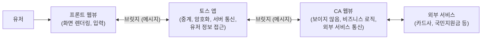

| | |
| --- | --- |
| 발표 | SLASH 22 |
| 연사 | 정세훈 (토스 Web Automation 챕터, Node.js Developer) |
| 자료 | [발표 영상](https://www.youtube.com/watch?v=ScZT51pZ5MQ) · [SLASH 22](https://toss.im/slash-22) |

토스 앱 안에서 카드 등록, 포인트 찾기, 구독 해지, 보험·연금 조회, 국민지원금 신청 같은 외부 서비스를 "클릭 다섯 번"으로 끝내주는 기반 기술 Crazy Activation(CA)의 구조를 설명하는 발표다. 서버 사이드 Puppeteer가 아니라 **모바일 앱 안의 보이지 않는 웹뷰**가 외부 사이트를 자동화하고, 화면을 그리는 웹뷰와 비동기 메시지로 협업한다. 웹 자동화 챕터의 일이라 프론트와 백엔드의 경계에 있지만, 시스템 구조와 IPC 추상화가 내용의 중심이라 이 시리즈에 넣었다. 내용은 발표 영상과 자동 생성 자막을 근거로 했고, 표현은 내 말로 바꿨다.

## 문제: 국민지원금 신청

카드사에서 국민지원금을 신청하려면 메뉴를 찾는 것부터 수고가 들고, 찾아 들어가도 수많은 개인정보를 입력해야 한다. 토스에서는 다섯 번의 클릭과 한 번의 키보드 입력이면 됐다. 토스 앱이 이미 가진 정보를 활용해 단계를 줄인 것이고, 그것을 가능하게 한 기술이 CA다. "사용자에게 미친 연결 경험을 제공한다"는 뜻이고, 연결이란 프론트 웹뷰를 통해 유저와 상호작용하며 외부 서비스를 쓸 수 있게 해주는 브릿지다.

## 세 컴포넌트

- **프론트 웹뷰**: 유저에게 보이는 화면. 렌더링과 입력을 담당한다.
- **CA 웹뷰**: 외부 서비스와 통신하며 프론트가 보내준 입력을 받아 비즈니스 로직을 실행한다. **유저에게 보이지 않는다.**
- **토스 앱**: 두 웹뷰 사이의 통신을 중계하고, 암호화, 서버 통신, 유저 정보 접근처럼 네이티브만 할 수 있는 일을 한다.

흐름은 이렇다. 유저가 서비스를 클릭하면 프론트 웹뷰가 뜨고, 프론트가 CA 웹뷰를 실행시킨 뒤 로딩 화면으로 전환한다. CA 웹뷰는 외부 서비스에 페이지를 요청하고 응답을 받아 프론트에 "이 화면을 그려라"는 메시지를 보낸다. 유저 입력이 필요하면 프론트에 입력 화면을 띄우라는 메시지를 보내고 입력을 받는다. 핸드폰 번호나 이름처럼 토스가 이미 가진 정보는 토스 앱에 직접 요청해 받는다. 이렇게 조립한 정보를 외부 서비스에 전송하고 다음 단계로, 목적을 달성할 때까지 반복한다.

## 페이지 매니저: 모바일 브라우저에서 자동화 스크립트 돌리기

브라우저 자동화 하면 Puppeteer나 Playwright가 떠오르지만 서버 사이드에서 실행된다. 모바일 웹뷰를 자동화하려면 다른 구조가 필요하다. 국민지원금 플로를 예로 들면 신청 페이지 접속 → 정상 동작 확인 → 자격 조회 → 개인정보 입력 후 신청 → 결과 조회 순서다.

`CAPage` 인터페이스가 있고, 이를 구현한 각 페이지 클래스가 위의 비즈니스 단계 하나씩을 담당한다. **페이지 매니저**가 현재 CA 웹뷰의 URL에 따라 적절한 페이지를 찾아 실행한다. 동시에 토스 앱과 프론트 웹뷰가 정상 동작하고 브릿지로 연결돼 있는지 검사한 뒤 인자로 넘긴다. 스크립트가 브라우저에 로드될 때 이 로직이 초기화되고 반복 실행된다.

지원금 신청 페이지 하나를 보면: 페이지가 점검 중인지는 점검 메시지 셀렉터로 엘리먼트를 찾아 확인하고, 점검 중이면 프론트에 알림을 띄우게 하고 플로를 끝낸다. 아니면 휴대폰 본인인증이 필요한데, 이름·번호·생년월일 같은 정보를 토스 앱에서 가져와 폼 엘리먼트에 채우고 클릭하면 인증번호 전송 요청이 나간다. 유저의 SMS에는 접근할 수 없으므로 프론트에 입력 페이지를 띄우게 하고 입력을 받아 다시 전송한다. 재시도 로직이 반드시 들어가고(유저가 잘못 입력할 수 있다), 개인정보 활용 동의는 프론트가 처리한다. 성공이면 결과 조회 URL로 이동한다. 정리하면 각 페이지는 토스 앱과 프론트 웹뷰를 인자로 받는 `onLoad` 메서드를 갖고, 논리 단위로 분리된 페이지 구현체들이 페이지 매니저에 모여 URL에 맞춰 실행된다.

## RxJS로 만든 멀티 웹뷰 통신

토스 앱과 프론트 웹뷰가 어떻게 깔끔한 API로 통신하는가. 컴포넌트 간 통신은 비동기 메시징이고, 이를 추상화한 것이다. 가장 로우레벨부터 올라간다.

**1단계: 두 프로세스.** 토스 앱을 떼어내면 두 웹뷰는 IPC처럼 직접 연결할 수 없는 두 프로세스다. 각자 브릿지로 토스 앱에 데이터를 보내고, 토스 앱이 호출하는 콜백을 등록해 데이터를 받는다. Node.js에서 부모 프로세스와 `process.on('message')`·`process.send`로 통신하는 두 자식 프로세스와 같다. 부모 P가 A의 메시지를 B에, B의 메시지를 A에 그대로 전달하면 A와 B만 남는다. Electron의 renderer(프론트 웹뷰)와 main(CA 웹뷰) 관계와 같다.

**2단계: 요청-응답.** 수신 채널과 송신 채널만으로 비동기 메시지를 요청과 응답으로 묶으려면 메시지에 **콜백 ID**를 실어 보내고 응답에도 같은 ID를 실어 보내면 된다. 이를 Promise로 감싼다. 메시지를 보낼 때 Promise를 만들고 resolve 함수를 콜백 ID를 키로 테이블에 저장한다. 리스너가 콜백 ID를 받으면 테이블에서 resolve를 찾아 페이로드를 담아 호출한다.

**3단계: RxJS.** 보내는 쪽은 깔끔해졌지만 받는 쪽에는 `process.on`이 남아 있다. 방심하면 핸들러와 분기문이 붙으면서 무너지고, 미들웨어 추가나 디버깅이 번거로워진다. 특정 타입만 필터링하거나 중복 메시지를 거르거나 어떤 메시지는 한 번만 처리하는 로직이 필요해진다. 그래서 리스너를 Observable로 만들어 구독한다. 메시지는 `type`, `payload`, `callbackId` 세 필드면 된다. 첫 파이프에서 콜백 ID가 바인딩된 함수(송신 채널을 쓰는)를 만들어 `resolve`라는 이름으로 다운스트림에 추가하면 끝이다. Promise API와 RxJS 시스템으로 멀티 웹뷰 통신이 완성된다. React에서는 `useEffect`로 구독을 시작하고 수신 메시지를 state에 저장한 뒤 Context로 묶으면 메시지로 화면을 제어할 수 있고, 메시지 타입에 따라 페이지를 전환하는 라우팅도 된다.

이렇게 만든 API로 어떤 메시지를 주고받을지 프로토콜이 없으면 무용지물이라, 공통 프로토콜 패키지를 만들어 TypeScript로 양쪽 코드에서 일관된 타입 안정성을 확보한다.

## 리뷰

**"보이지 않는 웹뷰"가 핵심 발상이다.** 서버에서 헤드리스 브라우저를 돌리면 유저의 세션·인증·SMS에 접근할 수 없고 법적·보안적 문제도 크다. 유저의 기기 안에서, 유저의 동의 아래, 유저의 정보로 자동화하되 화면은 토스 UI로 보여준다. 스크래핑을 "서버가 하는 일"에서 "앱이 유저 대신 하는 일"로 옮긴 구조이고, 이것이 마이데이터 이전 시대에 토스가 연결 경험을 만든 방식이다. 같은 해 [스크래핑 조회 발표](/posts/slash22-scraping-inquiry/)와 함께 읽으면 서버 쪽 스크래핑과의 역할 분담이 보인다.

**IPC 추상화 3단계는 플랫폼과 무관하게 재사용할 수 있다.** 콜백 ID → Promise 테이블 → Observable 파이프. 브라우저 postMessage, Electron IPC, Web Worker, 심지어 메시지 큐 위의 요청-응답 패턴까지 같은 형태다. 백엔드 개발자가 이 발표에서 가져갈 것은 웹뷰가 아니라 이 추상화 순서다.

**페이지 매니저는 외부 사이트의 변경에 얼마나 취약한지가 궁금해지는 부분이다.** 셀렉터 기반 자동화는 대상 사이트가 바뀌면 깨진다. 발표는 구조에 집중했고 운영(깨짐 감지, 배포 주기, 사이트별 유지보수 비용)은 다루지 않았다.

## 남는 질문

- 외부 사이트가 마크업을 바꿨을 때 어떻게 감지하고 얼마나 빨리 페이지 구현체를 고쳐 배포하는지. CA 웹뷰의 스크립트는 앱 배포와 무관하게 갱신되는지.
- CA 웹뷰가 유저 기기에서 외부 사이트에 접속하므로 외부 사이트 입장에서는 정상 유저 트래픽이다. 외부 서비스와의 협의나 약관 문제는 어떻게 다루는지.
- 프론트 웹뷰와 CA 웹뷰가 동시에 떠 있으면 저사양 기기에서 메모리·성능은 어떤지.
- 마이데이터 API가 보편화된 뒤 CA의 역할이 줄었는지, 아니면 마이데이터가 커버하지 않는 영역(구독 해지, 지원금 신청)으로 옮겨갔는지.

## 참고

- [발표 영상](https://www.youtube.com/watch?v=ScZT51pZ5MQ)
- [SLASH 22](https://toss.im/slash-22)
- [RxJS](https://rxjs.dev/)
