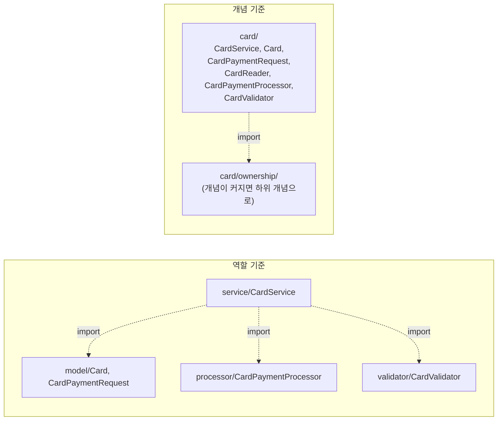
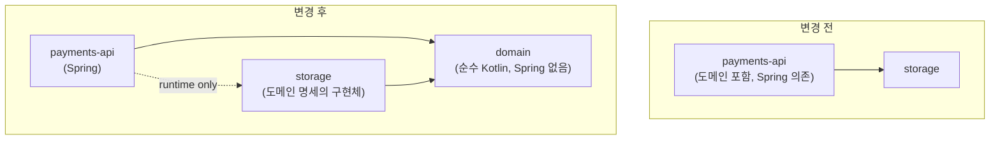

| | |
| --- | --- |
| 발표 | SLASH 22 |
| 연사 | 김재민 (토스페이먼츠 Server Developer) |
| 자료 | [발표 영상](https://www.youtube.com/watch?v=RVO02Z1dLF8) · [SLASH 22](https://toss.im/slash-22) |

IDE가 접어 놓는 `import` 문을 펼쳐서 보자는 발표다. 생성자만 보면 괜찮아 보이는 클래스가 import 문과 함께 보면 응집이 깨졌거나 레이어가 역류했거나 라이브러리가 비즈니스 로직에 침투한 것이 드러난다. 그 신호를 패키지·레이어·모듈 세 주제로 나눠 Kotlin 예제로 설명하고, 토스페이먼츠가 왜 코드를 "통제"하려 하는지로 끝난다. 내용은 발표 영상과 자동 생성 자막을 근거로 했고, 표현은 내 말로 바꿨다.

## 전제: 최고의 설계보다 최소 규칙

토스페이먼츠 개발자들은 코드 품질에 지속해서 관심을 갖되, 처음부터 최고의 설계나 품질을 유지하려는 것이 아니라 최소 규칙을 지켜 동작하는 소프트웨어를 빠르게 만들고 코드에 관심을 두고 성장시킨다. 코드 한 줄 한 줄의 의미를 곱씹고 "왜"라고 묻는 것을 권장한다. 소프트웨어를 잘 운영하는 데 중요한 것이 많지만 발표자는 가장 중요한 것이 코드라고 본다.

예제는 가상의 햄버거 서비스다. 구현이 없어도 생성자를 보면 의존하는 클래스가 보이고 무엇을 할지 상상할 수 있다. 생성자는 클래스가 존재하려면 반드시 있어야 하는 것들의 명세이고, 꼭 필요한 의존인지 과한 의존은 아닌지 생각해 볼 수 있다. 그런데 접혀 있던 import 문을 열어 보면 느낌이 달라진다. 이 발표는 import 문을 통해 어디가 아쉽고 어떤 방향으로 개선할 수 있는지를 본다.

## 패키지: 응집

햄버거 세트를 포장하는 비유로 시작한다. 햄버거는 포장지에, 감자튀김은 봉지에, 콜라는 컵에 담고 손잡이 있는 봉투에 넣는다. 큰 봉투에 햄버거를 포장 없이 넣고 감자튀김을 붓고 콜라를 부으면 햄버거 세트라 할 수 없다. 그리고 패키지 전략은 고정되지 않는다. 최소 주문 수량이 100개가 되면 햄버거는 박스에, 콜라는 음료 캐리어에 담는 전략으로 바뀌어야 한다. 패키지는 현재 상황을 계속 점검하면서 응집을 유연하게 지켜내야 하는 가치다.

예제의 `CardService`는 생성자만 보면 `addPayment`의 흐름이 보인다. import 문을 열면 `Card`, `CardPaymentRequest`, `CustomerCard`처럼 개념적으로 같은 "카드"에 속하는 클래스들을 서로 다른 패키지에서 import하고 있다. 빵과 패티와 치즈가 각각 따로 포장된 것처럼, 역할에 따라 나뉜 패키지가 개념을 분산시켰다. 생성자에 있는 `CardReader`, `CardPaymentProcessor`, `CardValidator`도 카드 관련 컴포넌트로 읽히는데 import까지 필요한가 하는 고민이 든다.

개념 기준으로 응집시키면 import 양이 줄고 카드 개념에 속한 클래스들의 import가 사라진다. 생성자에 있는 클래스들이 import 없이 존재한다는 것은 `CardService`가 존재하려면 꼭 필요한 것들이 가까운 곳에 응집돼 있다는 뜻이다. 그런데 한 개념의 클래스가 너무 많아지는 경우도 있다. import를 무조건 줄이려고 한 패키지에 너무 많은 클래스를 넣으면 그것도 응집이 깨진다. 적절한 시기에 개념을 더 세분화한다. 카드 개념이 한곳에서 너무 커지면 그 안에서 더 구체적인 개념, 예를 들어 카드 소유(ownership)라는 새 개념이 탄생해 새 패키지를 만든다. 이때 `CardService`에 import가 다시 생기지만 다른 결의 패키지가 아니라 카드 하위의 개념으로 인식된다.

## 레이어: 역류

토스페이먼츠 서버 개발자가 합류하면 공유받는 표준 레이어 규칙의 핵심은 셋이다. (1) 레이어는 위에서 아래로 순방향으로만 참조한다. (2) 참조 방향이 역류하지 않는다. (3) 레이어를 건너뛰지 않는다(레이어를 제거할 수는 있지만 있다고 정의했다면 건너뛰지 않는다).

예제에서 프레젠테이션 레이어가 비즈니스 레이어로 객체를 그대로 전달한다. `MobilePaymentRequest`가 import에 없으니 같은 패키지에 있고, 이 코드만 보면 이상한 점이 없다. 그런데 비즈니스 레이어 코드의 import에 프레젠테이션 레이어의 클래스가 박혀 있다. 비즈니스 레이어가 프레젠테이션 레이어를 참조하는 역류를 import가 알려준다. 개선은 프레젠테이션에서 비즈니스로 넘길 때 개념화된 클래스로 변환해 전달하는 것이다. 프레젠테이션의 import는 여전히 깔끔하고, 비즈니스의 import에서 역류가 사라지며, `MobileService`가 어떤 다른 개념에 의존하는지 import로 더 쉽게 유추할 수 있게 된다. 레이어 간 잘못된 참조는 장기적으로 복잡도를 높이고 확장의 발목을 잡는다.

## 모듈: 격리

표준 모듈 구조도 합류 시 공유된다. 화살표는 Gradle 구성에서의 의존 방향이고, 런타임에는 runner 모듈을 중심으로 의존성이 주입되어 실행되며, 외부 기능을 확장할 때는 새 모듈을 만든다. [모듈](/posts/modular-monolith-boundaries/)을 나누면 기술을 격리할 수 있고, 모듈별 테스트가 가능하며, 역할과 경계가 뚜렷해진다.

단일 모듈로 작업하면 의도치 않게 비즈니스 로직 안에 특정 라이브러리 의존이 들어간다. 라이브러리는 버전 업이나 내부 요구로 바뀔 수 있고, 그때 비즈니스 로직도 같이 고쳐야 한다. 이것도 import로 보인다. 모듈을 분리해 라이브러리를 격리하면 비즈니스 로직에서 그 라이브러리를 import할 수 없게 되고, 라이브러리가 교체될 때 비즈니스 로직에 영향 없이 작업할 수 있다.

두 번째 예는 `Store` 클래스가 프레젠테이션 레이어의 클래스로 변환하는 로직을 갖고 있어 레이어를 역류하는 import가 생기는 경우다. 프레젠테이션 레이어 자체를 모듈로 격리할 수 있고, Spring 자체도 격리하는 설계로 갈 수 있다.

토스페이먼츠 구조에서 payments-api는 도메인을 가진 채 API 서빙을 위해 Spring에 의존한다. 도메인 코드가 잘 정리되고 외부 의존이 격리돼 있다면 모듈 구조를 바꾸는 것은 어렵지 않다. 도메인 모델을 payments-api에서 분리해 Spring과 멀어지게 하고, 선택에 따라 storage 모듈도 격리해 payments-api가 storage를 runtime으로만 의존하고 storage는 도메인 명세의 구현체 역할만 하게 한다. 그러면 payments-api는 오직 도메인 모델만 알고 storage가 어떤 구현체를 쓰는지 아예 모른다. 컴파일 시점에 모르는 이유는 Gradle 설정에 있다. Gradle 문서는 `runtimeOnly`를 실행 시점에만 필요하고 컴파일 클래스패스에는 포함되지 않는 의존으로 정의한다([Gradle Java Plugin](https://docs.gradle.org/current/userguide/java_plugin.html)). 그래서 payments-api 코드는 storage의 클래스를 import해도 컴파일되지 않는다. HTTP 응답으로 [JPA](/posts/jpa-architecture/) 엔티티를 쓰거나 도메인이 HTTP 스펙을 아는 문제를 만들지 않을 수 있다. 변경된 코드에서는 비즈니스 레이어에서 프레젠테이션 클래스를 import하는 것이 불가능한 구조가 되고, Spring import도 불가능해져 순수한 코드만 남는다.

## 왜 코드를 통제하려 하는가

지속 성장 가능한 코드를 관리하는 방법은 다양하지만, 이 발표의 핵심은 import를 포함한 코드 한 줄 한 줄을 소중히 여기고 관리하라는 것이다. 모든 코드는 신호를 보내고, 우리는 그 속에서 적절한 트레이드오프를 하며 다음 수준의 설계를 고민해야 한다. 영원히 완벽한 코드와 설계는 없고 소프트웨어는 생명체처럼 계속 진화해야 한다. 매 순간 선택하고 그 선택을 설계와 코드에 녹여야 한다.

토스페이먼츠가 코드에 계속 관심을 두는 이유는 두 키워드다. 첫째는 통제다. 올바른 응집으로 코드를 관리하고 레이어 규칙을 지키며 적절한 모듈화로 기술을 격리해 변화에 대응할 수 있도록 코드를 통제한다. 둘째는 제어다. 그 통제를 기반으로 소프트웨어를 자유자재로 제어한다. 토스페이먼츠의 소프트웨어는 대부분 오랜 기간 운영돼야 한다. 가맹점 한 곳이라도 시스템을 쓰고 있다면 그 코드를 계속 통제하고 제어해야 한다. 수명이 매우 긴 소프트웨어이므로 코드의 수명도 길고, 지속적인 관리와 성장이 필요하다.

## 리뷰

내가 보기에 "import 문을 읽어라"는 도구 없이 바로 쓸 수 있는 진단법이다. [ArchUnit](/posts/archunit-guardrails-on-legacy/)이나 의존성 분석 도구를 도입하기 전에, 클래스 상단의 접힌 줄을 펼치는 것만으로 응집·역류·침투 세 가지를 볼 수 있다. 발표는 그 세 가지를 각각 패키지·레이어·모듈에 대응시켰고, 해법의 강도도 그 순서로 올라간다. 패키지는 옮기면 되고, 레이어는 변환 객체를 두면 되고, 모듈은 Gradle 의존 관계로 import 자체를 불가능하게 만든다.

"최소 규칙으로 빨리 만들고 성장시킨다"와 "통제"가 한 발표 안에 있다. 모순처럼 보이지만 나는 발표의 논리가 일관된다고 읽는다. 처음부터 완벽하게 설계하지 않되, 코드가 보내는 신호를 계속 읽으면서 다음 수준으로 옮겨간다. 그 신호를 읽는 습관이 통제이고, 결제처럼 수명이 긴 시스템에서는 그 습관이 곧 생존 조건이다. 같은 토스페이먼츠의 TMC 25 20년 레거시 발표를 읽을 때 이 발표가 배경이 된다.

모듈 격리의 마지막 단계(도메인이 Spring을 모른다)에는 비용도 있다고 본다. Spring의 트랜잭션·검증·이벤트를 도메인에서 못 쓰게 되고, 어댑터 코드가 늘어난다. 발표는 "선택에 따라"라고 여지를 두었고, 그 선택의 기준은 다루지 않았다.

## 남는 질문

- 레이어 규칙과 모듈 구조를 "합류하면 공유받는다"고 했는데, 문서로만 공유하는지 ArchUnit 같은 테스트나 Gradle 설정으로 강제하는지.
- 개념 기준 패키지에서 두 개념에 걸치는 클래스(예: 카드 결제와 계좌 결제가 공유하는 `PaymentResult`)는 어디에 두는지.
- storage를 runtime-only 의존으로 만들면 통합 테스트에서 구현체를 어떻게 주입하는지. 테스트용 storage 모듈이 따로 있는지.
- 도메인 모듈에서 Spring을 뺐을 때 `@Transactional` 경계는 어느 모듈이 갖는지.

## 참고

- [발표 영상](https://www.youtube.com/watch?v=RVO02Z1dLF8)
- [SLASH 22](https://toss.im/slash-22)
- [ArchUnit](https://www.archunit.org/)
- [Gradle Java Plugin - dependency configurations](https://docs.gradle.org/current/userguide/java_plugin.html)
