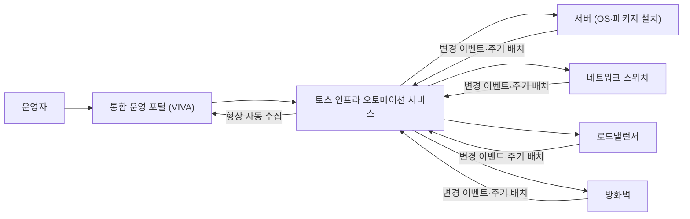

| | |
| --- | --- |
| 발표 | SLASH 22 |
| 연사 | 김정남 (토스 InfraOps Engineer) |
| 자료 | [발표 영상](https://www.youtube.com/watch?v=eVtoW-S6hV0) · [SLASH 22](https://toss.im/slash-22) |

쿠버네티스 아래, 물리 서버·네트워크·로드밸런서·방화벽 층의 자동화 이야기다. 시리즈의 다른 인프라 발표들이 컨테이너 위에서 벌어지는 일이라면 이 발표는 서버가 랙에 꽂힌 뒤 서비스가 뜨기까지의 11단계를 어떻게 1단계로 줄였는지 다룬다. 짧은 발표지만 측정 → 목표 → 결과의 구조가 명확하다. 내용은 발표 영상과 자동 생성 자막을 근거로 했고, 표현은 내 말로 바꿨다.

## 문제 정의: 서버 규모에 비례하는 준비 시간

새 서비스를 제공하려면 서비스별 용도에 맞는 서버를 구축하고 네트워크에 연결하고, 분산을 위해 로드밸런서를 설정하고, 접근 통제를 위해 방화벽을 설정한다. 이 준비 과정은 서비스별로 할당해야 하는 물리 서버 규모에 비례해 늘어난다. 토스 커뮤니티에는 **서버 규모에 상관없는 인프라 준비 속도**가 필요했다.

먼저 기존 과정을 분리해 소요 시간·진행 단계·담당자를 분석했다.

| 항목 | 기존 |
| --- | --- |
| 서버당 구축 시간 | 80분 |
| 서비스 구간별 구성 시간 | 20분 |
| 진행 단계 | 11개, 단계별 담당자 다름 |
| 구성 정보 | 형상 최신화가 안 됨 |

여기서 서버 단위 업무 시간 감소, 진행 단계 통합, 담당자 간소화가 우선순위임을 확인했다. 목표는 셋이다. 자동화로 운영 시간 감소, 담당자 개입 최소화로 휴먼 에러 감소, 형상 관리 자동화로 형상 최신화. 수치로는 서버 20대 규모 서비스 배포 기준 **시간을 1/10로**, 서비스 구성과 형상의 정합성을 **100%로**.

결과부터 말하면 20대 기준 **1,470분이 160분으로** 약 90% 줄었고, 여러 단계의 운영 업무가 **한 단계로 통합**됐으며, 형상 관리 자동화로 데이터 정합성이 100%가 됐다.

## 핵심: 정보와 운영 서비스의 통합

담당자별로 엑셀 등에 관리하던 현황 정보를 시스템으로 통합하고, 장비별 운영 서비스를 하나의 시스템에서 통합 관리하게 했다. 운영자는 통합 운영 포털인 VIVA에서 업무를 진행하고, 설정 변경 같은 장비 반영은 토스 인프라 오토메이션 서비스가 수행한다. 세부는 다섯 단계다.

### 1. 서버 배포

기존에는 엑셀로 정보를 관리하고 단계별 절차를 엔지니어가 수행해 정보 입력에서 휴먼 에러가 날 구간이 많았고 승인 절차에 따른 지연이 있었다. 지금은 운영자가 VIVA에서 **서비스 생성 정보만 입력**하면 OS 설치, 패키지 설치, 서버 설정, 도메인 등록, 장비 접근 통제까지 한 번에 진행되고, 모든 정보가 자동으로 형상 관리되어 VIVA에서 확인된다.

### 2. 네트워크 설정

기존에는 시스템 엔지니어가 서버 정보를 전달하면 네트워크 엔지니어가 위치를 확인한 뒤 스위치를 설정했다. 전달·확인 과정에서 잘못된 정보로 인한 휴먼 에러와 변경 횟수에 비례하는 시간이 문제였다. 지금은 VIVA에서 생성한 서버 정보를 입력하면 서버의 연결 정보를 활용해 네트워크 설정을 자동으로 바꾸고 IP 정보도 자동 할당한다. 업무 시간이 **1/5**로 줄었다.

### 3. 로드밸런서

기존에는 각 로드밸런서에 접속해 서비스를 등록·제어해야 했다. 지금은 VIVA에서 로드밸런서를 통합 운영해 **제품의 사용법을 배우지 않고** 서비스 생성·제어·확인을 할 수 있다.

### 4. 방화벽

기존에는 네트워크 엔지니어가 통신 정보를 요청받아 구간을 파악하고 각 방화벽에 접속해 정책을 확인한 뒤 필요하면 등록했다. 지금은 **출발지 IP, 목적지 IP, 서비스 포트만 입력**하면 통신 구간을 파악해 방화벽 정책을 확인하고, 운영자의 변경 승인 시 정책을 자동 반영한다.

### 5. 형상 관리

기존에는 엑셀, 텍스트 파일, 또는 각 시스템에 접속해 정보를 파악하고 문서화했다. 정확도가 떨어지고 시간이 많이 드는 업무였다. 지금은 인프라 오토메이션 서비스가 사용자의 형상 변경 이벤트를 감지하거나 주기적인 배치로 변경된 형상 정보를 자동 수집·업데이트한다. 엔지니어는 VIVA에서 항상 최신 정보를 조회한다.

## 다음 단계: 장애 추적과 자가 복구

이 과정을 더 발전시켜 장애 추적 시간을 줄이고 장애 시 자가 복구까지 자동화하려 한다. 순서는 인프라 형상 정보 고도화로 **서비스 연결 정보** 확보 → 모니터링과 로그 관리 시스템 정보를 기반으로 연관성 분석 → 예상 장애 범위 추출과 원인 추정 → 장애 유형 분리와 유형별 복구 프로세스 구축이다.

## 리뷰

**측정이 먼저였다.** 서버당 80분, 11단계, 단계별 담당자. 자동화 발표에서 흔히 빠지는 것이 "자동화 전 상태의 수치"인데, 이 발표는 그것을 첫 슬라이드로 놓고 목표(1/10, 100%)를 숫자로 정한 뒤 결과(90%, 1단계, 100%)를 같은 단위로 보고한다. 자동화 프로젝트를 설득해야 하는 사람에게 발표 구조 자체가 템플릿이다.

**"정보의 통합"이 "운영의 통합"보다 앞에 있다.** 다섯 단계 중 실제 병목은 각 장비 조작이 아니라 엑셀에 흩어진 정보를 사람이 옮기는 구간이었다. 형상 정보를 시스템 하나로 모으니 서버 정보로 네트워크를 설정하고, 그 결과가 다시 형상으로 돌아오는 순환이 생겼다. 자가 복구를 다음 단계로 잡은 것도 같은 논리다. 연결 정보가 정확해야 장애 범위를 추정할 수 있다.

**방화벽 자동화가 "승인"을 남겨둔 점이 금융 인프라답다.** 서버·네트워크·로드밸런서는 입력 즉시 반영이지만 방화벽 정책은 운영자 승인 후 반영이다. 접근 통제의 변경만은 사람의 확인을 거치게 한 것이고, [쿠버네티스 운영 발표](/posts/slash21-safe-kubernetes-operations/)에서 auto-sync를 끈 것과 같은 태도다. 이 발표의 물리 인프라 자동화는 3년 뒤 [하이브리드 클라우드 발표](/posts/tmc25-hybrid-cloud/)의 전제가 된다.

## 남는 질문

- 160분 중 남은 병목은 어디인지. OS 설치 같은 물리적 시간인지, 방화벽 승인 대기인지.
- VIVA와 쿠버네티스 클러스터 프로비저닝의 관계. 서버 배포 자동화가 끝나면 노드가 자동으로 클러스터에 조인되는지.
- 형상 수집을 "이벤트 감지 + 주기 배치"로 한다면 장비를 콘솔에서 직접 바꾼 경우(드리프트)를 얼마나 빨리 잡는지, 잡으면 되돌리는지 기록만 하는지.
- 자가 복구의 첫 대상 장애 유형은 무엇으로 잡았는지.

## 참고

- [발표 영상](https://www.youtube.com/watch?v=eVtoW-S6hV0)
- [SLASH 22](https://toss.im/slash-22)
