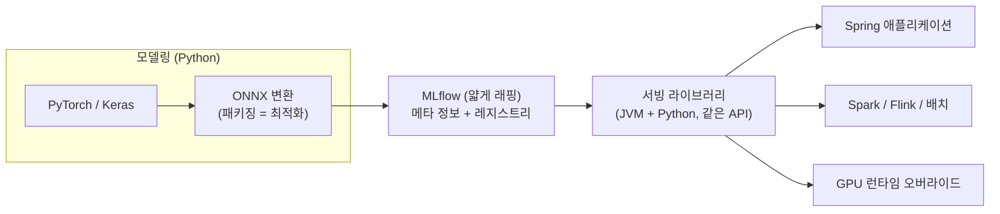

| | |
| --- | --- |
| 발표 | SLASH 22 |
| 연사 | 고석현 (토스 Machine Learning Engineer) |
| 자료 | [발표 영상](https://www.youtube.com/watch?v=EEsYbiqqcc0) · [SLASH 22](https://toss.im/slash-22) |

ML 모델링이 아니라 ML을 **서비스로 올리는** 이야기다. Kubeflow, KServe, TorchServe, Triton 같은 MLOps 프레임워크가 쏟아지던 2022년에 토스 ML 플랫폼은 "이미 있는 쿠버네티스와 DevOps 위에 정말 필요한 것만 얹는다"를 택했다. MLflow를 얇게 감싼 내부 라이브러리, ONNX로 표준화한 모델 아티팩트, 그리고 그것을 JVM(Kotlin·Scala)과 Python 어느 쪽에서든 같은 모양으로 불러오는 서빙 라이브러리가 결과다. 내용은 발표 영상과 자동 생성 자막을 근거로 했고, 자막 품질이 낮아 세부 표현보다 구조에 집중했다. 표현은 내 말로 바꿨다.

## 전제: 기술 스택은 문화의 속성을 갖는다

토스에서 무언가를 만들려면 그 속도에 맞춰야 한다. 머신러닝을 서비스에 적용하려고 하면 짧은 시간에 제품이 완성됐다가 사라지고 기능이 생겼다 없어진다. 프레임워크 선정부터 어려웠다. PyTorch가 연구와 빠른 실험에서 가장 좋은 성과를 내고 있었고 Keras/TensorFlow도 충분히 효율적이었으며, ONNX라는 모델 변환과 표준 런타임도 빠르게 발전하고 있었다. 서빙 영역으로 가면 TorchServe, TensorFlow Serving, 풀스택 환경의 KServe, 배치와 GPU에 적합한 NVIDIA Triton까지 선택지가 많다.

발표자가 인상 깊게 읽은 구절은 "기술 스택은 일정 부분 문화에 해당하는 속성을 가지고 있다. 문화와 여건에 맞는 기술을 고르는 것이 중요하다"이다. 내가 속한 회사의 인프라·인력·문화에서 성과를 낼 수 있는 기술이 좋은 기술이다. 토스에는 아주 잘 만들어진 플랫폼과 강력한 DevOps, 금융 도메인의 안정성·보안·인증이 이미 있다. 조건을 정리하면 이렇다. 타겟 유저 1,000만 이상, 향후 5년간 인프라 증설 계획이 주어져 있고, 서비스할 모델의 규모는 예측 어렵고, 금융 도메인이 요구하는 무중단·안정성이 중요하다. 이 조건에서 어떤 오픈소스를 고를 것인가.

## 정말 필요한 것은 무엇인가

모델 하나를 서빙하는 데 필요한 것은 모델, 모델 저장소, 서버 자원이다. 많은 조직이 쿠버네티스로 서비스 메시를 구성하고 현대적인 DevOps가 이미 있다면, MLOps 프레임워크의 상당히 많은 기능이 그것과 **겹친다**. MLOps를 고민하는 시점에는 이미 모델이 있는 경우가 많아 사실 필요한 것은 모델 저장소뿐일 수도 있다. S3 같은 오브젝트 스토리지나 HDFS면 충분할 수 있고, 메타 정보는 적당한 RDB를 써도 괜찮다.

오픈소스 도입에 신중해진 이유도 있다. 많은 오픈소스가 클라우드 매니지드 버전을 위한 체험판처럼 되어버렸고, 커뮤니티가 아니라 회사들의 기술 패권 싸움이 주도한다. 일부 기능은 프로덕션 수준에 한참 못 미치는데, PoC가 아니라 실제로 안정적인 서비스를 만들 수 있는지는 이미 실패를 겪은 뒤에 알게 될 가능성이 높다. 그래서 오픈소스는 **언제 도입해서 언제까지 쓰고 언제 걷어낼지** 처음부터 계획과 전략이 필요하다.

## 구성

**MLflow를 얇게 래핑한 내부 라이브러리.** MLflow가 위치하는 부분을 모델의 메타 정보 관리와 레지스트리 정도로 한정했다. RDB로 대체될 수 있을 정도의 작은 의존성만 남긴 것이다. 래핑은 거의 동일한 수준의 메서드로 구성해서 새로 합류한 팀원이 "왜 시장 표준을 안 쓰고 이상한 독자 규격을 쓰나"라고 불만을 갖지 않게 했다. 적당한 시장 표준과 락인 사이를 아슬아슬하게 줄타기하는 것은 항상 어렵다.

**서빙 라이브러리는 JVM과 Python 동시 제공.** TensorFlow 코어 라이브러리, PyTorch, ONNX Runtime을 그대로 쓰고 위에 추상화를 위한 정도의 얇은 래핑만 얹었다. 특별한 기능을 더 만들기보다 추상화가 목적이다.

## ONNX 변환은 패키징이자 최적화다

보통 학습 모델의 서빙은 Java 레이어와 고려되어 있지 않고 여러 런타임을 거치는 것이 까다롭다. 모델을 여러 프레임워크로 변환하는 것은 불과 1년 전만 해도 별도 발표가 될 만큼 쉽게 되는 일이 아니었다. 하지만 프레임워크와 오픈소스 커뮤니티, 빅테크 개발팀의 경쟁적 기여로 발전 속도가 놀랍다. 토스 모델팀은 모델 코드를 매우 구조적으로 체계화하고 코딩 가이드를 지켜서 ONNX 변환에 거의 문제가 없는 수준으로 만들었다. **이건 플랫폼이 잘하는 것이 아니라 모델링 코드가 얼마나 표준적이고 구조적으로 짜여 있는지의 문제**이고, 그래서 문화에 가깝다.

BERT 기반 추천 모델을 예로 들면, 모델의 연산 그래프 구조가 있다. "PyTorch는 즉시 실행 아닌가"라고 할 수 있지만 신경망은 본질적으로 그래프를 그리기 용이하고 서빙에서는 더욱 그렇다. 연산량이 균질하고 순서가 예측 가능한 그래프(DAG)는 컴퓨테이션 관점에서 가장 좋은 최적화 요건이다. 입력이 들어가 출력이 나오는 구조로 정리되어 패키징된 모델은 서빙 관점에서 그 중간의 수백 수천 줄 구현이나 복잡한 환경 종속성을 회피하게 해준다. 수십 수백 개의 Docker 이미지를 만들고 수시로 업데이트하던 것을 하나로 압축할 수 있다.

변환이 안 되는 경우도 있다. 해당 연산의 변환을 지원하지 않거나 애초에 텐서 연산이 아닐 수 있다. 예로 `acosh` 같은 연산은 수식으로는 간단하고 기본 텐서 연산으로 구현되므로 그렇게 고쳤다. "Attention is All You Need"의 유명한 LayerNorm 구현에서 `x.std(-1)`처럼 축을 `-1`로 표현하는 부분은 PyTorch에서는 되지만 동일한 ONNX 연산은 특정 범위만 지원한다. 이런 부분은 변환은 성공하고 런타임에서 에러를 뿜는 안 좋은 케이스인데, 개발에 공식 연산을 최대한 쓰고 모델 실험·설계부터 서비스를 고려한 힌트와 개발 문화가 지켜지면 쉬운 문제가 된다. 그것이 잘 지켜진 토스 모델팀에서는 체감하는 변환 비용이 0에 가깝다. 모델 코드에서 OP를 남기면 대부분 사전 해결된다. 그동안 "변환"이라고 했지만 이것은 서비스 출시를 위한 **패키징이자 최적화**다.

## 어디에든 올린다

PyTorch로 작성한 모델이든 Keras·TensorFlow로 작성한 모델이든 자동 변환으로 여러 언어·프레임워크에서 사용 가능한 상태가 된다. 목적에 따라 배치를 위해 Spark 같은 분산 클러스터에 풀어낼 수도 있고, Spark Streaming이나 Flink, 일반적인 Spring 애플리케이션에 탑재할 수도 있다. 워크플로를 무시하고 그냥 JAR 안에 파일로 모델을 넣어도 배포된다. 비즈니스나 속도가 요구하는 모든 상황을 대응할 체력이 생긴 것이다. 토스 ML팀은 이것을 두 달 만에 할 수 있는 인원과 경험과 역량이 있었고, 모든 조직에 적합하지 않을 수 있다고 했다.

최소 의존성으로 구성된 런타임과 얇은 라이브러리는 프로덕션 수준의 결과물을 보장했다. 코어 덤프나 메모리 누수가 없었고, Kafka로 이벤트와 모델 결과를 통합했으며, 기존 서비스 인프라에 그대로 올라타 관측성을 그대로 받았다. 그러면서도 Python 레이어에서 할 수 있는 것을 그대로 할 수 있었다.

외국의 유명 서비스 회사가 "데이터 과학자 직군은 절대로 그들의 Python 워크로드를 JVM에 허락하지 않을 것"이라고 발표한 적이 있다. 발표자는 그 화해의 장을 만들고 싶었다. 데이터 과학자가 추가로 많은 것을 해야 하는 것이 아니고, 단순히 모델을 기록하고 서비스를 위해 저장·관리하는 코드를 얇은 라이브러리로 감쌌다. MLflow와 거의 동일하고 특별한 정책 제약 없이 모델 저장을 자동화하고 로깅하거나 필요한 것을 명시적으로 넣을 수 있다. 좋게 말하면 높은 자유도, 나쁘게 말하면 알아서 하시오다. Scala 코드와 Kotlin 서버에서 같은 패키지를 import해 모델을 불러오고 런타임 클래스를 생성한다. BERT 모델을 JVM에서 추론하는 코드는 토크나이징 같은 전처리를 빼면 복잡하지 않고, 잘 알려진 모델을 굳이 큰 프레임워크 없이 서빙할 수 있다. Python에서 Keras로 불러와도, ONNX를 읽어 추론해도 거의 같은 모양이다. 언어와 프레임워크가 모두 바뀌었는데 코드가 같다는 점을 발표자는 개인적으로 인상 깊다고 했다. 필요하면 런타임을 GPU 버전으로 오버라이드해 코드 수정 없이 GPU에 배포하고 가속한다.

사례로, 토스 전체 유저의 브랜드 선호도 순위를 실시간으로 처리하고 적재하는 플랫폼을 만들었고 GPU로 가속하기도, 같은 코드에서 옵션만 바꿔 CPU로 천천히 처리하기도 했다. 소비 카테고리 분류 모델은 단순 분류가 아니라 소비·브랜드 임베딩을 생성하고, 배치 추론을 적절히 하면 GPU 한 장에서 초당 수천 건이 나온다. 이 파이프라인과 서빙으로 **100여 개의 모델을 동시에** 추론하며 조합과 성능을 높이고 있다. 컴페티션에서 일반적인 방법이고 특별한 것이 아니다. 그냥 하면 되는 것이고, 그냥 하면 되는 걸 아무 고민 없이 할 수 있게 하는 것이 플랫폼의 역량이다.

## 마무리

토스는 서비스 회사이고 금융회사이고 고객 중심 제품을 만드는 곳이다. AI든 ML이든 그것을 다루는 회사의 본질이 중요하다. ML 제품도 서비스 수준의 가시성이 필요하고, 로깅·정책·표준·보안이 철저해야 하고, A/B 테스트가 필요하고, 카나리와 모니터링이 필요하다. 하지만 이런 것들을 머신러닝을 위해 새로 만들지 않았다. 모델도 서비스이고 토스는 서비스를 하니까. 머신러닝을 위한 특별한 인프라나 프레임워크가 있어야 가능한 서비스가 아니라 물 흐르듯 자연스럽게 서비스하기 위해서는, 역설적으로 고도화된 ML 조직이 필요하다.

## 리뷰

**"MLOps 프레임워크는 기존 DevOps와 겹친다"가 이 발표의 가장 강한 주장이다.** Kubeflow나 KServe가 제공하는 배포·스케일링·라우팅·모니터링은 토스에 이미 있었다. 없는 것은 모델 레지스트리와 런타임 추상화뿐이었고, 그것만 얇게 만들었다. 플랫폼 팀이 "무엇을 만들지"보다 "무엇을 만들지 않을지"를 먼저 정한 사례다.

**ONNX를 "변환"이 아니라 "패키징"으로 부른 것이 정확하다.** Docker 이미지 수백 개 대신 그래프 아티팩트 하나. 서빙 인프라의 복잡도를 모델 코드의 규율로 갚은 것이고, 그래서 발표자가 "플랫폼이 아니라 문화"라고 한 것이다. 이 규율이 없는 조직에서는 같은 구조가 변환 실패의 늪이 될 수 있다는 점도 함께 읽어야 한다.

**JVM 서빙은 토스 서버 스택의 연장이다.** [서버 기술 스택 발표](/posts/slash21-toss-server-stack/)의 Kotlin·Spring·Kafka 위에 모델이 라이브러리로 얹힌다. 별도의 Python 추론 서버를 두지 않으므로 네트워크 홉이 하나 줄고, 관측성·배포·보안을 그대로 물려받는다. 3년 뒤 토스뱅크의 [ScyllaDB Online Feature Store](/posts/tmc25-scylladb-online-feature-store/) 발표와 함께 보면 피처 저장과 모델 서빙이 각각 어떻게 서비스 인프라에 녹아드는지 보인다.

## 남는 질문

- JVM에서 ONNX Runtime을 쓸 때 전처리(토크나이저 등)는 어디서 하는지. Python 전처리를 JVM으로 옮기는 비용이 실제로는 모델 변환보다 크지 않은지.
- MLflow 래핑을 "언제 걷어낼지" 계획이 있다고 했는데, 걷어낸다면 무엇으로 대체하는지.
- 100여 개 모델 동시 추론에서 모델 버전 관리와 롤백은 어떻게 하는지. 모델을 JAR에 넣는 방식이면 롤백이 애플리케이션 배포 롤백과 같아지는지.
- GPU 런타임 오버라이드 시 쿠버네티스에서 GPU 노드 스케줄링은 기존 DevOps가 그대로 다루는지.

## 참고

- [발표 영상](https://www.youtube.com/watch?v=EEsYbiqqcc0)
- [SLASH 22](https://toss.im/slash-22)
- [ONNX Runtime](https://onnxruntime.ai/)
- [MLflow](https://mlflow.org/)
