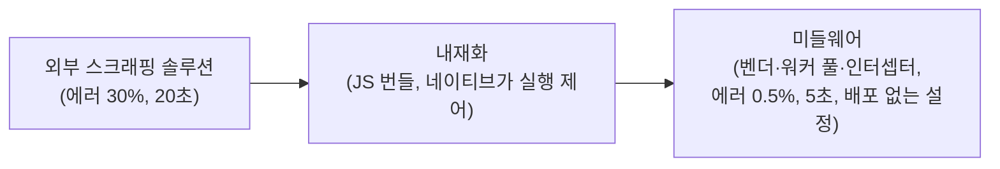
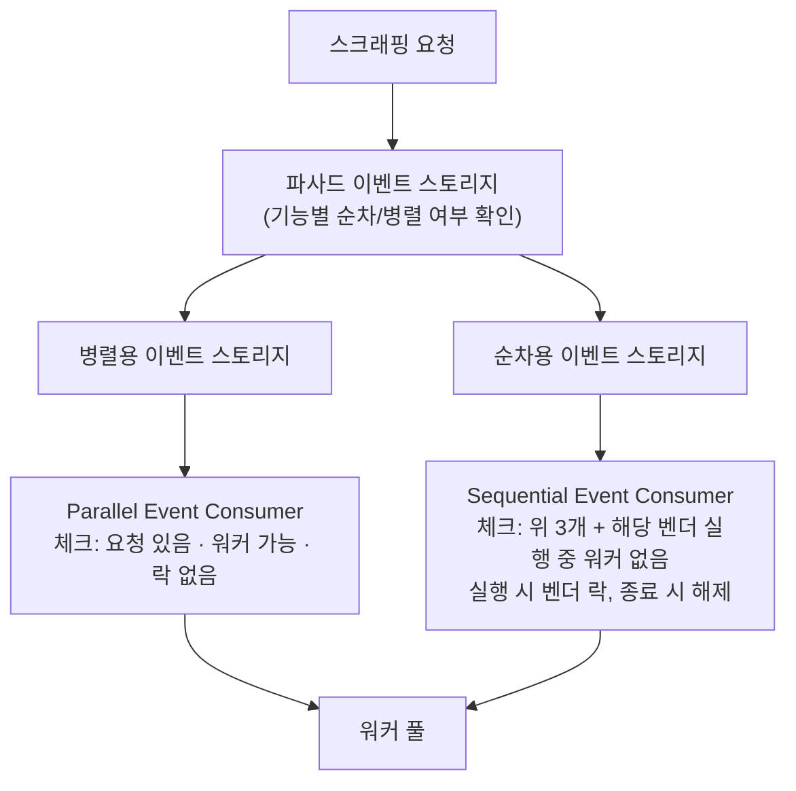

| | |
| --- | --- |
| 발표 | SLASH 22 |
| 연사 | 김용성 (토스 Web Automation 챕터, Node.js Developer) |
| 자료 | [발표 영상](https://www.youtube.com/watch?v=dP8S3kIQysk) · [SLASH 22](https://toss.im/slash-22) |

마이데이터 전환(2021년 12월) 이전까지 토스의 계좌·카드 조회는 유저 기기 안의 보이지 않는 웹뷰에서 실행되는 **클라이언트 스크래핑**이었다. 외부 솔루션으로 시작해 내재화하고, 네이티브와 스크래핑 사이에 미들웨어를 두어 에러율 30%를 0.5%로, 평균 20초를 5초로 줄인 과정이다. 같은 챕터의 [Crazy Activation 발표](/posts/slash22-crazy-activation-web-automation/)가 구조라면 이 발표는 운영 지표 개선의 기록이다. 내용은 발표 영상과 자동 생성 자막을 근거로 했고, 표현은 내 말로 바꿨다.

## 세 단계의 진화

**1단계: 외부 솔루션.** 별도의 스크래핑 모듈 개발 없이 솔루션 기능으로 조회할 수 있었지만, 디버깅하기 힘든 알 수 없는 오류, 신뢰할 수 없는 성공 여부, 느린 속도가 문제였다. 코드 적재적소에 로그를 넣고 스크래핑 과정의 모든 HTTP 요청을 로깅하는 디버그 로그를 추가해 최소한의 가시성을 확보했다. 그런데 솔루션 자체의 구조적 문제로 인한 사이드 이펙트가 원인인 경우가 있었고, 솔루션 엔지니어가 여러 업체를 관리하니 이슈 대응이 지연될 수밖에 없었다.

**2단계: 내재화.** 토스 네이티브에서 번들된 JavaScript로 실행되도록 개발했다. 코드를 직접 관리하게 되면서 오류를 빠르게 고칠 수 있었다. 하지만 기존 로그로는 확인할 수 없는 오류가 나타났다. 스크래핑 구간 사이에서 특정 요청이 비정상적으로 느리거나, 요청이 유실된 듯 결과가 뜨지 않는 현상이다. 그리고 대상 사이트마다 다른 실행 환경을 요구했다. 어떤 사이트는 순차 실행해야 하고 어떤 사이트는 로그인 세션을 공유해야 했다.

구간별 로그를 추가했다. (1) 스크래핑 요청이 생성되어 큐에 저장된 시간, (2) 큐에서 빠져나가 웹 프로세스를 생성한 시간, (3) 웹뷰가 번들된 스크립트를 로드한 시간, (4) 스크래핑 소요 시간, API별 소요 시간, 전체 소요 시간. 그 결과 **계좌·카드가 많이 등록된 사용자는 리소스를 과다하게 사용해 웹 프로세스가 정상 실행되지 못하는** 현상을 찾았다. 성공·실패 로그로는 볼 수 없던 문제였다. 원인은 찾았지만 개선에 허들이 있었다. 스크래핑 실행을 관리하는 로직이 네이티브에 있어 실험하려면 네이티브 배포 주기에 맞춰야 했다. 빠른 실험을 위해 네이티브와 스크래핑 사이에 실행을 제어할 새 레이어가 필요했다.

**3단계: 미들웨어.** "하나의 웹 프로세스에서 iframe으로 스크래핑을 실행하면 어떨까"라는 가설에서 출발해 여러 실험을 거쳐 iframe과 Web Worker를 쓰는 현재의 미들웨어가 만들어졌다.

## 미들웨어 구성

각 레이어(웹뷰, 미들웨어, 스크래핑)는 추상화된 메시지 프로토콜로 표준 `window.postMessage`를 통해 통신하고, 네이티브로 데이터를 보낼 때만 네이티브가 정의한 글로벌 함수를 호출한다.

| 컴포넌트 | 역할 |
| --- | --- |
| **벤더** | 대상 사이트별 실행 제어. 벤더별 맥락을 관리하는 벤더 컨텍스트, 요청된 스크래핑 이벤트를 저장하는 이벤트 스토리지, 일정 주기마다 꺼내 실행하는 이벤트 컨슈머로 구성된 producer-consumer 패턴 |
| **워커 풀** | 리소스 관리를 위한 실행 제어. 최대 실행 가능한 워커 수를 관리하고 워커로 스크립트를 실행. iframe 워커 풀과 Web Worker 풀 두 구현 |
| **인터셉터** | 스크래핑 요청 시 전후로 실행되어 비효율적인 요청을 개선 |

미들웨어 도입 후 비정상적으로 리소스를 사용하는 현상은 더 이상 발생하지 않았고, 에러율이 30%에서 0.5%로 떨어졌다. 하지만 속도 지표에서 개선할 포인트가 아직 많이 남아 있었다.

## 속도: 세 가지 비효율

**1. 로그인을 매번 한다.** 보유 카드 목록, 카드 거래 내역, 결제 예정 금액을 각각 요청할 때마다 로그인했다. 특정 사이트는 로그인 시 사용자에게 알림을 보내 알림이 연속으로 가기도 했다. 로그인 세션을 미들웨어가 관리하기로 했다. 스크래핑 실행 시 미들웨어에 세션을 요청하고, 있으면 유효한지 검증해 유효하면 바로 실행, 없거나 검증 실패면 로그인해서 성공하면 세션을 저장하고 실행한다. 세션이 실제로 만료되거나 유저가 동시에 로그인하는 경우를 제외하면 대부분 세션을 재활용하게 됐다.

**2. 중복 호출.** 조회 홈에서 계좌 상세로 이동할 때 같은 계좌 잔액 조회를 중복 호출했다. 중복 실행이 안 되는 앱이라면 이전 요청이 끝날 때까지 대기해야 한다. 두 인터셉터로 막았다.

- **서브셋 인터셉터**: 미들웨어 인메모리에 해시 기반 요청 스토리지를 둔다. 스크래핑 A+B 요청이 오면 저장하고 실행한다. 이어 A 요청이 오면 이미 A를 포함한 A+B 요청이 있으므로 그 아래에 A 요청을 추가로 저장한다. A+B가 끝나면 결과를 네이티브에 전달하고, 스토리지에서 A 요청이 있는 것을 확인해 A 결과도 전달한 뒤 A+B 이력을 제거한다.
- **캐시 인터셉터**: 브라우저 IndexedDB를 쓴다. A+B 요청 시 저장된 이력이 없으면 실행하고 결과를 네이티브에 전달한 뒤 A와 B 결과를 각각 저장한다. 잠시 후 A 요청이 오면 저장된 A 결과를 그대로 전달한다.

**3. 스크립트 파일 크기.** 미들웨어와 스크래핑 스크립트 모두 웹뷰용 번들 JS라 네트워크가 느린 유저는 다운로드에 시간이 많이 걸렸다. 처음엔 왜 시간이 걸리는지 찾다가 용량 문제임을 확인하고 트리 셰이킹이 가능한 구조로 리팩토링했다.

서브셋과 캐시를 도입하고 JS 파일 크기를 줄이면서 평균 20초에서 5초로, 4배 빨라졌다.

## 사이트별 유연한 설정

어떤 사이트는 병렬 실행이 가능하고 어떤 사이트는 순차로만 해야 한다. 특정 카드사는 카드 조회와 실적·혜택 조회를 병렬로 실행하면 로그인 세션이 풀렸다. 무엇보다 설정을 바꾸려면 매번 배포해야 했다.

병렬은 Parallel Event Consumer가 일정 주기마다 저장된 요청이 있는지, 실행 가능한 워커가 있는지, 락이 걸려 있는지 세 상태를 체크해 모두 만족할 때 실행한다. 순차는 Sequential Event Consumer가 여기에 해당 벤더에 실행 중인 워커가 있는지까지 네 상태를 체크하고, 실행 시 벤더에 락을 걸어 종료 시 해제한다. 기능별로 동시 실행을 제어하려면 파사드 스토리지가 기능별 순차·병렬 여부를 확인해 각 스토리지에 나눠 저장하고 두 컨슈머가 각자의 플로를 따른다.

벤더 컴포넌트 적용 후 사이트별 실행 환경을 **어드민에서** 바꿀 수 있게 됐다. 특정 사이트가 장애나 점검 중일 때 즉각 대응할 수 있고, 사이트 변경으로 실행 환경이 바뀌었을 때 설정만으로 대응한다. 10분이 넘는 빌드·배포 대신 클릭 두 번이다.

## 발표자의 정리

외부 솔루션에서 미들웨어까지 오면서 에러·속도 지표가 엄청나게 개선됐다. 가장 중요한 것은 **가시성 확보**였다. 어디서 오류가 나고 어디서 병목이 생기는지 로그와 지표로 정확히 알았기 때문에 그에 맞는 솔루션을 도입할 수 있었다.

## 리뷰

**"구간별 로그가 없으면 원인을 볼 수 없다"는 것이 발표의 첫 교훈이고, 백엔드 관측성과 완전히 같은 이야기다.** 성공·실패만 기록하는 로그로는 "카드가 많은 유저의 웹 프로세스가 죽는다"를 알 수 없었다. 큐 저장 → 프로세스 생성 → 스크립트 로드 → 실행이라는 파이프라인 각 단계에 타임스탬프를 찍은 뒤에야 원인이 드러났다. 이 발표가 프론트엔드 스크래핑을 다루지만 이 시리즈에 들어온 이유가 여기 있다.

**미들웨어는 유저 기기 안에서 돌아가는 작은 작업 스케줄러다.** 이벤트 스토리지 + 컨슈머 + 워커 풀 + 벤더 락은 서버에서 Kafka 컨슈머와 스레드 풀로 대외기관 호출을 제어하는 [토스뱅크 대출 시스템](/posts/slash22-tossbank-loan-system/)과 같은 구조다. 상대(카드사 사이트)가 견딜 수 있는 동시성만 보낸다는 목적도 같다. 다만 이건 서버가 아니라 수백만 대의 휴대폰 각각에서 돌아간다.

**"배포 없는 설정 변경"이 운영 안정성의 핵심으로 제시된다.** 대상 사이트가 언제 바뀔지 모르는 스크래핑의 특성상, 대응 속도가 곧 에러율이다. 어드민에서 벤더 설정을 바꾸는 것은 서버 쪽 feature flag나 동적 설정과 같은 역할이다.

## 남는 질문

- 서브셋 인터셉터는 A+B 요청이 "A를 포함한다"는 것을 어떻게 판단하는지. 요청 스키마에 포함 관계가 정의돼 있는지.
- IndexedDB 캐시의 TTL과 무효화. 잔액처럼 자주 바뀌는 값을 캐시하면 오래된 값을 보여줄 위험이 있는데 얼마나 짧게 잡았는지.
- 마이데이터 전환 이후 이 미들웨어는 어떻게 됐는지. 마이데이터가 커버하지 않는 조회에 계속 쓰이는지.
- 어드민 설정 변경이 유저 기기에 반영되는 경로. 앱 실행 시 설정을 받아오는지, 스크래핑 요청마다 확인하는지.

## 참고

- [발표 영상](https://www.youtube.com/watch?v=dP8S3kIQysk)
- [SLASH 22](https://toss.im/slash-22)
- 같은 챕터의 구조 설명: [SLASH 22 Toss Crazy Activation 리뷰](/posts/slash22-crazy-activation-web-automation/)
