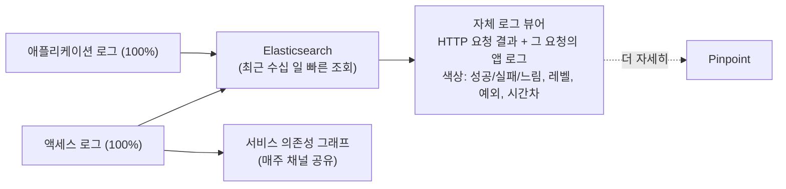

| | |
| --- | --- |
| 발표 | SLASH 22 |
| 연사 | 하태호 (토스페이먼츠 SRE/DevOps 팀 리더) |
| 자료 | [발표 영상](https://www.youtube.com/watch?v=oakvibIKToc) · [SLASH 22](https://toss.im/slash-22) |

토스페이먼츠가 "하루 수십 번 배포해도 걱정되지 않는 환경"을 어떻게 만들었는지 제품 전달 파이프라인 순서(프로젝트 구성 → CI/CD → 배포 → 운영)로 설명하는 발표다. 각 단계에서 한 가지씩 구체적인 선택이 있다. 항상 최신으로 유지되는 보일러플레이트, 빌드 서버 간 공유 캐시 스토리지, 두 클러스터 액티브-액티브, 샘플링하지 않는 자체 로그 뷰어, 원인 링크가 포함된 알림. 내용은 발표 영상과 자동 생성 자막을 근거로 했고, 표현은 내 말로 바꿨다.

## 전제: 좋은 코드는 배포되어야 가치가 생긴다

토스페이먼츠는 B2C보다 사업자 대상 유틸리티를 제공하는 B2B에 가깝다. 더 좋은 제품과 품질이 사업자의 성장에 기여하므로, 목표는 "사업자가 필요로 하는 기술적 도구를 적시에 완결성 있게 제공하는 것"이다. 먼저 코드를 잘 쓴다. 클라우드 마이그레이션 때 리팩토링한 레거시에는 20년 넘은 코드도 있었고, 그 코드가 앞으로 몇 년을 더 쓰일지 생각하면 지속 성장 가능한 코드가 중요하다([같은 해 코드 발표](/posts/slash22-sustainable-code/)). 하지만 좋은 코드가 전부는 아니다. 좋은 코드의 가치는 배포되어 사용자가 쓸 때 발현되고, 쓰이지 않는 코드는 기술적으로 바이트 덩어리일 뿐이다. 그래서 코드 작성부터 배포·운영까지 전달 파이프라인 전체가 잘 구성되어야 한다.

## 1. 프로젝트 구성: 항상 최신인 보일러플레이트

MSA에서는 프로젝트를 새로 구성하는 일이 자주 생긴다. Spring + Kotlin 기본 구성은 쉬워도 사내 환경에 맞추는 것은 어렵다. 쿠버네티스에서 쓸 Docker 베이스 이미지는 무엇인지, 로그는 어떻게 남기는지, 민감 데이터 암호화는 어떻게 하는지. 문서로 잘 써둬도 신규 입사자에게는 방대한 문서가 부담이고, 여러 번 해본 사람도 계속 바뀌는 인프라를 전부 이해한 채로 구성하기는 어렵다.

그래서 **항상 최신 상태로 유지되는 보일러플레이트 프로젝트**를 운영한다. JPA, Redis, Kafka, Cloud Config, 배치, 린터, 테스트, Sentry, 로깅, 공통 모니터링, 사내 Nexus, Dockerfile까지 구성되어 있어 DB 정보만 설정하면 바로 비즈니스 로직을 쓸 수 있다. 로깅·모니터링처럼 모든 서비스가 챙겨야 하는 기능은 **공통 라이브러리**로 제공하되, 사용하는 프로젝트와의 의존성을 최소화하는 방향으로 설계한다. public API 노출을 최소화하고, Spring Boot auto-configuration으로 기능을 확장하는 모듈은 프로젝트에서 접근할 수 있는 API가 전혀 없도록 모듈화했다.

이 덕분에 전사 프로젝트를 대상으로 공통 기능을 적용하기 쉽다. 라이브러리 버전을 올리는 PR을 전사에 생성해도 컴파일이 안 되거나 Spring 구동에 실패하는 경우가 거의 없다. **Log4j 취약점(Log4Shell) 대응 때 전체 시스템에 자동화된 PR을 생성해 쉽게 대응**했다.

## 2. CI/CD: 빌드 시간과 캐시

CI/CD 파이프라인 구성도 사내 환경에 맞추면 어렵다. 샘플 YAML 파일을 기반으로 프로젝트명, 도메인, 메모리 할당 등 최소 수정으로 구성할 수 있게 했다. 특이한 요구는 DevOps 엔지니어가 돕지만 대부분은 비슷하다. CI는 GoCD와 GitHub Actions를 쓴다. PR이 생성되면 린트, 테스트, REST Docs 기반 사내 API 카탈로그 문서 발행, API 리뷰 프로세스 등을 수행한다. GitHub Actions는 워크플로를 YAML로 정의하고 리포지토리에 포함만 시키면 되므로 보일러플레이트에 넣어두면 큰 노력 없이 전사에 반영된다.

빌드는 오래 걸리고 생산성에 영향을 주므로 최적화가 필요하다. 2021년 개발자가 매우 빠르게 늘고 develop 브랜치 머지 시 개발 환경 자동 배포 구성 때문에 빌드 컴퓨팅 자원이 모자라 지연이 생겼다. 대부분의 CI 도구는 자원을 늘릴 수 있다(GoCD는 에이전트, Actions는 러너). 그런데 **자원을 늘린다고 무조건 빨라지지 않는다.** 대기 시간은 줄지만 빌드 결과물이 저장되는 장비가 많아져 다음 빌드에서 캐시 효과를 못 본다. 모든 빌드 장비가 접근하는 **공유 스토리지**를 도입해 어느 장비에서 빌드해도 캐시 히트가 나게 했다.

그 외에 변경이 잦은 애플리케이션 레이어와 자주 변경되지 않는 라이브러리를 구분해 빌드하는 Spring Boot layered JAR, Docker 멀티스테이지 빌드로 이미지 경량화와 캐시 효과, 빌드 병렬화가 되는 Docker BuildKit을 쓴다. 클라우드라 시간대별로 빌드 서버 수를 조절해 요청이 몰리는 시간에도 자원이 부족하지 않게 한다. 이미 최고 사양 Intel Mac을 제공하고 있었지만 입사 시점이나 사용 기간과 무관하게 모든 개발자의 Mac을 M1 Max 최고 사양으로 바꿔주기도 했다.

## 3. 배포: 1% 카나리와 클러스터 단위 카나리

거의 모든 프로젝트가 쿠버네티스에 배포되고 Istio가 트래픽을 제어한다. 1% 단위로 신규 버전을 적용할 수 있어 스테이징에서 못 잡은 문제가 프로덕션에서 나도 빠른 롤백으로 영향 범위를 최소화한다.

서비스 단위가 아니라 쿠버네티스·Istio 버전 같은 클러스터 레벨 배포는 클러스터 전체의 안정성에 영향을 주는 위험한 작업이다. 클러스터 레벨 트래픽도 1% 단위로 조절되면 좋겠지만, 대신 **두 쿠버네티스 클러스터를 액티브-액티브**로 운영해 언제든 한쪽 트래픽을 완전히 제거할 수 있다. 트래픽을 뺀 클러스터에서 작업하고 다시 넣어보면서 안전하게 진행한다. 이 구조는 클러스터 레벨 개선을 부담 없이 하게 해 인프라 레벨 개선도 빠르고 지속적으로 이루어지게 하고, 클러스터 레벨 장애 때도 트래픽을 조정해 피할 수 있게 한다.

## 4. 운영: 메트릭·로그·트레이스·알림

발표자는 서비스 운영이 소프트웨어 생명주기에서 가장 중요하다고 본다. 코드의 가치가 발현되고 누적되는 단계이기 때문이다.

**메트릭.** 10초 단위 CPU·메모리 같은 숫자 데이터. 수집만 하면 의미가 없으니 Grafana로 여러 데이터 소스를 조회하고 알림을 만든다. 보일러플레이트에 기본 모니터링이 구성되어 있어 새 서비스에서 모니터링 구성을 잊어도 기본은 자동으로 된다.

**애플리케이션 로그.** 비정형이고 양이 많아 보관 비용이 크지만, 문제 분석의 중요한 단서이고 로그가 있으면 원인 파악 시간이 극단적으로 준다. 찾기 쉬운 형태로 오래 보관하는 것이 중요하되, 시간이 지날수록 찾지 않는 데이터에 많은 비용을 쓰는 것은 아깝다. 수십 일 로그만 저장하는 Elasticsearch 클러스터가 작년에 이미 100대를 넘었고 양이 계속 늘어서, **스토리지 티어링**(오래될수록 고사양 → 저사양 장비로 이동)으로 비용을 줄이고 초장기 보관은 S3에 넣는다.

**액세스 로그.** 서버가 요청 하나마다 한 줄씩 남기는 디지털 발자국이다. 트래픽 이해와 네트워크 문제 식별에 중요하지만 요청 관련 문맥이 부족하다. 주문 ID가 URL 경로에 있는 조회 API는 액세스 로그로 어떤 주문인지 알 수 있지만, 현금영수증 발급 API는 경로에 식별자가 없어 어떤 영수증이 발급됐는지 알 수 없다. 여러 서버가 협업하는 상황에서 공통 식별자가 없으면 분산 로그를 추적하기 어렵다. 그래서 액세스 로그에 trace ID·span ID 외에 **어느 API가 처리했는지, 호출한 서비스는 무엇인지, 처리한 클러스터·데이터센터, 가맹점 식별 정보** 등 문맥을 넣는다. trace ID로 문제 요청을 쉽게 찾고, 문맥 정보로 지표를 만들어 특정 API나 특정 가맹점이 문제를 겪고 있지 않은지 품질 관리도 한다.

**트레이스와 자체 로그 뷰어.** Jaeger, Zipkin, Pinpoint, Elastic APM 같은 분산 추적 도구는 에이전트로 코드 수정 없이 요청 추적이 된다. 토스페이먼츠도 Pinpoint를 쓴다. 하지만 아쉬운 점이 셋 있었다. (1) 샘플링 기반이라 문제 요청이 저장되어 있을지 모른다. (2) trace ID가 아닌 요청 단위 메타데이터를 추가하거나 그것으로 요청을 찾기 어렵다. (3) 실제로 추적해야 하는 문제는 성능보다 외부 시스템 통신이나 비즈니스 로직의 예외인 경우가 더 많은데, 분산 추적은 지연과 "문제가 났다"는 사실은 잘 보여주지만 **왜** 났는지 이해하는 데 필요한 애플리케이션 로그를 쉽게 찾아주지 못한다. 샘플링은 레이트를 올리면 되지만 나머지는 해결이 어려웠다.

그래서 별개의 로그 뷰어를 만들었다. 로그는 샘플링 없이 100% 저장하므로 문제 요청이 있을지 고민할 필요가 없고, HTTP API 단위 처리 결과와 개발자가 남긴 애플리케이션 로그가 함께 보여 로직 문제도 빠르게 확인된다. Elasticsearch로 다양한 조건으로 요청을 식별하고 최근 수십 일은 빠르게 조회된다. APM만큼 자세하진 않지만 더 필요하면 APM으로 넘어갈 수 있다. 직접 만든 화면이라 강조를 색으로 표현한다. 정상은 파란색, 실패는 빨간색, 오래 걸린 것은 주황색, 로그 레벨별 회색·초록·빨강, 예외 스택트레이스는 붉은 배경, 애플리케이션 로그는 이전 항목과의 시간차를 계산해 크면 색으로 표시해 어디를 봐야 할지 알기 쉽게 했다. 트레이스와는 별개로 액세스 로그 기반 **서비스 간 의존성 그래프를 매주 서버 개발자 채널에 공유**한다. 아키텍처 개선 포인트와 병목을 찾고, 신규 입사자 적응을 돕고, 순단 가능성이 있는 작업 때 영향받는 서비스를 식별한다.

**알림.** 아무리 좋은 데이터가 있어도 문제를 사람이 모르면 의미가 없다. 알림은 수신자의 액션이 필요할 때 오므로 효율적으로 대응할 정보를 담아야 한다. 왜 왔는지, 임계치는 얼마인지, 발생 정책은 무엇인지, 원천 데이터는 무엇인지, 원천 데이터에서 공통으로 발견되는 패턴은 무엇인지 자동으로 판단해 요약을 제공한다. 문제 요청의 로그를 특정할 수 있으면 **로그 뷰어 링크**를, 패턴 이해가 중요한 알림이면 **대시보드 링크**를 항상 포함한다. Sentry처럼 커스터마이징이 어려운 도구는 Sentry 이벤트를 분석하는 봇이 원인 로그 링크를 붙여준다. 간단한 시계열 예측 모델로 이상 탐지도 하고 마찬가지로 링크를 준다. 알림은 인지·복구 시간을 줄이는 것뿐 아니라 **"문제가 나면 알 수 있다"는 사실이 배포 부담을 줄여** 더 자주 배포하게 한다. 그래서 알림은 새 프로젝트에서 별도 고민 없이 전체 서비스에 자동 적용되고, 종류를 계속 다변화하며, 피로도가 높아지지 않도록 오탐을 제거하고 미탐을 줄이려 노력한다.

## 리뷰

**"알림이 배포 부담을 줄인다"는 문장이 발표 제목에 대한 답이다.** 빠르고 자주 배포하려면 배포가 무서우면 안 되고, 무섭지 않으려면 문제가 났을 때 반드시 알게 된다는 확신이 있어야 한다. 이 발표의 관측성 파트는 장애 대응이 아니라 배포 빈도를 위한 투자로 위치 지어져 있다. 토스뱅크의 [테스트 커버리지 100%](/posts/slash21-test-coverage-100/) 발표가 "테스트 덕분에 배포가 무섭지 않다"고 한 것과 정확히 대구를 이룬다.

**빌드 서버를 늘렸는데 캐시가 깨진다는 관찰이 좋다.** 수평 확장이 만드는 새 병목의 전형이고, 공유 스토리지라는 답보다 "자원을 늘려도 안 빨라지는 이유"를 짚은 것이 가치다. layered JAR, 멀티스테이지, BuildKit도 함께 언급되어 JVM 컨테이너 빌드 최적화의 체크리스트가 된다.

**자체 로그 뷰어를 만든 이유가 APM에 대한 정확한 비판이다.** 분산 추적은 "어디가 느린가"에 최적화되어 있고 "왜 실패했나"에는 약하다. 결제처럼 외부 연동과 비즈니스 예외가 문제의 대부분인 도메인에서는 100% 저장된 로그와 요청 단위 뷰가 더 유용하다. 액세스 로그에 가맹점 식별자를 넣어 "특정 가맹점이 문제를 겪고 있지 않은지"를 보는 것도 B2B 결제사만의 관측 축이다.

## 남는 질문

- 보일러플레이트를 "항상 최신"으로 유지하면 이미 생성된 프로젝트와의 차이는 어떻게 따라잡는지. 공통 라이브러리 버전 PR 자동화가 그 답이라면, 보일러플레이트 자체의 구조 변경은 어떻게 전파하는지.
- 로그 100% 저장의 비용. ES 100대 이상이라고 했는데, 스토리지 티어링과 S3 이전의 기준 일수는 얼마인지.
- 액세스 로그의 "호출한 서비스" 정보는 Istio가 넣어주는지 공통 라이브러리가 헤더로 전파하는지.
- 알림의 "공통 패턴 자동 판단"은 어떤 방식인지. 로그 필드 집계인지 클러스터링인지.

## 참고

- [발표 영상](https://www.youtube.com/watch?v=oakvibIKToc)
- [SLASH 22](https://toss.im/slash-22)
- [Spring Boot layered JAR](https://docs.spring.io/spring-boot/reference/packaging/container-images/efficient-images.html)
- [Docker BuildKit](https://docs.docker.com/build/buildkit/)
