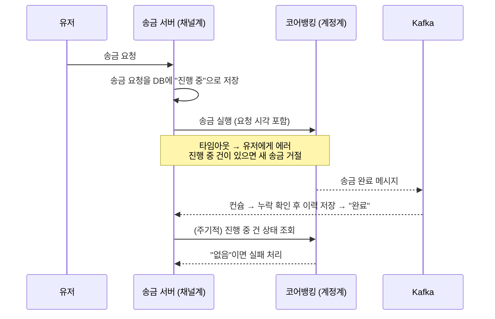
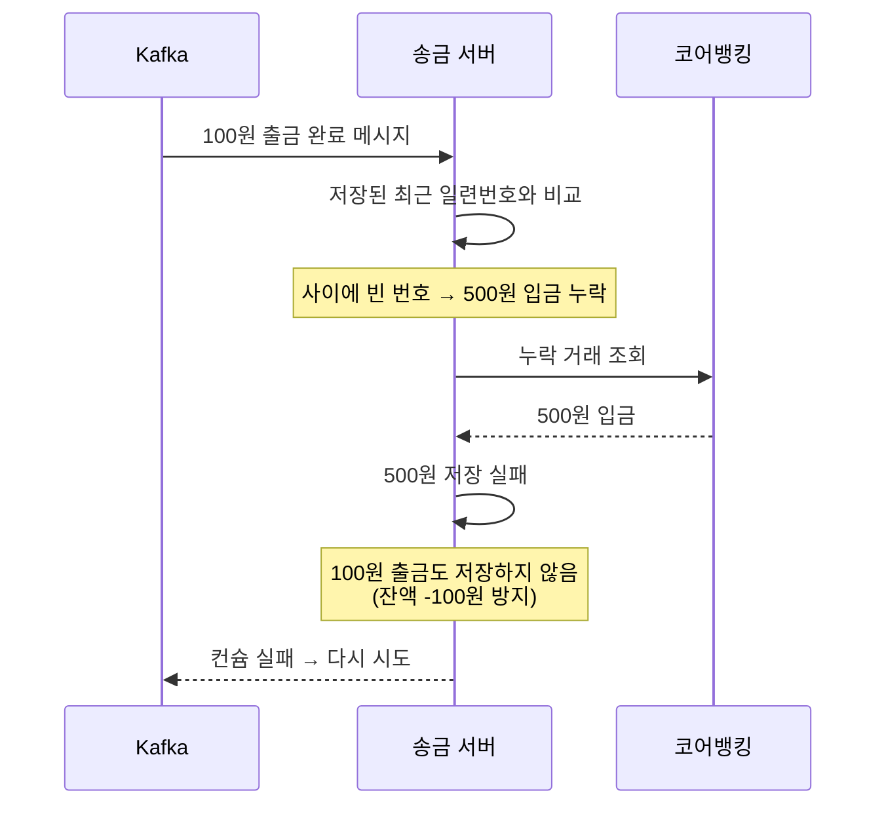

| | |
| --- | --- |
| 발표 | SLASH 22 |
| 연사 | 이응준 (토스뱅크 송금 서버 개발자) |
| 자료 | [발표 영상](https://www.youtube.com/watch?v=v9rcKpUZw4o) · [SLASH 22](https://toss.im/slash-22) |

은행 앱의 거래내역은 왜 기간을 지정해야 하고, 토스뱅크는 왜 트위터처럼 무한스크롤이 되는가. 답은 "채널계 송금 서버가 코어뱅킹에 묻지 않고 거래내역을 직접 반환한다"이다. 발표의 대부분은 그 동기화가 어긋날 수 있는 경우를 하나씩 들고 각각의 방어를 붙이는 데 쓰인다. 타임아웃, 중복 송금, 영원한 지연, 늦게 도착한 요청, 저장 실패, 순서 역전, 처리량, 그리고 최후의 수단. 분산 시스템의 흔한 문제들이 은행 거래내역 하나에서 차례로 나온다. 내용은 발표 영상과 자동 생성 자막을 근거로 했고, 표현은 내 말로 바꿨다.

## 채널계와 계정계

은행 시스템은 채널계와 계정계로 나뉜다. 계정계는 실제로 유저의 돈을 다루고 원본 데이터가 저장되는 영역이라 장애가 치명적이고 아주 높은 신뢰도가 요구된다. 채널계는 유저 요청을 직접 받아 처리하되 돈은 다루지 않고 계정계에 전달한다.

| | 채널계 | 계정계 (코어뱅킹) |
| --- | --- | --- |
| 구성 | 쿠버네티스 위 도메인별 여러 서버, 여러 DB | 서버 하나, DB 하나 |
| 장점 | 부하가 몰리는 서버만 스케일 아웃, DB 분리 가능. 큰 트래픽에 유리 | 네트워크 단순, 트랜잭션 처리 유리 |
| 단점 | 트랜잭션 처리가 어려운 경우 | 부분 스케일 아웃 불가. 급증하는 트래픽에 불리 |

계정계는 오류 없이 동작하는 것이 가장 중요하므로 성능을 희생하더라도 이 구조를 택한다. 거래내역은 은행의 핵심 기록이라 계정계에서 관리하고, 일반적인 은행 앱은 채널계가 요청을 계정계에 전달해 결과를 받는다. 그런데 계정계는 넓은 범위의 조회를 빠른 응답과 적은 부하로 제공하기 어렵다. 그래서 발표자는 UI에서 기본 조회 범위를 수개월로 한정하는 것이 현명한 선택이라고 설명한다.

토스뱅크에는 이 기간 설정이 없다. 거래내역을 조회할 때마다 코어뱅킹에 요청하지 않고 채널계 송금 서버가 직접 반환하기 때문이다. 이렇게 하려면 송금 서버가 항상 코어뱅킹과 거래내역을 정확히 동기화해야 한다. 조금만 어긋나면 누락이 생겨 은행의 신뢰에 타격을 입고, 반대로 너무 자주 동기화하면 코어뱅킹 부하가 커져 장애가 난다.

## 단순한 시작과 여덟 가지 방어

### 시작

유저가 이체할 때마다 송금 서버가 이체 내역을 자기 DB에 저장한다. 그러면 타행 앱으로 토스뱅크에 입금한 것은 조회되지 않는다. 그래서 코어뱅킹이 Kafka 토픽에 메시지를 발행하고 송금 서버가 컨슘해 저장한다. 이제 토스 앱이든 타행 앱이든 모든 거래를 코어뱅킹 호출 없이 볼 수 있다. 다만 이 구조는 모든 것이 이상적으로 돌아갈 때만 맞는다. 아래 그림은 1번부터 4번까지의 방어가 붙은 뒤의 송금 흐름이다.

### 1. 타임아웃

송금 중 코어뱅킹 응답이 늦어 송금 서버가 타임아웃되면 이력을 저장하지 못하고, 송금이 성공했어도 유저는 볼 수 없다. Kafka가 이 문제를 푼다. API는 타임아웃됐어도 송금이 완료되면 코어뱅킹이 토픽으로 결과를 알려주므로 송금 서버가 이력을 저장한다. 유저는 직후엔 에러를 만나지만 최종적으로 거래내역에 성공 건이 보인다. 타임아웃이 실패가 아니라 "결과를 모르는 상태"라는 점은 [ParityPay 3편](/posts/parity-pay-unknown-state/)에서 따로 다뤘다.

### 2. 중복 송금

타임아웃 에러를 본 유저가 실패한 줄 알고 다시 송금할 수 있다. 그래서 송금 서버는 코어뱅킹에 보내기 전에 송금 요청을 먼저 DB에 저장하고, 완료되지 않은 요청이 있는 유저의 새 송금은 거절한다. 완료되어 이력 저장까지 끝나면 그때부터 새 송금을 받는다.

### 3. 영원한 지연

네트워크 문제로 송금 요청이 코어뱅킹에 도달하지 못하면 요청은 영원히 "진행 중"으로 남는다. 2번의 방어 때문에 그 유저는 영원히 송금할 수 없게 된다. 그래서 송금 서버가 주기적으로 코어뱅킹에 상태를 확인한다. 코어뱅킹이 "그런 송금 없음"이라 답하면 전달 실패로 보고 실패 처리한다.

### 4. 늦게 도착한 요청

3번의 방어에도 빈틈이 있다. 희박하지만 상태 조회가 먼저 도착해 "없음"으로 실패 처리한 뒤, 원래 송금 요청이 뒤늦게 도달해 실행될 수 있다. 그러면 성공한 송금을 실패로 처리한 것이 된다. 해법은 송금 서버와 코어뱅킹이 타임아웃 시간을 1분으로 약속하는 것이다. 송금 서버는 요청에 요청 시각을 포함하고, 타임아웃이 지난 뒤 "없음" 응답이 오면 실패 처리한다. 뒤늦게 도착한 요청은 코어뱅킹이 요청 시각을 보고 타임아웃이 지났으면 처리하지 않고 거절한다.

### 5. 저장 실패

Kafka로 완료 메시지를 받아 저장하는 도중 순간적인 DB 장애로 실패하면 그 송금은 유저에게 보이지 않는다. 송금 서버는 잠시 후 메시지를 다시 컨슘해 저장한다. 재시도해도 계속 실패하면 몇 번을 해도 실패하는 상황으로 간주하고 더 재시도하지 않는다. 대신 데드 레터 토픽(재처리를 멈춘 메시지를 따로 모아 두는 토픽)에 저장하고, 개발자가 원인을 해결한 뒤 그 토픽을 다시 컨슘해 저장한다.

### 6. 순서 역전과 누락

500원 입금 후 100원 출금이 있었다. 500원 입금 동기화가 실패하고 100원 출금 동기화가 성공한 뒤, 500원 재동기화가 성공하기 전에 조회하면 유저는 존재하지도 않는 100원이 출금되어 잔액이 -100원인 이상한 화면을 본다.

그래서 완료 메시지를 받으면 그 거래만 동기화하지 않고, 그 이전에 다른 거래가 있는지 코어뱅킹을 조회한다. 모든 거래에는 순서대로 증가하는 일련번호가 있으므로, 송금 서버에 저장된 최근 거래와 메시지로 받은 거래의 일련번호를 비교하면 누락 여부를 알 수 있다. 100원 출금을 동기화할 때 500원 입금 누락을 발견해 먼저 동기화한다. 이때 500원 동기화가 또 실패하면 100원 출금도 동기화하지 않는다. 그래야 순간적으로 -100원이 되는 것을 피한다. 이 컨슘은 실패 처리되어 다시 시도된다. 아래 그림은 500원 재동기화가 다시 실패하는 경우의 순서다.

### 7. 진행 중 건이 있을 때 조회

위 재동기화가 끝나기 전에 유저가 조회하면 입금 500원도 출금 100원도 안 보인다. 입금이 늦게 보이는 건 이해해 줄 수 있어도, 방금 출금 성공 메시지를 봤는데 거래내역에 없으면 유저는 굉장히 당황한다. 송금 서버는 진행 중인 거래를 DB에 저장하고 있으므로, 조회 시 진행 중인 거래가 있으면 그 즉시 계정계와 동기화한다. 100원 출금이 진행 중임을 발견해 동기화하고, 이때 500원 입금도 아직이면 그것을 먼저 동기화한다.

### 8. 처리량

어떤 회사가 전 국민에게 100원씩 주는 이벤트를 해서 100만 명에게 1시간에 걸쳐 입금되면 초당 약 300건이다. 건당 100ms면 초당 10건이라 점점 밀리고, 1시간 뒤 100만 건이 밀려 28시간이 걸린다. 그동안 다른 입금도 안 보인다.

Kafka는 토픽을 파티션으로 나눠 여러 컨슈머가 처리하게 한다. 계좌번호를 키로 하면 같은 계좌의 거래는 같은 파티션·같은 컨슈머로 가서 동시성 문제를 막는다. Kafka 문서도 같은 키의 이벤트는 같은 파티션에 쓰인다고 설명한다([Kafka Introduction](https://kafka.apache.org/39/getting-started/introduction/)). 파티션 30개면 초당 300건은 충분하다.

하지만 유저가 계속 늘면 파티션을 무한정 늘릴 수는 없다. 늘리는 데 시간이 걸려 그사이 지연이 생기고, 피크 기준으로 넉넉히 잡으면 자원을 차지한다. 게다가 한번 늘린 파티션은 줄일 수 없다. Kafka 운영 문서도 토픽의 파티션 수를 줄이는 기능은 현재 지원하지 않는다고 적는다([Kafka Operations](https://kafka.apache.org/39/operations/basic-kafka-operations/)).

그래서 파티션은 적당히 유지하고 컨슈머별 워커 스레드를 충분히 둔다. 파티션 10개 × 워커 100개 = 1,000 스레드로 초당 1만 건이 된다. 그런데 워커들이 같은 계좌를 동시에 동기화하면 이미 끝난 거래를 재동기화하는 등 코어뱅킹에 불필요한 트래픽이 생긴다. 그래서 Kafka 파티션과 같은 요령으로 계좌번호 기준으로 워커 스레드를 선택해, 같은 계좌는 항상 같은 스레드가 처리하게 한다.

### 최후의 수단

모든 방어에도 예상치 못한 문제로 동기화가 안 되는 상황을 유저가 만날 수 있다. 거래내역이 최신이 아닌 것 같다고 느끼면 불러오기 버튼을 눌러 즉시 최신화할 수 있다.

## 리뷰

나는 이 발표를 CQRS의 읽기 모델을 은행에서 운영할 때 생기는 문제 목록으로 읽는다. [CQRS](/posts/event-sourcing-and-cqrs/)는 정보를 갱신하는 모델과 읽는 모델을 따로 두는 패턴이다([Martin Fowler, CQRS](https://martinfowler.com/bliki/CQRS.html)). 여기서는 계정계가 쓰기 모델, 송금 서버 DB가 읽기 모델, Kafka가 이벤트 전파에 해당한다. 흔히 "이벤트로 동기화하면 된다"에서 멈추는 설명을 이 발표는 여덟 단계 더 밀고 간다. 특히 6번(일련번호로 누락 감지)과 7번(조회 시점에 진행 중 건을 강제 동기화)은 [최종 일관성](/posts/consistency-models/)의 틈이 유저에게 "-100원"으로 보이지 않게 하는 장치다.

2·3·4번은 [멱등성](/posts/idempotency-key-design/)과 [정확히 한 번 처리](/posts/kafka-delivery-guarantees/)를 다루는 일반적인 방법과 같은 구조다. 요청을 먼저 기록해 중복을 막고, 주기적 조회로 유실을 잡고, 요청 시각과 약속된 타임아웃으로 늦은 도착을 거절한다. 4번은 양쪽이 같은 타임아웃 값을 약속해야 성립한다. 1년 뒤 [토스뱅크 코어뱅킹 MSA 전환](/posts/slash23-core-banking-msa/) 발표가 계정계 자체를 바꾸는 이야기라면, 이 발표는 계정계를 건드리지 않고 채널계에서 할 수 있는 것의 상한을 보여준다.

"파티션은 줄일 수 없다"에서 워커 스레드로 간 판단은 실용적이다. 파티션 수를 처리량의 유일한 손잡이로 쓰는 대신, 컨슈머 안에서 키 기반 스레드 라우팅으로 두 번째 손잡이를 만들었다. 같은 발표자의 [테스트 커버리지 100%](/posts/slash21-test-coverage-100/)와 마찬가지로, 문제를 끝까지 나열하고 각각에 답을 붙이는 방식이 일관된다.

## 남는 질문

- 워커 스레드를 계좌번호로 고정하면 특정 계좌(법인, 이벤트 계좌)에 거래가 몰릴 때 그 스레드만 밀린다. [핫 키](/posts/ordering-versus-isolation/) 대응은 어떻게 하는지.
- 일련번호로 누락을 감지한다면 코어뱅킹의 일련번호가 계좌별로 연속이어야 한다. 취소·정정 거래가 번호를 소비하는 경우는 어떻게 처리하는지.
- 진행 중 건이 있을 때 조회 시 강제 동기화는 코어뱅킹 호출이다. 유저가 새로고침을 반복하면 부하가 되는데 호출 간격 제한이 있는지.
- 불러오기 버튼이 실제로 눌린 빈도. 방어가 잘 되고 있다면 거의 0이어야 한다.

## 참고

- [발표 영상](https://www.youtube.com/watch?v=v9rcKpUZw4o)
- [SLASH 22](https://toss.im/slash-22)
- [Apache Kafka - Introduction](https://kafka.apache.org/39/getting-started/introduction/)
- [Apache Kafka - Basic Kafka Operations](https://kafka.apache.org/39/operations/basic-kafka-operations/)
- [Martin Fowler - CQRS](https://martinfowler.com/bliki/CQRS.html)
- 계정계 쪽 이야기: [SLASH 23 토스뱅크 코어뱅킹 MSA 전환 리뷰](/posts/slash23-core-banking-msa/)
