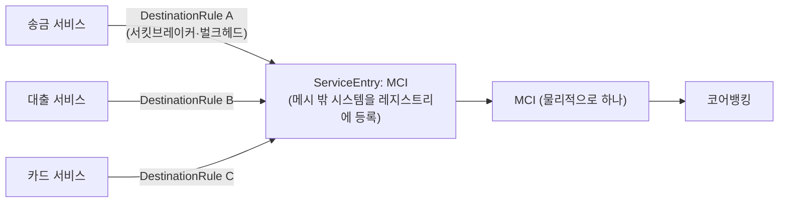
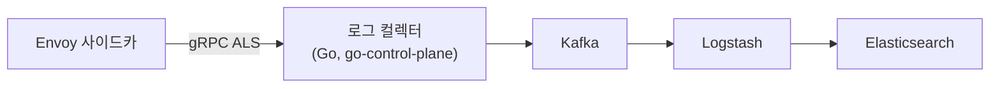

| | |
| --- | --- |
| 발표 | SLASH 22 |
| 연사 | 김동진, 하성준 (토스뱅크 DevOps Engineer) |
| 자료 | [발표 영상](https://www.youtube.com/watch?v=ftFHZwyUN38) · [SLASH 22](https://toss.im/slash-22) |

2021년 10월 출범한 토스뱅크가 채널계에 Istio를 어떻게 쓰고 어떻게 운영하는지 두 사람이 나눠 발표한다. 앞부분은 활용 방안(카나리 배포, EnvoyFilter로 접근 제어와 인증 위임, ServiceEntry + DestinationRule로 코어뱅킹 MCI 호출을 도메인별 벌크헤드로 격리), 뒷부분은 운영 노하우(hostPort 인그레스 게이트웨이, 이그레스 게이트웨이, Mixer 없는 메트릭·로그 수집, gRPC Access Log Service, 배치 애플리케이션의 좀비 사이드카, istiod 튜닝)다. 내용은 발표 영상과 자동 생성 자막을 근거로 했고, 표현은 내 말로 바꿨다.

## 왜 Istio인가

토스뱅크 시스템은 채널계와 계정계로 나뉜다. 채널계는 토스의 경험을 바탕으로 모든 서비스가 컨테이너화되어 쿠버네티스 위에서 운영되지만, 계정계는 기존 금융권처럼 거대한 모놀리식 솔루션에 금융 비즈니스 로직이 집중된 구조로 시작했다. 계정계는 성능과 운영 관점에서 불안정했다. 솔루션 의존성 때문에 다양한 배포 전략과 운영 자동화가 힘들었고, 배포 중 휴먼 에러, 특정 서비스 장애가 전체에 영향을 주는 경우, 가용성 부족으로 인한 장애까지 토스뱅크 내부에서 통제하기 힘든 장애가 있었다. 그래서 채널계와 계정계의 경계를 최대한 허물고 신규 금융 로직은 자체 구축하며 계정계 서비스도 컨테이너화해 인프라 의존성이 없는 클라우드 네이티브 환경을 만들고 있다.

그 위에 DC 액티브-액티브(장애뿐 아니라 인프라 작업 때 트래픽을 빠르게 옮김), 모놀리식을 MSA로 나눠 장애 도메인 분리와 독립 배포·스케일 아웃, ELK·Prometheus·Grafana·Thanos·Pinpoint 실시간 모니터링이 있다. MSA로 가면서 한 요청에 많은 내부 호출이 불가피해졌고 그 네트워크 처리를 위해 Istio를 도입했다. 선택 이유는 서킷브레이커·재시도 같은 네트워크 로직을 애플리케이션에서 인프라로 옮길 수 있다는 것, 그리고 수많은 내부 호출에서 중앙집중식 처리의 한계를 넘어 클라이언트 사이드 로드밸런싱을 구현할 수 있다는 것이다.

## 활용 1: 카나리 배포

쿠버네티스 네이티브 롤링 업데이트를 그대로 쓰면 많은 트래픽을 받는 상황에서 가용성을 유지하며 완전히 graceful하게 배포하기 힘들다고 판단했다. 새 버전을 배포한 뒤 Istio로 트래픽을 점진적으로 옮기는 카나리 전략을 택했다. 자체 개발 내부 시스템과 GoCD로 워크로드를 배포하고, 그 시스템이 Istio 컴포넌트 설정 값을 바꿔 블루그린·카나리를 지원한다. 계정계 일부 서비스와 계정계-채널계를 잇는 MCI 시스템도 쿠버네티스 위에서 돌도록 바꾸는 중이다. 솔루션이 배포하는 계정계는 카나리, 빠른 롤백처럼 장애가 나기 가장 쉬운 부분에 대한 전략을 세우기 힘든 구조였다.

## 활용 2: EnvoyFilter로 접근 제어와 인증

Istio는 Pod에 Istio 프록시(Envoy)를 사이드카로 배포하고 iptables로 들어오고 나가는 트래픽을 관리한다. Envoy는 API로 동적 설정을 지원하고 Istio는 `EnvoyFilter` 객체로 그 설정을 바꿀 수 있다. 토스뱅크는 L4 방화벽으로는 쿠버네티스 위 서비스의 IP 기반 접근 제어가 쉽지 않아 EnvoyFilter로 접근 제어를 하고, 내부망 도메인 노출 차단(경로 기반), path traversal 같은 공격 차단도 EnvoyFilter로 한다.

인증도 위임한다. 오픈소스를 많이 쓰는데 인증이 빠져 있거나 사내 LDAP 연동이 안 되는 경우가 있다. 애플리케이션이 아니라 Istio가 인증을 처리하도록 **앰배서더 패턴**으로 인증 서비스를 띄우고, Istio 프록시로 들어오는 트래픽을 EnvoyFilter의 external authorization으로 인증 토큰을 검증하게 해서 애플리케이션 변경 없이 인증을 강제한다.

## 활용 3: 코어뱅킹 MCI 호출을 도메인별로 격리

채널계가 클라이언트 요청을 계정계로 전달할 때 MCI를 거친다. 채널계 마이크로서비스 하나의 지연·장애가 MCI에 영향을 주면 계정계를 호출하는 **모든** 마이크로서비스가 영향을 받는다. 물리적으로 MCI 서버와 앞단 LB를 도메인별로 나누면 좋겠지만 변경마다 물리 작업이 따르고 빠르게 성장하는 토스뱅크에서 동적으로 바꾸기 힘들며 계정계 파이프라인이 복잡해진다. 그래서 **호출하는 쪽인 채널계에서** 풀었다.

쿠버네티스 밖의 계정계를 `ServiceEntry`로 Istio 서비스 레지스트리에 등록하고, `DestinationRule`의 서킷브레이커·벌크헤드 설정으로 도메인별 MCI 호출을 격리한다. 클라이언트 사이드에서 같은 MCI를 바라보지만 다른 도메인을 통해 독립적인 벌크헤드가 적용되어, 물리 작업 없이 장애 여파를 줄였다.

## 운영 1: 인그레스는 hostPort로

쿠버네티스 안의 Pod를 외부에 노출하려면 NodePort 서비스를 쓰지만 경로·헤더 기반 L7 라우팅과 SSL 종료가 필요해 대부분 앞단에 인그레스 게이트웨이를 두고 NodePort로 노출한다. 토스뱅크는 앞단에 HAProxy를 두고 업스트림으로 Envoy 기반 인그레스 게이트웨이를 등록한다. 대고객 API와 내부 서비스가 같은 인그레스로 들어오면 장애 도메인이 분리되지 않는다(이미지 레지스트리에서 큰 이미지를 받는 트래픽이 대고객 서비스에 영향을 줄 수 있다). 그래서 **트래픽 특성에 맞게 인그레스 게이트웨이 자체를 분리**한다.

토스뱅크 쿠버네티스는 IPVS 모드라 NodePort로 오는 트래픽은 L4 기반 로드밸런서인 IPVS를 거친다. 네트워크 홉을 줄이고 최대 성능을 내기 위해 NodePort 대신 **hostPort**로 컨테이너 포트를 호스트 포트에 직접 연결해 IPVS를 거치지 않게 했다. NodePort의 장점은 Pod가 어느 노드에 있든 고정 포트로 받는다는 것인데, hostPort는 그 Pod가 떠 있는 노드로 항상 트래픽을 보내야 한다. 인그레스 게이트웨이의 replica와 nodeSelector용 라벨, affinity로 모든 인그레스가 노드당 한 대씩 뜨게 하고 HAProxy 업스트림에 그 노드의 포트를 등록했다. 단점은 인그레스 증설·축소 때 노드 라벨링과 HAProxy 업스트림 수정이 따른다는 것이다.

## 운영 2: 이그레스와 예외

Istio가 관리하는 Pod의 트래픽은 모두 사이드카 Envoy로 리다이렉트되므로 나가는 트래픽도 제어된다. 다른 쿠버네티스 클러스터와는 mTLS로 통신하는데, 각 서비스가 별다른 작업을 하지 않도록 다른 클러스터로 가는 트래픽을 모두 이그레스 게이트웨이로 보내고 mTLS에 필요한 과정을 이그레스에 위임한다. 계정계 MCI로 가는 트래픽도 이그레스로 제어한다. DB, Kafka, ZooKeeper, Redis 등 쿠버네티스 밖 자원도 많이 쓰는데, 이런 통신은 L4 기반 제어의 영향을 최대한 받지 않도록 `excludeOutboundPorts`로 자주 쓰는 특정 포트는 Envoy를 타지 않고 직접 통신하게 했다. 이그레스로 제어되어야 하는 통신은 목적지 IP를 `includeOutboundIPRanges`에 추가해 Istio 제어권을 되돌렸다.

## 운영 3: Mixer 없는 메트릭과 로그

기존 Istio 로그·메트릭 수집은 Mixer라는 중앙 오브젝트가 담당했는데 1.5부터 기본이 Mixerless로 바뀌고 1.8부터 deprecated됐다. 새 수집 구조가 필요했다.

**메트릭**은 Prometheus가 모든 Envoy 파드에 직접 붙어 수집하는 방식으로 바꿨다. Prometheus Operator의 PodMonitor·ServiceMonitor 커스텀 리소스로 쉽게 처리하고, Pod 라벨 기반으로 배포하면 수집 대상이 동적으로 구성된다.

**Envoy 액세스 로그**는 처음에 Istio Operator의 meshConfig로 stdout에 쌓고 stdout을 호스트 볼륨에 연결해 각 노드의 Filebeat가 읽게 했다. 그런데 예상치 못하게 트래픽이 많이 들어와 로그가 많이 쌓이면 노드 디스크 I/O에 부하를 주고 노드 장애로 서비스에 영향을 줄 수 있는 잠재 위험이 있다고 판단했다. 그래서 Envoy의 **gRPC Access Log Service(ALS)**를 쓰기로 했다. 디스크 쓰기 대신 네트워크로 로그를 보낸다.

Envoy가 송출하는 gRPC 호출을 받아 로그를 가공하는 컬렉터를 Go로 개발했고(Envoy의 go-control-plane 이용), Kafka → Logstash → Elasticsearch 파이프라인을 구성했다. 공식 문서에는 meshConfig로 ALS를 설정할 수 있다고 나오지만, 사용 중인 버전 기준으로 **운영 중에 그 옵션을 켜면 문제가 생겼다.** 그 옵션은 Envoy 필터 체인에 gRPC로 로그를 전달하는 부분을 추가하는데, meshConfig를 쓰면 Envoy 네이티브 gRPC 클라이언트가 자동 적용되고 이 클라이언트 특성상 로그를 받는 서버가 static cluster로 등록되어야 하는데 그 부분이 함께 들어가지 않아, 운영 중 Envoy 설정이 업데이트되는 순간 대상 클러스터를 찾지 못해 **모든 Envoy 사이드카가 죽는** 현상이 났다. 그래서 meshConfig 대신 EnvoyFilter 커스텀 리소스로 설정을 직접 넣었다.

## 운영 4: 배치의 좀비 사이드카

토스뱅크 서비스는 API, 컨슈머, 배치 세 타입이다. API와 컨슈머는 Deployment라 종료 시그널 전까지 계속 돌아 문제가 없다. 배치는 특정 로직을 수행하고 종료돼야 하는데, 배치가 끝나도 사이드카 Envoy는 종료되지 않아 Pod가 좀비처럼 남는다. 스크립트를 담은 볼륨을 마운트하고 컨테이너의 command와 args로 그 스크립트를 대신 실행하게 했다. 스크립트는 Envoy가 정상적으로 뜰 때까지 대기한 뒤 실제 명령(Java 애플리케이션)을 실행하고, 종료 전에 Envoy의 `/quitquitquit`을 호출해 Envoy를 종료하며, 쿠버네티스가 exit code로 성공 여부를 판단하므로 애플리케이션의 exit code로 스크립트를 종료한다.

## 운영 5: istiod 튜닝

istiod는 컨트롤 플레인으로 메시의 Envoy들에게 변하는 라우팅 정보를 푸시한다. 대표적으로 셋을 조정한다. `PILOT_PUSH_THROTTLE`은 istiod가 한 번에 내보낼 수 있는 푸시 양, `PILOT_DEBOUNCE_MAX`는 푸시 주기(너무 잦으면 푸시 트래픽이 많아진다), `GOMAXPROCS`는 istiod 특화 옵션은 아니지만 Go로 개발됐으므로 할당된 CPU에 맞춰 세팅하는 것이 좋다.

## 리뷰

**MCI 벌크헤드가 이 발표의 가장 은행다운 부분이다.** 계정계는 건드릴 수 없고 물리 분리는 느리다. 그래서 메시 밖 시스템을 ServiceEntry로 메시 안으로 끌어들여 호출자 쪽에서 격리한다. 서비스 메시의 "클라이언트 사이드 제어"가 레거시와 공존할 때 어떤 가치를 갖는지 보여주는 예이고, 같은 문제를 1년 뒤 [토스뱅크 대외연계 시스템](/posts/slash23-bank-external-linkage/)이 애플리케이션 레벨에서 다시 다룬다.

**운영 파트는 Istio 문서에 없는 것들의 목록이다.** hostPort로 IPVS를 우회한 것, ALS를 meshConfig로 켜면 사이드카가 전부 죽는 것, 배치 Pod의 좀비 사이드카. 세 가지 모두 "문서대로 했는데 프로덕션에서 다르게 동작한 것"이고, 특히 ALS 사례는 컨트롤 플레인 설정 하나가 데이터 플레인 전체를 죽일 수 있다는 서비스 메시의 근본 리스크를 보여준다. 이 사례 하나만으로도 [SLASH 21 쿠버네티스 운영 발표](/posts/slash21-safe-kubernetes-operations/)에서 OPA로 Istio 컨트롤 플레인 삭제를 막은 이유가 이해된다.

**같은 시기 토스 본체의 [서버 스택 발표](/posts/slash21-toss-server-stack/)가 "Istio의 서킷브레이커·재시도는 결국 애플리케이션에 남았다"고 한 것과 비교하면 흥미롭다.** 토스뱅크는 도메인별 벌크헤드에 DestinationRule을 실제로 썼다. 대상이 내부 마이크로서비스가 아니라 단일 MCI였기 때문에 호스트별 설정이라는 한계가 오히려 맞았다.

## 남는 질문

- hostPort 방식에서 노드 장애 시 HAProxy 업스트림에서 자동으로 빠지는지, 헬스 체크 주기는 얼마인지.
- ALS 컬렉터가 죽으면 Envoy는 로그를 버리는지 버퍼링하는지. 로그 유실이 감사 요건에 걸리지 않는지.
- 인증을 EnvoyFilter로 위임한 오픈소스 서비스는 어떤 것들인지(Grafana, Kibana 같은 운영 도구인지 고객 트래픽 경로인지).
- 배치의 좀비 사이드카 문제는 이후 쿠버네티스 네이티브 사이드카 컨테이너(1.28+)로 해결됐을 텐데 전환했는지.

## 참고

- [발표 영상](https://www.youtube.com/watch?v=ftFHZwyUN38)
- [SLASH 22](https://toss.im/slash-22)
- [Envoy gRPC Access Log Service](https://www.envoyproxy.io/docs/envoy/latest/api-v3/extensions/access_loggers/grpc/v3/als.proto)
- [Istio ServiceEntry](https://istio.io/latest/docs/reference/config/networking/service-entry/)
