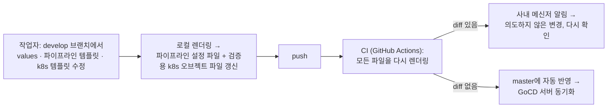

| | |
| --- | --- |
| 발표 | SLASH 23 |
| 연사 | 김동석 (토스뱅크 DevOps Engineer) |
| 자료 | [발표 영상](https://www.youtube.com/watch?v=SRLeXvA-o-U) · [SLASH 23](https://toss.im/slash-23) |

토스뱅크의 GoCD 파이프라인이 400개를 넘고 매년 두 배로 늘어나는 상황에서 가시성·생산성·확장성·복잡성 네 가지 어려움을 하나씩 어떻게 풀었는지 설명하는 발표다. 답은 Pipeline as Code(YAML), Helm 템플릿, 그리고 "다시 렌더링해서 diff가 나면 의도하지 않은 변경"이라는 CI 검증이다. 파이프라인 설정뿐 아니라 쿠버네티스 오브젝트 템플릿에도 같은 검증을 적용했다. 내용은 발표 영상과 자동 생성 자막을 근거로 했고, 표현은 내 말로 바꿨다.

## 배경: 파이프라인 설정을 중앙화한 이유

토스뱅크 DevOps 엔지니어는 서버 플랫폼팀 소속이고, 팀의 목표는 생산성·안정성·보안·컴플라이언스다. 파이프라인은 반복 작업을 자동화하는 시스템으로 빌드·배포가 대표적이지만 라이브러리 업로드나 운영 작업 자동화에도 쓴다. 동료 개발자가 일상적으로 가장 많이 쓰는 시스템 중 하나다.

플랫폼팀 관점에서 생산성은 파이프라인을 빠르게 만들고 수정할 수 있어야 한다는 것, 안정성은 예상대로 동작해야 한다는 것이다. **컴플라이언스**는 조금 낯설 수 있는데, 금융권은 전자금융감독규정이 적용되어 배포 시 상호 검증 같은 절차를 파이프라인에서 준수해야 하고, 그 기능을 "적용할 수 있는 것"으로는 부족하고 **반드시 적용되어 있음을 보장**해야 한다. 그래서 파이프라인 설정을 중앙화하는 것이 효율적이라 판단했고, 여러 스쿼드가 쓰는 파이프라인 설정을 한 곳에 모아 DevOps 엔지니어가 주도적으로 운영한다.

도구는 GoCD다. 정의된 파이프라인에 따라 서버가 에이전트에게 작업을 할당해 실행하는 구조로 Jenkins와 비슷하다. 파이프라인이 적을 때는 웹 UI의 위자드로 만들고 수정해도 큰 어려움이 없었지만, 개수가 늘면서 네 가지 어려움이 생겼다.

## 어려움 1: 가시성 → Pipeline as Code

서비스 빌드·배포 281개, 작업 자동화 76개, 기타 47개, 도합 400개가 넘는다. 웹 UI에서는 어떤 파이프라인이 있는지 확인하는 것부터 쉽지 않고(한 화면에 보이는 수가 적다), 파이프라인 하나의 설정도 단계마다 페이지를 오가며 봐야 하고, 서로 다른 파이프라인을 비교하기도 어렵다. 가장 큰 문제는 **설정이 어떻게 변했는지 알 수 없다**는 것이다. 배포 방식이 바뀌고 컴플라이언스 요건이 바뀌는데 웹 UI는 지금의 설정만 보여준다.

GoCD YAML Config 플러그인으로 파이프라인 설정을 YAML 파일로 작성해 Git에 저장하고 GoCD 서버와 연동했다. 수백 개 파이프라인을 한 폴더에서 보고, 여러 단계로 된 설정을 한 파일에서 보며, Git 버전 관리로 언제 어떻게 바뀌었는지 확인한다. 웹 UI에서 실행하고 결과를 보는 것은 그대로다.

## 어려움 2: 생산성 → 템플릿

파이프라인 수를 6개월 간격으로 집계하니 1년에 두 배 이상 늘었다. MSA를 적극 활용해 새 파이프라인을 자주 만드는데, 기술 스택과 구조가 비슷해 기존 설정을 복사·붙여넣기하는 경우가 많다. 이때 잘못 붙여넣거나 바꿔야 할 부분을 빼먹는 실수가 쉽고, 모든 파이프라인의 공통 변경이 있을 때 모든 파일을 수정하면서도 실수하기 쉽다.

GoCD 템플릿으로 동작을 추상화해 여러 파이프라인이 공유하게 했다. 공통 설정은 템플릿 지정 한 줄로 대체되고 다른 설정은 변수로 주입한다. 공통 변경은 템플릿에서 바꾸면 모두에게 적용된다.

## 어려움 3: 확장성 → Helm 템플릿

파이프라인 설정은 Git에서, 템플릿 설정은 GoCD 웹 UI에서 봐야 해서 둘을 비교하며 템플릿을 수정하는 것이 불편했다. 그리고 템플릿을 수정하면 그것을 쓰는 모든 파이프라인에 한 번에 적용되어 실수의 영향이 굉장히 크다. 결과적으로 설정을 유연하게 바꾸기 어려웠다.

**Helm 템플릿**을 파이프라인 설정의 템플릿 도구로 썼다. 공통 부분을 템플릿으로, 고유 부분을 values에 정의해 렌더링한다. 조건문·반복문·변수를 지원해 복잡한 내용도 표현할 수 있고 YAML을 잘 지원해 GoCD YAML 플러그인과 잘 어울린다. GoCD 템플릿을 대체할 뿐 아니라 더 추상적인 부분도 템플릿화할 수 있다. Helm 템플릿을 파이프라인 설정과 같은 Git 저장소에 두면 둘을 한 번에 수정하고, **조건문으로 템플릿 변경을 일부 파이프라인에서만 테스트**할 수 있다. 테스트용 파이프라인에서 충분히 검증하고 전체에 적용하면서 템플릿 실수가 전체에 영향을 주는 일이 많이 줄었고 부담 없이 수정하게 됐다. 호환성 이점도 있다. GoCD 템플릿은 GoCD에서만 쓰지만 Helm values 파일은 GoCD와 무관한 추상적 설정이라 다른 파이프라인 도구로 옮겨도 템플릿만 새로 쓰면 values는 재사용할 수 있다.

## 어려움 4: 복잡성 → 렌더링 diff CI

시간이 지나며 템플릿은 복잡해진다. 지금 파이프라인 설정은 5가지 타입, 72개 설정값, 템플릿 파일 합계 1,182줄이다. 복잡할수록 실수로 의도하지 않은 변경을 만들기 쉽고, Helm 템플릿 문법은 일반 프로그래밍 언어만큼 직관적이지 않아 더 그렇다. 템플릿을 잘못 고쳐 배포가 안 되거나 잘못된 배포가 되는 일이 종종 있었다.

CI를 도입했다. 템플릿 수정은 develop 브랜치에서만 하고 검증을 통과했을 때만 master에 반영한다. 도구는 GitHub Actions. 검증은 **develop에 푸시되면 모든 파이프라인 설정 파일을 다시 렌더링하는 것**이다. 의도한 변경은 이미 이전에 렌더링한 설정 파일에 반영되어 있을 것이고, 다시 렌더링할 때 생기는 차이는 의도하지 않았을 확률이 높다. 차이가 생기면 사내 메신저로 알림을 보내 작업자가 다시 확인한다.

**쿠버네티스 오브젝트에도 같은 검증.** 토스뱅크 채널계 서비스는 쿠버네티스에서 운영하고 배포할 때 Helm 템플릿으로 오브젝트를 배포한다. 7가지 오브젝트, 110개 설정값, 762줄로 파이프라인만큼 복잡해 같은 문제가 있었다. 그런데 파이프라인 설정과 다른 점이 있다. 렌더링 결과를 쿠버네티스에 배포할 뿐 **Git에 저장하지 않아** 변경 전후 비교 대상이 없다. 그래서 배포 때와 같은 방식으로 렌더링한 오브젝트 파일을 **검증용으로 Git에 저장**하기로 했다. CI에서 모든 검증용 오브젝트 파일을 다시 렌더링하고, 차이가 생기면 알림을 보낸다. 파이프라인 설정 파일과 검증용 오브젝트 파일 모두 차이가 없으면 master에 반영하고, 이후 실행되는 파이프라인과 배포되는 오브젝트는 검증을 거친 새 설정을 쓴다.

## 정리

파이프라인은 400개가 넘고 매년 두 배로 는다. 설정은 복잡하고 자주 변한다. GoCD YAML Config 플러그인, Helm 템플릿, CI를 활용했다. 이 방법은 GoCD가 아니어도 Pipeline as Code를 지원하는 도구(Jenkins, GitHub Actions, Spinnaker)라면 적용할 수 있다. Pipeline as Code는 보통 "버전 관리되는 파이프라인"까지를 뜻하는데, 여기에 Helm 템플릿으로 **프로그래머블**한 특성을, CI로 **테스터블**한 특성을 더하면 정말 코드처럼 유연하고 안전하게 운영할 수 있다.

## 리뷰

**"다시 렌더링해서 diff가 나면 의도하지 않은 변경"이라는 검증 방식이 이 발표의 발명이다.** 템플릿 언어에 단위 테스트를 붙이는 대신, 렌더링 결과물을 Git에 커밋해 두고 CI가 다시 렌더링해 비교한다. 스냅샷 테스트를 인프라 설정에 적용한 것이고, 템플릿 문법이 어떻든 도구가 무엇이든 통한다. 쿠버네티스 오브젝트처럼 원래 저장하지 않던 산출물을 "검증용으로" 커밋하기로 한 결정이 핵심이다.

**네 어려움의 순서가 자연스럽다.** 코드로 옮기니(가시성) 복사·붙여넣기가 문제가 되고(생산성), 템플릿을 만드니 템플릿 변경이 무서워지고(확장성), 템플릿이 커지니 실수가 늘어난다(복잡성). 각 해법이 다음 문제를 만들고, 그것을 다음 해법이 푼다. 자동화의 성숙 단계를 그대로 보여준다.

**컴플라이언스가 중앙화의 근거로 제시된 점이 금융권답다.** 상호 검증 같은 절차가 "모든 파이프라인에 반드시 있음"을 보장하려면 스쿼드가 각자 만드는 구조로는 안 된다. 같은 발표자가 2년 뒤 [작지만 강한 DevOps 팀 운영하기](/posts/tmc25-small-devops-team/)에서 이 중앙화 구조를 어떻게 유지했는지 이어진다.

## 남는 질문

- 렌더링 diff 검증은 "이전 렌더링 결과가 맞다"를 전제한다. 처음부터 잘못 렌더링된 파일은 어떻게 잡는지. 검증용 k8s 오브젝트와 실제 클러스터 상태의 드리프트는 별도로 보는지.
- 400개 파이프라인의 values 파일을 전부 렌더링하는 CI 시간은 얼마인지.
- Helm 조건문으로 일부 파이프라인에서만 테스트한다면, 그 조건 자체가 템플릿을 복잡하게 만든다. 테스트가 끝난 뒤 조건문을 정리하는 규칙이 있는지.
- 스쿼드 개발자가 자기 서비스의 values 파일을 직접 수정하는지, DevOps에 요청하는지. 중앙화와 셀프서비스의 경계는 어디인지.

## 참고

- [발표 영상](https://www.youtube.com/watch?v=SRLeXvA-o-U)
- [SLASH 23](https://toss.im/slash-23)
- [GoCD YAML Config Plugin](https://github.com/tomzo/gocd-yaml-config-plugin)
- [Helm Template](https://helm.sh/docs/chart_template_guide/)
