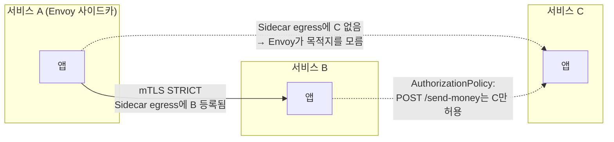

| | |
| --- | --- |
| 발표 | SLASH 23 |
| 연사 | 성준영, 한경수 (토스 DevOps Engineer) |
| 자료 | [발표 영상](https://www.youtube.com/watch?v=4sJd6PIkP_s) · [SLASH 23](https://toss.im/slash-23) |

"내부망에 있어도 믿지 않는다"는 Zero Trust를 토스가 Istio로 어떻게 구현했는지 두 사람이 나눠 발표한다. 앞부분은 쿠버네티스 클러스터 안의 마이크로서비스 간 통신(STRICT mTLS, Sidecar 리소스로 아웃바운드 화이트리스트, AuthorizationPolicy로 인바운드 제한, 무중단 마이그레이션, GitOps 관리), 뒷부분은 클러스터 밖(개발자 인증서, 계열사 간 mTLS, 마이데이터 외부사 통신)과 그 과정의 이슈(PROXY protocol, GSLB 위임, max connection duration)다. 내용은 발표 영상과 자동 생성 자막을 근거로 했고, 표현은 내 말로 바꿨다.

## Zero Trust의 구성 요소와 토스의 대응

Zero Trust는 유저나 기기가 신뢰할 수 있는 내부망에 있더라도 절대 믿지 않는 원칙이다. 기본적으로 신뢰하지 않고 올바른 권한을 가진 요청인지 검증한다. 달성하려면 트래픽을 가로채도 내용을 볼 수 없도록 **네트워크 암호화**, 인증된 사용자가 무엇을 할 수 있는지 정하는 **접근 정책과 제어**, 부인 방지를 위한 **로깅**과 권한을 넘어선 행위의 **모니터링**이 필요하다.

| 요소 | 토스의 구현 |
| --- | --- |
| 암호화 | mTLS. TLS 핸드셰이크에 클라이언트 인증서 검사가 추가되어 서버와 클라이언트가 서로 검증. 암호화되지 않은 요청과 신뢰할 수 없는 클라이언트 인증서의 요청 모두 거부되므로 자연스럽게 접근 제어가 된다 |
| 접근 정책 | Istio의 PeerAuthentication, Sidecar, AuthorizationPolicy |
| 로깅·모니터링 | Envoy 액세스 로그와 메트릭, 이상 접근 알림 |

## 클러스터 내부

쿠버네티스 기본 설정은 모든 Pod가 네임스페이스와 무관하게 서로 통신할 수 있다. 악의적 사용자가 게이트웨이를 우회해 노드에 접근하면 비인가 정보가 포함된 API를 호출하거나 노드의 트래픽을 캡처할 수 있다.

**1. PeerAuthentication STRICT.** 토스 클러스터에 배포되는 모든 서비스는 기본적으로 mTLS 모드가 STRICT다. TLS가 적용되지 않은 요청을 거부하므로 서비스 간 트래픽은 모두 암호화된다. 노드에 침투해 가로채도 내용을 볼 수 없고, API를 호출하려 해도 상호 인증이 안 되어 실패한다.

**2. Sidecar 리소스로 아웃바운드 화이트리스트.** mTLS만으로는 메시 안의 서비스끼리는 여전히 모두 통신할 수 있다. 어떤 서비스가 어떤 서비스를 호출할 수 있는지 인가 정책이 필요하다. 신규 서비스를 생성하면 실행에 필요한 플랫폼 컴포넌트(Cloud Config 등)만 호출할 수 있고 메시 안의 어떤 서비스도 호출할 수 없다. `Sidecar` 리소스가 바인딩되어 있기 때문이다. Istio는 기본적으로 모든 워크로드의 Envoy에 도달 가능한 모든 서비스를 등록하지만, egress 스펙을 가진 Sidecar가 바인딩되면 그 워크로드에는 egress hosts에 해당하는 서비스만 등록한다. 등록되지 않은 서비스를 호출하면 Envoy 입장에서는 메시에 없는 서비스라 어디로 보낼지 모르고, 도메인이 리졸빙되어 클러스터 안으로 다시 들어와도 mTLS가 적용되지 않은 트래픽이라 실패한다. 다른 서비스를 호출하려면 egress hosts에 등록해야 한다. 덤으로 Envoy에 타겟 서비스 설정을 주지 않으니 istiod의 전파 부하가 줄어 사이드카와 istiod의 리소스 절감 효과도 있었다.

**3. AuthorizationPolicy로 인바운드 제한.** 어떤 서비스는 클라이언트와 무관하게 주체적으로 HTTP 메서드·엔드포인트별 호출을 제한해야 한다. 돈이 오가는 서비스가 대표적이다. 서버 사이드에서 "서비스 C만 `POST /send-money`를 호출할 수 있다"처럼 정한다. B가 호출하면 실패하고, C라도 허용되지 않은 메서드·경로면 실패한다.

### 무중단 마이그레이션

mTLS와 인가 정책이 없던 환경에서 어떻게 안정적으로 옮겼나. 먼저 서비스별로 어떤 서비스를 호출하는지 알아내야 했다. Elasticsearch에 쌓던 **Envoy 액세스 로그**에서 특정 서비스를 출발지로 하는 요청을 확인해 Sidecar egress hosts 목록을 추출했다. 서버 사이드 인바운드 제어는 중요도 높은 서비스에 대해서만 경로별 호출을 쿼리해 AuthorizationPolicy 스펙을 뽑았다. 스펙을 알아낸 뒤에는 배포 시 장애를 막기 위해 인증·인가 리소스를 **신규 버전 워크로드에만 바인딩**하고, 카나리 배포로 점진적으로 트래픽을 넣으며 동작을 확인했다.

### GitOps로 관리

인증·인가 정책이 많아질수록 설정은 길고 복잡해진다. 서비스별 공통 파이프라인 스펙에 아웃바운드·인바운드 정책을 담고 GitOps로 관리한다. 추상화된 파이프라인 스펙을 쓰면 GoCD 파이프라인 스펙이 Helm으로 렌더링된다([같은 해 토스뱅크의 파이프라인 발표](/posts/slash23-deploy-pipeline/)와 같은 방식이다). 예를 들어 아웃바운드 화이트리스트 스펙을 수정하면 Sidecar egress hosts가 바뀐다. DevOps 엔지니어는 파이프라인 스펙만 보고도 이 서비스가 토스의 어떤 서비스를 호출하는지 투명하게 안다. 서비스 개발자는 스펙을 몰라도 사내 플랫폼 UI에서 호출이 필요한 서비스를 등록하면 되고, 서버 사이드에서 제한되는 서비스 외에는 자동으로 등록되어 스테이징부터 테스트할 수 있다. DevOps는 변경된 아웃바운드를 Slack으로 받고, **Sidecar에 등록하지 않았는데 호출을 시도하는 서비스에 대한 알림**을 받는다. 알림은 그 서비스의 최근 커밋 사용자를 멘션해 개발자도 자연스럽게 확인한다.

### 예상하지 못한 문제: Prometheus

전체 서비스에 mTLS를 적용하니 Prometheus가 `kubernetes_sd_config`로 Service에 연결된 엔드포인트를 스크랩할 때, 엔드포인트 IP로 요청하기 때문에 서비스 메시에 포함되어도 스크랩을 보내지 못했다. Istio 루트 CA로 서명된 인증서를 Prometheus에 마운트하고 `tls_config`로 그 인증서로 요청하게 해서 해결했다. 서비스 쪽에서는 AuthorizationPolicy로 `/actuator/prometheus` 같은 메트릭 엔드포인트만 호출할 수 있게 제한한다.

## 클러스터 외부

전통적인 네트워크는 내부망에 들어온 트래픽을 모두 신뢰했다. 외부 공격자가 내부망의 취약한 서비스를 탈취하면 게이트웨이를 거치지 않고 쿠버네티스 내부에 접근할 수 있고, 악의적 내부자도 마찬가지다. 토스는 외부와 여러 종류의 트래픽을 주고받는다. 개발자 기능 검증용 내부망 트래픽, 토스뱅크·토스증권 등 계열사 트래픽, 마이데이터 제공용 외부사 트래픽, 사용자 API 트래픽, 이미지·영상 같은 퍼블릭 트래픽. 각각의 진입점을 제한하기 위해 **여러 게이트웨이**를 쓴다(기술적 부분은 [토스 게이트웨이 발표](/posts/slash23-toss-gateway/)에서). 내부망에서도 게이트웨이를 통해서만 클러스터로 들어올 수 있다.

**개발자의 스테이징 호출.** 내부망 요청도 믿을 수 없다. 생산성을 해치지 않으면서 원칙을 지키려면 누가 어떤 서비스에 접근했는지 감사 로그와 접근 불가 서비스에 대한 인가 정책이 필요했다. 메시 트래픽과 마찬가지로 API를 mTLS로 호출하게 했다. 자기 인증서만 추가하면 되니 기존과 같은 환경이고, 개인별 인증서로 인증된 사용자임을 확인해 허용된 서비스를 호출한다. 개발자가 사내 플랫폼 페이지에 처음 접근하면 cert-manager가 내부 CA로 개발자 인증서를 서명해 준다. 스테이징 요청은 분리된 Istio 게이트웨이로 들어오고, 게이트웨이가 mTLS로 받으므로 평문이나 잘못된 인증서는 차단된다. 게이트웨이는 `X-Forwarded-Client-Cert` 헤더에 인증서 정보를 담아 내부 secure gateway로 전달하고, 이 헤더로 유저를 식별해 감사 로그를 남기며 서비스별로 유저에 따라 허용·차단한다.

**계열사 통신.** 토스와 토스뱅크의 모든 통신 구간은 mTLS로 암호화된다. 서로의 CA 인증서를 갖고 양쪽에서 검증하기 때문이다. 꼭 필요한 경우만 통신해야 하므로 마이크로서비스 때와 마찬가지로 Sidecar 리소스로 토스뱅크로 가는 egress 경로를 삭제해 의도하지 않은 트래픽을 차단하고, 차단된 경우 같은 방식으로 알림을 받는다. 토스 클러스터는 액티브-액티브 이중화라 토스에서 토스뱅크의 어느 클러스터로 mTLS 트래픽이 가더라도 같은 클러스터로 인지하도록, 반대 방향도 마찬가지로 **이중화된 클러스터들이 CA를 공유**한다. 토스증권, 토스모바일 등 많은 계열사와 이렇게 통신하는데 새 계열사마다 리소스와 설정이 굉장히 많아 Helm 차트로 정리하고 values로 단순화했다.

**마이데이터 외부사.** 마이데이터 사업에서 금융기관 간 통신에는 mTLS가 요건이다. 토스도 정보 제공자라 외부사가 mTLS로 요청할 수 있어야 한다. 마이데이터용 Istio 게이트웨이는 API 서비스와 완전히 분리되어 토스가 제공한 진입점 외에는 접근이 차단된다. 클러스터 이중화라 Route 53과 L7 프록시 등 여러 레이어로 각 DC 유입을 제어하고, 두 클러스터가 CA를 공유한다. 토스는 마이데이터 활용 기관이기도 해서 **토스 서비스에서 토스 마이데이터로의 내부 요청도 mTLS**여야 한다. 외부사처럼 호출할 수도 있지만 그러면 트래픽이 클러스터 밖으로 나갔다 들어와 하나의 요청이 두 클러스터에 걸치고, 한 클러스터의 장애가 연결된 모든 통신에 여파를 준다. 장애를 확산시키지 않기 위해 **ServiceEntry**로 마이데이터 요청을 내부 서비스 메시에 포함시켜 서비스 A → 내부 Istio 게이트웨이 → secure gateway(mTLS 신원 확인) → 클러스터 내부 마이데이터 서비스로 모든 요청이 클러스터 안에서 처리되게 했다.

### 운영 이슈 셋

| 이슈 | 원인 | 해법 |
| --- | --- | --- |
| 외부사 출발지 IP를 알 수 없음 | mTLS는 클러스터에서 복호화하므로 L7 프록시가 내용을 읽을 수 없어 `X-Forwarded-For`를 넣지 못함. 게이트웨이 입장에서 상대는 토스 L7 프록시. IP 기반 추가 검증 불가 | L7 프록시가 **PROXY protocol**로 외부사 IP를 Istio 게이트웨이에 전달하고 게이트웨이가 XFF 헤더에 추가 |
| 토스 작업이 토스뱅크에 영향 | 토스 → 토스뱅크 호출은 리졸빙된 IP 중 가까운 곳으로 가서 평시 50:50. 토스가 한쪽 DC로 트래픽을 몰면 토스뱅크 한쪽 클러스터의 요청이 두 배 | 계열사로 가는 트래픽의 DNS를 **계열사의 GSLB에 위임**해 계열사가 제어 |
| mTLS 커넥션을 중간에서 옮길 수 없음 | 클러스터 작업을 위해 트래픽을 한쪽으로 몰아야 하는데 mTLS는 L7 프록시가 내용을 몰라 기존 커넥션을 함부로 끊을 수 없음 | EnvoyFilter로 게이트웨이에 **max connection duration** 설정. 일정 시간이 되면 `Connection: close`를 보내 클라이언트가 끊고 새 커넥션을 만들 때 L7 프록시가 다른 DC로 넘김 |

## 리뷰

**Sidecar 리소스를 "기본 거부 아웃바운드"로 쓴 것이 이 발표의 핵심 기법이다.** 보통 Sidecar는 istiod 부하를 줄이는 성능 최적화로 소개되는데, 토스는 이것을 인가 정책으로 뒤집어 썼다. 신규 서비스가 아무것도 호출할 수 없는 상태에서 시작하고 필요한 것만 등록한다. AuthorizationPolicy(서버 사이드)와 Sidecar(클라이언트 사이드)를 짝지어 양방향 최소 권한을 만든 구성은 그대로 참고할 만하다.

**마이그레이션 방법이 실용적이다.** 액세스 로그에서 현재 호출 관계를 뽑아 화이트리스트를 만들고, 신규 버전에만 바인딩해 카나리로 검증한다. Zero Trust 도입에서 가장 어려운 "지금 누가 누구를 호출하는지 모른다"를 이미 쌓고 있던 관측 데이터로 풀었다. 2년 전 [모니터링 발표](/posts/slash21-server-infra-monitoring/)에서 Istio 도입으로 "어떤 소스가 어떤 목적지를 호출하는지" 메트릭이 생겼다고 한 것이 여기서 보안 정책의 재료가 됐다.

**뒷부분의 세 이슈는 모두 "암호화하면 중간 장비가 눈이 먼다"에서 온다.** XFF를 못 넣고, 커넥션을 못 옮기고, 트래픽 분배를 계열사에 넘겨야 한다. mTLS의 대가를 운영 관점에서 이렇게 구체적으로 나열한 발표는 드물다. PROXY protocol과 max connection duration은 그 대가를 갚는 표준적 도구인데, 문제를 먼저 겪고 도구를 찾은 순서로 설명돼서 이해가 쉽다.

## 남는 질문

- Sidecar egress hosts에 없는 호출 시도 알림이 하루에 얼마나 오는지. 개발자가 화이트리스트 등록을 잊는 빈도가 곧 이 정책의 마찰 비용이다.
- 계열사 간 CA 공유는 신뢰 경계를 넓힌다. 한 계열사의 CA 키가 유출되면 영향 범위는 어디까지인지, CA 로테이션은 어떻게 하는지.
- max connection duration을 짧게 잡으면 재연결 비용이 늘고 길게 잡으면 작업 대기가 길어진다. 값을 얼마로 정했는지.
- 개발자 인증서의 유효 기간과 폐기. 퇴사자의 인증서는 어떻게 무효화하는지.

## 참고

- [발표 영상](https://www.youtube.com/watch?v=4sJd6PIkP_s)
- [SLASH 23](https://toss.im/slash-23)
- [Istio Sidecar 리소스](https://istio.io/latest/docs/reference/config/networking/sidecar/)
- [PROXY protocol](https://www.haproxy.org/download/1.8/doc/proxy-protocol.txt)
