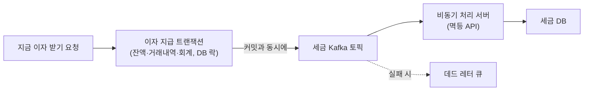

| | |
| --- | --- |
| 발표 | SLASH 23 |
| 연사 | 장세경, 조서희 (토스뱅크 Core Banking Developer) |
| 자료 | [발표 영상](https://www.youtube.com/watch?v=amTJyIE1wO0) · [SLASH 23](https://toss.im/slash-23) |

토스뱅크에서 매일 70만 명 이상이 쓰는 "지금 이자 받기"를 모놀리식 코어뱅킹에서 독립 마이크로서비스로 떼어낸 기록이다. 앞부분은 왜 그리고 어떻게 개발했는지(도메인 분리, DB 락 동시성 제어, Kafka로 트랜잭션 분리, Redis 캐싱), 뒷부분은 어떻게 안전하게 옮겼는지(이중 호출 검증, 단계별 오픈, 1%→100% 순차 전환)와 성과다. 1년 전 [무한스크롤 발표](/posts/slash22-bank-infinite-scroll/)가 계정계를 건드리지 않고 채널계에서 할 수 있는 것이었다면, 이 발표는 계정계 자체를 바꾸는 첫걸음이다. 내용은 발표 영상과 자동 생성 자막을 근거로 했고, 표현은 내 말로 바꿨다.

## 왜 코어뱅킹은 20년째 모놀리식인가

은행 시스템은 고객 요청을 전달하는 채널계와 금융 비즈니스 로직을 처리하는 계정계(코어뱅킹)로 나뉜다. 1970년대 계좌 데이터 처리 니즈로 1·2세대가 생겼고, 2000년대 모바일·웹·텔레뱅킹 등 다양한 거래를 한곳에서 처리하기 위해 현재의 모놀리식 코어뱅킹이 생겼다. 20여 년간 OS와 언어는 바뀌었지만 아키텍처는 그대로다. 보수적인 금융권이 검증된 아키텍처를 바꾸려 하지 않았고, 모놀리식은 표준화가 잘 되어 개발자가 빠르게 적응할 수 있기 때문이다.

토스뱅크도 채널계는 MSA였다. 코어뱅킹은 Redis·Kafka 같은 모던한 기술을 쓰면서도, 채널계 연계용 MCI, 대외 연계용 FEP, 대내 연계용 EAI가 강결합된 거대한 모놀리식이었다. 서버 하나, DB 하나라 트랜잭션 처리는 쉽다. 대신 특정 서비스만 스케일 아웃할 수 없고, 한 서비스의 지연·장애가 단일 장애점(그 하나가 멈추면 전체가 멈추는 지점)이 되어 전 업무를 마비시킨다. 상용 솔루션 기반이라 유연성·확장성도 낮았고 불필요한 레거시 코드로 유지보수성도 떨어졌다.

지금 이자 받기는 2022년 3월 16일 런칭한, 한 달에 한 번 받던 이자를 원하는 시점에 받는 국내 최초 서비스다. 토스뱅크 전체에서 트래픽이 가장 높은 서비스가 됐고, 트래픽 몰림으로 인한 지연이 전체 토스뱅크 서비스를 지연시키는 일이 종종 생겼다. 피크 타임을 위해 전체 코어뱅킹 서버를 증설하는 비효율이 뻔히 예상됐다. 그래서 이자 지급 도메인을 피크 때 유연하게 스케일 아웃하고 장애가 다른 서비스로 번지지 않는 독립 마이크로서비스로 전환하기로 했다.

## 개발

이자 계산은 마지막 이자 지급일부터 요청일 전일까지의 잔액에 약관의 금리와 잔액 유지 일수를 곱하고, 이자소득세 14%와 지방소득세 1.4%를 제한 뒤 계좌에 바로 입금한다. 기술 스택은 채널계와 같다. 쿠버네티스, Spring Boot, Kotlin, JPA, Kafka, Redis.

### 도메인 분리

첫 고민은 강결합된 업무별 의존성을 어디까지 느슨하게 할 것인가였다. 이자 지급에는 고객 정보, 상품(금리), 회계 정보가 필요하다. 이를 하나의 서버에서 처리하면 MSA의 장점을 살리지 못하므로 도메인 단위로 나눴다. 기존에는 고객 정보 조회 → 금리 조회 → 이자 계산 → 이자 송금 → 회계 처리를 한 트랜잭션으로 처리했는데, 트랜잭션으로 묶지 않아도 되는 도메인은 별도 마이크로서버로 구성하고 API 호출로 의존성을 느슨하게 했다.

### 동시성 제어

은행에서 잔액을 갱신하는 채널은 앱, 타행 입금, ATM, 자동이체 등 굉장히 많다. 그래서 발표자는 [Redis 글로벌 락](/posts/kleppmann-distributed-locking/)만으로는 동시성 문제를 풀기 어렵다고 본다. 락이 없으면 잔액 100원에 이자 100원 입금과 타행 300원 입금이 동시에 올 때 두 트랜잭션이 각자 100원을 읽는다. 그 결과 200원과 400원으로 갱신해 500원이 아닌 엉뚱한 금액이 된다.

그래서 Redis 글로벌 락에 더해 JPA 락 어노테이션으로 DB 단에서도 제어했다. Spring Data JPA에서는 쿼리 메서드에 `@Lock`을 붙여 락 모드를 지정한다([Spring Data JPA - Locking](https://docs.spring.io/spring-data/jpa/reference/jpa/locking.html)). 트랜잭션 2는 트랜잭션 1이 끝날 때까지 대기하고, 커밋 뒤 변경된 잔액을 참조해 500원이 된다. 발표는 락 모드 이름을 말하지 않았지만, 갱신하려는 트랜잭션끼리 줄을 세우는 이 동작은 Jakarta Persistence가 `PESSIMISTIC_WRITE`에 대해 설명하는 용도와 같다([LockModeType](https://jakarta.ee/specifications/persistence/3.1/apidocs/jakarta.persistence/jakarta/persistence/lockmodetype)).

주의점은 락을 잡을 데이터를 명확히 식별하고 갱신하는 데이터에만 락을 잡아야 [데드락](/posts/lock-types-and-waits/)과 성능 저하를 막는다는 것이다. 잔액 갱신이 메인 로직이므로 계좌의 현재 잔액 데이터에만 row lock이 걸리게 했고, 대기할 수 있는 재시도 로직과 적절한 타임아웃을 두어 고객이 락을 의식하지 못하게 했다.

### Kafka로 트랜잭션 분리

기존 코어뱅킹에서는 이자 한 번 받는 데 20개 테이블에 80번의 UPDATE·INSERT가 이루어졌다. 평균 300ms로 코어뱅킹 서비스 중 느린 편이었고, 정규화된 모델과 정교한 인덱스로도 빨라지기 어려운 구조였다. 그래서 일부 DML을 트랜잭션 밖으로 빼기로 했고, 분리 기준은 고객 잔액과 통장 데이터 관점에서 DB 쓰기 지연이 실시간으로 문제가 되는가였다. 반드시 트랜잭션이 보장돼야 하는 모델과, 세금 처리처럼 즉시성을 요하지 않는 모델의 DML을 분리했다.

이자 받기 트랜잭션 종료와 동시에 세금 토픽에 메시지를 발행하고 비동기 서버가 컨슘해 세금 DB에 저장한다. 정상이면 준실시간으로 반영된다. 실패하면 데드 레터 큐(처리에 실패한 메시지를 따로 보관하는 큐)로 세금 트랜잭션을 보장하고, 재처리 때 중복 반영되지 않도록 API [멱등성](/posts/idempotency-key-design/)을 확보했다. 그 결과 80회 DML이 50회로 줄었다.

### Redis 캐싱

기존 이자 계산은 RDB의 일자별 거래내역을 조회해 연산하는 방식이라 고객이 거래할 때마다 매일의 거래내역을 참조해 이자와 세금을 계산했다. 고객은 하루에 한 번만 이자를 받을 수 있으므로 하루 한 번만 DB I/O를 발생시키면 된다고 판단했다. 계좌 상세 탭에 접근할 때마다 발생하던 이자 계산 DB I/O를 하루 중 첫 접근에만 하고 예상 이자 결과를 Redis에 캐싱했다. 캐시 만료도 하루로 두어 잘못 계산되는 케이스를 원천 방지하고, 매일 자정 이후 첫 접근에만 캐싱하므로 정확성도 보장된다.

## 마이그레이션

코어뱅킹에서 이자 지급 마이크로서버로 옮기려면 순차 배포가 필요했다. 이자 조회 거래를 먼저 적용한 뒤 이자 받기 거래를 적용했다.

### 이자 조회: 3단계 검증

이자 계산 모델이 코어뱅킹과 마이크로서버로 이원화되면서 두 결과가 일치하는지 확인해야 했다. (1) 전기 이자 지급일부터 한 달간 앱에서 거래가 일어나면 기존 코어뱅킹 API와 마이크로서버 이자 조회 API를 동시에 호출해 두 값을 비교하고, 불일치하면 모니터링 채널에 알림을 받아 원인을 확인하고 로직을 수정했다. 기존 경로와 새 경로를 나란히 호출해 결과를 비교하는 방식은 [Shadow Release로 조회를 옮긴 기록](/posts/shadow-release-query-migration/)과 같은 형태다. (2) 스테이징(운영과 동일하게 구성된 내부 테스트 환경)에서 매일 오전 전건 배치를 실행해 대상 건별로 두 API를 호출·비교하고 불일치 대상을 특정할 수 있는 알림을 받아 수정을 반복했다. (3) 모니터링이 완료되면 이자 조회 API를 완전히 전환했다.

### 이자 받기: 단계별 오픈

금액 검증은 끝났지만 실제 입금은 거래내역이 올바르게 쌓이는지, 잔액이 갱신되는지 상세 검증이 필요했다. 수신 개발팀 팀원 → 토스뱅크 내부 팀원 → 일부 고객 → 대상 점차 확대 순으로 오픈했다. 정상 케이스 외에 예외 케이스는 E2E 테스트 케이스를 따로 세웠다. 잔액 5천만 원까지 연 2%, 초과분 연 3.3%의 구간별 차등 금리 검증, 명의도용·해킹 신고나 사망 등 거래 제한 고객 상태, 거래 중지·해지 계좌, 압류·전기통신금융사기 등 사고 유무. 네 가지 축으로 테스트 데이터를 만들어 통합 테스트를 했다.

### 1% → 100%

API를 한 번에 전환하면 문제 시 복구가 어려우므로 코어뱅킹 99% : 마이크로서버 1%로 시작해 90:10, 50:50, 10:90, 그리고 모든 검증이 끝났다고 판단한 시점에 코어뱅킹 호출을 페이드아웃하고 100% 전환했다. 기존 은행 차세대 전환은 연휴 동안 시스템을 전부 내리고 옮기는 빅뱅 방식이라 고객은 입출금은 물론 카드 거래도 못 했고, 문제가 생기면 전체를 중단했다가 보완해 다시 시도하기를 반복하며 수차례 장애와 중단을 겪었다. 토스뱅크는 순차 배포로 중단 없이 전환했다. 빅뱅 대신 조금씩 옮기는 전략은 1년 뒤 [차세대를 하지 않는 이유](/posts/slash24-tossbank-no-next-gen-migration/) 발표에서 스트랭글러 피그라는 이름으로 정리된다.

## 성과

| 항목 | 결과 |
| --- | --- |
| 독립성 | MCI를 거치지 않고 자체적으로 요청·응답. 코어뱅킹 부하가 있어도 영향 제한, 피크 때 이자 지급 서버만 스케일 아웃 |
| 재사용 | 이자 계산·입금·출금·회계 모듈을 제휴상품·여신상품·만보기·카드 서버 등이 호출할 수 있는 구조 |
| 확장성 | 조회 거래는 물론 출금·입금을 조합한 송금 모듈, 이체와 각종 원장 거래를 붙이기 용이 |
| 레거시 청산 | 이자 계산 코드 10만 라인 → 2,000라인 |
| 성능 | 평균 소요 시간 MCI 호출 대비 약 40배, 최대 소요 시간 약 170배 개선 |
| 기술 | 상용 솔루션의 제약을 벗어나 오픈소스 기반으로 쿠버네티스·Kafka·Redis 활용 |

## 리뷰

내가 보기에 이 발표에서 가장 유용한 부분은 "트랜잭션으로 묶어야 하는가"의 기준을 명시한 것이다. 고객 잔액과 통장 데이터 관점에서 쓰기 지연이 실시간으로 문제가 되는가. 이 기준으로 세금은 비동기가 되고 잔액·거래내역·회계는 동기로 남는다. 코어뱅킹 분해에서 무엇을 먼저 떼어낼지 고민할 때 그대로 쓸 수 있는 판단 규칙이다.

동시성 제어를 Redis 락과 DB 락 두 겹으로 둔 이유도 은행의 사정에서 나온다. 잔액을 바꾸는 주체가 앱 하나가 아니라 ATM, 타행, 자동이체까지라서, 나는 애플리케이션 레벨 락만으로는 모든 경로를 덮기 어렵다는 뜻으로 읽었다. 분산 락 아래에 DB 단의 장치를 한 겹 더 두는 구성은 [토스증권 주문 정합성 발표](/posts/slash22-overseas-order-consistency/)와 같다. 다만 그 발표는 DB 쪽 장치로 버전 비교(낙관적 락)를 택했고, 이 발표는 row lock으로 대기시키는 쪽을 택했다.

마이그레이션이 발표의 절반을 차지한다. 이중 호출 비교, 스테이징 전건 배치, 팀원 → 사내 → 일부 고객, 1%부터 시작하는 트래픽 전환. "빅뱅 없이"가 은행에서 무엇을 뜻하는지 절차로 보여준다. 1년 뒤 [Next 코어뱅킹 발표](/posts/slash24-next-core-banking-fx/)는 이 전환 뒤에도 DB는 Oracle을 공유하고 있었다는 데서 출발해, 외화예금 서비스를 처음부터 MSA와 MySQL로 만든다.

## 남는 질문

- Redis 글로벌 락과 DB row lock을 둘 다 쓰면 락 순서에 따라 데드락이 날 수 있다. 두 락의 획득 순서와 타임아웃은 어떻게 정했는지.
- 세금을 비동기로 분리하면 이자는 입금됐는데 세금 DB에는 아직 없는 순간이 생긴다. 그 사이 세무 리포트나 원천징수 조회가 들어오면 어떻게 보이는지.
- "MCI 대비 170배"는 MCI 자체의 오버헤드가 컸다는 뜻이기도 하다. 코어뱅킹 안에서만 최적화했다면 어느 정도까지 가능했을지.
- 이자 지급 서버가 다른 서버들의 공통 모듈(입금·출금·회계)이 됐다면 이 서버가 새로운 단일 장애점이 되지 않는지.

## 참고

- [발표 영상](https://www.youtube.com/watch?v=amTJyIE1wO0)
- [SLASH 23](https://toss.im/slash-23)
- 채널계 쪽 이야기: [SLASH 22 왜 은행은 무한스크롤이 안되나요 리뷰](/posts/slash22-bank-infinite-scroll/)
