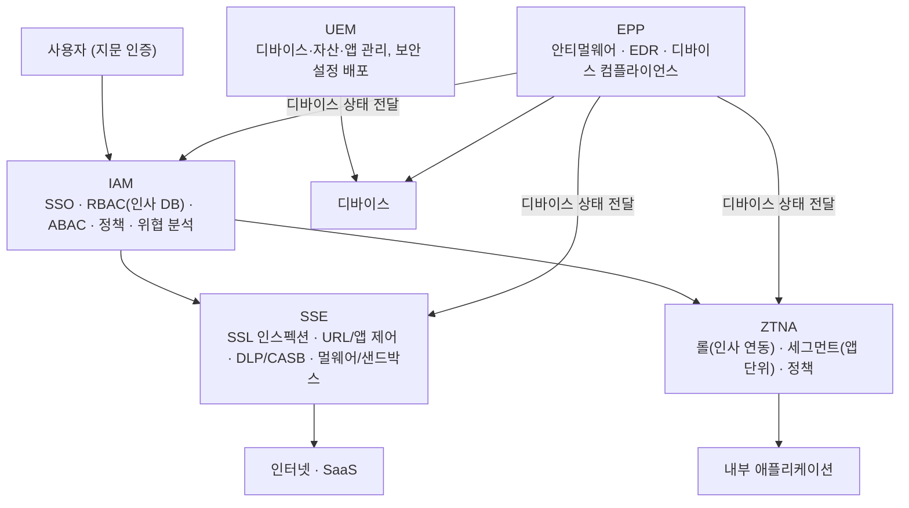

| | |
| --- | --- |
| 발표 | SLASH 23 |
| 연사 | 정연우 (토스 Security Engineer) |
| 자료 | [발표 영상](https://www.youtube.com/watch?v=2V2xYeqUsWw) · [SLASH 23](https://toss.im/slash-23) |

같은 SLASH 23의 [Istio Zero Trust 발표](/posts/slash23-istio-zero-trust/)가 서비스 간 통신의 Zero Trust라면, 이 발표는 **사람과 기기**의 Zero Trust다. Active Directory, SSL VPN, 시스템마다 다른 ID·패스워드와 OTP로 이루어진 전통적 사내 보안 환경을 5개월 만에 IAM·SSE·ZTNA·UEM·EPP 다섯 요소로 교체한 과정이고, "보안이 올라갈수록 왜 일은 불편해지는가"라는 질문에서 출발한다. 내용은 발표 영상과 자동 생성 자막을 근거로 했고, 표현은 내 말로 바꿨다.

## 출발: 보안이 올라갈수록 왜 불편해지는가

토스는 빠른 속도로 서비스를 출시하는 회사지만 금융회사라 규제와 컴플라이언스로 업무 몰입이 불편한 순간들이 있었다. 기존 환경의 불편은 사용자와 보안팀 양쪽에 있었다.

| 영역 | 사용자의 불편 | 보안팀의 불안 |
| --- | --- | --- |
| 로그인 | 수많은 SaaS·온프레미스·퍼블릭 클라우드 계정이 각각 따로. 3개월마다 바꿔야 하는 패스워드, 분실 시 IT팀에 초기화 요청, 시스템 접속마다 휴대폰을 꺼내 OTP 입력 | 모든 PC가 AD에 조인되어 있어 AD 관련 사고의 불안. 2020년 국내 대형 유통기업의 Clop 랜섬웨어(오프라인 점포 영업 중단, 카드 정보 100만 건 유출). AD 취약점이 매년 18~21건 나와 반복적인 패치 업무 |
| 네트워크 | 재택 시 매번 SSL VPN에 ID·패스워드·OTP 로그인. 오피스와 재택이 이원화되어 필요한 시스템을 양쪽에서 각각 신청 | 두 환경을 모두 관리. IP 기반 접근 제어라 트러블슈팅이 느리고, 한번 허용된 IP는 계속 접근 가능하며 재사용되므로 퇴사자의 IP를 신규 입사자가 승계하면 과다 권한 |
| 엔드포인트 | 노트북에 설치된 수많은 보안 솔루션과 개발 도구의 충돌로 재부팅(퍼플 스크린). AD 패스워드 변경 후 macOS 키체인 동기화 오류로 IT팀 방문 | |

## 요구사항 다섯 가지

1. 각기 다른 ID·패스워드의 통합 관리. 하나의 계정으로만 업무.
2. 계정과 애플리케이션을 한 번에 관리하고 OTP 대신 생체 인증으로 더 빠르고 안전한 로그인.
3. AD를 쓰지 않으면서 AD보다 관리가 편하고 보안성이 높은 방식.
4. IP 기반이 아닌 **사용자 기반** 네트워크 접근 제어. 오피스·SSL VPN 관리 포인트 통합. SSL 인스펙션으로 암호화 트래픽의 보안 가시성 확보.
5. PC의 보안 솔루션 개수는 줄이되 보안성은 향상. 계정·네트워크 접근 통제 시스템이 권한 있는 사용자라도 **회사 자산인지, 사전 정의한 보안 요구사항을 충족하는지** 검증해 검증된 PC만 접근.

이를 만족하려면 전통적 보안 모델이 아닌 새 패러다임이 필요했고, 그것이 Zero Trust다. 고정된 네트워크 경계를 방어하는 것에서 사용자·자산·자원 중심 방어로 바꾸는 패러다임으로, 물리적 위치·네트워크 위치·자산 소유권을 기준으로 부여된 암묵적 신뢰는 없다고 가정한다. 검토 단계에서 가장 도움이 된 것은 NIST SP 800-207이었고, 2021년 미국 대통령 행정명령으로 연방정부의 전환 계획 제출이 요구되면서 시장의 관심이 뜨거웠다.

## 다섯 요소

**IAM.** 적합한 사용자와 디바이스가 필요할 때 원하는 애플리케이션·리소스에 접근하게 하는 프레임워크. SSO는 SAML·OIDC 같은 프로토콜로 회사 시스템의 계정과 로그인을 통합한다. RBAC은 인사 DB와 연동해 직군·팀 단위로 접근을 제한하고, ABAC은 권한이 있어도 회사가 정의한 네트워크인지, 자산인지, 보안을 준수하는지 검증한다. 정책은 애플리케이션별 인증 팩터를 정의한다. 위협 인텔리전스로 IAM 프로바이더와 회사의 위협을 미리 파악하고 토스 팀원을 타겟으로 하는 피싱을 빠르게 탐지·예방한다.

**SSE(Security Service Edge).** 사용자·엔드포인트·원격 네트워크·앱·리소스를 안전하게 연결하는 클라우드 전달 플랫폼. SSL 인스펙션으로 HTTPS 암호화 패킷을 통제·분석하고, URL·애플리케이션 제어로 피싱·P2P 같은 악성 사이트에서 보호한다. DLP로 중요 데이터의 외부 유출을 막고 CASB로 클라우드의 회사 데이터를 보호한다. 멀웨어·ATP로 랜섬웨어·스파이웨어·피싱을 식별·차단하고 샌드박스로 URL·IP를 분석해 악의적 행위가 발견되면 즉시 프로세스나 호스트를 격리한다.

**ZTNA.** 명확히 정의된 접근 제어 정책 기반의 보안 원격 접근. VPN은 **네트워크 단위**로 접근을 제어하지만 ZTNA는 **애플리케이션·서비스 단위**다. 롤은 IAM 연동으로 인사 정보를 가져와 내부 네트워크에 접근할 수 있는 사용자·그룹을 정의하고, 세그먼트는 내부 자산을 애플리케이션 단위로 정의하며(로그 분석으로 사용 중인 애플리케이션을 식별·관리), 정책은 인가된 롤을 가진 사용자만 접근하게 하되 사전 정의한 보안 수준을 만족하지 못하면 차단한다.

**UEM.** PC와 모바일을 중앙에서 통합 관리. 디바이스의 보안·데이터·앱·업데이트를 관리하고, 하드웨어·네트워크·사용자 정보를 수집하며, 분실 시 원격 잠금·메시지 표시·초기화로 데이터를 보호한다. OS와 필수 프로그램을 자동 설치하고 보안 취약점·기능 업데이트를 내리거나 검증되지 않은 업데이트를 차단한다. 화면 보호기, 디스크 암호화 같은 보안 설정을 중앙에서 배포한다.

**EPP.** 엔드포인트의 다양한 위협을 탐지·차단하는 종합 플랫폼. 예전에는 안티바이러스와 EDR을 각각 설치했지만 EPP는 방화벽·안티바이러스·안티멀웨어·EDR·호스트 IPS를 통합 제공한다. EDR은 실시간 탐지·대응과 디바이스 행동 분석을 하고, **디바이스 컴플라이언스**는 OS 보안 설정과 상태를 평가해 취약점·위협을 식별하고 그 정보를 IAM·SSE·ZTNA에 전달해 접근 허용 여부를 결정하게 돕는다.

## 전환 절차

검토부터 전환까지 약 5개월이 걸렸다. (1) IAM에 모든 토스 팀원 계정을 생성하고 온보딩(패스워드 재설정, MFA 등록). (2) PC의 AD 조인을 제거하고 UEM으로 전환. IAM 계정으로 로그인하면 프로파일이 자동 다운로드되어 불필요한 애플리케이션을 삭제하고 새 인증서·애플리케이션·보안 설정이 자동 설치된다. (3) SSE와 ZTNA에 IAM으로 로그인하면 전환 완료.

## 도입 후

로그인은 **패스워드리스**로 지문 인증 한 번이면 원하는 시스템에 바로 들어간다. 단 인증 시 인가된 사용자인지, 신뢰된 네트워크와 디바이스인지, 보안을 준수하는지 빠르게 검증한다. 네트워크는 SaaS나 인터넷 접근 시 ZTNA가 동작해 회사든 재택이든 해외든 회사와 동일한 보안 환경으로 어디든 접속하고, 접속 디바이스의 보안 준수를 검증하며, 인터넷 사용 시 피싱 사이트로부터 보호한다. 이 기능들을 연동해 토스만의 정책 엔진을 구축했다.

효과는 넷이다. 오피스와 재택의 경계가 사라져 노트북만 열면 업무가 된다. 패스워드리스로 로그인 단계가 기존보다 **5배 간소화**됐지만 보안은 **3배 이상 향상**됐다. 인사 DB 연동으로 계정이 자동 생성되고 소속팀 권한이 자동 할당되며 인사이동 시 네트워크·애플리케이션 권한이 자동 회수·조정된다. 계정·네트워크·엔드포인트 영역에서 향상된 위협 예방 체계로 팀원이 더 안심하고 일한다. 이 경험으로 금융보안원에서 금융권 최초의 Zero Trust 보안 아키텍처 구축 모범 사례로 인정받았다.

## 리뷰

**"보안이 올라갈수록 왜 불편해지는가"라는 질문 자체가 발표의 주장이다.** 전통적 경계 보안은 "불편함 = 보안"이라는 등식 위에 서 있고, Zero Trust는 그 등식을 깨는 것이다. 사용자 경험 개선(5배)과 보안 향상(3배)이 동시에 일어났다는 결과는 두 목표가 상충하지 않는다는 증거로 제시된다. 개발자 생산성을 보안의 적이 아니라 보안 설계의 입력으로 놓은 점이 토스답다.

**IP에서 사용자·디바이스로 신원의 축이 옮겨간 것이 핵심 변화다.** "퇴사자의 IP를 신규 입사자가 승계하면 과다 권한"이라는 예는 IP 기반 접근 제어의 결함을 한 문장으로 보여준다. 인사 DB가 RBAC의 원천이 되어 인사이동이 곧 권한 변경이 되는 구조는, 서비스 쪽 Zero Trust에서 액세스 로그가 Sidecar 화이트리스트의 원천이 된 것과 같은 발상이다. 신뢰의 근거를 "이미 있는 정확한 데이터"에서 가져온다.

**다섯 요소의 설명은 벤더 카테고리 정의에 가깝다.** 각 요소가 무엇인지는 명확하지만 토스가 어떤 제품을 골랐고 왜인지, 다섯을 연동하는 정책 엔진이 구체적으로 어떤 규칙을 갖는지는 다루지 않았다. 도입기라기보다 개념 지도에 가까운 발표이고, 실제 구축 경험은 2년 뒤 토스페이먼츠의 [경계 보안부터 제로트러스트까지](/posts/tmc25-payments-zero-trust/) 발표가 더 구체적이다.

## 남는 질문

- SSL 인스펙션은 개발자의 로컬 환경(git, 패키지 매니저, Docker 레지스트리)과 자주 충돌한다. 인스펙션 예외는 어떻게 관리하는지.
- 디바이스 컴플라이언스 기준을 만족하지 못하면 접근이 차단된다. 차단된 개발자가 스스로 복구할 수 있는 셀프서비스 경로가 있는지, 차단 빈도는 얼마인지.
- AD를 제거하면 Windows 환경의 그룹 정책이 사라진다. Windows 사용자는 UEM만으로 충분했는지.
- 5개월 전환 중 두 체계가 공존한 기간의 운영은 어땠는지. 온보딩을 마친 사람과 아직인 사람 사이의 접근 차이를 어떻게 다뤘는지.

## 참고

- [발표 영상](https://www.youtube.com/watch?v=2V2xYeqUsWw)
- [SLASH 23](https://toss.im/slash-23)
- [NIST SP 800-207 Zero Trust Architecture](https://csrc.nist.gov/pubs/sp/800/207/final)
- 서비스 간 통신의 Zero Trust: [SLASH 23 토스의 Istio Zero Trust 리뷰](/posts/slash23-istio-zero-trust/)
