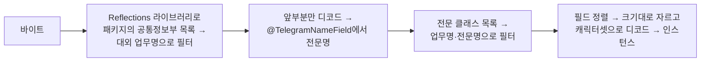
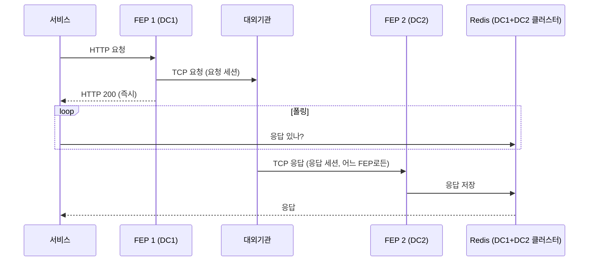

| | |
| --- | --- |
| 발표 | SLASH 23 |
| 연사 | 이상민 (토스뱅크 Server Developer) |
| 자료 | [발표 영상](https://www.youtube.com/watch?v=eS9tukmYBLI) · [SLASH 23](https://toss.im/slash-23) |

은행이 금융결제원·신용정보원 같은 대외기관과 TCP 고정 길이 전문을 주고받는 시스템이 FEP(Front End Processor)이고, 대부분의 은행은 벤더 솔루션을 쓴다. 토스뱅크는 그것을 MSA 환경에서 처음부터 다시 만들었다. 이 발표는 전문 설계서를 Kotlin 어노테이션으로 표현하고 리플렉션으로 인코드·디코드하는 코덱, Netty와 WebFlux로 논블로킹 송수신, TCP 요청·응답 세션이 분리된 대외기관과 액티브-액티브 두 클러스터에서 동작하기 위한 Redis 폴링 구조, 대외 업무별 FEP 분리까지 설명한다. 내용은 발표 영상과 자동 생성 자막을 근거로 했고, 표현은 내 말로 바꿨다.

## FEP란, 그리고 솔루션 FEP의 한계

은행 시스템은 채널계(MSA, Spring·Kafka 등 오픈소스로 유연하게 개발)와 계정계(SI 차세대 기반 모놀리식, 금융 트랜잭션을 안정적으로 처리)로 나뉜다. 타행 송금이나 신용 점수 조회에는 대외기관과의 협력이 필요하고, 계정계와 대외기관이 통신할 때 쓰는 시스템이 FEP다. 핵심 업무는 대외기관과 메시지를 주고받는 것이고 보통 TCP 프로토콜, 그것도 연결 유지형을 쓰므로 세션 관리도 중요한 역할이다.

| 측면 | 솔루션 FEP의 한계 |
| --- | --- |
| 생산성 | 간단한 기능도 대외기관을 통하면 여러 담당자가 협업해야 함. 토스뱅크의 도구(로깅·모니터링)와 연동이 제한적. HTTP는 되지만 경로를 여러 개 못 쓰는 등 지원 안 되는 스펙 |
| 안정성 | HTTP 통신 시 워커 스레드가 응답을 기다리는 동안 아무것도 못 하는 블로킹 I/O. 대외기관 응답이 느리고 요청이 많으면 스레드 풀 소진 → 장애. 일부 컴포넌트가 액티브-스탠바이. 인스턴스 수가 제한적이라 한 인스턴스가 여러 대외 업무를 처리 → **장애 도메인 공유** |
| 유지보수성 | 모놀리식을 고려한 오래된 소스라 분리가 어려움. 세션 관리·메시지 설정은 솔루션 도구를 써야 해서 FEP 전문 인력만 관리 가능. 소스도 어렵고 사람도 부족 |

FEP 담당자의 헌신으로 많이 개선됐지만, 솔루션을 고쳐 쓰는 것보다 모던한 FEP를 처음부터 만드는 것이 효과적이라고 판단했다.

## 전문을 코드로 표현하기

대외기관과 TCP로 주고받는 메시지는 고정 길이 형식이고 "전문"이라 부른다. TCP 바디에 바이트가 쭉 나열되어 있다. HTTP의 JSON은 키-값이라 해석이 쉽지만 전문은 그렇게 할 수 없다. 대신 전문 설계서에 각 항목의 순서와 크기가 명세되어 있어 바이트를 자를 수 있다. 또 항목별 캐릭터셋(문자와 바이트의 매핑 규칙)이 주어져 있어 바이트를 문자로 디코드할 수 있다.

전문 설계서는 공통정보부(HTTP 헤더에 해당, 한 대외 업무의 모든 전문이 동일)와 데이터부(HTTP 바디에 해당, 실제 업무 정보)로 이루어진다. 이를 Kotlin으로 표현했다.

```kotlin
@CommonPart(businessName = "SLASH23")
open class CommonInfo : Telegram {
    @TelegramField(order = 1, length = 4, charset = "ASCII")
    lateinit var length: String
    @TelegramNameField
    @TelegramField(order = 2, length = 8, charset = "ASCII")
    lateinit var telegramName: String
    // ...
}

@TelegramClass(telegramName = "SPEAKER_INQ")
class SpeakerInquiry : CommonInfo() {
    @TelegramField(order = 10, length = 20, charset = "KSX1001")
    lateinit var speakerName: String
    // ...
}
```

`Telegram` 인터페이스를 정의하고, 설계서의 정보는 어노테이션으로 표현한다. `@CommonPart`는 공통정보부와 대외 업무명, `@TelegramClass`는 각 전문과 전문명, `@TelegramField`는 항목의 순서·크기·캐릭터셋, `@TelegramNameField`는 공통정보부 중 특별하게 쓰이는 전문명 항목이다. 공통정보부 클래스를 만들고 전문 클래스가 이를 상속하면 설계서 전체가 코드가 된다.

## 코덱: 리플렉션으로 인코드·디코드

인코드는 3단계다. (1) 전문 인스턴스의 필드를 순서대로 정렬. 순서는 어노테이션에 있으므로 Java 리플렉션 API로 런타임에 클래스와 필드 어노테이션을 읽는다. (2) 필드별 인코드. 어노테이션의 캐릭터셋에 따라 인코드하는데, 캐릭터셋에 따라 같은 문자의 바이트가 달라진다. 필드 값이 `123abc`이고 캐릭터셋이 ASCII면 그대로지만, KS X 1001이면 영숫자가 다르게 생겼고(전각) 바이트도 다르다. 우리가 쓰는 영숫자는 대부분 ASCII라 인스턴스 프로퍼티에도 ASCII 영숫자가 들어 있는 경우가 많다. 이것을 그대로 KS X 1001로 인코드하면 의도치 않은 값이 들어간다. 그래서 캐릭터셋에 따라 적절히 문자를 매핑해 주는 것도 필요하다. (3) 필드별 바이트 배열을 한데 모은다.

디코드는 바이트에서 시작해 클래스 정보를 얻어야 하는 것이 다르다. 아이디어는 공통정보부의 전문명을 읽어 전문 클래스를 찾는 것이다.



대외 업무별로 공통정보부가 있으므로 Reflections 라이브러리(Java 리플렉션 API가 아닌 서드파티)로 특정 패키지의 클래스 정보를 다 가져와 지금 처리하는 대외 업무명으로 필터링해 공통정보부 클래스를 얻는다. 그 클래스로 바이트 앞부분만 디코드해 공통정보부 인스턴스를 얻고, `@TelegramNameField` 프로퍼티를 읽어 전문명을 얻는다. 다시 Reflections로 전문 목록을 얻어 업무명과 전문명으로 필터링하면 전문 클래스다. 나머지는 인코드와 비슷하게 리플렉션으로 순서를 얻어 정렬하고, 크기에 맞게 잘라 캐릭터셋으로 디코드해 인스턴스 프로퍼티에 넣는다.

## 송수신: 논블로킹, 그리고 액티브-액티브

단순한 구조는 서비스가 FEP에 HTTP 요청 → FEP가 인코드해 TCP로 대외기관에 전송 → TCP 응답 → HTTP 응답이다. 여기서 워커 스레드가 응답까지 블로킹되면 기존 FEP와 같은 문제가 생긴다. 느린 상대 하나가 스레드 풀을 소진시키는 과정은 [무너지는 Spring 서버 1편](/posts/tomcat-thread-exhaustion/)에서 따로 재현했다. 그래서 모던 FEP는 TCP에 [Netty](/posts/nio-and-event-loop/), HTTP에 [Spring WebFlux](/posts/reactive-and-backpressure/)와 WebClient를 써서 송수신을 모두 논블로킹으로 처리한다.

그런데 이 단순한 구조로는 토스뱅크 환경에서 동작하지 않는다. 물리적으로 분리된 두 클러스터가 액티브-액티브인데, 서비스가 FEP 1에 요청하고 FEP 1이 TCP로 보냈을 때, 대외기관의 TCP 응답이 FEP 2로 가면 서비스는 HTTP 응답을 받지 못하고 타임아웃이 난다. 응답이 요청을 보낸 FEP로 돌아오지 않는 이유는 둘이다. TCP 프로토콜 자체에는 요청과 응답이라는 개념이 없고, 대부분의 대외 업무는 같은 세션으로 요청·응답을 주고받지 않고 요청 세션과 응답 세션을 분리해서 쓴다. 아래 그림은 이 제약을 풀기 위해 바꾼 구조다.



FEP는 TCP 요청을 보낸 뒤 바로 HTTP 200을 주고, 서비스는 이어서 Redis를 폴링하며 응답을 기다린다. 대외기관이 TCP 응답을 다른 FEP에 보내더라도 그 FEP가 Redis에 값을 쓰므로 서비스는 읽을 수 있다.

Redis Pub/Sub을 쓰면 폴링 자원을 아낄 수 있다. 그런데 Pub/Sub은 [at-most-once](/posts/kafka-delivery-guarantees/)로 동작한다. Redis 문서는 "Redis' Pub/Sub exhibits at-most-once message delivery semantics."라고 적고, 구독자가 메시지를 처리하지 못하면 그 메시지는 영영 사라진다고 설명한다([Redis Pub/Sub](https://redis.io/docs/latest/develop/pubsub/)). FEP는 메시지를 신뢰성 있게 전달하는 것이 중요해서 폴링을 택했다. Redis도 DC1과 DC2에 걸쳐 클러스터가 구성되어 더 안전하다.

여기서 더 나아가 대외 업무별로 FEP를 분리해 독립 인스턴스와 배포 파이프라인을 갖게 했다. 한 대외 업무 FEP에 장애가 나도 다른 업무에 영향이 가지 않는다. 그리고 대외 업무별로 다른 세부 요건을 지원하기 위해 모던 FEP 내부에 추상화된 인터페이스를 두어, 새 대외 업무를 연계할 때 이 인터페이스를 구현하면 된다. 담당 서버 개발자가 FEP 동작을 몰라도 가이드를 따라 직접 적용할 수 있다.

## 결과

| 측면 | 모던 FEP |
| --- | --- |
| 생산성 | 채널계와 FEP가 직접 통신해 협업 인원 감소. 비슷한 기술 스택이라 채널계 개발자가 FEP 설정과 세부 요건을 직접 반영. 도구 연동 제한 없음. 지원 안 되는 스펙은 없거나 쉽게 만듦 |
| 안정성 | 논블로킹 I/O. 액티브-액티브. 업무별 장애 도메인 분리 |
| 유지보수성 | MSA로 시스템을 나눌 수 있어 유연. 오픈소스 기반이라 많은 사람이 개선 가능 |

발표자는 이 혁신에 기술 역량보다 더 필요한 것 셋을 꼽았다. FEP는 잘 동작하고 있었지만 아쉬운 부분에 문제의식을 갖고 해결할 수 있다는 공감대, 개인 여신 스쿼드의 서버 개발자가 팀 범위에 한정되지 않고 전사가 쓰는 시스템을 만들 수 있었던 임팩트 중심 문화, 플랫폼·DevOps·네트워크 엔지니어와 여러 서버 개발자의 도움과 챌린지.

## 리뷰

내가 보기에 이 발표의 설계를 결정한 것은 "TCP 요청 세션과 응답 세션이 분리되어 있다"는 도메인 사실 하나다. HTTP 사고방식으로는 요청을 보낸 인스턴스가 응답을 받는 것이 당연한데, 대외기관과의 전문 통신에서는 그렇지 않다. 그래서 FEP가 응답 대기 상태를 로컬에 둘 수 없고, Redis라는 공유 저장소와 폴링이 필요해진다. 발표는 이 제약을 먼저 설명하고 구조를 도출해서 설득력이 있다.

어노테이션과 리플렉션 코덱은 전문 설계서를 "문서"에서 "타입"으로 옮긴 것으로 읽힌다. 설계서가 바뀌면 클래스를 고치게 되고, 항목의 순서·크기·캐릭터셋이 문서가 아니라 코드로 관리되는 값이 된다. KS X 1001 전각 영숫자 매핑 같은 세부는 이런 시스템을 실제로 만들어 봐야 만나는 함정이라 발표에 포함된 것이 값지다. Reflections 라이브러리로 런타임에 전문 클래스를 찾는 부분은 [리플렉션 비용](/posts/class-loading-and-startup/)을 생각하면 캐싱이 필요할 텐데, 발표에서는 다루지 않았다.

1년 전 [대출 시스템 발표](/posts/slash22-tossbank-loan-system/)의 대외기관 유량 제어가 채널계 관점이었다면, 이 발표는 그 아래 전송 계층이다. 두 발표를 합치면 토스뱅크가 대외기관을 어떻게 대하는지 전체 그림이 된다. 이 모던 FEP는 2년 뒤 TMC 25의 모던 FEP 이후 구조 개선과 통합 발표로 이어진다.

## 남는 질문

- Redis 폴링 주기와 타임아웃. 대외기관 응답이 보통 수백 ms라면 폴링 간격을 얼마로 잡아야 지연을 늘리지 않으면서 Redis 부하를 감당하는지.
- 응답이 영영 오지 않을 때 Redis의 키는 누가 정리하는지. TTL로 처리한다면 그 뒤에 도착한 응답은 어떻게 되는지.
- 대외 업무별 FEP 분리는 세션 수도 업무별로 늘린다. 대외기관이 허용하는 세션 수 제한과 충돌하지 않았는지.
- 리플렉션 기반 코덱의 처리량. 전문 하나당 리플렉션 비용이 얼마이고 클래스 메타데이터를 캐싱하는지.

## 참고

- [발표 영상](https://www.youtube.com/watch?v=eS9tukmYBLI)
- [SLASH 23](https://toss.im/slash-23)
- [Reflections 라이브러리](https://github.com/ronmamo/reflections)
- [Redis Pub/Sub](https://redis.io/docs/latest/develop/pubsub/)
