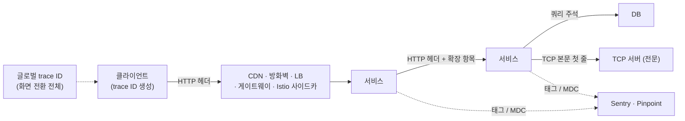

| | |
| --- | --- |
| 발표 | SLASH 23 |
| 연사 | 하태호 (토스페이먼츠 Server Platform Team Leader) |
| 자료 | [발표 영상](https://www.youtube.com/watch?v=Ifz0LsfAG94) · [SLASH 23](https://toss.im/slash-23) |

같은 발표자가 1년 전 SLASH 22의 "빠르고 자주 출시하기" 발표에서 운영 파트로 다뤘던 관측성을 정면으로 다시 잡은 발표다. "좋은 로그란 무엇인가"를 API 두 개짜리 예제로 단계별로 도출한 뒤, 분산 추적을 토스페이먼츠가 어떻게 다섯 방향으로 확장했는지(글로벌 trace ID, 전파 항목 확장, DB·TCP까지 범위 확장, 클라이언트에서 생성, 외부 도구 연계), 그리고 그 전파 인프라를 Istio 헤더 라우팅과 결합해 디버깅 환경을 만든 사례로 끝난다. 내용은 발표 영상과 자동 생성 자막을 근거로 했고, 표현은 내 말로 바꿨다.

## 왜 Observability인가

클라우드, 컨테이너, MSA는 기존 IT 시스템의 문제를 개선하고 민첩한 제품 조직을 만드는 데 도움이 되지만, 기반 환경이 점점 가상화·추상화되어 문제 추적은 더 어려워졌다. 수시로 바뀌는 서비스와 의존 관계, 동적으로 변경되는 인프라, 단일 요청이 예측할 수 없는 여러 네트워크 홉을 지나는 구조, 높은 [카디널리티](/posts/metrics-logs-traces/)(지표의 라벨 값 종류가 많은 정도)의 지표는 일반적인 모니터링 기반 탐색을 어렵게 한다. 그래서 이미 겪은 장애를 탐지하는 수준을 넘어, 겪어보지 못한 새로운 현상에 가시성을 주고 원인에 대한 질문에 답할 수 있는 시스템이 필요하다. 발표는 그것을 Observability라고 부른다. 이 용어를 처음 정의한 전기공학자 루돌프 칼만은 "시스템의 출력으로부터 시스템의 상태를 이해할 수 있는 능력"이라 했고, 개발자 시각으로는 로그와 모니터링 지표 같은 출력으로 상태를 이해하는 능력이다.

## 좋은 로그란

로직에 문제가 없어도 외부 연계 시스템이 잘못 응답하거나 인프라 문제로 의도대로 동작하지 않을 수 있으므로, 로직을 쓰는 단계부터 로그를 잘 남겨야 한다. 하지만 로그 관련 업무는 중요도가 낮게 평가되는 경우가 많다. 발표는 Spring Web만 넣은 프로젝트에서 요청 시작·종료 로그를 남기는 API 하나로 시작해 조건을 하나씩 발견한다.

| 단계 | 상황 | 깨달음 |
| --- | --- | --- |
| 1 | 기본 설정으로도 시간, 레벨, PID, 스레드, 코드 위치가 보인다. 여러 번 호출하니 스레드 이름 끝 숫자만 바뀌어 스레드 풀 사용을 유추할 수 있다 | 기본 설정도 꽤 많은 것을 알려준다 |
| 2 | API를 하나 더 추가하고 섞어 호출하니 어느 API의 로그인지 구분할 수 없다 | 로그에 **API 정보**를 포함한다 |
| 3 | 사용자별 호출 횟수를 알고 싶어 사용자 ID를 넣는다 | 요청을 처리할 때 필요한 **맥락 정보**를 로그에 넣으면 당시 상황을 이해할 수 있다 |
| 4 | 간헐적 실패 제보. 예외를 잡아 스택트레이스를 남기니 어느 요청의 것인지 알 수 없다 | 요청당 식별자(**trace ID**)를 발급해 모든 로그에 일관되게 기록한다 |
| 5 | 데이터 분석가가 유저별 API별 평균 응답 시간을 요청. 파싱하려니 API·사용자·trace ID의 기록 순서가 일관되지 않다 | 항목을 정의하고 **JSON으로 정형화**한다. 항목이 추가되거나 순서가 바뀌어도 괜찮고 외부 도구와 연계하기 쉽다 |

정리하면 좋은 로그는 정형화되어 저장되고, 기록 시점의 맥락 정보가 함께 기록되며, 같은 맥락의 로그가 동일한 trace ID로 연결되어 검색될 수 있는 로그다.

## MSA에서의 "같은 맥락"

앱 → 앱 서버 → 유저 서버(인증) → 페이먼트 서버(거래내역) 흐름에서 각 서버가 JSON 로그를 남기고, 유저 서버는 유저 ID를, 페이먼트 서버는 주문 ID를 맥락으로 넣었다. 좋은 로그의 조건에 맞아 보인다. 하지만 "사용자 ID 37인 고객이 몇 시쯤 거래내역 조회에 실패했다는데 주문 ID는 모른다"는 문의가 오면 페이먼트 서버 담당자는 사용자 ID를 모르니 시간만으로 추정할 수밖에 없다. 기술적으로는 서버 간 호출이 여러 개별 요청이지만, 비즈니스 관점에서는 하나의 요청으로 해석되는 것이 좋은 경우가 있다. 모든 서버가 앱 서버와 같은 trace ID A를 기록했다면 A로 전체를 검색해 페이먼트 담당자도 사용자 ID를 알 수 있다.

서로 다른 서버가 같은 trace ID를 갖게 하는 방법은 간단하다. 요청을 보낼 때 trace ID를 함께 보낸다. 이것이 분산 추적이다. Google의 [Dapper 논문](https://research.google/pubs/dapper-a-large-scale-distributed-systems-tracing-infrastructure/)(2010) 이후 Zipkin, Jaeger 같은 도구가 나왔고, Spring에서는 Sleuth가 HTTP 헤더로 trace ID를 교환한다.

코드 변경 없이 자동으로 문맥이 전파되게 하는 것은 어렵다. 반면 문맥의 표현법을 정의하는 것은 상대적으로 쉬워서 표현법이 여럿 생겼다. 발표는 최근 이것이 W3C Trace Context 표준으로 수렴하고, 자동 계측 라이브러리는 OpenTelemetry로 통합되고 있다고 정리한다. Trace Context 명세는 분산 추적에 필요한 문맥을 전파하는 표준 HTTP 헤더와 값 형식을 정의한다([W3C Trace Context](https://www.w3.org/TR/trace-context/)). OpenTelemetry로 실제 시세 파이프라인을 추적해 본 기록은 [OpenTelemetry + Jaeger로 분산 추적](/posts/monticker-opentelemetry-tracing/)에 있다.

## 토스페이먼츠의 다섯 가지 확장

### 1. 글로벌 trace ID

trace ID로 하나의 요청은 추적할 수 있지만, 비즈니스에서는 하나의 사용자 시나리오 전체를 이해해야 할 때가 잦다. 결제 완료 확인 화면에서 문제가 났는데 결제 정보 확인 화면부터 문제였을 것으로 예상되면, 화면 전환 단계 전체를 엮어줄 ID가 없어 하나의 ID로 검색할 수 없다. 그래서 화면 전환 단계 전체를 묶는 글로벌 trace ID를 정의하고 전파한다.

### 2. 전파 항목 확장

글로벌 trace ID 외에 다양한 정보를 함께 전파해 요청을 받는 서비스가 당시 문맥을 더 잘 이해하게 한다. "지금 결제 실패가 잦은 것 같은데 문제가 있나요"라는 질문에 "A 금융사 관련 API 실패율이 여러 서비스에서 높다, 금융사에 확인 요청했고 기술지원팀이 고객사에 안내 중이다"라고 시스템 상황을 이해한 채로 답할 수 있다.

### 3. 범위를 MSA 밖으로

실제 환경은 CDN, 방화벽, 로드밸런서, 외부 게이트웨이, Istio 사이드카, 서비스 서버, DB로 이루어진다. 그래서 trace ID만 있으면 전 구간의 로그를 찾을 수 있어야 한다. 문제는 HTTP 헤더를 넣을 수 없는 구성 요소다. DB는 쿼리 주석에 추적 문맥을 넣어 전파하고, [AOP](/posts/aop/)로 쿼리를 보내는 메서드를 추적해 로그를 남긴다. 모든 로그가 trace ID로 연결되므로 문제 쿼리, 문제 API 요청, 그 쿼리를 만든 메서드를 정확히 찾고 개별 건이 추적되니 문제 규모도 쉽게 확인된다. TCP는 프로토콜 자체에 본문을 바꾸지 않고 추가 정보를 보낼 방법이 없다. L4 로드밸런서가 HTTP를 이해하지 못해 `X-Forwarded-For`를 넣을 수 없는 것과 같은 문제이고, 그 해법이 PROXY protocol이다. 원래 TCP 본문은 그대로 두고 첫 줄에 `PROXY`와 클라이언트 IP를 붙이기로 약속한 규격이다. HAProxy가 공개한 명세에서 버전 1 헤더는 연결 직후 데이터 앞에 붙는 US-ASCII 한 줄이고 `PROXY`라는 문자열로 시작한다([The PROXY protocol](https://www.haproxy.org/download/2.9/doc/proxy-protocol.txt)). 토스페이먼츠는 이 아이디어를 가져와 TCP 본문 첫 줄에 추적 문맥을 심고 받는 서버가 규칙대로 파싱하게 했다. 그 결과 업무별 전문 데이터를 바꾸지 않고도 문맥이 전파된다.

### 4. 클라이언트에서 생성

서버 간 통신에서 최초 요청자가 trace ID를 만드는 것은 당연하지만, 사용자 단말이 만들어야 한다는 것은 일반적이지 않게 느껴질 수 있다. 프론트엔드 로직은 서버와 통신을 시작하기 전부터 실행되고 사용자 인터랙션이 먼저 발생할 수 있으므로, 문맥을 이어줄 trace ID가 미리 발급되어 있어야 한다. 그 결과 사용자가 경험한 웹 성능 지표, 크래시, 서버 통신 이력을 일관되게 볼 수 있다.

### 5. 외부 도구 연계

에러 추적은 Sentry, APM은 Pinpoint. Sentry는 태그로 글로벌 trace ID와 trace ID를 인덱싱해 검색하고, Pinpoint의 트랜잭션 ID를 MDC의 `ptxid`로 로그에 함께 기록해 성능 문제를 Pinpoint에서 찾을 수 있게 한다.

## 답할 수 있는 질문들

"사용자가 요청을 세 번 보낸 건가, 인프라 재시도로 세 번 들어온 건가." 최초 유입 지점인 로드밸런서 로그도 3건, 애플리케이션 액세스 로그도 3건이면 클라이언트 버그가 없다는 가정하에 실제 고객이 세 번 보냈다.

"피처 A의 API를 수정하면 영향받는 API 목록을 알고 싶다." 액세스 로그는 요청을 보낸 서비스명을 포함하고, 하나의 클라이언트 요청에서 파생된 요청은 같은 trace ID를 공유한다. 같은 trace ID의 액세스 로그를 찾고 그 API를 호출한 서비스명을 검색하면 어떤 API가 어떤 API에서 호출됐는지 알 수 있다. 장기 보관되는 액세스 로그에서 이를 추출하면 모든 API의 의존성을 식별할 수 있다. 이런 조건들을 조합해 복잡한 이슈의 실시간 탐지·알림 체계를 운영한다.

## 덤: 추적 인프라로 만든 디버깅 환경

A → B → C → D 서비스가 협업하는데 D에 버그가 있고 B가 C에 넘기는 데이터가 원인으로 추정된다. B와 D를 별도로 띄우고 특정 개발자의 요청만 그리로 보내고 싶은데, A와 C를 고쳐 특정 요청만 B′·D′를 보게 하려니 작업이 커서 엄두가 나지 않는다.

Istio에는 특정 헤더 규칙을 만족하면 다른 서비스로 라우팅하는 기능이 있다. 분산 추적으로 서비스 간 공유해야 하는 값을 HTTP 헤더로 전달할 수 있다는 것을 알았으니, `test-group-id: xyz` 같은 값을 A·B·C·D에 전파하고, B·D의 라우팅 설정에 이 헤더가 있을 때만 B′·D′로 가도록 한다. 그러면 A와 C의 코드를 고치지 않고도 디버깅 환경이 된다. 이를 자동으로 구성하는 도구를 만들어 개발자가 필요할 때 스스로 쓴다.

## 리뷰

내가 이 발표에서 교재로 쓸 만하다고 본 부분은 "좋은 로그"를 API 두 개짜리 예제에서 도출한 앞부분이다. 정형화, 맥락, trace ID라는 세 조건 자체는 흔히 듣는 이야기다. 이 발표는 각 조건이 "없으면 어떤 질문에 답할 수 없는지"를 순서대로 보여준다. 특히 "데이터 분석가의 요청"이 JSON 정형화의 이유로 등장하는 대목은 로그의 소비자가 개발자만이 아님을 짚는다.

TCP 전문에 문맥을 심는 방법은 이 발표에서 가장 독창적인 부분으로 보인다. PROXY protocol의 발상을 빌려 레거시 금융 전문의 본문은 건드리지 않고 앞줄에 추적 정보를 붙였다. 같은 SLASH 23의 Istio Zero Trust 발표가 PROXY protocol을 외부사 IP 보존에 쓴 것과 나란히 놓으면, 토스 계열이 "암호화나 프로토콜 때문에 중간에서 정보가 사라지는 문제"를 한 가지 도구로 두 번 풀었다는 것이 보인다.

디버깅 환경 사례는 추적 전파 인프라의 부수 효과다. 헤더가 전 구간을 통과한다는 사실이 확보되면 그 헤더로 라우팅도 할 수 있다. 관측성 투자가 테스트 환경 개선으로 돌아온 셈이고, 나는 이런 연결이 플랫폼 팀이 관측성 투자를 설득할 때 쓸 수 있는 근거라고 본다.

## 남는 질문

- 글로벌 trace ID의 생명주기. 화면 전환 전체를 묶는다면 언제 새로 발급하고 언제 끝나는지, 앱을 백그라운드에 뒀다 돌아오면 어떻게 되는지.
- 전파 항목이 늘면 헤더 크기가 커진다. 상한을 두었는지, 민감 정보(가맹점 식별자 등)가 헤더로 흐르는 것에 대한 보안 검토는 어땠는지.
- TCP 첫 줄 문맥은 상대 서버도 파싱해야 한다. 대외기관처럼 토스가 통제하지 않는 TCP 상대에는 적용할 수 없을 텐데 내부 TCP 서버에만 쓰는지.
- 헤더 라우팅 디버깅 환경에서 B′가 쓰는 DB는 실제 DB인지 복제본인지. 쓰기 요청을 디버깅할 때의 격리는 어떻게 하는지.

## 참고

- [발표 영상](https://www.youtube.com/watch?v=Ifz0LsfAG94)
- [SLASH 23](https://toss.im/slash-23)
- [W3C Trace Context](https://www.w3.org/TR/trace-context/)
- [OpenTelemetry](https://opentelemetry.io/)
- [Dapper, a Large-Scale Distributed Systems Tracing Infrastructure](https://research.google/pubs/dapper-a-large-scale-distributed-systems-tracing-infrastructure/)
- [The PROXY protocol (HAProxy)](https://www.haproxy.org/download/2.9/doc/proxy-protocol.txt)
