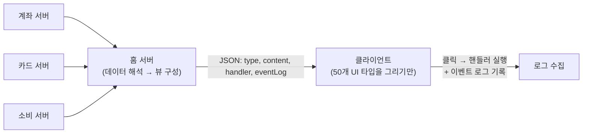

| | |
| --- | --- |
| 발표 | SLASH 23 |
| 연사 | 윤중현 (토스 홈팀 Server Developer) |
| 자료 | [발표 영상](https://www.youtube.com/watch?v=EuDOn7255gI) · [SLASH 23](https://toss.im/slash-23) |

토스 홈 화면을 담당하는 서버 개발자가 "서버가 데이터를 주고 클라이언트가 해석해 그린다"는 방식에서 "서버가 화면을 정의하고 클라이언트는 그리기만 한다"는 Server-driven UI(홈 DST)로 옮긴 이유와 구조를 설명하는 짧은 발표다. UI 컴포넌트 50개, 동작 핸들러 13개, 그리고 이벤트 로그까지 서버가 정의한다. 마지막에 한계와 "모든 화면에 쓰지는 않는다"는 결정이 있다. 내용은 발표 영상과 자동 생성 자막을 근거로 했고, 표현은 내 말로 바꿨다.

## 데이터 기반 설계의 한계

흔한 방식은 서버가 화면에 필요한 데이터를 주고 클라이언트가 그것으로 화면을 구성하는 것이다. 자산 영역이면 보유 계좌 목록을, 소비 영역이면 카드 목록과 이번 달 쓴 금액을 준다. 발표자는 이를 **데이터 기반 설계**라 이름 붙였다. 대부분의 니즈를 충족하고 홈팀도 쓰던 방식이지만 고민이 있었다.

- 홈에 기능을 배포할 때마다 사용자는 앱을 업데이트해야 하고 그때까지 기다려야 한다. 자산 섹션에 배너 하나 표시하려 해도, 클라이언트 버그가 나도 앱 업데이트다. 사용자가 최신 버전을 설치할 때까지 **최소 한 주**.
- 클라이언트가 여러 서버에서 데이터를 받아 취합해 그리므로 디버깅이 어렵다.

웹으로 만들면 앱 업데이트 없이 배포할 수 있어 두 문제는 풀리지만, 토스의 얼굴인 홈인 만큼 네이티브로 최고의 경험을 주고 싶었다. 그래서 만든 것이 **홈 DST**다. 서버가 "화면에 이렇게 표시해 주세요"라고 전달하고 클라이언트는 그 내용을 표시하기만 하는 스펙이다.

## 구조

예시 JSON은 `type: ListRow`로 시작한다. ListRow라는 이름의 UI를 그리라는 뜻이다. `content`에는 상단 행에 "토스뱅크 통장", 하단 행에 약 500만 원의 금액, `left`에는 토스뱅크 아이콘, `right`에는 "송금" 버튼이 정의되어 있다. **클라이언트는 데이터를 해석하지 않는다.** 서버가 모은 데이터를 직접 해석해 뷰를 구성하고 전달하면 클라이언트는 그 정보대로 그린다. ListRow처럼 UI를 정의하고 이름을 붙인 것이 **50개**이고, 이를 조합해 화면을 만든다.

**핸들러.** `right`의 하단에 `handler`가 있다. 클릭했을 때의 동작이다. `type: link`, `uri`에 계좌 상세 화면의 앱 스킴이 있어 클릭하면 그 화면으로 이동한다. 송금 버튼도 마찬가지로 링크 핸들러로 송금 화면으로 간다. 링크 외에 alert, bottom sheet, refresh 등 운영하면서 자주 쓰이는 패턴을 찾아 **13개**의 핸들러를 정의했다.

**이벤트 로그.** 토스팀은 모든 서비스의 런칭·종료를 데이터로 판단하고, 사용자가 어떤 항목에 반응했는지 통계를 내기 위해 앱 이벤트 로그를 기록한다. 데이터 기반 설계에서는 클라이언트를 개발할 때 하나하나 넣어야 해서 누락이 적지 않았고, 누락되면 앱을 또 업데이트하고 또 기다려야 했다. 홈 DST는 화면 표시 정보처럼 "송금 버튼을 클릭하면 이런 이벤트 로그를 남기세요"라는 정보도 함께 전달한다. 실제 기록되는 로그에는 토스팀 이벤트 로그의 고유 ID인 `schemaId`, 현재 표시 중인 UI를 알려주는 `elementType`과 `element`, ListRow 중 어느 부분을 클릭했는지 `clickPath`, 그리고 화면에 표시되지 않지만 분석에 필요한 계좌 타입 같은 데이터를 담는 `payload`가 있다. 이렇게 하니 iOS·Android 두 OS의 차이가 줄었고, 실수로 누락해도 서버 배포만으로 즉시 기록된다. 몇 명이 보았는지의 **impression 로그**도 DST에서 정의할 수 있게 설계되어 impression과 click 기반으로 분석한다.

이제 비교적 간단한 화면이라면 앱 배포 없이 서버 배포만으로 새 화면을 구성할 수 있다.

## 한계와 결정

홈 DST가 완벽한 것은 아니다. 도입 이유가 실수를 줄이고 앱 업데이트 없이 새 서비스를 쓰게 하는 것이었지만, **새로운 UI를 만든다면 결국 앱을 업데이트해야 하고** 버그는 언제나 발생한다. 서버에 모든 로직을 옮기기에도 현실적 문제가 있다. 한 화면을 위해 서버와 클라이언트가 분담하던 일이 서버로 옮겨가면서 **서버 개발자 리소스가 급격히 많이 필요**해졌다. 그래서 모든 화면을 홈 DST로 만들겠다는 결정은 하지 않았고, 네이티브·웹에 이어 하나의 서비스를 만드는 데 쓸 수 있는 **또 하나의 무기**로 가져간다. 이름에 "홈"이 들어갈 정도로 홈팀에 특화되어 있고 아직 전사로 확장되지 않았다. 앞으로 "홈"을 떼고 DST로 발전할 수 있도록 범용성과 사용성을 높일 예정이다.

## 리뷰

**이벤트 로그를 서버가 정의한다는 점이 이 발표에서 가장 토스다운 부분이다.** Server-driven UI 발표는 보통 "앱 업데이트 없이 화면을 바꾼다"에서 끝나는데, 여기서는 UI와 동작에 더해 **측정**까지 서버 스펙에 넣었다. 데이터로 서비스의 생사를 판단하는 조직에서 로그 누락은 UI 버그만큼 치명적이고, 그래서 로그도 배포 주기에서 풀어냈다. `schemaId`는 SLASH 21 [데이터 흐름 발표](/posts/slash21-toss-data-flow/)의 로그 센터 스키마 ID와 이어진다.

**한계 섹션이 정직하다.** 새 UI 타입은 여전히 앱 배포가 필요하고, 서버 개발자의 부담이 급증한다. 그래서 "전부"가 아니라 "무기 하나"로 위치를 정했다. SDUI를 도입하려는 팀이 가장 먼저 부딪히는 두 문제를 발표자가 먼저 말해준 셈이다. 다만 서버 리소스가 얼마나 늘었는지, 홈 서버의 응답 크기와 지연이 어떻게 변했는지 같은 수치는 없다.

**백엔드 관점에서 이 구조는 BFF(Backend for Frontend)의 극단이다.** 홈 서버가 여러 도메인 서버의 데이터를 모아 해석하고 뷰까지 만든다. 디버깅이 쉬워진 이유는 취합 지점이 클라이언트에서 서버로 옮겨져 로그와 재현이 한곳에서 되기 때문이다. 이 발표와 토스증권의 [Compose로 만든 증권 앱](/posts/tmc25-compose-securities-app/)을 함께 보면 계열사마다 SDUI에 대한 태도가 다르다는 것이 보인다.

## 남는 질문

- 홈 서버의 응답 JSON이 50개 타입의 조합이면 크기가 상당할 텐데, 응답 크기와 렌더링 시간은 데이터 기반 설계 대비 어떤지.
- 클라이언트가 모르는 UI 타입이나 핸들러를 받았을 때(구버전 앱)의 폴백. 무시하는지, 대체 UI를 그리는지.
- 서버가 뷰를 만들면 개인화·실험(A/B)이 서버 로직이 된다. 실험 플랫폼과 DST의 연결은 어떻게 되어 있는지.
- 서버 개발자 리소스 문제를 어떻게 풀 계획인지. 뷰 조립을 선언적으로 만드는 DSL이나 어드민 도구가 있는지.

## 참고

- [발표 영상](https://www.youtube.com/watch?v=EuDOn7255gI)
- [SLASH 23](https://toss.im/slash-23)
- [Airbnb - A Deep Dive into Airbnb's Server-Driven UI System](https://medium.com/airbnb-engineering/a-deep-dive-into-airbnbs-server-driven-ui-system-842244c5f5)
