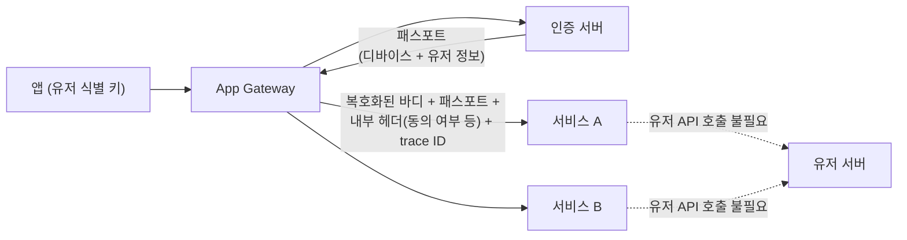
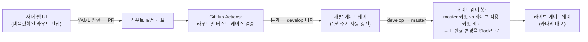

| | |
| --- | --- |
| 발표 | SLASH 23 |
| 연사 | 최준우, 오종훈, 김성현 (토스 Server Platform Team, Server Developer) |
| 자료 | [발표 영상](https://www.youtube.com/watch?v=Zs3jVelp0L8) · [SLASH 23](https://toss.im/slash-23) |

SLASH 21 [서버 기술 스택 발표](/posts/slash21-toss-server-stack/)에서 "Spring Cloud Gateway를 골랐고 게이트웨이를 하나 더 추가했다"고 한 지 2년 뒤, 토스 게이트웨이가 어떻게 여럿으로 나뉘고 무엇을 처리하고 어떻게 운영되는지 세 사람이 나눠 발표한다. 공통 로직(sanitize, trace ID, 내부 헤더, 패스포트), 보안과 안정성(종단 간 암호화, JWT, 요청 서명 검증, FDS 연동 차단, mTLS 인가, OIDC SSO, 서킷브레이커), 운영(리포지토리 분리, YAML 라우트, 사내 웹 UI, 게이트웨이 봇, z-score 이상 감지) 순이다. 내용은 발표 영상과 자동 생성 자막을 근거로 했고, 표현은 내 말로 바꿨다.

## 왜 게이트웨이인가, 왜 여러 개인가

서비스가 적으면 클라이언트가 서비스를 직접 호출하고 각 서비스가 인증이나 유저 정보 조회 같은 로직을 다 처리해도 부담이 없다. 서비스가 수없이 많아지면 공통 로직 변경을 모든 서버에 적용·배포하는 것이 큰일이 되고, 담당자가 놓치면 장애다. 앞에 공통 로직을 처리하는 서버를 두는 것이 게이트웨이 패턴이다. 요청이 오면 설정에 따라 라우팅하고 필터를 순서대로 실행한 뒤 업스트림으로 프록시한다. 라우트는 요청을 매칭하는 predicate(path, method, host)와 전처리·후처리를 하는 필터로 구성된다.

공통 로직을 몰아두면 게이트웨이가 하나의 커다란 모놀리식이 된다. 웹과 앱의 로직이 다른데 둘 다 가져야 한다. 클라이언트별 백엔드를 두는 **BFF(Backend for Frontend)** 패턴으로 관심사를 분리하고, 요청 방향에 따라 **인그레스·이그레스**로도 나눈다. 그래서 토스는 목적별로 게이트웨이를 개발해 쓴다.

| 게이트웨이 | 목적 |
| --- | --- |
| App Gateway | 앱 요청. 종단 간 암호화 복호화, 인증·인가 |
| Public Gateway | 웹 요청. JWT 검증 |
| Secure Gateway | mTLS 인증서 검증 |
| SSR Gateway | 서버 사이드 렌더링 서버의 API 요청 |
| Internal Service Gateway / Internal Secure Gateway | 사내 요청. OIDC SSO, 개발자 인증서 |
| Egress Gateway (계열사별) | 계열사로 나가는 아웃바운드 트래픽 |

Spring Cloud Gateway로 만든다. Spring WebFlux 위에서 Reactor Netty로 비동기 처리하고, 필터 개발에 Kotlin 코루틴을 적극 쓰며, Istio 인그레스·이그레스 게이트웨이와 EnvoyFilter와 유기적으로 개발한다.

## 공통 로직: 요청 처리와 유저 처리

**Sanitize.** 게이트웨이가 먼저 해야 하는 것은 클라이언트의 올바르지 않은 요청을 지우거나 올바른 값으로 바꾸는 것이다. 사용자가 악의적으로 값을 넣어도 게이트웨이가 바꿔서 서비스에 넘긴다.

**Trace ID.** 서비스의 진입점이므로 마이크로서비스 내 트랜잭션을 구분할 trace ID를 생성해 전파한다. 각 서비스는 MDC에 저장해 로그에 남긴다.

**내부 헤더.** 한 트랜잭션 안에서 여러 서비스가 공통으로 필요한 정보가 있다. 기존에는 모든 서비스가 공통 API를 각각 호출해 중복 요청이 생겼다. 게이트웨이가 공통 정보를 내부 헤더로 주입해 전파하고 서비스는 헤더에서 꺼내 쓴다. 예를 들어 사용자 동의 여부가 필요하면 게이트웨이가 동의 여부를 헤더에 넣어 전파하고, 각 서비스는 약관 API를 호출할 필요 없이 헤더를 읽는다.

**패스포트.** 기존에는 유저 정보가 필요할 때마다 유저 API를 호출해 중복 요청과 리소스 낭비가 있었다. Netflix의 Passport 구조를 참고했다. Netflix는 유저 인증 시 Passport라는 ID 토큰을 트랜잭션 내로 전파한다. 토스에 맞게 바꿔 **토스 패스포트**를 구현했다. 앱이 유저 식별 키와 함께 API를 요청하면 게이트웨이가 그 키로 인증 서버에 패스포트를 요청하고, 디바이스 정보와 유저 정보가 담긴 패스포트를 직렬화해 서비스에 전파한다. 유저 정보가 필요한 서비스는 유저 API 호출 없이 패스포트를 쓴다.

## 보안

**종단 간 암호화.** 토스 앱의 대부분 API는 종단 간 암호화로 패킷 분석의 허들을 높인다. 앱이 요청 바디를 암호화하고 App Gateway가 복호화해 서비스에 전달한다. 복호화 과정에서 인증·인가가 처리되고 복호화된 데이터와 유저 정보가 서비스로 넘어가므로 서비스는 편하고 안전하게 요청을 처리한다.

**JWT.** 프론트엔드 SSR처럼 종단 간 암호화를 쓰기 어려운 스펙을 위해 JWT API 요청도 지원한다. 클라이언트가 매 요청마다 새 토큰을 만들어 Public Gateway에 보내면 서명값, 유효기간, 중복 사용 여부, 만료 여부를 검증해 리플레이 어택과 토큰 변조를 막는다. 검증된 토큰은 프론트엔드 Node 서버로 전달되고, Node 서버는 그 토큰으로 SSR Gateway를 통해 업스트림에 접근하며, SSR Gateway는 토큰으로 유저 정보를 가져와 적절한 업스트림에 전달한다. 게이트웨이는 접근 토큰이 유효한지 내부 인가 서버에 질의한 뒤 요청 API가 그 토큰의 접근 범위인지 판단한다.

**요청 서명 검증.** 인증·인가를 넘어 각 요청이 **위변조되지 않은 토스 앱에서 만든 요청인지**도 검증한다. 토스 앱은 매 요청을 서명할 아주 짧은 유효기간의 안전한 키와 변조되지 않은 토스 앱만 알 수 있는 정보로 각 요청을 서명해 보낸다. 게이트웨이는 서명값으로 토스 앱에서 만든 요청인지, 중복 사용되지 않았는지, 만료된 키로 만들지 않았는지 검증해 앱 위변조·지연된 요청·리플레이 어택을 막고, 의심스러우면 FDS를 통해 계정을 비활성화한다.

**FDS 연동 정교 차단.** 요청 단위 검증을 넘어 유저의 모든 행위 로그를 분석해 브루트 포스 정보 획득, 앱 분석 시도 등 수많은 룰로 탐지한다. FDS가 의심 행동을 감지하면 게이트웨이에 정보를 보내고, 게이트웨이는 IPS 차단처럼 전체 서비스를 막는 것이 아니라 **특정 유저·IP·디바이스가 특정 API나 서비스를 이용하지 못하도록** 정교하게 차단한다.

**mTLS 인가.** 외부 회사나 내부 개발자를 위해 클라이언트 인증서 기반 mTLS API 호출도 지원한다. Istio의 mTLS 흐름 위에 레이어를 하나 더 얹어 인증·인가를 처리한다. Istio만으로 할 수도 있지만 코드 기반 애플리케이션이 Istio의 매칭 룰보다 자유도가 높고 감사(audit) 로직을 처리할 수 있으며 카나리 배포의 이점을 늘릴 수 있어 게이트웨이가 담당한다. 엣지에서 Istio가 클라이언트 인증서의 CA 유효성을 확인한 뒤 인증서 정보를 헤더에 실어 게이트웨이에 전달하고, 게이트웨이는 인증서를 디코드해 X.509 확장의 Subject Alternative Name에서 사용자 정보를 얻고, 사용자·목적지 호스트·경로로 인증·인가와 감사를 한다. 내부 개발자의 스테이징 요청도 이 인증서로 관리한다. 액세스 토큰이나 IP 화이트리스트로도 할 수 있지만 단순 인가만 가능해 실제 사용자 정보로 감사하기 어렵고, 디버깅용이라 호환성이 중요한데 클라이언트 인증서 등록은 curl, Postman, 여러 프레임워크에서 범용적으로 쉽게 설정할 수 있어 허들을 낮추면서 안전하다고 판단했다.

**OIDC SSO.** 사내 웹 서비스의 인증·인가도 게이트웨이가 대신 처리한다. Internal Service Gateway가 OIDC 프로바이더와 OIDC 플로로 액세스 토큰을 가져와 Redis 세션 스토어로 관리한다. 사내 웹 서비스를 만드는 팀은 로그인 페이지나 로직 없이 사내 SSO로 페이지별 인증·인가를 할 수 있고, OIDC를 지원하지 않는 오픈소스 플랫폼(Kibana, Pinpoint, 쿠버네티스 대시보드)에도 인증을 붙일 수 있다.

## 안정성: 서킷브레이커

MSA에서는 서비스가 거미줄처럼 상호작용하므로 한 서비스의 응답 지연이 의존하는 수많은 서비스로 전파되고, 퍼진 지연이 시스템 자원을 점유해 전체가 먹통이 된다. 지연을 유발하는 서비스에 요청을 더 보내지 않고 빠르게 실패해 회복을 돕고 확산을 막는 것이 서킷브레이커다. 내부 서비스 간 서킷브레이킹도 중요하지만 **근원적인 트래픽을 만드는 클라이언트에게 백프레셔를 빠르게 주려면** 게이트웨이에서 거는 것이 중요하다. Istio를 쓰면 호스트 단위로 쉽고 빠르게 전체 적용되고 애플리케이션 개발 주기와 독립적이지만, 호스트 단위로만 가능하고 룰에 한계가 있다. 토스는 각 애플리케이션과 게이트웨이에 Resilience4j 같은 라이브러리로 **호스트·라우트·기능 단위**로 정교하게 건다.

## 운영

**리포지토리 분리.** 초기에는 모든 게이트웨이 구현 코드와 Java로 작성된 라우트 설정이 한 모노레포에 있었다. 코드 공유는 됐지만, 금융 서비스라 배포 시 증적을 남겨야 하는데 한 게이트웨이를 배포할 때 다른 게이트웨이의 변경 사항이 함께 감지되어 증적 관리가 불편했다. 게이트웨이를 각각의 리포지토리로 쪼개고 공통 로직은 라이브러리로 만들어 import한다.

**YAML 라우트.** Java 코드 라우트 설정에 익숙하지 않은 개발자의 실수로 잘못된 라우트가 배포되는 경우가 빈번했다. 설정을 모두 YAML로 마이그레이션하고 별도 라우트 설정 리포지토리로 분리했다. 가독성이 좋아졌고 각 게이트웨이는 Spring Cloud Config로 설정을 import해 코드와 설정을 완전히 분리했다.

**사내 웹 UI.** 서비스 개발자가 각 게이트웨이의 라우트 설정을 확인하고 템플릿화된 설정으로 추가·수정할 수 있다. UI에서 수정하면 YAML로 변환되어 라우트 리포에 PR이 올라오고, GitHub Actions가 라우트 목록과 라우트별로 정의된 테스트 케이스를 불러와 검증한 뒤 develop에 머지한다. 개발 게이트웨이는 1분 주기로 설정을 자동 갱신하므로 설정한 개발자가 바로 테스트한다.

**게이트웨이 봇.** 라이브는 자동 갱신이 위험하므로(발견되지 않은 설정 오류나 환경 차이) 다른 애플리케이션처럼 카나리로 점진 배포한다. 그런데 신규 라우트가 배포된 줄 알았는데 실제로는 없어 404가 쏟아지는 일이 생겼다. master에 머지한 뒤 실수로 배포를 안 한 것이다. 이를 막기 위해 봇이 주기적으로 master의 최신 커밋과 라이브 게이트웨이에 적용된 설정의 커밋을 비교해 변경 사항을 Slack으로 관리자에게 알린다. 관리자가 점진 배포해 최신화한다.

**모니터링.** 게이트웨이를 지나는 모든 요청·응답의 라우트 ID, 메서드, URI, 상태 코드 등을 Elasticsearch에 남긴다. Istio 사이드카 Envoy 로그로 소스·목적지, 상태 코드, 실패 원인을 상세히 보고 B3 span 정보로 트랜잭션을 추적하며 홉별 네트워크 지연도 본다. 메트릭은 node exporter의 시스템 메트릭과 Spring Actuator의 애플리케이션 메트릭을 Prometheus가 수집해 Grafana로 시각화하고 Slack으로 알린다. Spring Cloud Gateway의 라우트별 메트릭에 **path 값을 더해 API 경로별** 상태 코드, 평균·최대 응답 시간, 호출 수로 업스트림 상태를 확인하고, 서킷브레이커 지표로 라우트별 서킷 오픈과 타임아웃을 본다. 여기에 **z-score 이상 감지**를 쓴다. 배포나 외부 원인으로 장애가 나면 4xx·5xx가 갑자기 솟구치는데, 에러 개수를 z-score로 변환해 스파이크를 감지한다. 트레이싱은 Pinpoint로 트랜잭션 내 트래픽 흐름과 실패 지점을 보고 콜스택으로 문제 지점을 특정한다.

## 리뷰

**요청 서명 검증과 FDS 연동 차단이 이 발표에서 가장 금융 앱다운 부분이다.** 인증(누구인가)과 인가(무엇을 할 수 있는가)를 넘어 "이 요청이 정품 앱에서 지금 만들어진 것인가"를 검증하고, 의심되면 서비스 전체가 아니라 특정 유저·디바이스·API 조합만 막는다. 게이트웨이가 보안 정책의 실행 지점이 되면서 FDS 같은 분석 시스템의 결정을 트래픽에 즉시 반영할 수 있게 된 구조다.

**"Istio가 아니라 게이트웨이에서"의 이유가 두 번 나온다.** mTLS 인가(자유도, 감사, 카나리)와 서킷브레이커(호스트 단위의 한계). 2년 전 [서버 스택 발표](/posts/slash21-toss-server-stack/)에서 "재시도·서킷브레이커는 애플리케이션에 남았다"고 한 것의 연장이고, 서비스 메시와 애플리케이션 게이트웨이의 역할 분담을 토스가 어떻게 정했는지 보여준다. 코드로 할 수 있는 것은 코드로, 인프라는 암호화와 라우팅.

**게이트웨이 봇은 작지만 중요하다.** "머지했는데 배포를 안 했다"는 실수를 사람의 주의가 아니라 커밋 비교로 잡는다. 같은 해 토스뱅크의 [파이프라인 발표](/posts/slash23-deploy-pipeline/)가 렌더링 diff로 의도하지 않은 변경을 잡은 것과 같은 결이다. 자동 갱신을 라이브에서 일부러 끄고 그 대신 드리프트 감지를 붙인 구성은 [쿠버네티스 운영 발표](/posts/slash21-safe-kubernetes-operations/)의 auto-sync 끄기와도 같다.

## 남는 질문

- 패스포트를 매 요청마다 인증 서버에서 받아온다면 인증 서버가 새 병목이 된다. 게이트웨이에서 캐싱하는지, 패스포트의 유효기간은 얼마인지.
- 요청 서명에 쓰는 "토스 앱만 아는 정보"는 앱 무결성 증명(attestation)에 가까운데, 루팅·탈옥 기기나 에뮬레이터는 어떻게 다루는지.
- 게이트웨이가 여덟 종류 이상이면 공통 라이브러리 버전 업을 전부에 적용하는 것이 부담이다. 게이트웨이 간 버전 편차는 어떻게 관리하는지.
- z-score 이상 감지의 윈도우와 임계값. 새벽처럼 트래픽이 적을 때 오탐은 어떻게 막는지.

## 참고

- [발표 영상](https://www.youtube.com/watch?v=Zs3jVelp0L8)
- [SLASH 23](https://toss.im/slash-23)
- [Netflix - Edge Authentication and Token-Agnostic Identity Propagation](https://netflixtechblog.com/edge-authentication-and-token-agnostic-identity-propagation-514e47e0b602)
- [Spring Cloud Gateway](https://spring.io/projects/spring-cloud-gateway)
