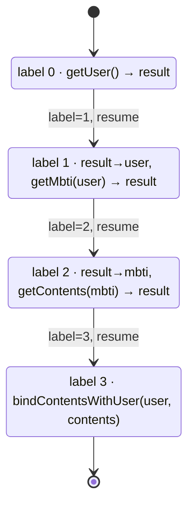
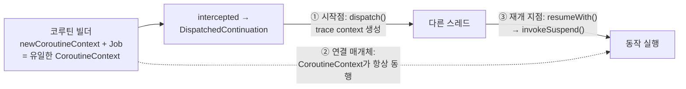

| | |
| --- | --- |
| 발표 | SLASH 23 |
| 연사 | 구태진 (토스 Server Platform Team, Server Developer) |
| 자료 | [발표 영상](https://www.youtube.com/watch?v=MA7B9bJCwYk) · [SLASH 23](https://toss.im/slash-23) |

토스는 APM으로 Pinpoint를, 비동기 프로그래밍에 Kotlin 코루틴을 쓴다. 문제는 Pinpoint가 코루틴을 지원하지 않아 코루틴을 넘는 순간 추적이 끊긴다는 것이다. 발표자는 코루틴 플러그인을 직접 만들기 위해 `suspend` 함수가 컴파일된 바이트코드를 Java로 디컴파일해 읽고, 추적 문맥을 심을 시작점·전달 매개체·재개 지점 세 곳을 찾아낸다. 후반은 연결된 추적 데이터를 HBase에서 직접 읽어 "한 요청이 내부 요청 328번을 만든다"는 관찰에서 불필요한 호출을 찾아 특정 API의 응답 시간을 50% 이상 줄인 이야기다. 내용은 발표 영상과 자동 생성 자막을 근거로 했고, 표현은 내 말로 바꿨다.

## 문제: Pinpoint + 코루틴 = 끊어진 추적

Pinpoint는 여러 기능으로 관측성을 제공하지만 특히 분산 추적에 강하다. 유저 요청을 처리하기 위해 토스 안에서 파생되는 모든 요청과 정보를 확인할 수 있고, 응답을 못 받으면 어느 서비스가 문제인지, 늦으면 어디서 지연됐는지 한눈에 본다.

토스는 서버 리소스를 최대한 활용하기 위해 주로 비동기 방식으로 개발한다. 동기 방식은 모든 연산을 순서대로 처리하므로 요청이 서버에 오래 머문다. 비동기는 여러 연산을 동시에 처리해 빠른 응답을 준다. 이를 위해 최적화된 비동기 코드를 쉽게 만들어주는 Kotlin 코루틴을 쓴다. 비슷한 역할의 RxJava와 비교하면 코루틴은 러닝 커브가 낮으면서 효율이 좋다.

둘을 함께 쓰면 Pinpoint에서 모든 요청이 연결이 끊어진 채로 보인다. Pinpoint가 코루틴을 지원하지 않기 때문이다. 관측성에는 Pinpoint가, 리소스 활용에는 코루틴이 반드시 필요해서 코루틴 플러그인을 직접 만들기로 했다.

## Pinpoint의 비동기 추적 방식

플러그인을 만들려면 대상 프레임워크의 특징을 파악해야 한다. 먼저 단순한 비동기 라이브러리인 `AsyncRestTemplate`으로 Pinpoint가 비동기를 어떻게 추적하는지 본다. 메인 스레드에서 `executeAsync`가 호출되는데 이것이 비동기 HTTP 요청의 시작점이다. 여기서 Pinpoint의 trace context를 생성해 연결 매개체에 저장한다. 스레드가 바뀐 곳에서 응답을 받아 `ListenableFuture.set`으로 결과를 저장하는데, 이때 연결 매개체에서 context를 가져와 기록한다. 시작점 메서드와 비동기 스레드의 의미 있는 메서드의 공통점은 직접 또는 간접적으로 `ListenableFuture`를 갖는다는 것이고, 이것이 trace context를 옮기는 매개체다. 즉 코루틴에서도 시작점, 연결 매개체, 재개 지점 셋을 찾으면 된다.

## 코루틴은 컴파일되면 무엇이 되나

예제는 유저를 조회하고, MBTI 성향을 확인하고, MBTI에 맞는 콘텐츠를 가져오고, 콘텐츠와 유저를 연결해 반환하는 단순한 메서드다. 동기 코드를 코루틴으로 바꾸려면 호출 지점에서 코루틴 빌더로 감싸고 정의 지점에 `suspend`를 붙이면 된다. 이것이 가능한 이유는 Kotlin 컴파일러가 `suspend` 메서드를 다른 형태로 변형하기 때문이다. 발표자는 바이트코드를 Java로 디컴파일해 그 변형을 읽었다.

발표자의 설명으로는 코루틴은 효율적인 비동기 실행을 위해 한정된 스레드를 [이벤트 루프](/posts/nio-and-event-loop/) 형태로 써서 스레드 풀 지옥을 최소화한다. 이벤트 루프는 한 번에 많은 로직이 수행되지 않게 해야 하고 인자·결과를 주고받는 방법이 정형화되어야 하므로 제약이 많다. RxJava는 이 제약을 가진 채 이벤트 루프로 동작하는 프레임워크라 개발 난이도가 매우 높다.

디컴파일된 코드에서 `getContentByUser`는 `getContentByUser$suspendImpl`로 바뀌고, 첫 부분에 Continuation을 재정의하며 몇 개의 변수와 `invokeSuspend` 메서드를 갖는다. Continuation 인터페이스는 `CoroutineContext`를 프로퍼티로, 동작을 재개하는 `resumeWith`를 메서드로 갖는다. 그 뒤 `switch`문이 나오는데, label 값에 따라 실행되는 동작이 나뉜다. 아래 그림은 예제 메서드의 label 전이를 그린 것이다.

label 0은 유저 조회, 1은 유저로 MBTI 조회, 2는 MBTI로 콘텐츠 조회, 3은 연결이다. 각 분기는 Continuation 재정의부에 선언된 변수를 쓴다. case 0에서 `getUser`를 호출해 결과를 Continuation의 `result`에 저장하고, case 1에서 저장된 `result`를 `user` 변수에 옮겨 `getMbti`를 호출하고 결과를 다시 `result`에 저장하는 식이다. 즉 Continuation 객체가 메서드 실행에 필요한 변수를 선언하고 필요할 때 제공한다. 메서드의 동작은 여전히 네 가지지만, 한 번 호출로 네 동작이 실행되던 것이 label 값을 바꿔가며 네 번 호출하는 형태로 바뀌었다. 각 분기가 다음 label을 지정하므로 별다른 조작 없이 호출만으로 기존과 같은 결과가 된다.

Continuation이 label로 실행 상태를 부여하고 다른 변수들로 나뉜 로직에 영속성을 부여했기 때문에, Continuation만 전달하면 그 시점에 필요한 동작을 실행할 수 있다. 이것이 Continuation Passing Style(CPS)이고, 변수로 상태를 관리해 호출되는 메서드가 바뀌는 패턴이 상태 머신이다. Kotlin 코루틴 설계 문서(KEEP)도 suspend 함수가 CPS로 구현되어 `Continuation` 매개변수를 하나 더 받는다고 설명하고, 컴파일 방식을 "a suspending function is compiled to a state machine, where states correspond to suspension points"(suspend 함수는 중단 지점마다 상태가 하나씩 대응하는 상태 머신으로 컴파일된다)라고 요약한다([KEEP: Coroutines](https://github.com/Kotlin/KEEP/blob/master/proposals/coroutines.md#state-machines)). 한 번에 많은 로직이 호출되지 않고 인자·결과 전달이 정형화되어 이벤트 루프에 적합한 형태가 됐다. 컴파일러는 로직 실행 후 메서드를 종료하지 않고 다른 로직을 이어 실행하는 것이 효율적이라 판단하면 `goto`를 써서 객체 생성과 연산을 생략한다.

`resumeWith` 구현체를 보면 `invokeSuspend`가 여기서 실행되고, 그 결과가 `COROUTINE_SUSPENDED` 정적 변수면 즉시 종료한다. 두 번째 메서드 `getMbti`가 `COROUTINE_SUSPENDED`를 반환하면 남은 동작은 어떻게 되나. 그것은 새로운 suspend 메서드가 실행됐다는 뜻이고, 다른 Continuation의 `resumeWith`가 실행된다. 새 Continuation의 `invokeSuspend`가 끝나면 완료되고, 변수로 갖고 있는 `completion` Continuation이 실행 가능한지 확인해 가능하면 current를 completion으로 대체하고 다시 `invokeSuspend`를 실행한다. 여기서 기존 Continuation이 못 했던 동작이 다시 실행된다.

## 호출 지점: 빌더, 디스패처, 컨텍스트

`launch`, `async`, `withContext`, `withTimeout`, `runBlocking`처럼 코루틴을 활성화하는 함수가 코루틴 빌더다. 빌더는 새 코루틴 객체를 만들고 `start`를 호출하며, 내부에서 메서드가 체인으로 실행된다. `intercepted`에서 코루틴 인터셉터 기능을 현재 Continuation에 추가하는데, 보통 여기서 동작을 비동기 스레드로 전달하기 위해 Continuation을 `DispatchedContinuation`으로 감싼다. 이것은 생성자로 `CoroutineDispatcher`를 받고 `resumeWith`로 Continuation을 실행하며, 다른 스레드가 필요하다고 판단되면 디스패처의 `dispatch`를 호출해 자기 자신을 지정 스레드로 전달한다. `dispatch`의 인자는 `Runnable`인데 `DispatchedContinuation`이 `Runnable`을 구현하기 때문에 가능하고, 이 특성 덕에 코루틴이 제공하는 워커가 아닌 다른 스레드 풀에서도 Continuation을 실행할 수 있다.

여기까지로 시작점은 `CoroutineDispatcher.dispatch`, 재개 지점은 `Continuation.resumeWith`가 적합해 보인다. 남은 것은 둘 사이의 연결 매개체다. `CoroutineContext`는 Continuation 인터페이스가 유일하게 갖는 프로퍼티이고 맵처럼 다양한 값을 가질 수 있다. 빌더는 가장 먼저 `newCoroutineContext`로 현재 스코프의 컨텍스트에 인자 컨텍스트를 더해 새 컨텍스트를 만들고, 코루틴 객체를 생성할 때 그 컨텍스트에 자기 자신을 더한다. 코루틴 클래스가 `Job`을 구현하고 Job이 `CoroutineContext.Element`를 확장하기 때문이다. 고유한 Job이 더해졌으므로 이 코루틴의 컨텍스트는 유일한 값이 된다. 그래서 빌더로 코루틴을 만들면 컨텍스트에 의해 트리 구조가 그려지고, 부모 컨텍스트의 Job을 조회해 Job 관계를 구성해 코루틴 간 연결을 유기적으로 묶는다. 이것이 structured concurrency다.

빌더부터 재개까지를 이어 보면, 코루틴은 빌더에 전달된 컨텍스트와 코루틴 객체의 Job을 더한 유일한 컨텍스트를 가진 채 실행되고, `intercepted`로 `DispatchedContinuation`이 되어 `resumeWith`로 다른 스레드에 전달되며, 전달받은 스레드가 안의 Continuation을 꺼내 `resumeWith` → `invokeSuspend`를 호출해 비동기 동작이 완성된다. 이 과정에서 새로 만든 컨텍스트가 항상 함께한다. 그래서 연결 매개체는 `CoroutineContext`다. 세 지점을 이용해 Pinpoint 개발 문서에 따라 플러그인을 만들어 적용하니 정상 추적되고, 콜스택에서 그 메서드들이 연결의 핵심 요소임이 확인된다.

## 연결되고 나서 보인 것: 한 요청에 내부 요청 328번

이제 Pinpoint에서 유저 요청에서 파생되는 모든 요청을 볼 수 있게 됐다. 조회하던 중 의문이 들었다. 한 요청의 결과를 만들기 위해 가장 많이 파생된 내부 요청 수가 캐시·DB 조회를 빼고 328번이었다. 모두 의미 있는 요청인지 파악할 필요가 있었다.

Pinpoint의 저장소는 HBase다. Hadoop HDFS 위의 분산 컬럼 기반 키-값 DB로, row key 설계를 알맞게 하면 대용량 처리에 굉장한 성능을 보인다. Pinpoint 스캐터 차트의 점 하나하나가 외부에서 들어온 요청이고, 연관 테이블은 `ApplicationTraceIndex`다. row key는 애플리케이션 이름 + 요청 시간 조합이라 이름과 시간 범위를 지정하면 굉장히 효율적으로 데이터를 가져올 수 있고, 수십만 건의 요청 정보도 수초면 된다. 컬럼 패밀리는 둘로, index는 스캐터 차트의 점을 그리는 정보, meta는 드래그 앤 드롭 시 보여주는 시작 시간·경로·요청자 IP·트랜잭션 ID 등이다.

트랜잭션 ID는 최초 요청을 받은 서비스(API 게이트웨이)가 만들고 파생된 모든 요청이 같은 값을 갖는다. meta 컬럼 패밀리가 qualifier로 트랜잭션 ID를 저장하므로, 특정 시간 동안 유저 서비스의 요청을 조회하면 트랜잭션 ID 기준으로 유저 서비스가 호출된 요청을 찾을 수 있다. 하나의 송금 요청 안에 동일한 요청이 포함되어 있다면, HBase의 수십만 건을 가져와 트랜잭션 ID별로 분류해 동일 HTTP API의 중복 호출 여부와 양을 파악할 수 있다. 이로써 불필요한 요청이 발생한 많은 경우를 찾았다. 한 서비스 안의 불필요한 요청은 코드 변경으로 제거했고, 분산 환경에서 나뉘어 발생하는 것은 [API 게이트웨이의 내부 헤더 릴레이](/posts/slash23-toss-gateway/)를 적절히 이용해 제거했다.

작업 자체는 어렵지 않았다. 그렇지만 서비스가 완성되어 잘 동작하기 시작하면 내부 동작에 신경 쓰지 않아 비효율이 방치되는 경우가 많은데, 이를 손쉽게 찾게 되어 지속적 관리가 가능해졌다. 결과로 앱이 직접 호출하는 특정 API의 응답 시간이 50% 이상 개선됐고 많이 호출되는 여러 API도 개선됐으며, 서비스 간 요청량이 90% 이상 줄어든 경우도 있었다. 발표자는 "연결되지 않은 곳에서 하나의 점으로 전체를 연결한" 결과가 유저에게는 시간을, 토스에는 리소스를 줄여 안정성을 가져다줬다고 정리했다.

## 리뷰

발표의 절반이 코루틴 디컴파일 해설이고, 그 해설이 곧 플러그인 설계의 근거다. "Pinpoint가 코루틴을 지원하지 않는다"에서 멈추지 않고 CPS 변환, 상태 머신, `COROUTINE_SUSPENDED`, `DispatchedContinuation`, Job이 컨텍스트를 유일하게 만드는 이유까지 내려가 세 지점을 도출한다. 코루틴 내부 설명을 "추적 문맥을 어디에 실을 것인가"라는 질문에 맞춰 읽었기 때문에, 나에게는 바이트코드 설명이 지루하지 않았다.

이 플러그인은 Pinpoint 오픈소스에도 들어가 있다. Pinpoint 저장소에는 2021년 12월 8일 발표자와 같은 이름(Taejin Koo)으로 올라온 "Support Kotlin Coroutines Plugin" 커밋이 있고([f31832c](https://github.com/pinpoint-apm/pinpoint/commit/f31832cd105621cb0149f984c2fb9fc0f8195a7d)), 플러그인 디렉터리는 [v2.4.0 태그](https://github.com/pinpoint-apm/pinpoint/tree/v2.4.0/plugins/kotlin-coroutines)에 포함돼 있다. 2022년 1월 커밋 메시지는 추적 대상을 `Task.runSafely`에서 `resumeWith`로 바꿨다고 적는데, 발표가 재개 지점으로 꼽은 메서드와 같다.

후반의 HBase 직접 조회는 APM을 UI로만 쓰지 않는다는 태도로 읽힌다. 스캐터 차트로 한 건씩 보는 대신 row key 설계를 이해하고 수십만 건을 긁어 트랜잭션별로 집계했다. 같은 해 토스페이먼츠 [Observability 발표](/posts/slash23-observability-tracing-logs/)가 액세스 로그로 API 의존성을 뽑은 것과 목적이 같고, 데이터 소스가 다르다. 두 발표를 합치면 "추적 데이터를 집계하면 아키텍처 부채가 보인다"는 결론이 된다.

328번이라는 숫자와 90% 감소는 코루틴 플러그인의 가치를 보여주는 데 쓰였다. 관측성 도구를 고친 것 자체보다, 고친 뒤 무엇이 보였고 그것으로 무엇을 바꿨는지가 발표의 무게 중심이다.

## 남는 질문

- 토스가 운영하는 플러그인이 Pinpoint 저장소의 `kotlin-coroutines` 플러그인과 같은 코드인지, 내부에서 따로 고친 부분이 있는지.
- `dispatch`를 시작점으로 잡으면 디스패처를 거치지 않는 코루틴(같은 스레드에서 이어지는 경우, `Dispatchers.Unconfined`)은 어떻게 추적되는지.
- trace context를 `CoroutineContext`의 Element로 넣으면 컨텍스트 복사 비용이 생긴다. 고부하 서비스에서 플러그인의 오버헤드는 얼마였는지.
- 328번 요청의 원인은 무엇이었는지. N+1 스타일의 반복 호출인지, 여러 서비스가 같은 유저 정보를 각자 조회한 것인지.

## 참고

- [발표 영상](https://www.youtube.com/watch?v=MA7B9bJCwYk)
- [SLASH 23](https://toss.im/slash-23)
- [Pinpoint](https://github.com/pinpoint-apm/pinpoint)
- [Kotlin 코루틴 설계 문서 (KEEP)](https://github.com/Kotlin/KEEP/blob/master/proposals/coroutines.md)
- [Pinpoint kotlin-coroutines 플러그인 (v2.4.0)](https://github.com/pinpoint-apm/pinpoint/tree/v2.4.0/plugins/kotlin-coroutines)
