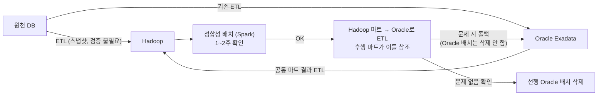

| | |
| --- | --- |
| 발표 | SLASH 23 |
| 연사 | 김용휘 (토스뱅크 Data Platform Team Leader) |
| 자료 | [발표 영상](https://www.youtube.com/watch?v=RjsG-zKMuX8) · [SLASH 23](https://toss.im/slash-23) |

은행의 정보계(DW)를 Oracle Exadata에서 Hadoop 오픈소스 스택으로 옮긴 기록이다. 왜 옮겼는지(중복 시스템, 10배 비용, 용량 한계), 무엇으로 대체했는지(Airflow, HDFS+Kudu, Spark, Ranger, Debezium), 잘 돌고 있는 시스템을 정합성을 보장하며 어떻게 단계적으로 옮겼는지, 그리고 Impala로 시작했다가 Spark로 바꿔 마이그레이션 비용을 1/3로 줄인 회고, 마지막으로 전자금융감독규정 29·30조를 Airflow와 GoCD, 자체 승인 서비스로 어떻게 만족했는지까지 다룬다. 내용은 발표 영상과 자동 생성 자막을 근거로 했고, 표현은 내 말로 바꿨다.

## 왜 재구축했나

토스뱅크는 초기에 타 은행 구조를 그대로 따라 계정계·채널계·정보계로 구성됐다. 정보계는 고객 거래 데이터로 통계·분석을 내는 영역이다. 그런데 로그 데이터 분석이나 CSS·FDS 관리처럼 빅데이터를 다루는 영역에서 Hadoop이 필요했고, 채널계와 계정계의 경계를 허물면서 MySQL뿐 아니라 MongoDB 같은 NoSQL도 금융 거래 DB로 도입되어 이를 모두 Hadoop으로 보내 분석하고 있었다. 하지만 보고서나 단위 업무를 위해 Hadoop의 데이터를 **다시 Oracle Exadata로 보내야** 하는 불필요한 이동이 있었고, 대용량 처리 시스템이 둘로 나뉘어 있었다. 하나로 통일하려 할 때 같은 용량 기준으로 Exadata는 Hadoop보다 **약 10배 이상 비쌌고**, 아키텍처상 용량 한계가 있어 매우 큰 데이터를 담을 수 없었다. 그래서 Exadata의 정보계 단위 업무를 Hadoop으로 이관하기로 했다.

걱정은 셋이었다. DW에 쓰이는 Exadata 외의 기술 컴포넌트(스케줄러, CDC 등)를 무엇으로 대체할 것인가. 한국은행·금감원 같은 대외기관에 공시·보고 의무가 있어 **기존 시스템과 동일한 값**을 어떻게 보장할 것인가. 이미 구축된 상황에서 옮기는 비용이 그대로 쓰는 것보다 크지 않을까.

## 대체 기술

| 역할 | 기존 | 대체 | 비고 |
| --- | --- | --- | --- |
| 스케줄러 | 상용 스케줄러 (SSH 원격 실행) | Apache Airflow | 공식 Helm 차트로 k8s에 설치, 스케일 아웃 쉬움. 코드로 파이프라인을 써서 GitHub와 함께 쓰면 검색이 쉬움. Impala·Spark 오퍼레이터, Java·Kotlin 프로그램은 Docker 이미지로 KubernetesPodOperator |
| 스토리지 | Oracle 내장 (PK + 보조 인덱스) | HDFS + Kudu | HDFS는 PK 미지원, Kudu는 PK만 지원. 대부분의 DW는 PK만으로 무방 |
| 쿼리 엔진 | Oracle (PL/SQL) | Impala → Spark | Impala는 UDF는 되지만 쿼리 결과를 변수에 담아 다음 쿼리에 쓰기 어려움. Spark는 SQL + Java·Scala·Python으로 자유도 최고 |
| 접근 제어 | Oracle 내장 | Sentry → Apache Ranger | Sentry는 Apache에서 retired, Impala 4부터 미지원 |
| ETL | 상용 (DB 파일 기반, 부하 적음) | 오픈소스 (쿼리 엔진 기반, 부하 큼) | 추출 쿼리에 맞게 인덱싱이 중요. 대신 자유도 높음 |
| CDC | Oracle GoldenGate | Debezium | MySQL·MongoDB 등 오픈소스 DB와 호환 좋음 |

**CDC 세부.** Oracle CDC에서 LogMiner는 무료지만 성능이 떨어지고, continuous mine이 19c부터 deprecated되어 폴링마다 로그 마이닝 세션을 새로 만든다. XStream API는 유료지만 개발 환경 테스트에서 약 2.8배, 라이브에서는 로그 스위치가 더 빈번해 매번 딕셔너리 빌드와 세션 생성이 일어나므로 **약 20배 이상** 처리량 차이가 났다. ETL·CDC는 서비스 DB에 부하를 줄 수 있어 읽기 전용 DB를 두고, 계정계 Oracle은 CDC DB를 통해 가져가되 업데이트가 일어나는 테이블에는 업데이트 시각 필드를 꼭 추가해 변경분만 ETL하도록 한다.

**Airflow 세부.** 배치 잡의 선후행은 비트 연산자로 설정하고 배열로 감싸면 병렬 실행이 된다. 다른 DAG의 태스크와 선후행을 걸 때 Airflow는 Sensor와 Trigger를 제공하는데 Sensor를 택했다. 월별 작업이 일별 작업 완료 후 실행되어야 하는데 Trigger 방식은 어려웠다. 하지만 Sensor에도 문제가 있었다. 선행 DAG의 실행 시간이 바뀌면 후행 Sensor의 `execution_date` 함수를 전부 맞춰 바꿔야 해서 관리 포인트가 크게 늘었다. 그래서 `ExternalTaskSensor`를 상속해 **타임 슬라이스(일·시간 단위) 안에 실행된 선행 태스크가 있으면 OK**되는 자체 Sensor를 만들었다. 선행 DAG의 스케줄 간격을 바꿔도 후행에 문제가 없다. 기존 스케줄러의 모든 작업을 한 번에 옮기는 것은 불가능해 이종 스케줄러가 공존해야 했고, DB나 파일로 서로의 작업 완료를 인지하도록 구현했다.

## 정합성을 보장하는 단계적 이관

원천 DB에서 ETL하는 영역은 스냅샷이라 따로 검증하지 않는다. 첫 번째로 수행되는 공통 마트 영역을 Hadoop으로 이관하고, Oracle에 적재된 공통 마트도 ETL해 Hadoop에 적재한 뒤, Hadoop에서 만든 마트와 정합성을 체크하는 배치를 주기적으로 돌린다. 1~2주 틀리지 않으면 Hadoop 마트를 Oracle로 보내는 배치를 만들고 후행 마트가 그 결과를 참조하게 한다. 쿼리가 안 돌거나 데이터가 안 맞으면 **바로 롤백해 기존 Oracle 공통 마트를 참조할 수 있도록 삭제하지 않는다.** 문제없음이 확인되면 선행 Oracle 배치를 삭제한다. 같은 방법으로 리스크 마트, 보고서 마트를 옮기면 Exadata를 비울 수 있다.

정합성 배치는 Spark로 쉽게 구현했다. Hadoop 마트를 `new` DataFrame, Oracle에서 넘긴 마트를 `origin` DataFrame으로 만들어 union한 뒤 `dropDuplicates`(distinct)를 친다. 결과의 row count가 `new`와 `origin` 각각의 row count와 일치하면 된다. 이 방법으로 **매일 600건 넘는 테이블**의 정합성을 체크하는 배치를 만들어 모든 테이블의 정합성을 보장하며 이관했다.

## 회고: Impala에서 Spark로

토스는 쿼리 엔진으로 Impala를 계속 써왔기에 처음엔 Impala로 이관했다. 문제가 여럿이었다. Oracle의 DECIMAL 타입을 그대로 ETL하면 Impala에도 DECIMAL로 남는데 **Impala는 암시적 형변환이 안 되어** 숫자 함수를 쓰려면 꼭 캐스팅해야 했고 너무나 많은 쿼리에 CAST가 추가됐다. Oracle 쿼리 언어와 호환성이 높지 않아 많은 함수를 바꿔야 했고, 특히 ROLLUP·CUBE는 낮은 버전 Impala에서 제공되지 않아 전부 다른 쿼리로 바꿔야 했다. 마이그레이션 비용이 생각보다 컸다.

작업 중 동료가 Spark를 제안했고 결과는 매우 좋았다. 암시적 형변환이 되어 CAST가 필요 없었고, 소수점 17자리까지 비교해도 Oracle과 동일했으며, Impala에 없는 Oracle 함수가 대부분 지원되고 ROLLUP·CUBE도 같은 결과였다. 단 MERGE INTO는 Hudi·Delta Lake·Iceberg 같은 차세대 DW 오픈소스가 필요했다. 결과 **한 명의 개발자가 본업을 하면서 남는 시간에** 100개 넘는 배치를 Spark로 이관·검증하는 데 한 달이 걸리지 않았다. Impala로 비슷한 양을 했을 때 3달 이상 걸린 것과 비교하면 큰 성과다.

성능과 운영 효율도 좋아졌다. 튜닝 없이도 Oracle에서 롱러닝하던 쿼리가 비약적으로 빨라졌고(느려진 것도 있어 단위 작업 기준 지표를 산출하니 **약 5.3배**, 5시간이 1시간), Exadata도 장비를 바꾸면 빨라지겠지만 매우 비싸고 같은 가격이면 Hadoop 장비를 더 높은 스펙으로 더 많이 살 수 있어 유의미한 비교라고 봤다. 기존 스케줄러는 재작업이 매우 불편했다. 1→2→3 선후행이 있으면 1을 재시작하고 끝날 때까지 기다렸다 2를 수동으로, 또 기다렸다 3을 수동으로. Airflow는 재수행 DAG를 쉽게 만들어 한 번에 돌리고 `max_active_runs`·`concurrency`로 빠르게 재작업한다. Exadata로의 중복 ETL 요청이 줄었고 GitHub에 스케줄 코드와 프로그램 코드가 모두 있어 가독성·검색이 좋아졌다.

## 보안·컴플라이언스

**전자금융감독규정 29조**: 프로그램 등록·변경·폐기 내용의 정당성에 대해 제3자 검증을 받을 것. 배치 프로그램도 해당하므로 Airflow 코드 변경에 제3자 검증을 받고 배포해야 하고, 배포 시 서비스 책임자의 승인도 별도로 필요하다. Airflow Helm 차트를 기본으로 쓰면 git-sync가 주기적으로 코드를 가져간다. master 푸시를 막고 PR로 머지받으면 제3자 검증은 되지만, 검증 완료 즉시 배포되어 **책임자 검증 절차가 없다.** 토스는 모든 API 서버에 대해 제3자 검증·책임자 검증·배포 이력 관리를 GoCD로 하고 있으므로, git-sync의 자동 폴링을 끄고 GoCD에서 두 검증이 끝나면 GoCD 에이전트가 git-sync를 수동 호출하도록 바꿔 해결했다.

**30조**: 일괄 작업은 책임자의 승인을 받아야만 스케줄링을 실행할 수 있다. Airflow만으로는 구현이 불가능해 일괄 배치 작업을 통제하는 **헤임달**이라는 웹 서비스를 자체 개발했다. Airflow에서 관리자 권한을 전부 회수하고 헤임달에서 DAG on/off를 요청하게 했다. 사용자가 코드 배포 후 헤임달로 일괄 배치를 요청하고 책임자가 승인하면 헤임달 DB에 누가 어떤 작업을 승인했는지 기록을 남긴 뒤 Airflow API로 DAG 스케줄을 켠다.

**접근 제어**는 Sentry에서 Ranger로 바꾸고 있다. Ranger는 사용자별 접근 제어, 권한별·테이블별 컬럼 마스킹·해싱을 제공해 개인정보보호 관점에서 좋고, "A 테이블 전부가 아니라 A 컬럼만 특정 사용자에게"처럼 상세하게 제어되며 Hadoop 컴포넌트의 감사 로그도 제공한다. 금융권에서 Hadoop을 쓴다면 Ranger는 필수불가결하다고 본다.

다음 단계는 차세대 DW를 위한 Hudi·Iceberg 도입, MongoDB 같은 NoSQL의 CDC 개발, EOL된 Sqoop·Sentry를 걷어내고 더 나은 오픈소스로 대체하는 것이다.

## 리뷰

**정합성 배치의 로직이 단순한 것이 강점이다.** union → distinct → count 비교. 600개 테이블을 매일 검증하는 장치가 Spark 몇 줄이라는 것은, 정합성 보장이 복잡한 도구가 아니라 "롤백 가능한 단계적 전환 + 매일 돌아가는 단순 검증"의 조합이라는 뜻이다. Oracle 배치를 삭제하지 않고 남겨두는 롤백 전략과 함께, 금융 데이터 마이그레이션의 표준 절차로 삼을 만하다.

**Impala → Spark 회고가 이 발표에서 가장 솔직한 부분이다.** 토스 본체가 [SLASH 21 데이터 흐름](/posts/slash21-toss-data-flow/)에서 Impala를 주 엔진으로 고르고 그 한계를 하나씩 극복했다고 한 것과 달리, 토스뱅크는 마이그레이션 비용 앞에서 엔진을 바꿨다. 같은 그룹 안에서도 "무엇을 최적화할 것인가"(쿼리 속도 vs Oracle 호환성)에 따라 답이 달라진 사례이고, "3달 vs 한 달 미만"이라는 숫자가 결정을 정당화한다.

**규제 조항을 명시하고 각 조항에 대한 구현을 보여준 점이 금융권 데이터 엔지니어에게 가장 실용적이다.** 29조(제3자 검증 + 책임자 승인)는 git-sync를 GoCD 뒤로 옮기는 것으로, 30조(일괄 작업 승인)는 Airflow 관리자 권한을 회수하고 승인 서비스를 앞에 두는 것으로. 오픈소스가 규제를 만족하지 못하는 지점을 정확히 짚고 최소한의 자체 개발로 메웠다. 3년 뒤 토스뱅크의 [Data Mesh 발표](/posts/tmc25-data-mesh/)는 이 플랫폼 위에서 조직 구조를 바꾸는 이야기다.

## 남는 질문

- 정합성 배치가 count 비교라면 값이 다르지만 행 수가 같은 경우(같은 수의 행이 서로 다르게 틀린 경우)는 잡히지 않는다. union+distinct 후 count가 원본과 같다는 조건으로 그 경우가 커버되는지 다시 확인해 볼 만하다.
- Spark의 암시적 형변환이 Oracle과 "17자리까지 동일"했다는데, 반올림 규칙(HALF_UP vs HALF_EVEN)이 다른 경우는 없었는지.
- 헤임달의 승인은 DAG 단위인지 실행(run) 단위인지. 매일 도는 배치를 매일 승인하는 것은 아닐 텐데 승인의 범위와 유효 기간은 어떻게 정했는지.
- Exadata를 완전히 비운 뒤 라이선스·하드웨어 비용이 실제로 얼마나 줄었는지.

## 참고

- [발표 영상](https://www.youtube.com/watch?v=RjsG-zKMuX8)
- [SLASH 23](https://toss.im/slash-23)
- [Apache Airflow ExternalTaskSensor](https://airflow.apache.org/docs/apache-airflow/stable/howto/operator/external_task_sensor.html)
- [Apache Ranger](https://ranger.apache.org/)
