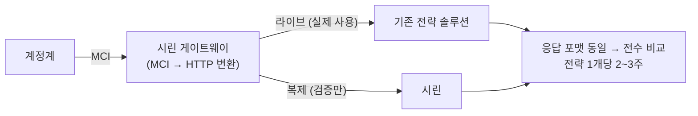

| | |
| --- | --- |
| 발표 | SLASH 24 |
| 연사 | 김용휘 (토스뱅크 Data Platform Department Leader), 유형균 (토스뱅크 Machine Learning Engineer) |
| 자료 | [발표 영상](https://www.youtube.com/watch?v=4fk3TxgQ9Ks) · [SLASH 24](https://toss.im/slash-24) |

은행에서 대출이 승인되는 과정 뒤에는 신용 평점 시스템(CSS)과 한도·금리를 정하는 신용 전략 시스템이 있고, 대부분의 은행은 상용 솔루션을 쓴다. 토스뱅크는 둘 다 자체 구축했다. 전략 시스템 "시린"은 파이썬 함수와 Airflow DAG 문법으로 심사 로직을 쓰고, 기존 솔루션과 병렬로 트래픽을 복제해 전수 검증한 뒤 전략 하나씩 옮겼으며, 카나리가 부적절한 이유 때문에 섀도우 배포를 쓴다. 모형 시스템 "린"은 AutoML(ML 박스)이 전처리·후처리까지 패키징한 모델을 코드 몇 줄로 배포하고 모니터링까지 자동화한다. 내용은 발표 영상과 자동 생성 자막을 근거로 했고, 자막 품질이 낮아 세부 표현보다 구조에 집중했다. 표현은 내 말로 바꿨다.

## 신용 모형과 신용 전략

은행은 자기만의 신용 평점 시스템(CSS)을 갖고 그 점수에 근거해 대출을 승인하거나 거절한다. 크게 둘로 나뉜다. **ASS(Application Scoring)**는 신청 시점의 승인·거절이라 앱에서 요청하면 빠르게 응답해야 하므로 API 형태다. **BSS(Behavior Scoring)**는 기보유 대출자 수백만 명의 점수를 다시 산출해 조기 경보나 대손충당금(회계) 처리에 쓰므로 배치 형태다.

점수만으로 대출을 내줄 수는 없다. 한도와 금리를 판단하는 **신용 전략** 컴포넌트가 필요하다. 수익성과 신용 리스크에 기반해 어디까지, 얼마를, 어떤 금리로 내줄지 프라이싱하고, DSR 같은 규제에 맞춰 대출 물량을 조절한다.

시중에 솔루션이 많은데 자체 구축한 이유는 셋이다. (1) 머신러닝 생태계는 파이썬 위에서 돌아가는데 신용 모형 솔루션들이 파이썬 모델과 호환되지 않아 모델을 만드는 솔루션을 또 사야 했다. (2) 복잡한 전략을 구현하기 어렵다. 타행은 직장인 대출, 개인 신용대출 등 상품 목록에서 하나를 골라 그 심사 결과만 보여준다. 토스뱅크는 개인 신용대출 화면이 하나뿐이고 누르면 **토스뱅크가 내줄 수 있는 모든 개인 신용대출 심사를 한 번에** 타서 모든 결과를 보여준다. 슬라이더를 옮기면 한도가 늘고 금리가 바뀌는데 그것이 상품이 바뀌는 것이다. 고객에게는 편하지만 전략 시스템 구현은 굉장히 복잡해지고 솔루션으로는 까다롭다. (3) 솔루션은 소스를 수정할 수 없어 내부 피처 스토어 연동, 추가 로깅, 타 시스템 연동이 어렵다.

## 시린: 전략 시스템의 이관

시린은 대출 심사 전략을 파이썬 코드로 구현한다. 각 전략 로직은 간단한 파이썬 함수이고 로직 간 실행 순서는 **Airflow의 DAG 문법을 차용**해 심사 흐름을 쉽게 정의하고 확인할 수 있다. 정의된 전략은 API로 제공되어 온라인 ASS 심사에 쓰이고, BSS 배치에도 **같은 소스코드**를 쓴다. 전략이 복잡해도 이해하기 쉬운 프로젝트 구조 덕에 시린으로 옮기는 것 자체는 상대적으로 간단했다. 어려운 것은 서비스를 중단하지 않고 옮기는 것이었다.

배치는 간단했다. 시린 결과와 기존 시스템 결과 테이블을 1:1로 매칭해 틀린 점이 없는지 확인하면 됐다. 문제는 신규 고객 대상 온라인 심사였다. 최초에는 계정계가 기존 전략 솔루션을 직접 호출했다.

계정계와 기존 솔루션 사이에 자체 게이트웨이를 두었다. 역할은 둘이다. 기존 솔루션 호출에 쓰던 MCI 프로토콜을 HTTP로 변환하는 것, 그리고 기존 솔루션으로 보낸 트래픽을 **그대로 복사해 시린에도** 보내는 것. 실제 대출 서비스는 기존 솔루션의 응답만 썼다. 시린의 응답 포맷을 기존과 동일하게 구현했으므로 두 응답이 같은지 쉽게 전수 검증했다. 기존 솔루션의 전략 하나를 시린에 구현하고 2~3주 검증해 **단 하나의 심사 결과도 다르지 않은지** 확인한 뒤 그 전략을 완전히 시린으로 옮기고, 다음 전략(개인 2, 사업자, 기업)도 같은 방식으로 옮겨 기존 솔루션을 안전하게 퇴역시켰다.

## 베스트 프랙티스 1: 카나리가 아니라 섀도우

롤링은 인스턴스를 하나씩 올리고, 블루그린은 신버전을 구버전만큼 띄운 뒤 트래픽을 한 번에 넘긴다. 블루그린은 신버전이 웜업할 기회가 없어 트래픽이 몰리는 순간 배포가 부담스럽고, 100% 넘긴 뒤 오류가 나면 장애로 번진다. 토스 커뮤니티는 일반적으로 카나리를 쓴다. 트래픽을 점진적으로 옮기므로 웜업이 되고 에러가 나도 구버전으로 롤백하면 된다.

하지만 **심사 전략 시스템에는 카나리도 부적절했다.** 심사 시스템이 점진 배포된다는 것은 새 심사 전략이 담긴 코드가 나가는 것인데, 같은 시간대에 두 버전이 돌면 **동일한 신용도를 가진 서로 다른 고객 중 누구는 승인되고 누구는 거절되는** 문제가 생긴다. 또 토스뱅크 심사는 신청 심사와 본심사 두 단계인데 신청 심사는 구버전, 본심사는 신버전이면 결과가 크게 달라질 수 있다. 스티키 세션으로 두 번째 문제는 피할 수 있어도 첫 번째는 해결되지 않는다.

그래서 **섀도우 배포**를 택했다. 시린 게이트웨이가 라이브 심사 요청을 보낼 때 섀도우(신버전) 쪽에도 똑같이 복사해 보내고, 결과를 별도로 저장했다가 충분한 시간을 두고 새 전략에 오류가 없는지 확인한 뒤 확실하면 트래픽을 섀도우로 튼다. 코드를 내보내기 전에 단위·통합 테스트를 하므로 대부분의 오류는 그 전에 검출되지만, 테스트 케이스를 만들다 보면 예상하지 못한 엣지 케이스가 있다. 실제로 자주 들어오지 않는 심사 케이스에서 **신규 입력값이 누락된** 경우가 있었는데 단위·통합 테스트로는 잡을 수 없었고 섀도우 검증에서 검출되어 장애 없이 수정했다.

## 베스트 프랙티스 2: 배치 코드의 배포 승인

최초 설계 때는 배치 코드를 수정하면 브랜치를 따서 main에 머지하고 배치 워커가 가져가면 되겠다고 생각했다. GitHub 리뷰로 제3자 검증은 되지만 **서비스 책임자 검증과 배포 담당자 검증**이 없다. 전자금융감독규정 29조는 프로그램 변경 시 제3자 검증(3항)과 운영 시스템 적용 전 충분한 테스트와 책임자 승인(6항)을 요구한다. 그래서 배치 로직 배포를 이미 쓰는 CI/CD 도구 GoCD로 하게 했다. GoCD로 배포하면 이미 구축된 감사 프로세스를 자동으로 타고, 그 프로세스를 통과해야만 수정된 배치 로직이 **직렬화되어 DB에 들어가며**, 배치 워커는 모든 승인을 거친 코드만 DB에서 꺼내 쓴다. (같은 팀의 [데이터플랫폼 오픈소스 전환 발표](/posts/slash23-bank-data-platform-opensource/)가 Airflow에 같은 규정을 적용한 방법과 짝을 이룬다.)

## 베스트 프랙티스 3: 분산 컴퓨팅은 Ray

시린은 전부 파이썬이라 파이썬에서 쓸 수 있는 분산 컴퓨팅 엔진이 중요했다. 유저가 많아지고 로직이 복잡해지면 분산 처리 없이는 실행 시간이 길어지고 OOM 확률이 높아진다. 후보는 Ray와 Spark였고 두 가지 이유로 Ray를 골랐다. Ray는 배치 처리에 필요한 의존성을 **런타임 환경에서** 쉽게 추가할 수 있다. Spark는 YARN 클러스터 워커 노드에 파이썬 패키지를 다 깔거나 별도 이미지를 만들어 잡 제출 시 쓰게 해야 하는데, Ray는 클라이언트 생성 시점에 `runtime_env` 파라미터에 필요한 패키지나 자체 모듈을 적으면 워커에 자동 설치된다. 그리고 컴퓨팅 집약적 작업에서 Spark보다 성능이 좋았다. Ray는 심사 배치뿐 아니라 모형 적합과 하이퍼파라미터 탐색에도 쓰고, 그런 코드는 보통 Jupyter 노트북이라 노트북을 Airflow에서 바로 실행하는 Jupyter 오퍼레이터를 만들어 활용한다.

## 린: 모형 시스템의 자동화

은행 신용 모형은 경제 상황이나 당국의 예상치 못한 요구에 맞춰 시의성 있는 모델을 빠르게 개발·배포·모니터링하는 것이 중요하다. 과거 플로는 이랬다. 모델러가 Jupyter에서 모형을 개발하고 위험관리심의위원회에 적정성을 리포팅하는 문서를 만들어 허가가 나면 MLflow에 업로드하고, ML 엔지니어가 모델을 내려받는 코드를 API 서버에 구현하고 전처리·후처리 로직을 복사·붙여넣기하고 모니터링 로깅을 추가한다.

**모델 개발의 자동화: ML 박스.** 개발 프로세스를 다섯으로 나누면 대부분 자동화가 가능하다고 판단했다. 신용 모형은 대부분 "부실"이라는 라벨을 걸러내는 **이진 분류** 문제로 귀결되므로 방법론만 정하면 통계 데이터 산출·비교, 피처 선택, 최적 모델 탐색, 리포트 로직을 자동화할 수 있다. 시중의 AutoML 오픈소스는 딥러닝·이미지·NLP 기능이 많아 코드가 복잡했고 그런 기능은 불필요해 유지보수가 어렵다고 봤다. 그래서 은행 친화적이고, 신용 모형에서 굉장히 중요한 **설명 가능한 모형**(토스뱅크가 특허를 낸 XAI 모델 포함)을 지원하는 자체 AutoML 시스템 ML 박스를 만들었다.

**서빙의 자동화: 린.** ML 박스를 만들면서 **모델 자체에 전처리와 후처리까지 함께 패키징**되도록 했다. ML 엔지니어가 코드를 복사·붙여넣기하다 실수할 여지가 크게 준다. 시스템 장애는 차라리 괜찮은데 가장 큰 문제는 장애는 없는데 값이 잘못 산출되는 경우이고, 그것을 미연에 방지한다. ML 박스와 인터페이스를 맞춘 서빙 시스템 린을 개발해 관심사가 분리됐다. 모델러는 ML 박스로 Jupyter에서 개발하고, ML 엔지니어는 린에서 **코드 몇 줄만 추가하면** 자동으로 배포된다.

**모니터링의 자동화.** 모형마다 다르게 봐야 하는 지표도 있지만 공통으로 반드시 보는 세 지표가 있다. 모형이 배포되면 그 모형에 쓰인 피처 목록이 Kafka로 전송되고, Hadoop에 적재되며, Airflow 배치가 돌고, 마트 테이블을 Tableau가 바라본다. 모델이 추가되면 목록이 자동 갱신되고 적재와 배치까지 자동으로 돌며, Tableau에 몇 줄만 추가하면 모형 모니터링이 된다.

앞으로는 설명 가능한 모델을 계속 발전시키고, 지금까지 빠른 개발을 위해 KCB·NICE 외부 데이터를 많이 썼다면 이제 토스뱅크 자체 데이터가 충분히 쌓였으므로 비즈니스 임팩트를 낼 수 있는 자체 데이터 기반 피처 스토어를 개발할 예정이다.

## 리뷰

**"카나리가 부적절한 시스템"을 정의한 것이 이 발표의 가장 날카로운 부분이다.** 토스 전체가 카나리를 표준으로 쓰는데, 심사 시스템은 두 버전이 동시에 살아 있는 것 자체가 **공정성 문제**다. 같은 조건의 고객이 다른 답을 받으면 안 된다. 그래서 트래픽을 나누지 않고 복제하는 섀도우 배포가 답이 된다. 배포 전략 선택 기준에 "성능·안정성" 외에 "결정의 일관성"이 추가된 사례다.

**이관 방식과 배포 방식이 같은 구조다.** 게이트웨이가 트래픽을 복제해 병렬로 보내고 결과를 비교한다. 이관 때는 기존 솔루션 vs 시린, 운영 때는 시린 1.1 vs 1.2. 한 번 만든 게이트웨이가 마이그레이션 도구에서 배포 도구로 재사용된 것이고, [코어뱅킹 MSA 전환](/posts/slash23-core-banking-msa/)의 이중 호출 검증과 같은 계보다.

**"장애는 차라리 괜찮고 값이 틀리는 것이 가장 나쁘다"는 문장이 ML 서빙 설계 전체를 설명한다.** 전처리·후처리를 모델에 패키징한 이유, 배치 코드를 승인 없이 DB에 못 넣게 한 이유, 섀도우 배포로 결과를 저장해 두는 이유가 모두 이 한 문장으로 수렴한다. 토스 본체의 [ML 서비스 발표](/posts/slash22-ml-service-flow/)가 "모델도 서비스다"였다면, 토스뱅크는 "모델은 틀리면 안 되는 서비스다"에 가깝다.

## 남는 질문

- 섀도우 배포에서 신버전이 라이브와 다른 결과를 냈을 때, 그것이 "의도된 전략 변경"인지 "버그"인지 어떻게 구분하는지. 새 전략은 당연히 다른 결과를 내야 하므로 비교 기준이 단순 일치일 수 없다.
- 시린 게이트웨이가 트래픽을 복제하면 외부 신용평가사 조회도 두 번 나가는지. 비용과 조회 이력 기록 문제는 어떻게 다루는지.
- Ray 클러스터의 운영 주체와 규모. 쿠버네티스 위 KubeRay인지, 별도 클러스터인지.
- ML 박스의 "설명 가능한 모형" 특허가 어떤 방식인지. SHAP 계열인지, 모형 구조 자체가 해석 가능한 것인지.

## 참고

- [발표 영상](https://www.youtube.com/watch?v=4fk3TxgQ9Ks)
- [SLASH 24](https://toss.im/slash-24)
- [Ray runtime environments](https://docs.ray.io/en/latest/ray-core/handling-dependencies.html)
- 같은 팀의 앞선 발표: [SLASH 23 은행 데이터플랫폼 오픈소스로 전환하기 리뷰](/posts/slash23-bank-data-platform-opensource/)
