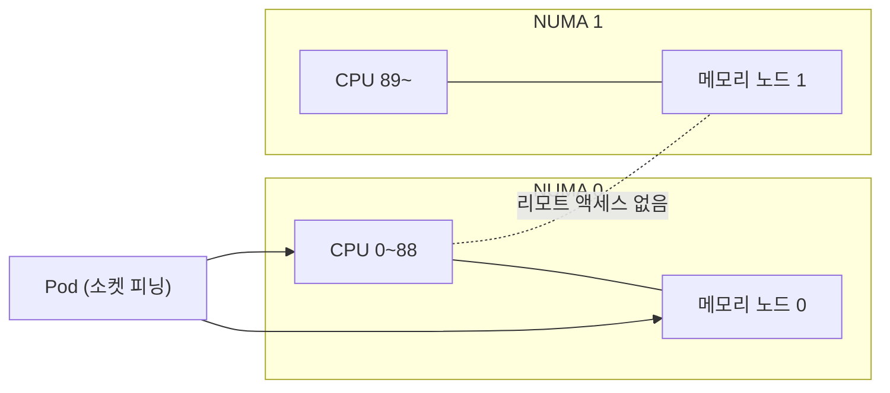
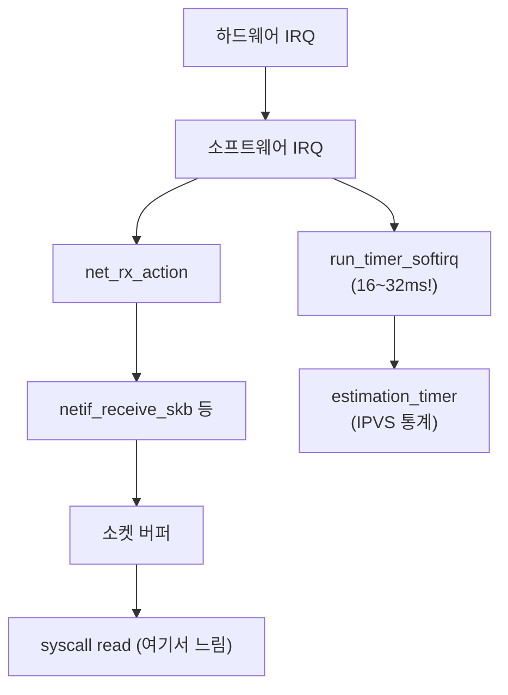

| | |
| --- | --- |
| 발표 | SLASH 24 |
| 연사 | 이재성 (토스 DevOps Team Leader), 이항령 (토스 Head of Server) |
| 자료 | [발표 영상](https://www.youtube.com/watch?v=e8cEDhAPm-E) · [SLASH 24](https://toss.im/slash-24) |

커널이 블랙박스로 가리고 있던 두 가지를 eBPF로 벗겨낸 발표다. 앞부분은 페이지 폴트 플레임 그래프에서 NUMA 리모트 액세스가 절반임을 발견하고 kubelet을 직접 고쳐 소켓 피닝을 구현해 클러스터 CPU 13%를 아낀 이야기, 뒷부분은 1년 전 [프로파일러 발표](/posts/slash23-profiler-performance/)에서 "커널을 올리니 사라졌다"로 끝났던 Redis 지연이 20~50ms로 다시 나타나 tcpdump → perf trace → bpftrace → BCC로 좁혀가다 `run_timer_softirq` 안의 `estimation_timer`(IPVS)를 찾아낸 이야기다. 내용은 발표 영상과 자동 생성 자막을 근거로 했고, 표현은 내 말로 바꿨다.

## 1부: CPU 사용률 안의 메모리 대기

CPU, 메모리, 디바이스 I/O를 쓸 때 중간에서 커널이 분배하다 보니 "누가 CPU를 더 쓰나", "누가 메모리 할당 문제를 일으키나"가 블랙박스처럼 가려져 있어 분석에 애를 먹었다. eBPF가 그 한 꺼풀을 벗겨준다.

CPU 사용률은 전체 시간 중 busy 상태가 차지한 비율인데, 이것이 모두 연산 시간은 아니다. 메모리를 읽고 쓰기 위해 대기하는 **메모리 I/O(stall)** 시간도 포함된다. 그래서 메모리 I/O를 추적하면 CPU 사용률을 더 잘 이해할 수 있다. 메모리 할당은 malloc → 페이지 매핑으로 이어지고 가장 시간이 걸리는 부분은 물리적 작업인 **페이지 폴트**다. 토스 서버의 페이지 폴트를 eBPF로 플레임 그래프를 그려보니 `do_numa_page`와 같은 NUMA 관련 영역이 **절반 정도**를 차지했다. 이 부분을 없애면 페이지 폴트 영향을 절반으로 줄일 수 있다.

### NUMA

무어의 법칙으로 CPU·메모리 칩 성능은 주기적으로 두 배씩 올랐지만 CPU와 메모리 사이 버스·채널 성능은 따라가지 못했다. 그래서 채널을 쪼개 각 CPU에 로컬 메모리를 따로 붙여 한계를 극복한 것이 NUMA 아키텍처다. 자기에게 붙은 메모리 접근은 로컬, 멀리 있는 메모리 접근은 리모트이고, 리모트는 물리적 홉이 추가되어 사이클이 더 필요하다. 리모트 액세스가 많으면 NUMA가 우리 인프라에서 비효율적으로 동작하는 것이다.

얼마나 영향을 줬는지 eBPF로 볼 수 있다. NUMA 마이그레이션 시스템 콜만 해도 초당 CPU 스케줄러에 10~50ms를 소모했고, 메모리 액세스를 카운팅하니 로컬 DRAM 6,000회에 리모트 DRAM 4,000회, **약 40%가 리모트**였다. 절반 가까이라 NUMA가 비효율적으로 동작하고 있었는데, 몰라서 해결하지 못하고 있었다.

### 쿠버네티스에서의 세 가지 선택지

컨테이너는 `cpuset.cpus`와 `cpuset.mems`로 어느 NUMA 노드의 CPU와 메모리를 쓸지 지정할 수 있다. 하지만 토스는 클러스터 수천 대, 컨테이너 만 개 가까이라 일일이 설정할 수 없다. 쿠버네티스 기반의 해법을 검토했다.

| 방식 | 동작 | 문제 |
| --- | --- | --- |
| CPU 피닝 | 4코어 요청이면 CPU 0·1·3·6처럼 고정 할당 | 메모리는 여유에 따라 노드 0 또는 1에 할당되어 리모트 액세스가 여전히 발생. 피닝된 코어 이상을 쓸 수 없어 스파이크 때 안정성 저하 |
| 메모리 피닝 | 메모리를 노드 0에 고정 | CPU 런큐 상태에 따라 NUMA 0·1을 오가므로 리모트 액세스 동일하게 발생 |
| **소켓 피닝** | NUMA 0의 메모리에만 할당하고 NUMA 0의 CPU(0~88)에만 할당 | 쿠버네티스가 제공하지 않아 **kubelet에 직접 구현** |

원하는 것은 CPU 한 개 이상을 쓸 수 있는 안정성과 로컬 액세스만 일어나는 성능이었고, 답은 소켓 피닝이었다. NUMA 0의 CPU를 전부 할당할 수 있으므로 소켓 리밋까지 쓸 수 있어 안정성이 보장되고, 리모트 액세스 없이 로컬만 일어나 성능이 오른다.

적용 효과를 eBPF로 측정하니 NUMA 마이그레이션이 거의 일어나지 않았다. 가장 기대했던 CPU 성능은 클러스터 레벨로 측정해 **클러스터 전체 CPU 사용률 13% 향상**이었다. 클러스터 500대씩 두 개, 1,000대에서 130대를 줄일 수 있는 효과다. IDC를 매년 수백억씩 증설하는 입장에서 고무적인 성과였다.

운영해 보니 NUMA가 생각보다 잘 풀렸다. kubelet의 토폴로지 힌트가 안 주어진다거나 리소스 할당에 여유가 없는 케이스가 있었다. 이를 모니터링하기 위해 Cloudflare의 ebpf_exporter로 NUMA 영향도를 메트릭화했다. `numa_latency_total`, `numa_move_total` 같은 값을 뽑아 NUMA가 풀리지 않는지 보면서 운영한다. DevOps는 소프트웨어 영역에서 활동이 많았는데 이번엔 하드웨어 영역까지 디버깅해 최적화하는 경험이었다고 했다.

## 2부: Redis 지연 20ms 이상 현상

작년 SLASH에서 다룬 것과 비슷해 보이지만, 작년은 200ms였고 이번은 **20~25ms**로 더 작은 양이다. 그때 다 해결된 줄 알았지만 아니었다. 그래프에 중간중간 튀는 20~50ms 지연이 발견됐다.

**tcpdump: 네트워크 탓?** 애플리케이션 보내는 쪽·받는 쪽, Redis 보내는 쪽·받는 쪽 네 군데에서 덤프를 떴다. 가끔 발생하고 큰 지연이 아니라 "분명히 네트워크 문제"라고 남 탓을 했다. 가는 쪽은 문제가 없었고 오는 쪽에서 오래 걸렸다(Redis가 보냈는데 애플리케이션이 늦게 받음). 돌이켜보면 보낼 때 문제가 없으니 받을 때도 없어야 하지만 그때는 네트워크를 굉장히 의심했다. SRE와 네트워크 엔지니어가 모여 Redis와 애플리케이션 사이의 10층·6층 네트워크 장비에서도 덤프를 떴다(패킷이 많아 잠깐씩). 결과는 **네트워크 장비는 문제없고 장비와 애플리케이션 사이에서만 느렸다.** 케이블 문제를 말할 수도 있었지만 노드 문제로 보고 분석했다.

**perf trace: 이벤트가 빠진다.** 작년처럼 perf trace로 네트워크 이벤트를 다 받아 로그를 찍고, 소켓 주소와 `net_rx_action`, `netif_receive_skb` 같은 메서드 정보가 나오니 순서대로 파싱하면 어디가 느린지 나오겠다고 스크립트로 분석했다. 결론은 큰 값도 작은 값도 나왔다. 이벤트가 중간중간 빠졌기 때문이다. 나중에 알게 됐지만 네트워크 이벤트는 워낙 많이 발생해 로그 형태로 접근하면 안 됐다.

**bpftrace → BCC.** eBPF를 알고 있었으니 perf 대신 써보기로 했다. bpftrace(스크립트)와 BCC 툴 두 가지가 있다. 먼저 bpftrace로 접근했는데 역시 이벤트가 많아 값이 정확하지 않았다. 문제 범위가 너무 넓어 좁혀야 했고, 직접 작성하기보다 BCC의 `funclatency`로 함수 호출 수와 소요 시간을 봤다. perf trace에 나온 함수들을 각각 돌려봤지만 느린 결과가 나오지 않았다. 처음 하는 거라 "내가 잘 접근하고 있나" 고민이 들어 레퍼런스(Pixie)에서 어떻게 쓰는지 봤더니 **시스템 콜 `read`에서 속도를 측정**하고 있었다. eBPF가 잘 동작하는지 확인하려고 `read`를 봤고 거기서 느린 값을 받았다. 해결책은 아니었지만 eBPF로 이런 걸 확인할 수 있다는 확신을 줬다.

**iptables?** 쿠버네티스에서 iptables를 쓰다 Pod가 많아지며 문제가 되어 IPVS로 바꾼 경험이 있어, 남아 있는 것이 있을까 봤다. 당시 쓰던 Calico가 iptables로 정책을 관리하고 있었고 룰이 몇천 개였다. 조금 걸릴 것 같지만 정말 느린 건지 확신할 수 없어 눈으로 확인하고 싶었다. BCC의 `netfilter latency` 스크립트로 iptables 훅에서 발생한 횟수와 시간을 측정했는데 느린 값이 안 나왔다. 소스를 보니 `nf_hook_slow`를 기준으로 잡고 인자로 필터링해 보여주는 것이라 `funclatency`로 `nf_hook_slow`를 따로 봤더니 같은 결과였다. 넷필터는 아니었다.

**패킷 수신 경로를 그리고 아래에서 위로.** 지식으로 안 되니 이론적으로 패킷을 받는 구조 전체를 살펴 어느 구간을 측정해야 빠지는 부분 없이 전체를 보는지 그래프를 그렸다. write와 달리 read는 애플리케이션이 읽는 방향과 패킷이 들어오는 방향, 하드웨어·소프트웨어 인터럽트가 섞여 있어 복잡했다.

`net_rx_action`을 확인했는데 느린 부분이 없었다. 문제를 좁힐 수 있겠다고 생각하고 소프트 IRQ의 네트워크 IRQ를 봤는데 역시 안 나왔다(구현체가 `net_rx_action`과 같다). 마지막으로 "이건 무조건 하드웨어다"라고 생각하며 하드웨어 IRQ를 봤는데 **느린 게 없었다.** 아는 모든 지식에서 느린 부분이 없었다. 이제 뭘 해야 하나 생각하며 여러 가지를 보다가 갑자기 **소프트 IRQ 중 timer가 다른 것보다 유난히 길었다.** 숫자를 잘못 보나 했는데 제일 밑에 16~32ms 구간에 6개의 숫자가 있었다. 중간은 다 0인데 느린 것이 갑자기 나온 것이다. 그 부분을 담당하는 `run_timer_softirq` 함수의 속도를 측정하니 30~60ms의 느린 카운트가 나왔다. 이 부분이 느리다는 확신이 생겼다.

타이머 쪽 커널 소스를 보니 타이머가 리스트라 느릴 수 있겠다는 생각이 들었고, 타이머별로 측정하려고 `trace_timer_expire_entry`·`exit` 트레이스포인트에서 시간을 잡으면 각 타이머의 소요 시간을 측정할 수 있었다. bpftrace로 들어올 때와 나갈 때의 시간을 재서 16ms 이상일 때 스레드 이름과 심볼·심볼 주소를 출력하게 하고 바로 돌렸다. 쾌감이 있었다. **돌리자마자 동일한 함수와 주소가 찍혔고** 여러 스레드가 나왔다. `estimation_timer`였다. 아는 스택에 맞춰 발생해야 모든 것이 맞아떨어지므로 `stackcount`로 측정하니 `run_timer_softirq`가 나오면서 지식이 맞아 들어갔다.

문제를 정확히 타게팅했으니 검색했다. 토스보다 규모가 큰 곳에서 이미 IPVS의 estimation이 문제가 되어 커널에 `run_estimation`을 끌 수 있는 sysctl 옵션이 들어가 있었다. 해결 방법은 셋이었다. 커널을 올린 뒤 스킵 설정, 커널 패치로 그 부분을 덮기, 또는 쓰고 있는 Calico를 eBPF 기반 **Cilium**으로 바꿔 장기적으로 속도 향상을 꾀하기. Cilium으로 변경했고 현재 이 문제는 사라졌으며 커널 버전 업은 계속하고 있다.

발표자가 배운 것은 이렇다. 문제를 겪으면 모든 것이 의심되는데, eBPF가 명확한 수치로 관측성을 높여 원인을 알 수 있었다. 커널 업이나 다른 것으로 바꿔 회피할 수도 있었지만 그러지 않고 왜 일어났는지 찾아 근본 원인에 닿은 경험이었다. 대단하다고 말하긴 힘들지만 우당탕탕 해결한 과정이 다른 사람의 문제에 용기와 도움이 됐으면 한다고 했다.

## 리뷰

**1부는 "CPU 사용률"이라는 지표를 의심하는 데서 시작한다.** busy 안에 메모리 stall이 들어 있고, stall의 절반이 NUMA 리모트 액세스였다. 지표를 분해하지 않았다면 "CPU가 부족하니 서버를 사자"로 끝났을 일이 "kubelet을 고쳐 130대를 아끼자"가 됐다. 쿠버네티스가 제공하는 CPU Manager와 Topology Manager로는 부족해 kubelet을 직접 수정한 것은 [1년 뒤 쿠버네티스 CPU 발표](/posts/slash24-kubernetes-cpu/)와 이어진다.

**2부는 실패한 시도를 하나도 빼지 않아서 가치가 있다.** 네트워크 탓, 장비 덤프, perf trace 로그 파싱, bpftrace, funclatency, netfilter, 수신 경로를 아래에서 위로 전부 확인. 그리고 답은 네트워크 경로 밖의 타이머 softirq에 있었다. "아는 모든 지식에서 느린 부분이 없었다"는 순간이 발표의 정점이고, 그 뒤 트레이스포인트 두 개와 bpftrace 스크립트 몇 줄로 범인이 잡히는 대비가 eBPF의 가치를 가장 잘 보여준다. IPVS `estimation_timer`는 서비스 수가 많은 쿠버네티스 노드에서 알려진 문제인데, 그것을 검색이 아니라 관측으로 찾아냈다는 점이 다르다.

**두 이야기 모두 "회피하지 않았다"로 끝난다.** 작년의 Redis 200ms는 커널 업그레이드로 사라졌고 원인은 미제였다. 올해의 20ms는 원인까지 갔고, 그 원인이 Calico → Cilium이라는 인프라 결정으로 이어졌다. 같은 발표자가 1년 사이 관측의 깊이를 얼마나 늘렸는지가 두 발표를 이어 읽을 때 보인다.

## 남는 질문

- 소켓 피닝을 kubelet에 구현했다면 업스트림 kubelet 업그레이드마다 패치를 유지해야 한다. 업스트림에 기여했는지, 아니면 Topology Manager의 `single-numa-node` 정책으로 대체 가능해졌는지.
- NUMA 0에만 피닝하면 NUMA 1의 자원은 어떻게 쓰는지. Pod를 두 소켓에 균등 배치하는 스케줄링 로직이 kubelet에 함께 들어갔는지.
- Calico → Cilium 전환의 범위와 기간. 네트워크 정책이 수천 개였다면 정책 마이그레이션은 어떻게 검증했는지.
- `run_estimation`을 끄면 IPVS 통계가 사라진다. Cilium 전환 전 임시로 껐는지, 통계 없이 운영해도 괜찮았는지.

## 참고

- [발표 영상](https://www.youtube.com/watch?v=e8cEDhAPm-E)
- [SLASH 24](https://toss.im/slash-24)
- [Cloudflare ebpf_exporter](https://github.com/cloudflare/ebpf_exporter)
- [BCC tools](https://github.com/iovisor/bcc)
- 1년 전 같은 Redis 지연: [SLASH 23 프로파일러로 시스템 성능 향상시키기 리뷰](/posts/slash23-profiler-performance/)
