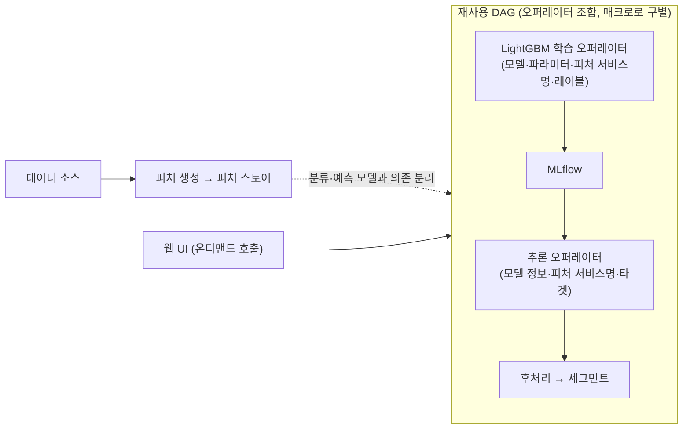
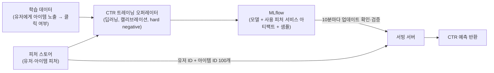

| | |
| --- | --- |
| 발표 | SLASH 24 |
| 연사 | 김찬주 (토스 ML Chapter Lead) |
| 자료 | [발표 영상](https://www.youtube.com/watch?v=-im8Gzmf3TM) · [SLASH 24](https://toss.im/slash-24) |

2년 전 [ML 서비스 발표](/posts/slash22-ml-service-flow/)가 "MLOps 프레임워크 대신 최소 의존성"이었다면, 이 발표는 그 위에 토스가 무엇을 직접 만들었는지 보여준다. 피처 스토어, Airflow 위의 DAG 빌더, ML 전용 모니터링 세 가지를 소개하고, 그것들이 타겟 세그먼트 생성과 CTR 예측이라는 두 사례에서 어떻게 개발 속도와 안정성을 동시에 올렸는지 설명한다. 내용은 발표 영상과 자동 생성 자막을 근거로 했고, 자막 품질이 낮아 세부보다 구조에 집중했다. 표현은 내 말로 바꿨다.

## 문제: 수요가 늘면 드러나는 것

인프라가 준비되지 않은 초기에는 문제마다 개별 접근이 필요해 예상보다 긴 개발 시간이 들고, 특히 온라인 서빙은 어려움이 많으며 안정적으로 유지하기도 어렵다. 기획자가 요구하는 빠른 변화에 대응하기도 힘들다. 이런 문제는 ML 수요가 양쪽으로 늘 때 도드라진다. 토스도 대규모 ML 파이프라인을 운영하고 실시간 서빙이 필요한 모델 수가 급증하면서, 한 개발자가 여러 모델을 관리하다 작업자 실수가 늘어 운영 안정성이 떨어졌다. ML 모델은 서비스에 적용되면 **눈에 띄지 않는 에러**가 생긴다. 피처 생성부터 학습·서빙까지 여러 편향 문제로 성능이 서서히 감소하고, 이를 모니터링하는 것도 어려운 일이었다.

## 플랫폼 구성

토스 ML 플랫폼은 데이터 플랫폼 인프라 위에서 동작하고, 일관성을 위해 공통 라이브러리를 쓴다. 인하우스 개발과 오픈소스가 섞여 있다.

| 영역 | 구성 |
| --- | --- |
| 피처 | **피처 스토어**(인하우스), 벡터 DB. 임베딩도 피처 스토어에 등록해 피처로 사용 |
| 파이프라인 | **DAG 빌더**(인하우스)를 Airflow 위에 올려 생성·관리 |
| 학습 | 실험 환경은 ML Hub, 라이브 학습도 DAG 빌더로 관리 |
| 모델 관리 | MLflow |
| 서빙 | 배치는 DAG로 동일하게 관리. 온라인은 상황과 모델에 따라 Triton 또는 Kotlin 위에서 직접 실시간 추론 |
| 상위 플랫폼 | 위 구성 요소의 조합으로 더 하이레벨 플랫폼 제공 |
| 모니터링 | ML 전용 모니터링·관리 플랫폼(인하우스) |

### 피처 스토어

학습과 추론을 위해 피처 데이터를 관리·제공한다. 자세한 내용은 [같은 해 별도 세션](/posts/slash24-feature-store/)에서 다루므로 여기서는 안정성과 효율성 측면만 본다. 피처를 한 번 생성하면 재사용할 수 있어 피처 생성과 학습·서빙 사이의 의존을 줄여 속도를 높인다. 무엇보다 학습이든 온라인·오프라인 추론이든 **피처 서비스**라는 피처 번들 단위로 재사용할 수 있어 추가 개발 리소스를 크게 줄인다. 흐름은 데이터 소스에서 피처를 생성해 등록하고, 오프라인 학습이든 추론이든 같은 피처 서비스 이름으로 접근하되 대상만 다르게 하며, 학습된 모델의 실시간 서빙도 동일한 피처 서비스로 데이터에 접근한다.

### DAG 빌더

Airflow 위에서 파이프라인을 효율적으로 생성·관리하는 자체 라이브러리다. YAML만으로 DAG를 만들고, 개발 환경을 자연스럽게 제공해 프로덕션에 영향 없이 테스트하며, 여러 작업을 하나의 오퍼레이터로 묶어 복잡한 작업을 쉽게 반복한다. 예시는 쿼리로 피처를 생성하는 DAG다. 상단에 매크로가 있고, 타입이 오퍼레이터인 태스크들이 정의된다. 테이블 센서는 필요한 테이블이 준비될 때까지 기다리고, 쿼리 태스크는 **SELECT 문만** 포함하며 테이블 생성·INSERT·UPDATE는 오퍼레이터가 자동으로 채운다. 데이터 안전성을 위해 타겟 테이블에 바로 적재하지 않고 **임시 테이블을 만들어 옮기는** 과정이 포함되어 있고, 테이블 생성 후 DQ나 데이터 편향을 체크하는 테스트를 YAML로 간단히 추가할 수 있다. 이것들을 엮어 하나의 데이터 파이프라인이 된다.

### ML 모니터링

ML은 에러나 장애 없이 **성능만 줄어드는** 일이 있어 일반 개발과 다른 모니터링이 필요했고 자체 개발했다. 피처 데이터, 추론, 서빙까지 엔드 투 엔드로 데이터 편향이나 문제를 빠르게 잡아 개발자나 사용자에게 나가지 않게 막는 것이 목표다. 모델 학습 시 지표를 추적하고, 모델 추론 결과의 분포가 매일 일정하게 유지되는지 확인하며, 알림을 등록해 조건에 맞으면 받는다. 예를 들어 최근 다섯 번 대비 어떤 스코어가 몇 퍼센트 이상 변하면 알림이 온다.

## 사례 1: 타겟 세그먼트 생성

토스는 사용자의 특정 행동을 예측하거나 유사한 유저를 추출해 세그먼트를 만든다. 플랫폼 전에는 요구사항마다 개별 접근이라 복잡하고 시간이 많이 들었다. 플랫폼으로 대부분의 업무를 자동화했다.

왼쪽은 데이터로 피처 스토어에 피처를 만드는 부분이고, 실제 분류·예측 모델과 의존이 많이 떨어진다. 오른쪽 DAG의 흰 박스 하나하나가 태스크(오퍼레이터)다. 모델 학습, 모니터링, 추론, 추론 후 작업, 세그먼트 생성이 각각 오퍼레이터로 개발되어 있어 재사용해 DAG를 구성한다. 새 세그먼트는 이 DAG를 재사용하면 되고, 매크로를 API로 바꿔 DAG를 구별한다. 학습 오퍼레이터에는 어떤 모델을 쓸지, 파라미터, 어떤 피처를 쓸지는 **피처 서비스 이름만**, 그리고 레이블(클릭 여부 등)을 넣으면 LightGBM 오퍼레이터가 학습해 MLflow에 적재한다. 추론은 모델 정보, 피처 서비스, 추론 타겟을 넣으면 결과 테이블에 저장된다. 웹에서 세그먼트를 만들 때 실시간으로 온디맨드 호출하는 화면도 있다.

효과는 피처 재사용, 오퍼레이터·파이프라인 전체 재사용으로 새 타겟 스케줄 추가가 금방 가능해진 것, 온디맨드 수행, 그리고 **코드 퀄리티 향상**이다. 하나의 오퍼레이터를 여러 ML 엔지니어와 데이터 사이언티스트가 함께 고도화하고 코드 리뷰하기 때문이다. 결국 개발자가 반복 작업 대신 더 좋은 피처, 고도화된 작업, 오퍼레이터의 AutoML 기능 강화에 집중할 수 있었다.

## 사례 2: CTR 예측 플랫폼

특정 유저에게 특정 아이템이 노출됐을 때 클릭·전환될 확률을 실시간으로 예측해 반환하는 시스템이다. 모델이 **한 시간 또는 더 짧은 주기**로 학습·업데이트된다. 토스 앱 상단 배너가 매 순간 여러 아이템의 클릭 확률을 예측해 선택되고, 홈 인텔리전스와 광고 영역에도 쓰인다.

학습 데이터는 노출과 클릭 여부이고, 따로 개발한 CTR 트레이닝 오퍼레이터가 학습한다. 유저와 아이템 피처는 피처 스토어에서 가져오므로 여러 모델을 빠르게 함께 실험할 수 있다. 광고나 홈 인텔리전스는 새로 등록되는 아이템이 굉장히 많아 트리 모델보다 **딥러닝 모델**을 쓰고, CTR을 정확히 맞추는 것이 중요해 post-calibration이나 hard negative 같은 기능이 오퍼레이터에 들어 있다. 배포도 MLflow와 DAG 빌더로 한다. 서빙 서버는 지정된 모델 레지스트리에 **10분마다** 업데이트가 있는지 확인해 있으면 받아오는데, 모델 아티팩트에 **어떤 피처 서비스를 쓰는지**와 샘플 데이터가 포함되어 있어 검증한다. 요청이 오면 예측 대상 아이템이 100개쯤 되므로 유저 ID와 아이템 ID로 피처 서비스에 데이터를 요청해 그대로 모델에 넣고 CTR을 반환한다.

효과는 우선 개발 속도다. 피처 버전과 모델 버전 덕에 서버에서 개발할 것이 크게 줄었다. 이전에는 모델이 개발되면 그 모델이 쓰는 피처를 엔지니어가 하나하나 개발해 넣어야 했고, 모델이나 피처가 바뀔 때마다 그 변경을 개발자가 판단해야 했다. 피처 스토어로 피처 버전을 관리한 뒤로는 새 모델이 새 피처를 써도 **추가 개발 없이 배포**된다. 피처 스토어가 학습과 서빙에 같은 피처 값을 제공하므로 **학습-서빙 편향(skew)**이 많이 줄어 오프라인에서 학습한 모델이 실제 서빙에서 동일한 성능을 보인다. 모니터링 코드가 오퍼레이터에 계속 추가되어 고도화되고, 개발자는 피처 발굴과 새 모델·학습 방법에 집중한다.

## 리뷰

**"에러 없이 성능만 줄어든다"가 ML 플랫폼이 일반 백엔드 플랫폼과 달라야 하는 이유다.** 이 발표의 세 구성 요소는 모두 그 문제에 대한 답이다. 피처 스토어는 학습-서빙 편향을 없애고, DAG 빌더는 임시 테이블과 DQ 테스트로 잘못된 데이터가 흘러가지 않게 하며, 모니터링은 추론 분포를 매일 비교한다. 장애 알림이 아니라 분포 알림이라는 점이 핵심이다.

**모델 아티팩트에 "어떤 피처 서비스를 쓰는지"를 넣은 것이 CTR 사례의 결정적 설계다.** 그래서 서빙 서버가 모델과 피처의 짝을 스스로 알고, 새 모델이 새 피처를 써도 서버 코드가 바뀌지 않는다. 한 시간 주기로 모델이 바뀌는 시스템에서 배포에 사람이 개입하면 안 된다는 요구가 이 설계를 강제했을 것이다. 같은 날의 [피처 스토어 발표](/posts/slash24-feature-store/)와 짝으로 읽어야 완성된다.

**"오퍼레이터를 여러 사람이 공동으로 고도화해서 코드 퀄리티가 올랐다"는 관찰이 플랫폼의 조직적 효과다.** 개별 프로젝트마다 학습 코드를 복사하면 각자 퇴화하지만, 하나의 LightGBM 오퍼레이터에 모두가 기여하면 캘리브레이션이나 hard negative 같은 기능이 축적된다. 토스뱅크의 [신용 모형 시스템](/posts/slash24-credit-model-strategy-system/)이 ML 박스로 같은 효과를 노린 것과 비교된다.

## 남는 질문

- 서빙 서버가 10분마다 새 모델을 받아 교체할 때 무중단 교체와 롤백은 어떻게 하는지. 새 모델의 샘플 검증이 실패하면 이전 모델을 유지하는지.
- 아이템 100개에 대해 매 요청마다 피처 서비스를 호출하면 피처 스토어의 지연이 응답 시간을 지배한다. 온라인 피처 스토어의 p99와 캐싱 전략은 어떤지.
- DAG 빌더의 YAML이 복잡해지면 결국 Airflow Python DAG와 같은 문제가 생긴다. YAML의 한계를 어디에 두었는지, 조건 분기 같은 것은 어떻게 표현하는지.
- CTR 모델을 한 시간마다 재학습하면 학습 데이터 지연(클릭 여부가 확정되는 시간)은 어떻게 다루는지.

## 참고

- [발표 영상](https://www.youtube.com/watch?v=-im8Gzmf3TM)
- [SLASH 24](https://toss.im/slash-24)
- [MLflow Model Registry](https://mlflow.org/docs/latest/model-registry.html)
- 2년 전 같은 팀의 출발점: [SLASH 22 물 흐르듯 자연스러운 ML 서비스 만들기 리뷰](/posts/slash22-ml-service-flow/)
