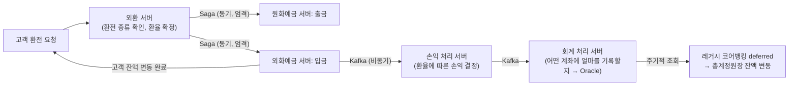

| | |
| --- | --- |
| 발표 | SLASH 24 |
| 연사 | 장세경, 김준우 (토스뱅크 Server Developer) |
| 자료 | [발표 영상](https://www.youtube.com/watch?v=uWnAVYgCd0k) · [SLASH 24](https://toss.im/slash-24) |

1년 전 [지금 이자 받기 MSA 전환](/posts/slash23-core-banking-msa/)은 마이크로서비스로 쪼갰지만 DB는 여전히 Oracle을 공유했다. 이 발표는 그 다음 단계다. 외화예금(환전) 서비스를 처음부터 MSA + MySQL로 만들면서 Oracle의 장단점을 정면으로 따지고, 고객 잔액은 엄격한 트랜잭션으로, 은행 내부 회계는 Kafka로 분리한 트랜잭션 아키텍처, Redis 분산 락 + DB 비관적 락, 코루틴 병렬 검증, 자정에도 거래를 막지 않는 잔액 대사 테이블 설계, 다섯 명이 6개월 만에 오픈할 수 있게 한 3층 테스트 자동화를 설명한다. 결과는 3,000 TPS, 환전 30ms, 24시간 무중단이다. 내용은 발표 영상과 자동 생성 자막을 근거로 했고, 표현은 내 말로 바꿨다.

## 왜 Oracle을 벗어났나

모놀리식 코어뱅킹은 한 서버에서 모든 트랜잭션을 처리해 트랜잭션 관리가 쉽지만, 한 업무 컴포넌트의 장애가 다른 컴포넌트로 전파되는 단일 장애점이다. 토스뱅크는 지금 이자 받기처럼 점진적으로 MSA로 옮기고 있었지만 **DB는 여전히 Oracle을 공유**했다. 예금 마이크로서버가 많은 트래픽으로 Oracle에 과도한 부하를 주면 관련 없는 카드·여신 마이크로서버와 레거시 코어뱅킹까지 함께 마비된다. 마이크로서버별로 Oracle 서버를 따로 두는 옵션도 있지만 CPU 코어 수에 비례해 과금되는 라이선스 구조상 채택하기 어려웠다.

대안을 찾기 전에 Oracle의 장단점을 명확히 파악했다. 장점은 트랜잭션 관리·고가용성·복구·무결성의 신뢰성과 안정성, 큰 데이터 볼륨의 확장성, 복잡한 트랜잭션과 대규모 쿼리의 성능, 금융업계에서 오래 쓰여 축적된 노하우와 커뮤니티다. 단점은 단일 장애점, MySQL 대비 비싼 비용, 제한적인 스케일 아웃 전략이다. 모든 금융 업무를 모바일로 보는 지금도 코어뱅킹에는 Oracle만이 정답인가라는 통념에 의구심을 갖기 시작했다.

Oracle을 쓰는 가장 큰 이유가 막강한 트랜잭션 관리이므로 트랜잭션 관리 방법이 어떻게 바뀌었는지 봤다. 예전에는 모든 트랜잭션을 DB 레이어에서 관리했지만 지금은 Redis 분산 락, Kafka를 활용한 Saga 패턴 같은 기술로 **애플리케이션 레이어에서** 효율적으로 관리할 수 있다. 확장성은 MySQL 리플리케이션으로 높은 수준의 스케일 아웃이 되고, 안정성은 MySQL도 MVCC로 효율적인 동시성 제어가 되며, 노하우도 많은 IT 회사가 메인 DB로 오래 써서 Oracle 못지않다. 그래서 앞으로 만드는 제품은 MSA + MySQL로 하자는 마음이 있던 차에 토스뱅크가 외환 사업에 진출했고, 원화예금은 모두 Oracle이지만 **외환 관련 서비스는 모두 MSA + MySQL로** 개발하자는 다짐으로 프로젝트를 시작했다.

## 아키텍처

초창기 수신 원화예금은 개설·입금·출금·해지 등 모든 업무가 하나의 레거시 코어뱅킹 서버에 있었고, 지금 이자 받기·송금·원장 관리 같은 업무를 점진적으로 새로 구현하되 DB는 Oracle이었다. 외화예금은 기존 수신 업무의 모든 것을 데이터 모델링부터 인프라·API까지 전면 재설계했고 DB는 MySQL이다. 기술은 Kotlin, Spring, MySQL, Hadoop, Redis, Kafka로 토스에서 쓰던 것들이다.

### 트랜잭션: 고객 잔액은 엄격하게, 은행 회계는 비동기로

빠른 환전 경험을 위해 트랜잭션은 전체적으로 느슨하게 연결하되, **고객의 잔액 관리 부분은 서버 간 트랜잭션을 엄격하게** 관리하고, **고객과 관련 없는 은행 내부 회계 처리는 Kafka로 비동기 분리**했다.

은행에서 금융 거래란 고객 요청으로 고객 계좌 잔액이 바뀌고, 이어서 재무제표의 기초인 총계정원장이라는 은행 계좌의 잔액까지 바뀌는 것이다. 환전도 원화 계좌 출금과 외화 계좌 입금으로 두 계좌 잔액이 바뀌니 금융 거래다.

고객이 환전을 요청하면 외환 서버가 환전 종류를 확인하고 환율을 확정한 뒤 원화예금 서버로 출금하고 외화예금 서버로 입금한다. 여기까지 끝나면 고객 계좌의 잔액 변동은 완료된 것이고, **여기까지만 서버 간 트랜잭션을 묶어** 외환 서버가 Saga 패턴으로 관리한다(같은 날 [환전 보상 트랜잭션 세션](/posts/slash24-compensating-transaction-fx/)에서 자세히). 남은 흐름은 Kafka다. 외환 거래라 손익 처리를 위해 손익 Kafka를 발행하면 손익 처리 서버가 환율에 따른 손익을 결정하고, 은행 계좌 처리를 위해 회계 Kafka를 발행하면 회계 처리 서버가 어떤 계좌에 얼마를 기록할지 Oracle에 기록해 두고, 레거시 코어뱅킹의 deferred 작업이 주기적으로 조회해 총계정원장의 잔액을 변동시킨다.

이 모든 과정을 레거시 코어뱅킹에 구현할 수도 있었다. 하나의 트랜잭션이면 커밋·롤백 관리가 쉽다는 큰 장점이 있지만, 복잡한 은행 비즈니스 로직 간 의존이 더 높아지고 고객과 관련 없는 은행 계좌 처리까지 하나의 트랜잭션에 묶여 환전 속도가 정말 느려지고 수용 가능한 TPS가 낮아졌을 것이다.

### 입금 API: 락, 병렬 검증

입금을 하려면 잔액 변동을 막는 동시성 제어가 필수다. 환전과 동시에 같은 계좌로 카드 결제가 들어올 수 있고 자동이체가 잔액 변동을 시도할 수 있다. 애플리케이션 레이어에서 **Redis 분산 락**, 실제 데이터가 수정되는 DB 레이어에서 **비관적 락**을 건다. Redis를 쓴 이유는 DB보다 빠른 응답으로 다른 트랜잭션이 접근했을 때 **fail-fast**를 유도하기 위해서다.

다음은 거래 가능한 계좌인지 검증하는 단계인데 정말 많고 복잡하다. 해지된 계좌는 아닌지, 압류나 사고가 걸린 계좌는 아닌지, 명의도용이나 사망한 고객은 아닌지 등등. 여러분의 안전한 거래를 위해 절대 생략할 수 없는 필수 단계다. 이 과정을 레거시 코어뱅킹처럼 하나씩 동기적으로 조회·검증했다면 지연이 폭발적으로 늘었을 것이다. **코루틴으로 동시에 조회·검증**해 지연을 낮췄다. 거래 가능이 확인되면 거래 내역을 적재하고 잔액을 수정하고 DB 커밋한 뒤 은행 계좌 처리용 Kafka를 발행한다.

### 자정에도 멈추지 않는 잔액 대사

토스뱅크 환전은 24시간 365일 무중단이다. 왜 일반 은행은 자정 근방에 거래가 안 되나. 택시 결제나 음식점 결제가 자정에 실패한 당황스러운 경험이 있을 수 있는데, 은행의 회계 시스템, 구체적으로 **잔액 대사**와 관련이 있다. 금융 거래가 발생하면 고객 계좌와 은행 계좌의 잔액이 바뀌는데 그것이 매일 잘 처리됐는지 검증하는 것이 잔액 대사다. 매일 00:00을 기점으로 모든 고객 계좌 잔액의 합과 모든 은행 계좌 잔액의 합이 같아야 하고, 그러려면 00:00의 정확한 잔액을 산출해야 한다.

| 방법 | 동작 | 문제 |
| --- | --- | --- |
| 일반 은행 | 자정 근방에 거래를 막는다 | 고객이 거래할 수 없다 |
| 토스뱅크 원화예금 | 00:00에 전일자 스냅샷 테이블을 만들고, 그 시점에도 거래가 있을 수 있으므로 00:00 이후 거래가 있던 계좌의 첫 거래 내역 금액으로 잔액을 **역산해 보정** | 보정 로직 필요 |
| 토스뱅크 외화예금 | **일자별·계좌별 PK로 잔액만 기록하는 테이블**을 두고 금융 거래마다 일자 기준으로 잔액을 기록. 전일자 스냅샷은 이 테이블에서 일자별로 가져온다 | 보정 없음. Hadoop 이관 내역 기반으로 만들어 온라인에 부하 없음 |

원화예금은 보정으로 24시간 송금을 제공했고, 외화예금은 보정조차 없이 **데이터 구조를 바꿔** 해결했다. 기술적 최적화와 데이터 관리 전략으로 일반 은행의 제약을 극복한 것이다.

## 테스트 자동화: 5명이 6개월

입금 API 같은 말도 안 되게 복잡한 비즈니스 로직이 적어도 100개는 모여야 외화예금 서버가 된다. 개발은 어떻게든 하더라도 테스트가 어렵다. 토스뱅크 오픈을 위해 원화예금을 개발할 당시에는 **30명 넘는 개발자가 1년 6개월 동안 수기로** 엑셀에 재량껏 발생 가능한 케이스를 적고 증적 사진을 남기며 검증했고, 코드에 작은 수정이 있을 때마다 반복했다.

| 층 | 환경 | 내용 |
| --- | --- | --- |
| 단위 테스트 | 로컬 | 프로그램 정합성. 하나라도 실패하면 dev와 라이브에 반영되지 않는 룰 |
| E2E 서버 | dev | 배포 대상 서버의 API를 dev에서 호출하는 코드를 작성하는 공간. 고객이 외화예금을 거래하는 시나리오를 코드화해 두고, 코드 수정마다 트리거되어 자동으로 API를 호출. 하나라도 실패하면 알림 |
| 이상 거래 탐지 | 라이브 | 운영에서 발생하면 안 되는 데이터가 발생했는지 검증. 해지된 계좌에 입금된 내역은 없는지, 하루에 이자를 두 번 받은 계좌는 없는지. 데이터 중요도에 따라 주기적으로 돌며 알림. 복잡한 네이티브 쿼리라 Hadoop 이관 내역 기반 |

원화 오픈 당시 수기로 했던 검증이 외화예금에서는 모두 자동화됐고, 다층 자동화 덕에 **다섯 명이 6개월 만에** 개발·오픈했다.

## 성과

- **금융권 최초 MySQL + MSA 기반 코어뱅킹.** 191만 MAU 토스 홈에서 오는 **3,000 TPS**를 안정적으로 소화하는 Grafana 메트릭을 보여줬다.
- **세상에서 제일 빠른 환전.** 토스뱅크 원화 송금은 건당 평균 280ms로 이미 일반 은행보다 빠른데, 환전은 **30ms**다. MySQL뿐 아니라 Redis 캐싱, 코루틴 등으로 애플리케이션 자체 속도를 원화예금보다 월등히 빠르게 설계했기 때문이다.
- **24시간 365일 무중단.** 은행 회계 정합성을 위한 원장 보정 작업까지 MSA로 전환해 안정적으로 언제나 환전할 수 있다.

## 리뷰

**"고객 잔액까지만 동기, 은행 회계는 비동기"라는 경계가 이 발표의 설계 원칙이고, 1년 전 발표의 "세금은 비동기"를 일반화한 것이다.** 고객이 보는 것(내 잔액)과 은행이 보는 것(총계정원장)을 다른 일관성 수준으로 다루고, 그 사이를 Kafka와 deferred 처리로 잇는다. 외환 거래에서 손익 계산이 끼어드는 것도 같은 비동기 경로에 얹혔다. 은행 트랜잭션을 분해할 때 "무엇이 즉시 일관되어야 하는가"의 답이 "고객 계좌 잔액"이라는 것이 두 발표를 통해 확인된다.

**잔액 대사 테이블 설계가 가장 은행다운 엔지니어링이다.** "자정에 거래를 막는다"는 관행의 근거를 회계 검증에서 찾고, 원화에서는 보정으로, 외화에서는 일자별 잔액 테이블로 풀었다. 문제를 애플리케이션 로직이 아니라 데이터 모델로 없앤 두 번째 답이 더 낫다는 것을 발표자가 순서대로 보여준다. 이것은 Oracle을 버리는 것과 무관하게 어느 은행에나 적용 가능한 설계다.

**"30명 1년 6개월 수기 검증 vs 5명 6개월 자동화"가 발표의 가장 강한 숫자다.** 토스뱅크의 [테스트 커버리지 100%](/posts/slash21-test-coverage-100/) 발표가 개인의 실천이었다면, 여기서는 단위·E2E·라이브 탐지 3층이 팀의 표준이 되어 인력 6배, 기간 3배 차이를 만들었다. Oracle → MySQL보다 이 차이가 더 큰 변화일 수 있다.

## 남는 질문

- Saga로 원화 출금과 외화 입금을 묶을 때 외화 입금 실패 시 원화 출금 보상은 어떻게 하는지. 보상 트랜잭션 세션에서 다룬다고 했으니 [그 리뷰](/posts/slash24-compensating-transaction-fx/)에서 이어진다.
- 회계 처리 서버가 여전히 Oracle에 기록하고 레거시 deferred가 총계정원장을 바꾼다면, 총계정원장 자체는 아직 Oracle이다. 그것까지 MySQL로 옮길 계획인지.
- 3,000 TPS에서 MySQL 리플리케이션의 복제 지연이 잔액 조회에 영향을 주지 않는지. 읽기를 어디로 보내는지.
- 일자별 잔액 테이블은 거래가 있는 계좌만 기록될 텐데, 거래가 없는 계좌의 전일 잔액은 어떻게 채우는지.

## 참고

- [발표 영상](https://www.youtube.com/watch?v=uWnAVYgCd0k)
- [SLASH 24](https://toss.im/slash-24)
- 1년 전: [SLASH 23 은행 최초 코어뱅킹 MSA 전환기 리뷰](/posts/slash23-core-banking-msa/)
- 같은 날 짝: [SLASH 24 환전의 보상 트랜잭션 리뷰](/posts/slash24-compensating-transaction-fx/)
