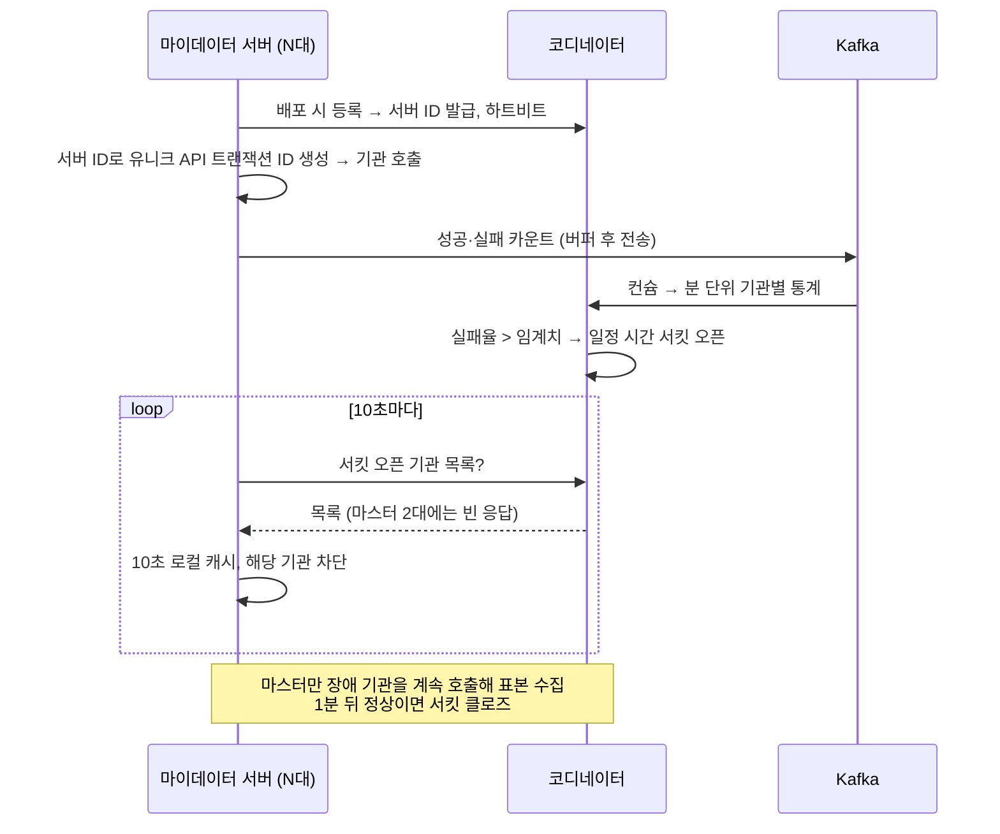

| | |
| --- | --- |
| 발표 | SLASH 24 |
| 연사 | 신윤재 (토스 User Financial Data Team, Server Developer) |
| 자료 | [발표 영상](https://www.youtube.com/watch?v=5I7ehDTvnWA) · [SLASH 24](https://toss.im/slash-24) |

토스 홈 화면의 자산·잔액·거래내역은 마이데이터로 온다. 마이데이터 서버는 약 7만 TPS를 받고 7개 업권 수백 개 제공기관과 API를 주고받는 토스 금융 데이터의 플랫폼이다. 발표는 세 문제를 다룬다. Resilience4j의 서버 단위 서킷이 클러스터에서 일관되지 않아 별도 코디네이터 서버를 만든 것, 77초짜리 자산 등록 API가 토스 공용 네트워크 리소스를 점유하는 문제를 웹소켓 얼리 리턴으로 56배 줄인 것, 7일 주기 배치 호출을 유저 사용 패턴에 맞춰 분산하고 코루틴 채널로 100ms 단위 실행한 것. 내용은 발표 영상과 자동 생성 자막을 근거로 했고, 표현은 내 말로 바꿨다.

## 마이데이터 서비스

여러 금융기관에 흩어진 개인의 신용정보를 편리하게 조회하는 서비스다. 토스 홈에서 연결한 금융 자산과 잔액·거래내역을 보는 것, 신용점수 올리기, 대출 같은 다양한 서비스가 마이데이터를 쓴다. 그래서 마이데이터 서버는 토스에서 금융 데이터의 플랫폼 역할을 하고 트래픽도 자연스럽게 늘어 현재 약 7만 TPS(초당 트랜잭션 수)다. 나비효과처럼 아주 작은 변화도 큰 문제를 일으킬 수 있는 환경이다.

## 1. 장애 대응: 서버 단위 서킷의 한계

7개 업권 수백 개 제공기관과 통신하므로 복잡한 상호작용 때문에 장애 가능성이 상대적으로 높다. 제공기관 장애는 마이데이터 서버로, 다시 유저와 다른 토스 시스템으로 전파된다. 기관 수가 많은 만큼 대응 리소스도 함께 는다. 기관으로 향하는 트래픽을 모니터링해 유저당 일정 수 이상 호출이 나가지 않게 관리하고(임계치를 넘으면 기관 성능에 영향), 그럼에도 장애가 나면 트래픽을 차단해 복구를 도와야 한다. 이 과정을 개발자 개입 없이 자동화하는 것이 코디네이터 시스템이다.

처음부터 만들려던 것은 아니다. Resilience4j로 기관 단위 [서킷브레이커](/posts/circuit-braker/)를 적용하고 장애 시 서킷을 열어 "점검 중"을 띄웠다. 하지만 Resilience4j는 **서버 단위**로 적용된다. 각 서버가 자기 호출 결과만 보고 실패율을 계산한다는 뜻이다. 모든 서버가 A 은행을 호출하는데 특정 서버의 호출만 실패하면, 전체 관점에서 실패율은 10%지만 그 서버 입장에서는 100%라 서킷이 열린다. 반대로 장애 은행으로 가는 트래픽이 특정 서버에 몰리면 그 서버는 즉시 열리지만 호출이 없었거나 최소 표본을 모으지 못한 서버는 열리지 못한다. 최소 표본 조건은 Resilience4j 설정에도 있다. `minimumNumberOfCalls`만큼 호출이 기록되기 전에는 실패율을 계산하지 않으므로, 기록된 호출이 모두 실패했어도 서킷이 열리지 않는다([Resilience4j CircuitBreaker 문서](https://resilience4j.readme.io/docs/circuitbreaker)). 결국 서버마다 서킷 상태가 달라 시스템이 일관되게 동작하지 못한다.

그래서 코디네이터를 만들기로 했고, 마이데이터 서버 안에 구현할지 별도 서버로 할지 고민한 끝에 별도 서버를 택했다. 마이데이터 서버는 의존성이 많아 장애 가능성이 높은데, 장애 난 서버가 코디네이터 기능을 수행하고 있었다면 전체 기능이 중단된다. 운영·자동화 기능을 온전히 분리해 유연하고 확장 가능한 시스템을 만들자는 결론이다.

마이데이터 서버가 쿠버네티스에 배포되면 코디네이터에 등록을 요청하고, 코디네이터는 클러스터 목록에 편입시켜 서버 ID를 발급하며 하트비트를 확인한다. 서버는 서버 ID로 분산 환경에서 유니크한 API 트랜잭션 ID를 만들어 기관을 호출하고, 성공·실패를 카운트해 잠시 버퍼에 쌓았다가 Kafka로 보낸다. 코디네이터는 컨슘해 분 단위 통계를 만들고 실패율이 임계치를 넘은 기관이 있으면 일정 시간 서킷을 연다. 마이데이터 서버는 10초에 한 번 서킷이 열린 기관 목록을 요청해 다음 10초까지 로컬에 캐싱하고 그 기관으로의 트래픽을 차단한다.

다시 닫는 조건에 서버 ID가 쓰인다. 코디네이터는 가장 먼저 배포된 서버와 가장 마지막에 배포된 서버 두 대를 마스터로 지정하고, 서킷 목록 요청에 마스터에게만 빈 응답을 주어 A 은행 장애를 모르게 한다. 그러면 마스터만 장애 기관으로 호출이 나가 표본을 수집하고, 1분 뒤 실제로 해소됐다면 서킷이 닫히며, 다음 사이클에 모든 서버의 캐시가 갱신되어 트래픽이 다시 나간다. 왜 처음과 마지막인가. 토스는 카나리 배포라 일시적으로 서버 수가 두 배가 되고 구버전에서 신버전으로 트래픽이 전환되는데, 어느 쪽으로 가더라도 최소 한 대는 표본을 수집하도록 처음(구버전)과 마지막(신버전)이 마스터가 된다.

코디네이터는 트래픽 통계로 지난주 대비 이번 주 증감을 유의미하게 감지해 개발자 확인이 필요한 정도면 사내 메신저로 알린다. 이 시스템으로 주당 평균 55분의 업무 시간을 절약했다.

## 2. 토스 시스템 부하: 77초짜리 API

마이데이터 API 중에는 한 번의 호출에 N번의 제공기관 호출이 발생하는 것이 있다. 대표적으로 자산 등록이다. 여러 번의 인증과 자산 정보 호출이 필요하다. 그래서 전체 실행 시간이 제공기관 응답 속도에 좌우되는데, 마이데이터 공식 스펙의 타임아웃은 20초이고 20초가 지나도 성공 응답이 오는 케이스, 순차 호출해야 하는 공식 스펙도 있어 응답 시간이 비대칭적으로 늘어난다.

사례: 인증 확인 → 토큰 발급 28초 → 자산 목록 25초 → 자산 상세 24초, 총 77초. 1분 넘게 완료 화면을 기다려 주는 유저는 많지 않다. 하지만 늦은 응답도 중요하다. 당장 성공 화면을 못 보여줘도 유저가 이탈한 뒤 모든 API가 성공하면 다시 진입했을 때 연결된 자산을 볼 수 있다. 실제로 77초 걸린 유저도 그때는 이탈했지만 다시 들어왔을 때 등록된 자산을 확인했다.

문제는 토스 인프라 점유 시간이다. 앱에서 마이데이터 서버를 호출하면 여러 네트워크 장비와 게이트웨이를 지나는데, 각 홉은 다음 홉의 응답을 기다리며 커넥션을 유지한다. 이 홉들은 토스의 다양한 서비스가 공용으로 쓰는 리소스라 특정 서버의 응답이 느려지면 토스 트래픽 입구의 가용성 문제가 된다. 마이데이터는 트래픽이 워낙 많아 제공기관 응답이 느려지면 시스템 알림이 어김없이 올라왔다.

[웹소켓과 폴링](/posts/monticker-ws-vs-polling/) 중 웹소켓을 택했다. 대용량 트래픽 서버에 잦은 폴링으로 부하를 주는 것보다 효율적이라 판단했다. 토스 앱을 열면 웹소켓 서버와 연결을 맺고 이 커넥션은 서버 푸시가 필요한 여러 토스 서비스가 공유한다. 유저가 긴 자산 등록을 시작하면 마이데이터 서버는 API를 얼리 리턴(작업 완료 전에 먼저 응답)해 즉시 공용 리소스를 해제하고, 비동기로 자산 등록을 진행하며 완료되는 기관이 생길 때마다 웹소켓으로 푸시한다. 모든 자산이 끝나야 한 번에 알던 방식에서 완료된 기관 목록을 동적으로 알려주어 화면에 동적으로 표현할 수 있게 됐다. 시스템적으로는 평균 **3,300ms 점유하던 공용 리소스가 58ms로, 56배** 개선됐다.

## 3. 피크 트래픽 제어: 7일 배치를 고르게

마이데이터 API는 유저 액션에 의한 유저 호출과, 유저 동의하에 7일에 한 번 자산을 갱신하는 배치 호출로 나뉜다. 배치 호출은 아무 때나 할 수 없고 하루 중 금융기관이 허용한 6시간 동안만 가능하다. 허용 시간은 짧고 유저는 많아 제공기관에 과한 트래픽이 갈 수 있다. 어떻게 7일 동안 균일하게 호출할 것인가.

힌트는 유저 사용 패턴이었다. 피크가 가장 큰 날은 매달 25일 월급날 아침이고, 증권 거래가 되는 평일에 주말보다 더 찾는다. 유저마다 다르지만 패턴이 있다. 유저 호출이 많은 날은 배치 호출 수를 낮추고, 적은 날은 늘렸다. 7일 총량은 같지만 특정일 과부하로 인한 장애를 막았다.

실행 시간대는 기관이 허용한 6시간이다. 배치 애플리케이션은 하루가 시작되면 오늘의 대상 유저 수를 계산하고, 은행의 허용 시간대가 되면 1분간 실행할 대상 수를 다시 계산한다(기관이 허용 시간대를 분 단위로 설정할 수 있어서). 배치 호출은 유저 한 명당 N번의 API가 나가므로 동시 호출을 최소화하기 위해 1분 대상을 다시 100ms 단위로 나눠 실행한다.

구현은 코루틴이다. 실제로는 1분간 실행할 기관이 A 은행만이 아니라 N개이고 기관마다 유저 수도 다르다. 기관과 유저 범위를 명령 객체로 표현하고 N개 기관을 별도 코루틴에서 병렬 실행한다. 처리 메서드에는 두 코루틴이 있다. 첫째는 일정 간격으로 DB에서 대상자 정보를 가져오는 코루틴, 둘째는 대상자를 100ms 단위로 나눠 실행하는 코루틴이고, 둘을 코루틴 채널로 잇는다. 대상자를 한 번에 가져오지 않는 이유는 배치가 활발한 시점에 1분간 가져올 수가 4만 개를 넘어 한 번에 가져오면 슬로우 쿼리가 나고 다른 코루틴에 영향을 주기 때문이다. 1초마다 소분해 채널에 produce하고, 60초 뒤 produce가 끝나면 채널이 닫힌다. consume 쪽은 채널에서 명령 객체를 받아 100ms마다 실행하는데, 여기서 **코루틴 스코프를 분리**했다. 코루틴은 structured concurrency 특성상 하위 코루틴이 끝나지 않으면 스코프를 벗어나지 않는다. Kotlin 문서는 이를 "A parent coroutine waits for its children to complete before it finishes."(부모 코루틴은 자식이 모두 끝나야 끝난다)라고 설명한다([Kotlin - Coroutines basics](https://kotlinlang.org/docs/coroutines-basics.html#coroutine-scope-and-structured-concurrency)). 그래서 채널에서 객체가 도착했는데 하위 코루틴이 안 끝나 즉시 실행하지 못하는 문제가 생길 수 있다. 스코프를 분리해 비동기로 실행하고, 채널이 닫히면 컨슈머 쪽 for도 끝나 1분 배치가 종료된다.

발표자는 존경하는 동료의 말로 마무리했다. 엔지니어링은 공학이고 공학은 문제를 해결하는 것이다. 팀은 개발 자체보다 상황에 맞게 문제를 해결하는 데 초점을 맞춰 왔고, 때로는 기술이 아닌 접근 방식의 변화로, 기술이 필요할 때는 가장 효율적인 솔루션으로 풀어왔다.

## 리뷰

나는 서킷브레이커를 "서버"가 아니라 "클러스터"의 상태로 만든 것을 이 발표의 핵심 설계로 읽는다. Resilience4j의 한계는 라이브러리 결함이 아니라 관점의 차이다. 인스턴스별 실패율은 카나리나 트래픽 편중이 있는 클러스터에서 전체 상황을 대표하지 못한다. 통계를 Kafka로 모아 중앙에서 판단하고 10초 캐시로 뿌리는 구조는, 2년 전 [토스뱅크 대출 시스템](/posts/slash22-tossbank-loan-system/)이 Redis에 분 단위 지표를 쌓아 서킷을 연동한 것의 클러스터 버전이다. Resilience4j의 HALF_OPEN은 서킷 하나가 정해진 수의 호출만 통과시켜 대상이 회복됐는지 확인하는 상태다([Resilience4j CircuitBreaker 문서](https://resilience4j.readme.io/docs/circuitbreaker)). 마스터 두 대는 그 확인 역할을 클러스터 안의 특정 서버에 맡기고, 카나리 배포 중에도 구버전·신버전 양쪽에 한 대씩 남도록 고른 half-open 설계로 읽힌다.

웹소켓 얼리 리턴은 "늦은 응답도 중요하다"와 "공용 리소스를 점유하면 안 된다"를 동시에 만족시킨다. 77초 API를 타임아웃으로 끊으면 유저의 자산 등록이 실패하고, 기다리면 게이트웨이가 막힌다. 응답과 완료를 분리해 둘 다 지켰다. 그래서 3,300ms → 58ms는 마이데이터 서버가 빨라진 수치가 아니라, 토스 전체 입구가 마이데이터로부터 보호된 정도를 보여 주는 수치로 읽어야 한다.

배치 분산은 "상대를 지키는 유량 제어"의 또 다른 예로 읽힌다. 제공기관이 허용한 6시간 안에, 기관이 분 단위로 정한 시간에, 100ms 단위로 쪼개서 보낸다. 토스가 자기 시스템이 아니라 수백 개 기관의 시스템을 배려해 트래픽을 설계한다는 점에서 대출 시스템의 대외기관 파이프라인과 같은 철학이다. 코루틴 채널과 스코프 분리 설명은 짧지만 실제로 겪어야 아는 함정이다.

## 남는 질문

- 코디네이터 자체가 죽으면 마이데이터 서버는 마지막 캐시로 동작하는지, 서킷을 전부 닫는지(fail-open) 여는지(fail-close).
- 웹소켓 커넥션이 끊긴 유저(앱 종료)에게 완료 푸시가 가지 못한 경우, 다음 진입 시 어떻게 상태를 동기화하는지.
- 마스터 두 대가 장애 기관을 계속 호출하는 것 자체가 기관에는 부하다. 표본 수집 호출의 빈도를 얼마로 제한하는지.
- 7일 배치의 요일별 가중치는 수동으로 정하는지, 지난주 유저 호출량으로 자동 계산하는지.

## 참고

- [발표 영상](https://www.youtube.com/watch?v=5I7ehDTvnWA)
- [SLASH 24](https://toss.im/slash-24)
- [Kotlin Coroutine Channels](https://kotlinlang.org/docs/channels.html)
- [Kotlin - Coroutine scope and structured concurrency](https://kotlinlang.org/docs/coroutines-basics.html#coroutine-scope-and-structured-concurrency)
- [Resilience4j CircuitBreaker](https://resilience4j.readme.io/docs/circuitbreaker)
- 같은 철학의 대외기관 제어: [SLASH 22 토스뱅크의 완전히 새로운 대출 시스템 리뷰](/posts/slash22-tossbank-loan-system/)
