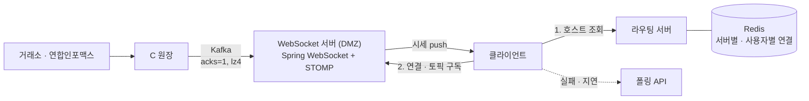

| | |
| --- | --- |
| 발표 | SLASH 22, Server 트랙 |
| 연사 | 박성우 (토스증권 마켓 플랫폼팀 Server Developer) |
| 자료 | [세션 페이지](https://toss.im/slash-22/sessions/2-6) · [발표 영상](https://www.youtube.com/watch?v=WKYE-QtzO6g) |

토스증권이 처음 SLASH에 나온 세션이다. 런칭 전에 폴링으로 다 만들어 둔 시세를 팀 논의 끝에 WebSocket으로 바꾼 결정, 망분리 안에서의 인프라 배치, Kafka latency 튜닝, 그리고 런칭 뒤 겪은 장애 네 가지가 순서대로 나온다. [시세·주문 아키텍처 리뷰](/posts/toss-securities-market-data-and-order-architecture/)에서 참석 후기를 근거로 요약했던 내용을, 이번엔 발표 영상과 자동 생성 자막을 근거로 다시 정리했다. 표현은 내 말로 바꿨다.

## 실시간 시세란 무엇이고, 왜 처음엔 폴링이었나

주식 시장에서 사거나 팔고 싶은 가격을 부르는 것이 주문 호가이고, 일치하는 상대 주문이 있으면 거래가 성사된다. 성사된 가격이 쌓인 것이 차트의 체결 시세이고, 가장 최근 체결가가 현재가다. 투자자는 최신 정보로 호가를 정하려 하므로 가장 빠르게 시세를 주는 MTS를 선호하고, 증권사는 거래소나 시세 제공처에서 받은 시세를 지연 없이 전달하려 한다. 국내는 모든 증권사가 무료지만 해외는 전월 실적 조건부나 유료가 많은데, 토스증권은 해외를 포함해 전 종목을 조건 없이 무료로 준다.

처음부터 그럴 계획은 아니었다. 런칭 전 초기 기획은 API 폴링이었고 구현도 끝나 있었다. 주식 초심자를 주 타깃으로 잡으면서 이들은 실시간성에 크게 민감하지 않을 것이라는 가설이 있었고, Robinhood를 벤치마킹하며 그 가설에 힘이 실렸다. 그런데 런칭을 앞두고 다시 논의가 붙었다. 주 타깃과 별개로 전체 사용자 경험을 생각하면 가장 최신 정보를 빠르게 줘야 한다는 데 팀이 크게 공감했고 빠르게 결정됐다.

기술은 WebSocket을 골랐다. 후보로 SSE(Server-Sent Events, 서버에서 클라이언트 방향으로만 이벤트를 흘려보내는 HTTP 스트림)가 있었지만 향후 양방향 통신으로 기능을 확장할 것이라 판단했다. 발표자는 여기에 회고를 덧붙였다. SSE가 더 방화벽 친화적이고, 특히 패킷 검사 기능이 있는 방화벽이 WebSocket 처리에 문제가 있다는 것을 나중에야 알았으며, 런칭 초기 방화벽 관련 이슈를 겪은 것을 돌이켜보면 단방향 시세 시스템에는 SSE도 충분히 고려할 만하다고 했다. 2년 뒤 SLASH 24에서 같은 회사가 [SSE로 폴링을 제거](/posts/slash24-sse-event-push/)하는 발표를 한 것이 이 회고의 후속으로 읽힌다.

WebSocket이 적용된 영역은 종목 상세의 차트, 호가창, 그리고 대부분의 종목 정보에 나오는 현재가다. 기존 폴링은 버리지 않고 폴백으로 남겼다. 연결 실패, 미지원, 연결은 됐지만 시세 지연이 있는 경우에 폴링 API가 대신한다. 이 폴백이 런칭 초기 안정화에서 제 몫을 했다.

WebSocket 시스템 위에 만든 재미있는 기능도 있었다. 같은 종목을 동시에 보고 있는 사용자 수를 실시간으로 노출하는 기능이다. 이것이 매매 전환율에 영향을 주는지 A/B 테스트를 했는데 긍정적 효과가 없어 페이드아웃됐다.

## 구조: C 원장에서 Java 앱까지 Kafka로

국내 시세는 한국거래소에서, 해외 시세는 연합인포맥스에서 온다. 원장은 Unix C 기반이고 MTS 애플리케이션은 Kubernetes 위 Java라 스택이 다르다. C 원장이 받은 시세를 Java 앱을 거쳐 클라이언트까지 보내려면 매개체가 필요했고, Kafka를 썼다. 원장이 시세를 수신·적재하며 Kafka로 보내고, WebSocket 서버가 받아 클라이언트로 전달한다.

### 인프라

WebSocket 서버를 DMZ(외부망과 내부망 사이에 둔 완충 구간)에 두고 N대가 각각 고유한 호스트명을 갖게 했다. 로드밸런싱과 라우팅을 위한 라우팅 서버를 따로 두고, 서버-클라이언트 연결 정보를 Redis로 관리한다. 이유는 둘이다. 전자금융감독규정의 망분리(내부 업무망을 인터넷과 분리하는 것) 요건은 클라이언트가 내부 서버에 직접 접속하지 않고 DMZ의 웹 서버를 경유하도록 권장하는데, WebSocket 서버가 DMZ의 공개 웹 서버 역할을 하면 이를 지킨다. 그리고 애플리케이션 서버 앞의 L7, nginx, Kubernetes 같은 네트워크 홉을 모두 제거해 단순해진다.

### 프로토콜

Spring WebSocket과 STOMP(WebSocket 위에서 구독과 발행 프레임을 정의한 텍스트 메시징 프로토콜)를 썼다. 별도 프로토콜 구현 없이 pub/sub을 빠르게 만들기에 가장 좋은 선택이었다. 토픽은 목적지가 종목 코드인 유형(현재가·호가·시장정보)과 사용자인 유형(보유 종목 등 개인 자산 갱신) 둘이다.

### 시세 수신 흐름

클라이언트가 라우팅 서버에서 접속할 WebSocket 서버의 호스트를 받아 연결하고, 실패하면 폴링 API를 부른다. 연결되면 WebSocket 서버가 갱신된 커넥션 정보를 라우팅 서버에 넘기고, 라우팅 서버는 서버별 커넥션 수를 Redis에 관리한다. 클라이언트는 화면에 보이는 종목의 토픽을 구독하고, WebSocket 서버는 Kafka로 받은 시세를 구독 클라이언트에 보낸다.

### 자산 갱신은 신호만 보낸다

갱신된 자산 정보를 WebSocket으로 직접 보내지 않고 "갱신하라"는 신호만 준다. handshake에서 사용자 ID를 얻어 사용자별 접속 서버를 Redis에 두고, 원장에서 체결이나 입출고로 자산이 바뀌면 라우팅 서버가 그 사용자가 붙은 WebSocket 서버로 이벤트를 포워딩하고, 클라이언트는 자산 API를 다시 조회한다.

### Kafka latency

발표자가 클라이언트 설정으로 튜닝한 것은 compression type과 [acks](/posts/kafka-delivery-guarantees/) 둘이다. acks는 `all`(leader와 replica 모두 저장 후 응답), `1`(leader만), `0`(확인 없이 응답)이 있다. Kafka 문서는 `acks=1`이면 leader가 응답한 직후 follower가 복제하기 전에 leader가 죽을 때 레코드가 유실된다고 적는다([Kafka producer configs](https://kafka.apache.org/43/configuration/producer-configs/)). 발표자가 수 KB 메시지 100만 개로 직접 측정하니 `all`과 `1`의 평균 latency가 약 5.7배 차이 났다. `0`은 더 빨랐지만 실제 서비스에 쓰기엔 무리라고 보고 `1`로 잡았다. compression은 producer와 consumer를 모두 고려한 결과 lz4가 가장 좋았다(gzip은 한쪽에서만 좋았다). 파티션 수까지 조율한 결과 거래소 수신부터 WebSocket 서버 송신까지 평균 수십 ms가 됐다.

## 런칭 뒤 겪은 네 가지

MTS 트래픽은 장 시작과 동시에 3분 안에 그날 최대치가 나오는 패턴이다. 큰 이벤트가 없는 한 늘 비슷하고, 체결 시세도 장 시작 시점에 가장 몰린다.

### 1. Least connection이 오히려 몰리게 했다

초기 로드밸런싱은 [least connection](/posts/load-balancing-algorithms/)(현재 연결 수가 가장 적은 서버를 고르는 방식)이었다. 서버 간 분산은 됐지만 장 시작에 사용자가 몰리자 순간적으로 특정 서버에 다수의 커넥션이 몰려 CPU가 오르고 연결이 지연됐다. 원인은 갱신 주기다. 커넥션 정보 갱신을 위한 HTTP 요청을 줄이려고 매 연결 종료마다가 아니라 0.5초 주기로 갱신했고, 그 사이에 몰림이 두드러졌다. 내가 이해하기로는 갱신 전 0.5초 동안 같은 서버가 계속 가장 한가한 서버로 보여 새 연결이 그쪽으로 몰린 것이다. 그렇다고 모든 연결마다 요청하기도 부담이었다. 해법은 round robin과 least connection의 하이브리드다. 대다수 요청은 round robin으로 순간 몰림을 막고, 서버 간 균형을 위해 아주 적은 비중으로만 least connection을 쓴다.

### 2. 비정상 종료에서 커넥션이 샜다

배포나 재기동이 없으면 수일에서 일주일 사이에 WebSocket 서버군의 커넥션이 서서히 늘어, HTTP 요청으로 집계한 동접자 수와 큰 차이가 났다. Spring WebSocket의 close 이벤트를 디버깅하니 정상 종료는 문제없고 abnormal 이벤트에서 WebSocket이 닫히지 않았다. heartbeat 설정과 idle timeout은 정상이었다. 세션 disconnect 이벤트를 모아 보니 1001·1006 같은 abnormal close 코드가 빈번했다. RFC 6455에서 1001은 페이지 이동처럼 한쪽이 떠나는 경우이고, 1006은 Close 프레임을 주고받지 못한 채 연결이 끊긴 경우를 애플리케이션에 알리기 위한 예약 코드다([RFC 6455 7.4.1](https://www.rfc-editor.org/rfc/rfc6455#section-7.4.1)). 모바일 네트워크가 바뀌면 Close 프레임 없이 끊기기 쉬우므로 1006이 많이 나왔을 것으로 본다.

로컬에서 서버와 클라이언트를 띄우고 heartbeat가 가지 않도록 클라이언트를 멈춰 재현했다. 코드를 분석하니 STOMP 세션은 정리되는데 그 아래 WebSocket 세션은 닫히지 않았다. close 메서드의 `closeSocket` 옵션이 false로 실행되는 것이 원인이었다. `WebSocketHandlerDecoratorFactory`로 데코레이터를 등록해 `afterConnectionClosed`에서 WebSocket 세션을 명시적으로 `close`하도록 했고, 주로 발생하던 abnormal 코드에서 명시적으로 닫게 했다. 배포 뒤 수일 모니터링에서 누수가 해소됐다. 발표자는 모바일은 네트워크가 자주 바뀌어 예상 못 한 종류의 이벤트가 생기므로 이를 적절히 처리해야 WebSocket을 문제없이 쓸 수 있다고 했다.

### 3. 이벤트가 터지자 방화벽이 병목이었다

"주식 1주 선물받기" 이벤트가 바이럴되어 런칭 약 한 달 만에 200만 계좌, 실제로는 이벤트 한 주 동안 약 170만 계좌가 개설됐다. 팀 예측을 훨씬 넘는 트래픽이었다. 장 초반에 종목 상세 같은 주요 화면이 느려지고 시세 연결이 실패하는 장애가 수차례 났다. 애플리케이션 튜닝과 서버 추가 배치를 했지만 트래픽이 급증하는 날이면 어김없이 지연이 났다.

더 문제는 지연이 시세 서버만이 아니라 전체 시스템에 걸쳐 났다는 것이다. 인프라 엔지니어들과 분석하고 장 시작 시점에 여러 번 테스트한 끝에, 시세 서버의 아웃바운드 트래픽 증가로 인한 방화벽과 보안 장비의 처리량 문제임을 알았다. WebSocket 서버는 Kubernetes 환경의 다른 서버군과 분리돼 DMZ에 있었지만, 인터넷 회선·방화벽·보안 장비는 전체 서버군이 공유하고 있었다. 인터넷 회선을 분리하고 방화벽을 더 높은 처리량의 장비로 교체했다. 애플리케이션 밖의 요인이라 원인을 찾기까지 꽤 고생했고, 대량 데이터가 오가는 WebSocket을 고려할 때는 방화벽과 보안 장비 처리량도 봐야 한다는 것을 배웠다.

### 4. 온프레미스 스케일아웃의 한계

시세 서버군은 여러 번 스케일아웃을 거쳐 런칭 초기 대비 약 5배 규모가 됐고 같은 수의 예비 서버군을 확보해 뒀다. 하지만 온프레미스라 스케일아웃의 비용과 속도에 한계가 있다. 시세 서버군을 AWS로 옮기는 것을 검토해 PoC를 마쳤고, IDC-AWS 이중화를 거쳐 AWS로 이전할 계획이었다.

## 리뷰

나는 런칭 직전의 방향 전환을 이 발표의 중심으로 읽는다. 폴링은 구현이 끝나 있었고 가설과 벤치마크가 뒷받침하고 있었다. 그것을 뒤집은 근거는 주 타깃과 별개로 전체 사용자 경험을 봐야 한다는 판단이었다. 기술 발표인데 첫 번째 결정이 기술이 아니라 제품 판단이고, 뒤에 나오는 트러블슈팅은 모두 그 판단 위에서 생겼다. 폴링을 폴백으로 남긴 것은 그 결정의 위험을 줄인 장치였다.

수십 ms의 대가도 발표 안에 드러나 있다. `acks=1`은 leader 장애 시 유실 가능성을 받아들인 것이고, 5.7배라는 숫자가 그 결정의 근거다. [시세·주문 아키텍처 리뷰](/posts/toss-securities-market-data-and-order-architecture/)에서 시세 경로의 첫 번째 "버리기"로 본 지점이 여기다.

네 장애 중 셋은 애플리케이션 코드 밖에 있었다. 로드밸런싱 알고리즘, 방화벽 처리량, 온프레미스 스케일아웃이다. 코드 안에 있던 것은 커넥션 누수 하나뿐이고, 그것도 프레임워크(STOMP와 WebSocket 세션의 분리)의 경계에서 났다. 그래서 실시간 시스템을 준비할 때는 코드 리뷰만큼 네트워크 경로와 장비 용량을 봐야 한다고 나는 읽는다.

회고도 솔직하다. SSE를 다시 고려할 만하다는 말, 함께 보는 사용자 수 기능이 A/B 테스트에서 효과 없어 사라졌다는 말은 발표에서 빼도 되는 내용이다. 남겨 둔 덕에 2년 뒤 SSE 발표와 이어 읽을 수 있다.

## 남는 질문

- 하이브리드 로드밸런싱의 "아주 적은 비중"이 얼마인지, 그리고 라우팅 서버 자체는 어떻게 이중화됐는지. 라우팅 서버가 죽으면 새 연결이 전부 폴링으로 떨어진다.
- 커넥션 누수 수정은 abnormal 코드에서 명시적으로 닫는 것인데, heartbeat가 오지 않는데 close 이벤트조차 오지 않는 경우(반쯤 열린 TCP)는 idle timeout에 의존한다. 그 timeout이 얼마였고 장 초반 동접에서 좀비 커넥션이 차지하는 비율은.
- 방화벽 교체 전후로 시세 서버의 아웃바운드가 얼마였는지 숫자가 없다. 사용자 수 × 구독 종목 수 × 틱 빈도로 대략 추정할 수 있을 텐데, 이벤트 전에 그 계산을 했는지.
- AWS 이전 계획의 이후. 2025년 AWS 사례([미국 옵션 파이프라인](https://aws.amazon.com/ko/blogs/tech/toss-securities-nasdaq-options-realtime-pipeline/))는 미국 시세의 수신 쪽이고, 국내 시세의 WebSocket 서버군이 실제로 AWS로 갔는지는 공개 자료에 없다.

## 참고

- [세션 페이지](https://toss.im/slash-22/sessions/2-6)
- [발표 영상](https://www.youtube.com/watch?v=WKYE-QtzO6g)
- [Apache Kafka 4.3 Producer Configs](https://kafka.apache.org/43/configuration/producer-configs/)
- [RFC 6455 7.4.1 Defined Status Codes](https://www.rfc-editor.org/rfc/rfc6455#section-7.4.1)
- 후속 발표: [SLASH 23 실시간 시세 데이터 처리](/posts/slash23-realtime-quote-platform/), [SLASH 24 SSE 이벤트 푸시](/posts/slash24-sse-event-push/)
- 다른 자료와 함께 읽기: [토스증권 시세·주문 아키텍처 리뷰](/posts/toss-securities-market-data-and-order-architecture/)
