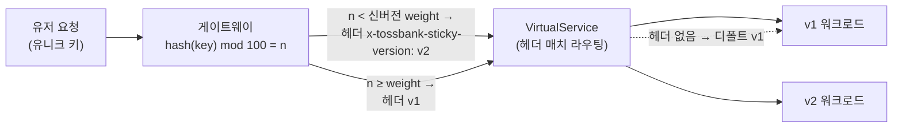

| | |
| --- | --- |
| 발표 | SLASH 24 |
| 연사 | 이민우 (토스뱅크 DevOps Engineer), 한태웅 (토스뱅크 SRE) |
| 자료 | [발표 영상](https://www.youtube.com/watch?v=ApNj9MZU7Ak) · [SLASH 24](https://toss.im/slash-24) |

토스 계열이 표준으로 쓰는 카나리 배포에서도 생기는 두 문제를 다룬다. 프론트엔드 서비스에서 유저의 첫 요청은 신버전, 다음 요청은 구버전으로 가서 "탭은 보이는데 페이지가 없는" Page Not Found가 나는 문제를 유저 키 해시 기반 **스티키 카나리**로 풀었고, 배포 중 모니터링을 사람이 완벽히 할 수 없고 MSA에서 A 배포의 문제가 B·C·D에서 터지는 문제를 오픈소스 없이 자체 배포 시스템의 스레드 하나로 만든 **오토 롤백**으로 풀었다. 내용은 발표 영상과 자동 생성 자막을 근거로 했고, 표현은 내 말로 바꿨다.

## 배포 전략과 토스뱅크의 선택

최근 주로 쓰는 전략은 셋이다. 기존 워크로드를 점진적으로 교체하는 롤링 업데이트, 신규 워크로드에 트래픽을 한 번에 넘기는 블루그린, 점진적으로 넘기는 카나리. 토스뱅크는 롤링과 카나리를 쓴다.

**롤링**은 replica 2 배포를 예로 들면 신버전 파드를 하나 만들고 준비되면 트래픽을 넣고 구버전 파드를 제거하는 과정을 반복한다. 쿠버네티스 기본 기능으로 되지만 **한번 시작된 배포를 중간에 멈출 수 없다.** 신버전 로직에 이슈가 있어 장애가 나면 완료될 때까지 기다려야 하고 그동안 모든 유저가 장애를 겪으며, 롤백도 같은 과정을 다시 거쳐 시간이 걸린다. 영향 유저 규모가 크고 복구 시간이 길다.

**카나리**는 쿠버네티스만으로는 어렵고 Istio 같은 도구가 필요하다. 신버전 워크로드를 만들고 네트워크 레벨에서 트래픽 1%를 넣고, 모니터링해 이상이 없으면 비율을 늘리고, 100%가 되면 구버전을 정리한다. 1%에서 이슈가 나면 즉시 롤백할 수 있다. 그래서 대고객 서비스 대부분은 카나리이고, 고객 트래픽이 없는 개발 환경이나 내부 어드민은 롤링이다.

## 문제 1: 카나리 중 버전 스위칭

카나리가 가장 안전해 보여도 예상치 못한 문제가 있다. 프론트엔드 서비스 사례를 픽션화해 보면, 토스뱅크 증명서 발급하기 서비스에 신규 기능 "금융거래 종합보고서"를 출시한다. 증명서 발급하기 페이지에 들어와 종합보고서 탭을 클릭해야 신규 기능을 쓸 수 있다. 신버전을 배포하고 트래픽을 50:50까지 올렸다.

유저 A가 증명서 발급하기 페이지에 진입할 때 운 좋게 신버전으로 가서 종합보고서 탭이 보인다. 탭을 클릭했는데 이번엔 **구버전**으로 요청이 간다. 구버전에는 그 기능이 없으니 **Page Not Found**다. 탭이 보이거나 안 보이는 것은 문제가 아니지만, 보인 상태에서 다음 요청이 구버전으로 가는 것이 문제다. 복불복으로 기능이 있었다 없었다 하는 경험이 생긴다.

가장 간단한 해결은 진입점 페이지와 새 페이지를 나눠 새 페이지부터 배포한 뒤 진입점을 배포하는 것이다. 그러면 탭이 보일 때 페이지는 반드시 있다. 하지만 새 페이지가 나올 때마다 빌드·배포를 두 번씩 해야 해서 생산성이 떨어지고, 사람이 하는 일이라 배포 순서를 바꾸거나 빠뜨리면 같은 에러가 난다.

### 스티키 카나리

로드밸런서의 스티키 세션(같은 클라이언트의 호출을 같은 서버로 고정)에서 이름을 따왔다. 카나리 배포 동안 **같은 유저의 호출을 같은 버전으로 고정**한다.

토스뱅크의 모든 서비스 앞에는 게이트웨이가 있고 프론트엔드 앞에는 SSR API 게이트웨이가 있다. 모든 서비스는 Istio `VirtualService`를 갖는데, HTTP 요청이 왔을 때 어느 버전의 워크로드로 라우팅할지 결정한다. 평상시 스펙은 subset v1에 weight 100이고, 기존 카나리는 v1·v2 두 라우트에 weight 50:50이다. 요청마다 비율에 따라 버전이 결정되므로 버전 스위칭이 생긴다.

처음엔 Istio 기능만으로 구현하려 했다. Istio의 consistent hash LB를 쓰면 첫 호출은 weight로 결정되고 이후 호출은 같은 버전으로 고정된다. 하지만 **weight 값을 바꾸면 고정이 풀리고** 다시 결정되므로, 신버전으로 가던 유저가 weight 변경 후 구버전으로 가면 같은 이슈가 난다. 카나리는 비율을 계속 바꾸므로 완벽한 해결책이 아니었다.

그래서 게이트웨이와 VirtualService로 구현했다. 모든 유저의 호출에는 유니크한 키가 있다. 게이트웨이가 키를 해싱해 mod 100을 하면 0~99의 정수가 나온다. 이 값이 신버전 weight보다 낮으면 헤더에 신버전을, 높으면 구버전을 추가한다. VirtualService는 헤더 매치 라우팅으로 헤더 값이 v2면 v2로, v1이면 v1로 보내고, 헤더가 없는 경우를 대비해 가장 하단에 조건 없는 디폴트 라우팅으로 v1을 둔다. 여담으로 **VirtualService 스펙의 순서가 중요하다.** 상단부터 일치하는 정책을 타므로 디폴트를 상단에 두면 v1로만 간다.

배포 과정을 따라가면, 신버전 비율 10%일 때 김토스(해시 12)와 홍길동(77)은 둘 다 10보다 높아 구버전이다. 50%로 올리면 12 < 50이라 김토스는 신버전, 홍길동은 구버전이다. 100%면 둘 다 신버전이고 카나리를 종료한다. 종료하면 게이트웨이는 헤더를 더 추가하지 않고 VirtualService는 헤더 매치를 삭제한 뒤 디폴트를 신버전으로 바꾼다. 유저 키 기반의 **변하지 않는 정수**를 쓰므로 비율을 점진적으로 높이는 동안 한 번이라도 신버전으로 간 유저는 계속 신버전으로만 간다. 이것으로 프론트엔드 서비스에 카나리 배포를 도입할 수 있었다.

## 문제 2: 모니터링은 사람이 한다

스티키 카나리로 배포 중 장애를 모두 막을 수 있나. 아니다. 카나리도 결국 사람이 하는 것이라 모니터링이 제대로 되지 않으면 문제가 생긴다. 카나리의 핵심은 점진적으로 트래픽을 전환하면서 모니터링으로 장애를 빠르게 감지하고 문제 버전의 트래픽을 차단해 빠르게 해소하는 것인데, 배포 담당자가 배포할 때마다 메트릭과 에러 로그를 완벽히 모니터링해 장애를 빠르게 탐지할 수는 없다.

두 번째는 MSA의 문제다. 토스뱅크는 400개 넘는 서비스가 거미줄처럼 얽혀 있다. A 서비스를 배포할 때 A만 문제가 되는 것이 아니라 B·C·D로 전파될 수 있다. 최악은 **A 서비스의 메트릭에 문제가 없고 에러 로그도 없는 경우**다. A 담당자는 배포를 완료했는데 연관된 B·C·D가 장애 중이면 원인을 쉽게 파악할 수 없고, 원인이 밝혀지기 전까지 장애를 계속 막아야 하며, 길어질수록 유저의 신뢰를 잃는다.

### 오토 롤백

오토 카나리는 문제 버전의 트래픽을 차단해 빠르게 대응하는 보조 수단이다. Spinnaker, Flagger 같은 오픈소스가 있고 공통적으로 메트릭 기반 **스코어링**으로 기준치를 넘지 못하면 트래픽을 차단하고 카나리를 정리한다. 하지만 도입 시 운영 비용과, 알 수 없는 복잡한 문제로 새로운 장애 포인트가 되고 시스템 복잡도가 증가할 수 있다. 그래서 오픈소스 없이 가장 간단하고 빠르게 해결할 수 있는 방법을 택했다.

트래픽 전환은 인프라 구성을 조절하는 자체 웹 애플리케이션 **VIVA**로 한다([SLASH 22 인프라 자동화](/posts/slash22-infra-automation/)의 그 VIVA다). 오토 카나리의 핵심은 트래픽을 자동으로 이동시키는 것이 아니라 시스템을 모니터링해 문제 시 **자동으로 롤백**하는 것이므로 오토 롤백에 집중했다. VIVA에서 배포할 때 서비스마다 **스레드를 하나 생성**하고, 그 스레드가 롤백 기준을 계속 체크해 만족하면 문제 버전의 트래픽을 0으로 롤백한다.

| 조건 | 판단 |
| --- | --- |
| 에러 로그 임계치 | 모든 애플리케이션 로그가 쌓이는 Elasticsearch를 조회해 에러 로그 수가 임계치를 넘음 |
| 로그 랙 | 로그량 급증이나 ES 문제로 로그가 늦게 쌓이면 모니터링이 되지 않는 상황이므로 배포 중단 후 0으로 롤백 |

둘 중 하나라도 만족하면 신버전 배포를 중단하고 담당자를 멘션하며 롤백 이벤트를 메시지로 보낸다. **전체 에러 로그**를 기준으로 판단하므로 배포 중인 서비스와 관련 없는 문제여도 롤백될 수 있다. 하지만 고객 자산을 운영하는 서비스이므로 배포를 보수적으로 운영한다.

발표자의 정리는 이렇다. 장애 시간을 최소화하려면 가장 간단한 방법으로 처리해야 한다. 문제를 발견하면 가끔 새로운 도구나 기술부터 리서치하는 경우가 있지만, 장애 해소에 가장 효과적인 방법은 복잡하지 않아야 하고, 간단한 방법으로도 직면한 문제를 풀 수 있다는 것을 보여주고 싶었다. 가장 빠르게 MVP를 도입하는 것이 중요하다.

## 리뷰

**스티키 카나리는 "해시가 weight 이하면 신버전"이라는 단조성 덕에 동작한다.** consistent hash LB가 실패한 이유는 weight가 바뀌면 재배정되기 때문인데, 이 구현은 유저마다 고정된 0~99 값을 두고 weight를 임계값으로만 쓴다. weight가 오르면 신버전 집합이 커지기만 하고 줄지 않는다. 롤백 시에는 반대로 전부 구버전이 되므로 문제없다. 단순하지만 카나리의 점진성과 유저 일관성을 동시에 만족하는 정확한 설계이고, [토스뱅크 신용 심사 시스템](/posts/slash24-credit-model-strategy-system/)이 "동일 신용도 고객이 다른 결과를 받으면 안 된다"며 카나리를 포기하고 섀도우로 간 것과 대비된다. 프론트엔드는 유저별 일관성이면 충분하고, 심사는 유저 간 일관성이 필요하다.

**오토 롤백의 판단 기준이 "배포 중인 서비스의 메트릭"이 아니라 "전체 에러 로그"라는 점이 이 발표에서 가장 논쟁적이고 가장 은행다운 결정이다.** 관련 없는 장애로도 롤백되는 오탐을 감수하고 "MSA에서 A의 문제는 B에서 터진다"를 우선했다. 오픈소스 스코어링을 쓰지 않은 이유도 같다. Spinnaker의 정교함보다 "지금 뭔가 이상하면 일단 멈춘다"가 고객 자산에는 맞다.

**"로그 랙이면 롤백"은 관측성 자체를 배포 조건으로 삼은 것이다.** 문제가 없어서 로그가 조용한 것과 로그 파이프라인이 막혀 조용한 것을 구분할 수 없으니, 후자면 배포를 멈춘다. 카나리의 전제인 "모니터링할 수 있다"가 깨지면 카나리도 무의미하다는 것을 조건으로 명시했다.

## 남는 질문

- 유니크 키가 없는 요청(비로그인, 첫 진입)은 어떻게 처리하는지. 디폴트 v1로 가면 그 유저는 카나리 대상에서 빠진다.
- 스티키 카나리에서 신버전 비율 1%는 "유저의 1%"이지 "트래픽의 1%"가 아니다. 헤비 유저가 1%에 포함되면 실제 트래픽 비율이 달라지는데 문제가 된 적은 없는지.
- 오토 롤백의 오탐 빈도. 관련 없는 장애로 롤백된 배포가 얼마나 있었고, 담당자가 다시 배포하는 비용은 어느 정도인지.
- VIVA의 스레드가 죽거나 VIVA 자체가 재시작되면 진행 중인 카나리의 감시는 어떻게 되는지.

## 참고

- [발표 영상](https://www.youtube.com/watch?v=ApNj9MZU7Ak)
- [SLASH 24](https://toss.im/slash-24)
- [Istio VirtualService HTTP match](https://istio.io/latest/docs/reference/config/networking/virtual-service/#HTTPMatchRequest)
- 카나리를 쓸 수 없는 경우: [SLASH 24 토스뱅크 신용 모형/전략 시스템 리뷰](/posts/slash24-credit-model-strategy-system/)
