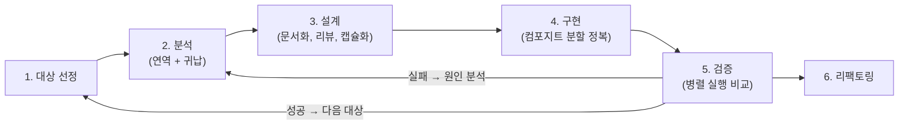
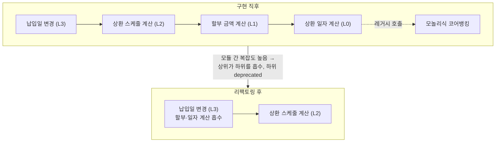
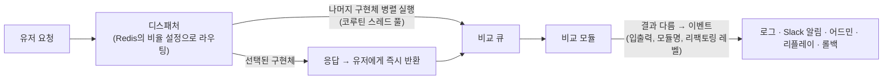

| | |
| --- | --- |
| 발표 | SLASH 24 |
| 연사 | 차영록, 김민혜 (토스뱅크 Server Developer) |
| 자료 | [발표 영상](https://www.youtube.com/watch?v=LwH9h8dG3PQ) · [SLASH 24](https://toss.im/slash-24) |

금융권이 기술 부채를 해결하는 방법은 "차세대 프로젝트"였다. 토스뱅크는 그것을 하지 않는다. 대신 스트랭글러 피그 패턴으로 모놀리식 코어뱅킹의 기능을 하나씩 마이크로서비스로 옮기는 6단계 마이그레이션 사이클(대상 선정 → 분석 → 설계 → 구현 → 검증 → 리팩토링)을 대출 상환 도메인 사례로 설명한다. 구현 파트의 컴포지트 패턴 분할 정복과, 요청을 한 구현체로 보내고 나머지를 병렬 실행해 결과를 비교하는 검증 시스템(디스패치·비교·알림·리플레이·자동 롤백)이 핵심이다. 결과는 42배 성능 개선이고, 마무리는 콘웨이 법칙이다. 내용은 발표 영상과 자동 생성 자막을 근거로 했고, 표현은 내 말로 바꿨다.

## 차세대 프로젝트의 문제

차세대 프로젝트는 대규모 시스템을 개편하는 큰 프로젝트다. 금융 환경과 기술은 빠르게 변하지만 복잡한 도메인과 부족한 기존 시스템은 따라가기 어려워 많은 금융회사가 차세대로 기술 부채를 해결해 왔다. 대부분 워터폴이다. 단계별로 진행해 유연성이 부족하고, 변경이 생기면 프로젝트 전체에 큰 영향을 주며, 모든 기능을 한꺼번에 배포해 큰 리스크를 진다. 진행 중 추가 요구사항이 생기면 기존 개발·테스트가 무의미해지고, 더 큰 문제는 추가 개발분이 시간 제약으로 충분히 테스트되지 못한다는 것이다. 품질과 완성도가 떨어지고 최악의 경우 전환 중 장애로 은행의 신뢰를 크게 떨어뜨린다.

그래서 토스뱅크는 차세대 대신 **스트랭글러 피그 패턴**과 자체 마이그레이션 전략으로 시스템을 안전하게 전환한다. 스트랭글러 피그는 Martin Fowler가 숙주 나무를 서서히 대체하는 무화과 덩굴에 빗대 이름 붙인, 레거시를 한 번에 갈아엎지 않고 조금씩 대체하는 방식이다([Martin Fowler - Strangler Fig](https://martinfowler.com/bliki/StranglerFigApplication.html)). 기존 시스템을 유지하면서 점진적으로 새 시스템으로 옮겨 리스크를 최소화하고 유지보수·확장성을 확보한다. 현재 코어뱅킹은 모놀리식이라 유연성이 부족하고 확장이 매우 어려운데, 기능을 하나씩 마이크로서비스로 전환해 궁극적으로 모두 MSA로 바꾸는 것이 목표다. 기존 시스템을 분석하니 낮은 응집도와 높은 결합도로 유지보수와 확장이 매우 어려웠고, 그래서 구현체를 유즈케이스 단위로 만들어 옮기기로 했다.

## 마이그레이션 사이클

### 1. 대상 선정

어떤 기능을 먼저 옮길지 정한다. 리스크 관리 중심 조직은 사이드 이펙트가 작은 기능부터, 성장 중심 조직은 복잡한 핵심 기능부터 전환해 기술 부채를 우선 해결하고 빠르게 확장 기반을 만든다. 정답은 없다. 토스뱅크의 많은 전환 사례 중 대출 상환 도메인을 예로 든다. 대출을 빌렸을 때 언제 얼마나 갚아야 하는지 계산하는, 은행에서 가장 복잡한 도메인 중 하나이자 대출 비즈니스의 핵심이라 기술 부채를 우선 해결하기로 했다. 핵심 도메인일수록 사이드 이펙트가 클 수 있어 복잡도가 낮은 유즈케이스부터 순차 전환하기로 했고, 시스템 의존성이 가장 낮은 납입일 변경 유즈케이스부터 시작했다.

### 2. 분석: 연역과 귀납

연역적 분석은 일반 원칙에서 구체적 결론을 도출한다. 도메인을 학습하고 자료를 분석해 대전제를 세우고 전체 구조를 이해한다. 귀납적 분석은 구체적 사례·데이터에서 원칙을 도출한다. 연역에서 세운 대전제로 기존 시스템을 분석해 검증하거나 새 전제를 세운다. 귀납은 정적·동적으로 나뉘는데, 정적 분석의 예는 함수 호출 그래프로 호출 관계를 시각화해 전체 구조를 파악하는 것이고, 동적 분석은 Kafka로 메서드별 I/O 데이터를 수집해 메서드의 기능과 유즈케이스별 사용 빈도를 분석하는 것이다. 이 데이터는 설계에 쓰이고, 나중에 검증 단계에서 테스트 데이터셋으로 활용되어 다양한 시나리오를 커버한다.

예를 들어 연역으로 "납입일은 변경 가능하다"를 대전제로 세우고, 귀납으로 소스 코드와 DB를 분석해 변경이 불가능한 케이스를 새로 발견해 추가 전제로 보완하고, 둘을 결합해 결론을 도출한다.

### 3. 설계: 문서가 가이드다

좋은 소프트웨어는 훌륭한 코드보다 철저한 설계에서 시작된다. 설계 문서만으로 시스템의 구조와 동작을 완전히 이해할 수 있어야 하고 그것을 가능하게 하는 것이 문서화다. 분석 결과로 설계 문서를 작성해 마이그레이션의 핵심 가이드로 쓰고, 동료 리뷰로 도메인을 깊이 공유하며 다양한 시각으로 보완한다. 설계 중 기존 시스템의 데이터 타입이 다양하지 않아 향후 문제가 될 부분을 발견했고, 도메인 캡슐화로 가독성을 높이고 데이터를 효율적으로 관리하게 했다. 중요한 도메인은 별도 캡슐화해 로직을 독립적으로 관리한다.

다음은 테스트 케이스 작성이다. 분석에서 도출한 전제로 예상 가능한 모든 케이스와 시나리오를 쓰고 단위 테스트로 구현한다. 대출 상환 도메인의 커버리지는 약 90%다. 발표자는 지속 가능한 마이그레이션의 핵심으로 **도메인 문서**를 꼽았다. 마이그레이션은 일회성이 아니라 지속적으로 관리·유지되어야 하므로 담당자가 바뀌어도 새 사람이 빠르게 파악하고 최적화된 로직을 유지할 수 있어야 한다. 글뿐 아니라 다이어그램 같은 시각적 표현을 많이 쓰면 복잡한 개념을 쉽게 이해하고 소통이 원활해진다. "혼자 가면 빨리 가지만 함께 가면 더 멀리 간다"처럼 팀원들의 노하우와 경험 공유가 중요하다.

### 4. 구현: 버그가 아니라 기능이다

"버그가 아니라 기능입니다"는 개발자의 밈이지만 더 이상 농담이 아니다. 기존 코드가 복잡한 만큼 버그가 산재하고, 한 모듈에 버그가 있으면 그것을 쓰는 다른 모듈이 버그를 고려한 형태로 작성되어 있다. 한 모듈의 버그를 고치면 다른 모듈에서 버그가 나는 부수 효과가 생긴다. 그래서 기존 로직과 **100% 동일한 출력**을 반환해야 부수 효과를 막을 수 있고, 버그를 고치려면 연관 모듈을 모두 분할 정복해야 한다.

분할 정복을 가능하게 하는 구조의 핵심은 컴포지트 패턴이다. 리프와 컴포지트가 같은 인터페이스를 구현해 같은 객체로 취급된다. 납입일 변경 유즈케이스로 보면, 깊이가 가장 낮은 상환 일자 계산 모듈부터 구현한다(여기서 레거시는 기존 모놀리식 코어뱅킹을 호출한다). 다음 할부 금액 계산 모듈, 같은 깊이의 상환 스케줄 계산 모듈(내부적으로 기능 단위 두 유즈케이스로 분리), 마지막으로 최상위 납입일 변경 유즈케이스를 구현해 전체 기능을 옮긴다. 같은 인터페이스의 여러 구현체를 리팩토링 레벨로 구분해 부른다. 아래 그림은 발표에서 설명한 흡수 과정을 정리한 것이다.

유즈케이스를 분리하고 코드를 다시 보니 하위 모듈이 상위 모듈의 비즈니스를 분기로 처리하고 있거나 하위 모듈에 버그가 있었다. 이렇게 모듈 간 복잡도가 높으면 상위 모듈을 리팩토링해 하위 모듈을 흡수한다. 상환 일자 계산 모듈을 의존하던 모듈들이 그것을 흡수해 상환 일자 계산은 청산되고 기존에 그것을 쓰던 상위 모듈(레벨 1)은 deprecated된다. 할부 금액 계산도 마찬가지로 레벨 3가 흡수하고 레벨 2가 deprecated된다. 리프부터 루트까지 모든 모듈을 구현한 뒤 큰 단위로 리팩토링해 불필요한 로직을 제거하고 필요한 기능만 최소화한다.

### 5. 검증: 디스패치, 병렬 실행, 비교

분할 정복 과정에서 같은 인터페이스의 구현체가 여럿이므로 유저의 요청을 어느 구현체로 보낼지 선택하고 검증해야 한다.

디스패처는 Redis에서 조회한 비율대로 구현체에 트래픽을 라우팅하고, 이후 비교와 격리하기 위해 선택된 구현체의 응답은 유저에게 바로 반환한다. 나머지 구현체는 코루틴 스레드 풀에서 병렬 실행되어 결과를 비교 큐에 적재한다. 비교 모듈이 결과가 다르면 입출력 데이터, 모듈 이름, 리팩토링 레벨 등 메타데이터를 이벤트로 발행하고, 이벤트는 로그·Slack 알림·어드민·리플레이·롤백 형태로 적재된다. 개발자는 알림으로 인지하고 어드민에서 자세한 정보를 확인해 잘못된 로직을 수정하며, 리플레이로 이벤트에 적재된 메타데이터를 HTTP 요청으로 다시 재현해 정상 동작을 확인한다.

잘못된 로직의 구현체로 라우팅되고 있다면 개발자가 안전한 버전으로 직접 돌릴 수 있지만, 인지하지 못했거나 자고 있는 시간에는 빠른 대응이 어렵다. 그래서 롤백 기능을 만들었다. 비교 실패 횟수가 설정한 역치보다 높아지면 미리 설정한 안전한 버전(레거시)으로 라우팅이 모두 바뀐다.

검증에 성공하면 대상 선정으로 돌아가 사이클을 반복하고, 실패하면 분석으로 돌아가 원인을 찾아 다시 설계·구현한다. 하나의 도메인을 완전히 옮길 때까지 반복한다.

## 아키텍처의 변화와 성과

작업 전은 일반적인 은행 아키텍처다. 하나의 유즈케이스를 마이크로서비스로 전환한 구조 → 한 도메인의 모든 유즈케이스를 전환한 구조(나머지 도메인은 여전히 코어뱅킹) → 스트랭글러 피그의 최종 모습으로 모놀리식 코어뱅킹의 대출 상환 도메인을 완전히 마이크로서비스로 대체. 성능 비교 테스트에서 기존 대비 약 42배 개선됐다. 발표자는 이 결과를 단순히 로직을 옮긴 것이 아니라 그 과정에서 도메인 로직을 최소화했다는 뜻으로 해석했다. 이 전략으로 모놀리식 코어뱅킹을 전부 마이크로서비스로 전환할 수 있겠다는 확신을 얻었다.

마지막은 콘웨이 법칙이다. 발표자는 무엇보다 중요한 것이 조직 구조와 팀워크라고 했다. Melvin Conway의 원래 문장은 "Any organization that designs a system (defined broadly) will produce a design whose structure is a copy of the organization's communication structure."(시스템을 설계하는 조직은 자기 커뮤니케이션 구조를 복제한 설계를 만든다)이다([Mel Conway - Conway's Law](https://www.melconway.com/Home/Conways_Law.html)). 일반 은행은 코어뱅킹 개발자와 채널 개발자가 명확히 구분되고 시스템도 코어뱅킹·채널로 나뉜다. 토스뱅크는 코어뱅킹과 채널을 하나의 직무로 통합했고, 직군의 경계가 사라지면서 거대한 모놀리식 코어뱅킹을 하나씩 분할 정복하고 있다.

## 리뷰

나는 "버그가 아니라 기능이다"를 진지하게 받아들인 것이 구현·검증 설계 전체를 결정했다고 읽는다. 레거시의 버그를 다른 모듈이 보정하고 있으므로, 옮길 때는 버그까지 100% 재현해야 하고, 버그 수정은 연관 모듈을 전부 흡수한 뒤에야 가능하다. 그래서 컴포지트로 리프부터 옮기고, 리팩토링 레벨을 여러 개 동시에 살려두며, 병렬 실행으로 레거시와 결과를 비교한다. 레거시 마이그레이션에서 "동작 동일성"과 "개선"을 어떻게 분리해 순서대로 하는지에 대해, 내가 본 발표 중 구체적인 편에 속하는 답이다.

검증 시스템은 같은 SLASH 24의 신용 모형·전략 시스템 발표에서 나온 섀도우 배포, SLASH 23 [지금 이자 받기](/posts/slash23-core-banking-msa/)의 이중 호출 비교와 같은 계보로 보이고, 더 일반화되어 있다. 구현체가 둘이 아니라 N개이고, 비율 라우팅·비교·리플레이·역치 기반 자동 롤백이 하나의 프레임워크다. 토스뱅크가 두 해의 SLASH에 걸쳐 같은 아이디어를 도구로 굳혀온 과정으로 읽힌다. 동적 분석에서 Kafka로 모은 메서드 I/O가 테스트 데이터셋이 된다는 점도 같은 발상이다. 운영 트래픽이 곧 검증 데이터다.

발표자는 콘웨이 법칙으로 발표를 끝내며 조직 구조가 무엇보다 중요하다고 했다. 나는 이것을 이 발표의 진짜 주장으로 읽는다. 차세대를 하지 않을 수 있는 조건이 패턴이나 도구보다 코어뱅킹과 채널을 한 직무로 합친 데 있다는 뜻이다. 코어뱅킹 개발자와 채널 개발자가 명확히 나뉜 구조라면, 기능을 하나씩 옮기는 스트랭글러 피그가 매번 두 조직의 경계를 넘어야 했을 것이다. [모던 FEP](/posts/slash23-bank-external-linkage/) 발표가 "여신 스쿼드 개발자가 전사 시스템을 만들 수 있었다"고 한 것과 같은 조직 이야기다.

## 남는 질문

- 병렬 실행 비교는 읽기 유즈케이스에서는 안전하지만 쓰기(납입일 변경은 상태를 바꾼다)에서는 N개 구현체가 모두 DB를 바꿀 수 없다. 쓰기 유즈케이스의 비교는 어떻게 격리하는지(드라이런인지, 출력만 비교하고 커밋은 선택된 것만 하는지).
- 리팩토링 레벨을 여러 개 동시에 유지하면 코드베이스가 일시적으로 커진다. deprecated 구현체를 언제 삭제하는지의 기준.
- 42배는 어느 유즈케이스 기준인지. 레거시가 MCI를 거치는 오버헤드가 포함된 수치인지.
- 6단계 사이클 한 바퀴에 평균 얼마나 걸리는지. 대출 상환 도메인 전체를 옮기는 데 든 기간.

## 참고

- [발표 영상](https://www.youtube.com/watch?v=LwH9h8dG3PQ)
- [SLASH 24](https://toss.im/slash-24)
- [Martin Fowler - Strangler Fig Application](https://martinfowler.com/bliki/StranglerFigApplication.html)
- [Mel Conway - Conway's Law](https://www.melconway.com/Home/Conways_Law.html)
- 같은 계보의 검증: [SLASH 23 은행 최초 코어뱅킹 MSA 전환기 리뷰](/posts/slash23-core-banking-msa/)
