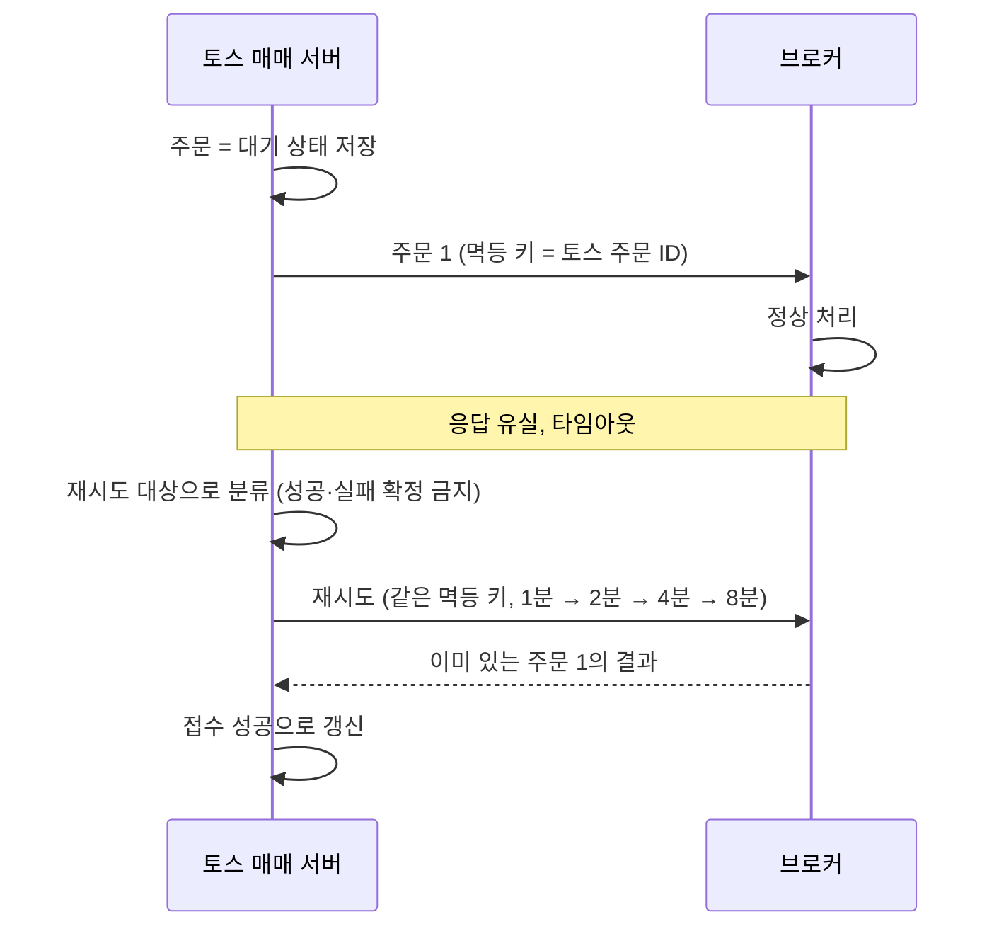

| | |
| --- | --- |
| 발표 | SLASH 22, Server 트랙 |
| 연사 | 이승천 (토스증권 Server Developer) |
| 자료 | [세션 페이지](https://toss.im/slash-22/sessions/2-7) · [발표 영상](https://www.youtube.com/watch?v=UOWy6zdsD-c) · [발표 자료](https://static.toss.im/assets/homepage/slash22/pt-session/SLASH22_%EC%9D%B4%EC%8A%B9%EC%B2%9C%EB%8B%98.pdf) |

MSA로 만든 해외주식 원장에서 주문 하나가 브로커를 거쳐 거래소에 닿고 체결이 돌아오기까지, 세 지점에서 정합성을 어떻게 지켰는지에 대한 발표다. 동시 주문(분산락과 낙관적 락), 해외 구간의 네트워크 지연(비동기, 타임아웃, 멱등 재시도), 브로커 의존성(서버 수준 격리와 체결 수신 서버). [시세·주문 아키텍처 리뷰](/posts/toss-securities-market-data-and-order-architecture/)에서 슬라이드를 근거로 다뤘던 내용을 발표 영상과 자동 생성 자막으로 다시 정리했다. 표현은 내 말로 바꿨다.

## 구조: C 모놀리식이 아닌 MSA 원장

토스증권 시스템은 게이트웨이, 채널계, 해외 원장, 국내 원장으로 나뉜다. 대부분의 증권사 원장이 C 기반 모놀리식인 것과 달리 해외주식 원장은 MSA다. 각 서버는 Spring, Kotlin, JPA 기반이고 필요에 따라 Kafka와 Redis를 쓴다. 도메인별 모듈이 독립적이라 자원 관리가 효율적이고 한 모듈의 장애가 전체로 번지지 않게 설계했다.

주문 흐름은 이렇다. 토스증권은 한국 법인이라 NASDAQ 같은 현지 거래소와 직접 거래할 수 없고 브로커를 통해 제출한다. 고객 주문은 매매 서버 → 매매 요청 서버 → 브로커 → 거래소로 가고, 체결 결과는 주문 요청 트랜잭션과 별개의 트랜잭션으로 발생하며 하나의 주문에 여러 이벤트가 생길 수 있다. 이벤트는 체결 수신 서버 → Kafka → 매매 서버로 처리된다. 매매 요청 서버와 체결 수신 서버가 왜 따로인지는 마지막 주제에서 답한다.

## 동시성: 계좌 락을 MSA에서 어떻게 잡는가

매매 서버는 고객 주문을 브로커에 전달하고 원장에 기록한다. WTS, MTS, 자동매매가 같은 잔고를 동시에 갱신하므로 동시성 제어가 필요하다. 보편적인 방법은 락인데, 매매 요청은 잔고·증거금·주문 등 여러 테이블을 삽입·갱신하므로 테이블마다 락을 잡으면 데드락을 피할 수 없다. 그래서 보통 락용 테이블을 따로 두고, 다른 증권사들은 계좌 테이블에 `SELECT ... FOR UPDATE`로 트랜잭션을 시작한다.

토스증권 해외 원장은 MSA라 도메인 모듈마다 독립 데이터베이스를 쓰고, 서버 하나가 여럿으로 갈라질 수도 있다. DB 락 방식은 서비스 간 높은 결합이나 비효율적 자원 사용으로 이어진다. 그래서 Redis 기반 [분산락](/posts/kleppmann-distributed-locking/)을 쓴다. 모두가 같은 DB를 쓰도록 강제하지 않아 서비스 간 결합이 느슨하고, 메모리 기반이라 DB 락보다 처리량이 높다.

### 분산락 타임아웃이 갱신 유실을 만든다

분산락은 모든 서버가 공유하므로 한 트랜잭션이 락을 무한히 쥐면 다른 서버의 요청이 멈춘다. 적정한 타임아웃이 필요하다. 그런데 타임아웃은 의도대로 동작하지 않을 수 있다. 락은 해제됐는데 트랜잭션이 아직 안 끝난 상태에서 다른 트랜잭션과 경합한다. Martin Kleppmann도 같은 문제를 지적했다. 타임아웃이 있는 락(lease)을 쥔 프로세스가 GC 등으로 멈춘 사이 lease가 만료되면, 그 프로세스는 만료를 모른 채 안전하지 않은 쓰기를 할 수 있다([How to do distributed locking](https://martin.kleppmann.com/2016/02/08/how-to-do-distributed-locking.html)).

| t | T1 | T2 | 잔고 |
| --- | --- | --- | --- |
| 0 | 락 획득 | 락 대기 | 2,000원 |
| 2 | 락 타임아웃(해제) | 락 획득 | |
| 3 | | 500원 출금 | 1,500원 |
| 4 | 지연됐던 처리 완료, 2,000원 출금 | | 0원 |

T1의 갱신이 T2의 갱신을 덮어써 잔고가 0원이 된다. [갱신 유실](/posts/isolation-levels-and-anomalies/)(lost update)이다. 분산락 해제 전에 DB 커밋이 안 끝났거나 락을 먼저 풀고 커밋하는 경우에 생기고, JPA에서는 쓰기 지연 때문에 발생 확률이 비교적 높다.

갱신 유실 방지에는 원자적 연산, 명시적 잠금, 갱신 손실 자동 감지, CAS 연산이 있다. 명시적 잠금은 여러 테이블을 갱신하는 트랜잭션에서 비용이 비싸고, 원자적 연산과 자동 감지는 DBMS 의존적이라 ORM과 궁합이 나쁘다. 그래서 [CAS](/posts/lock-free-and-cas/)(compare-and-set, 읽은 값이 그대로일 때만 쓰기)를 골랐고, JPA 환경에서는 `@OptimisticLocking`으로 간단히 구현된다. 버전으로 막는다. 0초에 잔고 버전 1, 3초에 T2가 갱신하며 버전 2, 4초에 T1이 업데이트를 시도하면 버전이 이미 바뀌어 `UPDATE ... WHERE version = 1`이 0건으로 실패한다.

그렇다면 분산락 없이 낙관적 락만으로 충분하지 않을까. 발표자의 답은 아니다. 분산락이 없으면 동시 트랜잭션은 대기 없이 실패하거나 별도의 재시도 구현이 필요하고, 재시도는 재시도 자체의 실패 케이스까지 고려해야 해서 복잡도가 오른다. 대부분의 상황에서 분산락은 정상 동작하므로, **분산락으로 동시성을 제어하고 만약의 상황에서 낙관적 락으로 정합성을 지킨다.** 주요 테이블은 Hibernate Envers로 변경 이력을 저장해 데이터 흐름을 파악한다.

## 해외 구간: 타임아웃은 실패가 아니다

브로커 통신 구간은 네트워크 지연이 빈번하다. 브로커 요청이 지연되면 매매 서버 스레드까지 블로킹되고, 최악에는 모든 스레드가 걸려 고객 요청을 못 받는다. 고객 요청을 받는 스레드와 브로커에 요청하는 스레드를 분리해 이를 막는다. 그래도 지연이 잦으므로 동기로 처리하면 고객이 응답을 기다리며 다른 서비스를 못 쓴다. 그래서 이 구간을 비동기로 처리해 고객 경험을 올리고 트랜잭션 시간을 줄인다.

브로커 요청은 실패할 수 있으므로 요청 전에 주문을 반드시 대기 상태로 저장한다. 브로커 응답에 따라 접수 성공·실패로 갱신한다. 문제는 TCP 기반이라 타임아웃이 난다는 것이다. 응답을 못 받은 채 타임아웃이 나면 주문 상태를 판단할 수 없고, 브로커 측 식별자도 못 받았으니 브로커에 조회하기도 어렵다. 토스증권은 이런 주문을 **재시도 대상**으로 분류한다.

재시도의 위험은 중복이다. 브로커는 1번 주문을 정상 처리했는데 응답이 유실돼 토스가 재시도하면 브로커에 주문이 둘 생기고 정합성이 어긋난다. 그래서 [멱등 API](/posts/idempotent-api-design/)(같은 요청을 여러 번 보내도 결과가 한 번 보낸 것과 같은 API)로 요청한다. 토스 주문 ID를 멱등 키로 보내고, 하나의 토스 주문 ID에는 하나의 브로커 주문만 생성하도록 브로커와 약속한다.

멱등성을 확보했으니 성공할 때까지 보내면 될까. 타임아웃 특성상 짧은 주기로 재시도하면 지연을 더 악화시켜 타임아웃이 더 잦아지는 악순환이 된다. 그래서 재시도를 일정 횟수로 제한하고 [지수적으로 간격을 벌린다](/posts/timeout-retry-backoff/). 1분에 한 번, 2분, 4분, 8분 식이다. 그래도 정합성이 어긋나면 [대사](/posts/parity-pay-reconciliation/) 배치에서 잡히고 별도로 처리할 장치가 있다. 그리고 토스증권은 모든 데이터 정합성을 체결 내역에서부터 시작하기 때문에 토스증권 내부의 정합성이 틀어지는 일은 절대 없다고 했다.

## 브로커 의존성: 서버 수준에서 격리한다

브로커는 외부 기관이고 비즈니스 결정으로 언제든 바뀌거나 추가된다. 매매 서버가 브로커에 직접 붙어 있으면 새 브로커가 올 때 네트워크 프로토콜부터 인터페이스까지 매매 서버가 맞춰야 하고, 매매 서버의 처리량이 브로커 처리량에 강하게 결합된다.

그래서 토스증권은 브로커 의존성을 **가장 강한 격리 수준인 서버 레벨**에서 격리한다. 브로커가 전문 통신이든 HTTP든 매매 서버는 내부 인터페이스만 맞추면 된다. 타임아웃 주문 처리도 브로커 인터페이스 의존 요소인데, 토스 식별자로 상태를 조회할 수 있는 브로커가 추가되면 전혀 다른 방식의 타임아웃 처리를 도메인 로직과 무관하게 확장할 수 있다. 브로커 처리량에 따라 매매 요청 서버만 스케일아웃하고, 브로커 장애를 토스증권 전체로부터 격리한다.

브로커로 나가는 아웃바운드는 매매 요청 서버가, 브로커에서 오는 인바운드는 체결 수신 서버가 맡는다. 체결 수신 서버는 브로커 이벤트를 받아 DB에 적재하고 Kafka로 발송한다. 여기서 장점이 셋 생긴다.

1. 매매 서버가 아주 바쁜 상황에서도 브로커 이벤트를 수신하지 못하는 일이 없다.
2. Kafka 발송 전에 DB에 적재하므로 Kafka가 다운돼도 폴링 모드로 바꾸는 등 다양한 페일오버 전략을 메시지 유실 없이 고를 수 있다.
3. 중복 이벤트를 브로커 인터페이스와 무관하게 처리한다. 이벤트 발행 시 유니크 ID를 직접 발급하는데, 브로커 파트너가 여럿이면 파트너 간 ID가 충돌할 수 있지만, 이 역할을 체결 수신 서버가 가져가면 여러 브로커에 대해 전역적으로 유일한 ID를 발급할 수 있다.

## 리뷰

내가 보기에 두 겹의 방어는 각자 다른 질문에 답한다. 분산락은 "평소에 경합을 어떻게 줄이는가"에, 낙관적 락은 "락이 무너졌을 때 돈이 틀리지 않는가"에 답한다. 발표자가 "낙관적 락만으로 안 되나"라는 질문을 스스로 던지고 재시도 복잡도로 답한 대목이 이 설계의 핵심 판단이다. 락 없이 낙관적 락만 쓰면 정합성은 지켜지지만 실패가 사용자에게 노출되고, 그것을 숨기려면 재시도 로직이 커진다. [ParityPay 10편](/posts/parity-pay-lock-lease/)에서 같은 시나리오(lease가 트랜잭션보다 먼저 끝남)를 실측한 것과 나란히 읽을 만하다.

"모른다"를 상태로 인정한 것도 발표의 중심이다. 타임아웃 주문을 실패로 확정하지 않고 재시도 대상으로 두고, 멱등 키 없이는 재시도하지 않으며, 재시도 간격을 지수적으로 벌리고, 그래도 안 되면 대사로 넘긴다. 이 네 단계는 [ParityPay 3편](/posts/parity-pay-unknown-state/)의 UNKNOWN 상태 설계와 같은 모양이고, 발표는 그보다 앞선 2022년이다.

발표는 정합성의 기준점을 체결 내역으로 정했다. "토스증권 내부 정합성이 틀어지는 일은 절대 없다"는 강한 문장에 대해 발표가 댄 근거는 모든 데이터 정합성을 체결 내역에서 시작한다는 것뿐이다. 나는 이것을 체결 수신 서버가 브로커 이벤트를 먼저 DB에 적는 구조와 이어서 읽는다. 발표가 둘을 직접 연결하지는 않았다. 그렇게 읽으면 외부(브로커)와의 차이는 대사가 잡고, 내부는 체결 내역을 원본으로 삼는 구조가 된다.

## 남는 질문

- 분산락의 타임아웃 값과 트랜잭션 시간의 관계. 낙관적 락이 뒤를 받치니 타임아웃을 짧게 잡을 수 있는데, 실제로 얼마로 잡았고 타임아웃 뒤 낙관적 락 실패가 하루에 몇 건 나는지.
- 낙관적 락 실패 시 사용자 경험. T1의 출금이 실패하면 고객에게 무엇이 보이고, 재시도는 누가 하는가. 발표는 분산락이 대부분 막아 주니 드물다고 했지만, 드문 경우의 처리가 궁금하다.
- 멱등 API는 브로커가 지원해야 한다. 지원하지 않는 브로커가 추가되면 매매 요청 서버 수준에서 어떻게 대체하는지. 서버 수준 격리가 이 경우를 위한 것이라고 읽히지만 구체적 방법은 없었다.
- 체결 수신 서버가 DB에 먼저 적고 Kafka로 보내는 것은 [outbox 패턴](/posts/parity-pay-outbox/)의 형태다. DB 적재와 Kafka 발송 사이에 죽으면 누가 이어서 발송하는지, 그것이 "폴링 모드"인지.
- 재시도 8분 뒤에도 답이 없는 주문은 장 마감까지 몇 번이나 남는지, 그 주문을 고객에게 어떻게 보여 주는지.

## 참고

- [세션 페이지](https://toss.im/slash-22/sessions/2-7)
- [발표 영상](https://www.youtube.com/watch?v=UOWy6zdsD-c)
- [발표 자료 (PDF)](https://static.toss.im/assets/homepage/slash22/pt-session/SLASH22_%EC%9D%B4%EC%8A%B9%EC%B2%9C%EB%8B%98.pdf)
- [Martin Kleppmann - How to do distributed locking](https://martin.kleppmann.com/2016/02/08/how-to-do-distributed-locking.html)
- 후속: [해외주식 서비스 안정화 사례 (Toss Tech)](https://toss.tech/article/28738), [TMC 25 주식모으기 대용량 트래픽 리뷰](/posts/tmc25-stock-collecting-traffic/)
- 다른 자료와 함께 읽기: [토스증권 시세·주문 아키텍처 리뷰](/posts/toss-securities-market-data-and-order-architecture/)
