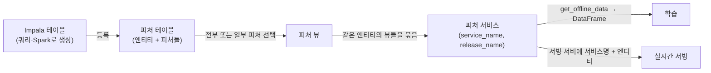
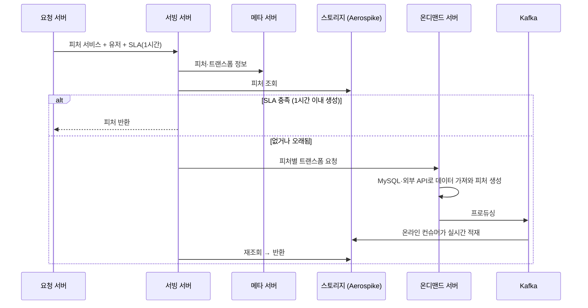

| | |
| --- | --- |
| 발표 | SLASH 24 |
| 연사 | 이현준 (토스 ML Platform Team, Machine Learning Engineer) |
| 자료 | [발표 영상](https://www.youtube.com/watch?v=-u3rhd7k2JQ) · [SLASH 24](https://toss.im/slash-24) |

같은 날 [ML 플랫폼 발표](/posts/slash24-ml-platform/)가 "자세한 건 피처 스토어 세션에서"라고 넘긴 그 세션이다. 피처가 무엇인지부터 시작해 왜 피처 스토어가 필요했는지(재사용, 실시간 서빙, 모니터링, 접근 제어), 왜 자체 개발했는지, 피처 테이블 → 피처 뷰 → 피처 서비스라는 추상화와 SDK, 온라인 피처 서빙의 SLA와 트랜스폼 구조, 드리프트 시 적재를 막아 잘못된 모델이 만들어질 수 없게 한 설계, 그리고 도입 후 어려웠던 점까지 다룬다. 내용은 발표 영상과 자동 생성 자막을 근거로 했고, 표현은 내 말로 바꿨다.

## 피처, 타겟, 피처 스토어

테이블의 컬럼에 `app_use_daily`, `app_use_monthly`, `os`, `age` 같은 정보가 있다면 하루 앱 사용 수, 30일 앱 사용 수, 핸드폰 OS, 나이로 해석되는 이런 요소가 **피처**다. 유저를 표현하는 특성이다. **타겟**은 피처로 모델이 맞추고 싶은 정답이다. 상품 구매 확률, 서비스 클릭 확률 같은 것. 모델은 피처와 타겟으로 학습하고, 학습된 모델에 타겟이 비어 있는 피처를 넣으면 타겟이 0인지 1인지 결과를 얻는다. 피처 스토어는 **모델 학습과 추론을 위한 피처를 관리하는 저장소**다.

## 왜 필요했나

1. **재사용성.** 많은 데이터 사이언티스트가 모델 개발을 위해 피처를 만들고 학습·추론·테스트를 거치는데, 공유가 빈번하지 않아 중복 피처가 많아진다. 누군가 만든 피처의 존재를 몰라 다시 만들거나, 예전에 내가 만든 것이 있어도 새로 만드는 게 빠르고 편한 경우가 있다.
2. **실시간 모델 서빙.** 배치 서빙은 학습된 모델로 모든 유저의 추론 결과를 만들어 DB에 저장하고 서버가 읽는다. 가장 안정적이고 간단하지만 한계가 있다. 추론 결과가 너무 많으면 더 큰 DB와 긴 적재 시간이 필요하고, 방금 클릭한 아이템이나 구매 정보처럼 **최신성**이 필요한 피처는 배치로 해결하기 어렵다. 실시간 추론은 피처를 DB에 저장하고 모델을 모델 서버에 올려 요청이 올 때 피처를 꺼내 추론한다. 이를 위해 피처 스토어가 필요했다. 또 어떤 모델에 어떤 피처를 어떤 순서로 쓸지 데이터 사이언티스트와 서버 개발자의 **커뮤니케이션 비용**이 크고, 실험하며 모델이 바뀌면 피처도 자주 바뀌므로 그 비용을 줄이고 싶었다.
3. **데이터 모니터링.** 실수로 작성된 코드나 원본 데이터 이슈로 잘못된 피처가 생길 수 있다. Garbage in, garbage out. 잘못된 피처로 학습된 모델은 잘못된 결과를 만들고 ML 서비스의 신뢰를 떨어뜨린다.
4. **접근 제어.** 피처 스토어 사용자에 대해 역할별 접근 제어가 필요했다.

오픈소스(Feast 등)와 비교했는데 당시 토스 환경에 적합한 것이 없었다. 개발 공수를 적게 들이고 싶어 기존 시스템을 최대한 활용해 필요한 기능만 만들고, 추가 기능도 빠르게 개발하고 싶은 니즈까지 종합해 **자체 개발**로 결정했다.

## 아키텍처와 추상화

Impala와 Airflow로 스케줄링하고, 메타데이터 서버와 서빙 서버가 나뉘어 있으며, 스트리밍과 온라인 피처를 위한 서버도 별개다. 스토리지는 Aerospike와 Phoenix다.

**피처 테이블**은 Impala 테이블을 피처 스토어에서 쓰기 위해 추상화한 것으로, 엔티티(유저 번호, 상품 ID 같은 PK)와 피처로 구성된다. **피처 뷰**는 피처 테이블을 논리적 기능으로 정의한 것으로, 테이블의 피처를 전부 쓸지 특정 피처만 쓸지 정한다. **피처 서비스**는 여러 피처 뷰의 집합이고, 같은 엔티티를 가져야 하나로 묶인다. SDK로 보면 URI, 워크스페이스, 토큰으로 인스턴스를 만들고, `create_feature_view`에 테이블 이름(과 선택적으로 피처 이름 리스트)을 넣어 뷰를 만들고, 뷰들과 엔티티로 서비스를 만들어 `register_feature_service`에 서비스명과 릴리즈명으로 등록한다. 등록된 서비스는 `get_feature_service(service_name, release_name)`로 가져와 `get_offline_data`에 타겟 데이터와 파티션 정보를 넣고 `to_dataframe`하면 피처들이 엔티티로 구성된 DataFrame이 나와 학습에 쓴다.

피처 서비스 단위로 관리하니 모델 실험에서 다양한 피처 서비스를 빠르게 바꿔가며 실험할 수 있었고, 어떤 피처를 썼는지 **자연스럽게 기록되고 버전 관리**됐다. 새 모델에 기존 등록된 서비스를 쉽게 써서 재사용이 늘었고, 쿼리 대신 코드로 관리해 복잡도가 줄고 가독성이 올랐다. 서비스·뷰·테이블을 관리하는 웹 서비스도 운영한다.

## 모델 서빙: 학습과 서빙이 같은 피처 서비스

학습 단계와 실시간 서빙 단계 모두 피처 스토어에서 **같은 피처 서비스 단위**로 피처를 가져온다. 그래서 데이터 사이언티스트와 서버 개발자는 모델마다 피처 목록을 논의·관리하는 대신 **사용할 피처 서비스만 정하면** 되어 커뮤니케이션 비용이 크게 줄었다.

오프라인 서빙은 요청 서버가 피처 서비스와 엔티티(유저 번호 100)를 요청하면 서빙 서버가 메타 서버에서 메타를 받아 배치로 이미 적재된 스토리지에서 피처를 가져와 돌려준다.

**온라인 피처 서빙.** 최근 한 시간 앱 사용 횟수 같은 피처는 배치보다 실시간으로 가져오는 것이 최신성이 있다. 오프라인과 다른 점은 **SLA**를 추가한 것과 피처마다 어떤 **트랜스폼**을 할지 정해둔 것이다. 트랜스폼의 예는 모델에 숫자만 들어가므로 OS를 iOS 0, Android 1로 변환하는 것이다. SLA는 "한 시간 이내에 생성된 데이터만 사용" 같은 조건으로 피처 생성 시간을 보장한다.

서버가 피처 서비스, 유저, SLA를 요청하면 메타 서버에서 피처와 트랜스폼 정보를 받고 스토리지를 확인한다. 데이터가 있으면 SLA를 확인해 충족하면 그대로 제공하고, 아니면 새로 생성한다. 서빙 서버가 **온디맨드 서버**에 각 피처에 매핑된 트랜스폼을 요청하면 온디맨드 서버에는 트랜스폼마다 피처를 만드는 코드가 있어 MySQL이나 외부 API로 데이터를 가져와 피처를 만들고 Kafka에 프로듀싱하며, 온라인 컨슈머가 읽어 스토리지에 실시간 적재하고 서빙 서버가 쓴다. 요청마다 만드는 것 외에 유저 액션마다 생기는 로그를 실시간 피처로 쓰고 싶은 경우에는 **스트리밍 서버**가 로그를 변환해 피처를 만들어 적재하는 예시도 있다.

## 모니터링과 접근 제어

원본 데이터에서 피처 생성 시 미리 설정한 조건으로 **데이터 드리프트**를 체크하고, 드리프트가 발생하면 알림을 주고 **피처를 적재하지 않는다.** 매일 학습되는 모델이라면 오늘자 피처가 적재되지 않았으므로 자연스럽게 학습도 되지 않아, 결국 잘못된 피처로 학습된 모델이 만들어질 수 없다.

접근 제어는 **워크스페이스와 토큰**으로 해결했다. 워크스페이스는 피처 서비스·테이블·뷰를 관리하는 큰 단위이고, 특정 워크스페이스의 피처 서비스를 쓰려면 권한 추가를 요청해 관리자가 수락해야 한다. 사용자마다 토큰을 발급해 SDK와 서빙에서 토큰을 함께 써야 권한 있는 피처를 정상적으로 받는다.

## 어려웠던 점

- 새 개념의 러닝 커브로 기존 팀원이 적응하는 데 시간이 걸렸고, 불편한 점과 추가 기능 니즈로 SDK·서버 작업이 많이 생겼다.
- 설계 때는 필요할 것 같았던 기능이 실제로는 쓰이지 않아 레거시 제거 작업으로 없앨 예정이다.
- 여러 서버가 생기고 Aerospike라는 스토리지가 추가되면서 이중화와 배포 간소화 작업, 스토리지 운영 업무가 추가로 생겼다.
- 실시간 피처 적재는 최초 설계(파이썬 서버가 직접 적재)로는 기대한 성능이 나오지 않아, 마지막에는 Kafka 컨슈머를 통해 적재하도록 바꾸는 등 적합한 방법을 찾는 데 시간이 꽤 들었다.

현재 이 피처 스토어는 커머스, 광고, 세그먼트 등 여러 프로젝트에 쓰이고 개선이 꾸준히 이루어지고 있다.

## 리뷰

**피처 테이블 → 뷰 → 서비스라는 3단 추상화가 커뮤니케이션 비용을 "피처 서비스 이름 하나"로 압축한다.** 서버 개발자가 알아야 할 것이 수십 개 컬럼과 순서에서 문자열 하나로 줄고, 릴리즈명이 버전이 된다. [ML 플랫폼 발표](/posts/slash24-ml-platform/)에서 "모델 아티팩트에 피처 서비스명을 넣으면 서버 코드 변경 없이 새 모델이 배포된다"고 한 것이 이 추상화 위에서 가능하다. 두 발표를 합쳐야 완전한 그림이 된다.

**"드리프트면 적재하지 않는다"가 이 발표에서 가장 강한 안전장치다.** 알림만 보내면 사람이 놓칠 수 있지만, 적재를 막으면 하류의 학습 파이프라인이 자동으로 멈춘다. 잘못된 피처가 존재할 수 없게 하는 방식이고, 토스뱅크의 [신용 모형 시스템](/posts/slash24-credit-model-strategy-system/)이 "장애는 괜찮지만 값이 틀리는 것이 최악"이라고 한 것과 같은 우선순위다.

**온라인 피처의 SLA + 온디맨드 생성 구조는 캐시 패턴을 피처에 적용한 것이다.** 스토리지에 있고 신선하면 반환, 아니면 만들어서 Kafka로 적재 후 반환. 요청 경로에서 외부 API까지 호출할 수 있다는 점이 일반 캐시와 다르고, 그래서 지연이 튈 수 있다. 어려웠던 점에서 "파이썬 직접 적재로는 성능이 안 나왔다"고 한 것은 이 경로의 병목이 어디였는지 짐작하게 한다.

## 남는 질문

- SLA 미충족 시 온디맨드 생성이 요청 경로 안에 있으면 응답 시간이 외부 API에 좌우된다. 타임아웃 시 오래된 피처를 쓰는지(stale-while-revalidate), 에러를 내는지.
- Aerospike와 Phoenix의 역할 분담. 온라인 서빙은 Aerospike, 오프라인은 Phoenix인지.
- 피처 서비스의 릴리즈명이 바뀌면 그것을 쓰던 모델은 어떻게 되는지. 모델이 특정 릴리즈에 고정되는지, 최신을 따라가는지.
- 드리프트 조건은 누가 정하는지. 피처 생성자가 SDK에서 선언하는지, 플랫폼이 통계적으로 자동 감지하는지.

## 참고

- [발표 영상](https://www.youtube.com/watch?v=-u3rhd7k2JQ)
- [SLASH 24](https://toss.im/slash-24)
- [Feast](https://feast.dev/) (비교 대상으로 언급된 오픈소스)
- 짝이 되는 발표: [SLASH 24 ML 플랫폼으로 개발 속도와 안정성 높이기 리뷰](/posts/slash24-ml-platform/)
