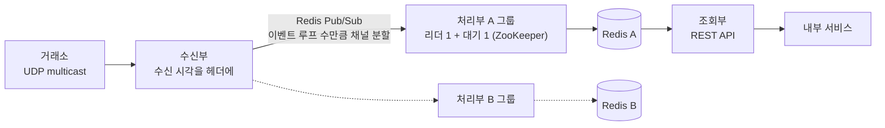

| | |
| --- | --- |
| 발표 | SLASH 23, Server 트랙 |
| 연사 | 정도원 (토스증권 마켓 플랫폼팀 Server Developer) |
| 자료 | [세션 페이지](https://toss.im/slash-23/session-detail/B1-7) · [발표 영상](https://www.youtube.com/watch?v=SF7eqlL0mjw) |

거래소 시세를 가장 먼저 받아 가공해 내부 서비스에 주는 시세 플랫폼의 내부 설계다. 목표는 낮은 지연과 빠른 장애 복구 두 가지이고, 발표는 그 목표를 위해 무엇을 포기했는지를 숫자와 함께 보여 준다. Kafka 대신 Redis Pub/Sub(15ms 대 3ms), 멀티스레딩 대신 종목별 단일 스레드 이벤트 루프, 큐가 차면 오래된 틱을 버리기. 마지막에 22,000 TPS에서 1ms 이하라는 결과가 나온다. [시세·주문 아키텍처 리뷰](/posts/toss-securities-market-data-and-order-architecture/)에서 참석 후기를 근거로 요약했던 내용을 발표 영상과 자동 생성 자막으로 다시 정리했다. 표현은 내 말로 바꿨다.

## 시세 플랫폼이 하는 일과 목표

국내 시세는 한국거래소가 실시간으로 전문 형식의 데이터로 준다. 체결가와 호가만이 아니라 거래정지, 공매도, 외국인 투자 현황 등이 들어 있다. 토스증권은 이 데이터를 새벽부터 저녁까지 끊임없이 처리하고, 특히 9시에는 거래량이 늘어 처리량도 늘어난다. 이 피크에도 밀리거나 누락되지 않게 만드는 것이 시세 플랫폼의 일이다. 거래소 데이터를 제일 먼저 소비해 가공하고, 내부 서비스들은 필요한 정보를 실시간 또는 API로 받아 토스 앱에 보여 준다. 단순 디코딩과 전달만이 아니라 차트처럼 과거 데이터를 누적하거나 여러 정보를 합성하기도 한다.

최우선 목표는 **낮은 지연과 빠른 장애 복구**다. 시세가 지연되거나 틀리면 투자자에게 큰 혼란을 주기 때문이다.

## 세 파트와 장애 대비

- **수신부**는 거래소의 UDP multicast 그룹에 접속해 읽는다. 처리부로 보낼 때 수신 시각을 헤더에 넣어 총 처리 시간을 측정한다.
- **처리부**는 비즈니스 로직이 모인 곳으로 결과를 Redis에 저장하거나 서비스에 바로 전달한다. 블로킹 I/O가 있어 처리 시간에 가장 큰 영향을 준다. 코드 변경이 가장 잦아 장애 확률도 가장 높다.
- **조회부**는 REST API를 제공한다.

장중에 처리부가 죽으면 시세를 쓰는 모든 서비스가 영향을 받고 사용자에게 잘못된 정보가 간다. 그런데 처리부를 복구해도 서비스는 여전히 장애 상태다. 장애 시간 동안 데이터가 유실되거나 오염됐기 때문이다. 한두 건은 손으로 보정할 수 있지만 초당 수천 건이라 찰나의 장애에도 셀 수 없이 많은 오류가 생긴다.

그래서 택한 해법은 처리부와 Redis를 두 그룹으로 두는 것이다. 평소 A 그룹만 서비스에 할당하다 장애가 나면 B 그룹으로 전환한다. 오염된 데이터를 장중에 복구하는 대신 문제없는 데이터베이스를 빨리 쓰는 것이다. 배포에도 좋다. A와 B를 번갈아 배포하며 차이를 비교하고, 문제가 있으면 트래픽 전환만으로 롤백한다. 갑작스러운 장애에 대비해 그룹마다 처리부를 2개로 늘리고 [ZooKeeper](/posts/zookeeper/)로 리더를 선출해 리더만 데이터를 처리하게 했다. 중복 데이터를 막기 위해서다.

## 브로커 선택: Kafka 15ms, Redis Pub/Sub 3ms

처리부가 늘자 수신부가 처리부 수만큼 반복해서 보내야 해 수신부 성능이 떨어졌다. 처리부가 작은 서비스로 쪼개지면 더 늘어난다. 답은 메시지 브로커다. 수신부와 처리부를 디커플링하고 수신부는 한 번만 보낸다. 그런데 시세 플랫폼에서 가장 중요한 것이 낮은 지연인데 브로커는 지연을 늘린다. 그래서 선택이 중요하다.

Kafka는 처리량과 안정성이 뛰어나고 사내에서 많이 쓰여 개발 초기에 썼다. 그러나 자체 테스트에서 Redis Pub/Sub보다 지연이 길어 쓰지 않기로 했다. 같은 부하에서 수신부부터 처리부까지의 총 지연을 피크 기준으로 재니 **Kafka 15ms, Redis Pub/Sub 3ms**였다.

Redis Pub/Sub은 보통의 브로커가 메시지를 내부 큐에 저장하는 것과 달리 받는 즉시 채널의 구독자에게 보내 버린다. 구독자가 없으면 버린다. 유실 가능성은 있지만 지연에는 유리하다. Redis 문서도 이 성질을 "Redis' Pub/Sub exhibits at-most-once message delivery semantics."(Redis Pub/Sub은 [at-most-once](/posts/kafka-delivery-guarantees/) 전달 의미론을 따른다)라고 적는다([Redis docs - Pub/Sub](https://redis.io/docs/latest/develop/interact/pubsub/)). 내부에는 `pubsub_channels`라는 딕셔너리가 있어 모든 채널과 구독자를 보관하고, 구독하면 그 채널의 연결 리스트에 구독자를 추가하며, 발행하면 딕셔너리에서 채널을 찾아 연결 리스트를 순회하며 순서대로 보낸다.

## 처리부: 읽는 속도가 지연을 정한다

브로커가 아무리 빨라도 처리부가 늦게 처리하면 지연은 다시 는다. 처리부의 일은 둘이다. TCP 소켓에서 데이터를 읽는 것과 비즈니스를 처리하는 것.

**읽는 속도가 지연에 큰 영향을 준다.** TCP 흐름 제어 때문이다. 수신자는 소켓 수신 버퍼를 기준으로 한 번에 받을 수 있는 양(윈도우 크기)을 송신자에게 알리고 송신자는 그만큼만 보낸다([RFC 9293 3.1](https://www.rfc-editor.org/rfc/rfc9293.html#section-3.1)의 Window 필드). 처리부의 수신 버퍼가 차면 Redis는 더 보내지 않고, 지연이 는다. 읽는 스레드가 하는 일이 많으면 읽는 속도가 떨어지므로, 비즈니스 처리는 반드시 별도 스레드에 위임해야 하고 블로킹 I/O가 있다면 더욱 그렇다.

Spring Data Redis의 ReactiveRedisTemplate을 썼는데, 기본 클라이언트 Lettuce는 [Netty](/posts/netty/)를 쓴다. Netty에서는 채널이 소켓을 추상화하고 연결 뒤 [이벤트 루프](/posts/nio-and-event-loop/)에 등록되며, 이벤트 루프가 무한 루프를 돌며 수신 버퍼를 읽는다. NIO 방식의 실행 코드를 보면 버퍼에 데이터가 있는지 확인하고 읽고 변환해 결과를 통보한다. 그러므로 NIO 이벤트 루프가 비즈니스 로직을 처리하지 않는 것이 중요하다.

### 멀티스레딩 대신 이벤트 루프 그룹

비즈니스 로직에 블로킹 I/O가 있으니 성능을 위해 멀티스레딩을 써야 한다. 문제는 순서 역전이다. 삼성전자 체결 전문이 아주 짧은 시간에 여러 개 오는데 처리 순서가 바뀌면 앱에 엉뚱한 가격이 보인다. 그래서 멀티스레딩 대신 **이벤트 루프 그룹**을 썼다. 이벤트 루프는 큐로 순서를 보장하고 스레드 하나만 쓰니 동기화도 필요 없다. Spring의 `ThreadPoolTaskExecutor`를 `corePoolSize = 1, maxPoolSize = 1`로 만들면 된다.

그런데 어느 이벤트 루프에서 처리할지 알려면 종목 코드를 미리 알아야 하고, 그러려면 JSON을 객체로 변환해야 한다. 이 변환이 트래픽이 늘수록 NIO 이벤트 루프의 CPU를 많이 써서 지연의 원인이 됐다. 해법은 Redis Pub/Sub의 채널이다. 수신부가 처리부의 이벤트 루프 수만큼 채널을 나눠 보내고, 처리부는 채널명을 보고 해당 이벤트 루프를 찾는다. 수신부가 보낸 순서가 처리부에서 그대로 유지되고, NIO 이벤트 루프에서 객체 변환을 하지 않아도 되니 성능도 올랐다.

큐가 찼을 때의 처리 방식은 유실 가능성은 있지만 실시간성이 중요한 시세 플랫폼에 가장 적합하다고 판단했다. 자막에는 정책 이름이 없고, [시세·주문 아키텍처 리뷰](/posts/toss-securities-market-data-and-order-architecture/)에서 참석 후기를 근거로 `DiscardOldestPolicy`(가장 오래된 미처리 작업을 버림)라고 정리했다([Javadoc - ThreadPoolExecutor.DiscardOldestPolicy](https://docs.oracle.com/en/java/javase/21/docs/api/java.base/java/util/concurrent/ThreadPoolExecutor.DiscardOldestPolicy.html)). 큐 크기(`queueCapacity`)에는 정답이 없다. 너무 작으면 피크에 유실되고, 너무 크면 오래된 데이터가 쌓여 실시간성이 떨어진다.

### 이벤트 루프 수를 줄이는 세 가지 방법

이벤트 루프 그룹은 `ThreadPoolTaskExecutor` 여러 개를 리스트로 만든 것이고, 리스트 크기가 이벤트 루프 수다. 이 수를 줄이려 했다. 늘수록 [컨텍스트 스위칭](/posts/context-switching-and-cgroup/)이 NIO 이벤트 루프 성능에 악영향을 주기 때문이다. 하지만 무조건 줄이면 이벤트 루프에 작업이 밀려([백프레셔](/posts/reactive-and-backpressure/)) 지연이 훨씬 는다. 성능 테스트에서 목표 트래픽을 걸고 각 이벤트 루프의 대기를 모니터링하며 적정 수를 찾았다. 줄이려면 이벤트 루프가 더 효율적이어야 하고, 세 가지를 적용했다.

1. **Redis 저장을 논블로킹으로.** 이벤트 루프는 한 번에 한 작업을 처리하는데 작업 끝에 Redis 저장이 반복됐다. 저장이 끝나기를 기다릴 필요가 없어서 ReactiveRedisTemplate의 비동기 함수로 바꿔 다음 작업으로 넘어가게 했다.
2. **과거 데이터 조회는 로컬 캐시로.** 비즈니스 로직에 Redis에서 과거 데이터를 조회하는 경우가 많은데, 조회는 비동기로 할 수 없다. 비동기면 순서가 역전된다. 그래서 매번 Redis를 읽는 대신 로컬 캐시를 먼저 읽어 블로킹 I/O 횟수를 상당히 줄였다.
3. **무거운 작업은 별도 이벤트 루프 그룹으로.** 배치나 MySQL 적재 같은 상대적으로 무거운 작업은 기존 이벤트 루프가 아닌 별도 그룹에서 처리해 기존 루프가 블로킹되지 않게 했다.

### 그래도 처리량이 안 오를 때

높은 트래픽에서 처리량이 더 오르지 않으면 `netstat`이나 `ss`로 소켓의 수신·송신 버퍼를 직접 본다. Recv-Q와 Send-Q는 그 소켓이 얼마나 대기 상태로 남아 있는지를 뜻하고, 특히 Recv-Q가 지속적으로 0보다 크면 그 소켓에서 아직 읽히지 않은 데이터가 계속 남아 있다는 뜻이고, 이때 세 가지를 시도한다.

1. NIO 이벤트 루프가 하는 일을 다시 본다. 데이터 변환, 객체 생성, 로깅 같은 사소한 처리도 높은 트래픽에서는 성능 저하의 원인이다. 채널로 디코딩을 분리한 것처럼 작은 부분이라도 다른 스레드에 위임한다.
2. CPU 사용량을 본다. CPU 프로파일링으로 불필요한 스레드를 찾아 제거하거나 줄이면 컨텍스트 스위칭이 준다. 예를 들어 Spring의 기본 Tomcat 스레드 수를 1로 줄일 수 있다.
3. NIO 이벤트 루프를 여러 개 쓴다. ReactiveRedisTemplate을 여러 개 만들면 되고, 병렬로 소켓 버퍼를 읽어 처리 시간을 낮게 유지하면서 처리량을 약 2배 올렸다.

결과는 **22,000 TPS에서 1ms 이하 처리 시간**이다. 22,000 TPS는 개발 당시 목표치이면서 향후 거래소에서 늘어날 전송량을 고려한 수치다.

## 리뷰

나는 이 발표를 지연을 위해 세 번 버린 기록으로 읽는다. Kafka의 재처리 가능성(Redis Pub/Sub은 구독자가 없으면 버린다), 큐 용량 너머의 틱(작은 큐는 피크에 유실된다), 그리고 멀티스레딩의 처리량(순서를 위해 이벤트 루프마다 스레드 하나). 앞의 두 번은 발표자가 직접 "유실 가능성은 있지만"이라는 전제를 달고 실시간성을 택했다. 15ms 대 3ms라는 숫자가 그 선택의 근거이고, [시세·주문 아키텍처 리뷰](/posts/toss-securities-market-data-and-order-architecture/)에서 이 발표를 "두 번째·세 번째 버리기"로 읽은 이유다.

발표는 복구 대신 전환을 골랐다. 내가 보기에 처리부 두 그룹은 단순한 이중화가 아니라 "오염된 데이터를 장중에 고칠 수 없다"는 인정에서 나온 설계다. 발표자 말대로 초당 수천 건이면 손으로 보정할 수 없고, 깨끗한 쪽으로 옮기는 것만 가능하다. 그 구조가 A·B 번갈아 배포와 트래픽 전환만으로 하는 롤백까지 겸한다는 것이 부수 효과다.

발표자는 병목을 소켓 버퍼에서 찾는다. "처리량이 안 오르면 Recv-Q를 보라"는 조언은 애플리케이션 지표(응답 시간, CPU)보다 한 층 아래를 보는 습관이다. 발표도 TCP 흐름 제어를 먼저 설명해 "왜 읽는 스레드가 가벼워야 하는지"를 세우고, 그 다음에 이벤트 루프 설계로 넘어간다. 진단할 때도 같은 순서로 내려가면 된다.

내가 가장 영리하다고 본 지점은 채널로 라우팅을 수신부에 옮긴 것이다. 종목 코드로 이벤트 루프를 고르려면 JSON을 파싱해야 하고 그 파싱이 NIO 루프를 잡아먹는다. 수신부가 채널을 이벤트 루프 수만큼 나눠 보내면 처리부는 채널명만 보면 된다. 라우팅 판단을 병목이 아닌 쪽으로 옮긴 것으로 읽힌다. 수신부가 이 판단을 어떻게 하는지는 발표에 나오지 않는다.

## 남는 질문

- 종목을 채널(이벤트 루프)에 배정하는 규칙. 해시라면 거래량이 몰리는 종목 몇 개가 한 루프에 겹칠 수 있고, 그 루프의 백프레셔가 다른 종목까지 지연시킨다. 배정을 동적으로 바꾸는지.
- `DiscardOldestPolicy`로 버려지는 틱이 체결이라면 차트에 구멍이 난다. 2025년 AWS 사례에서는 호가와 체결을 갈라 체결은 `acks=all`로 보냈는데, 이 시점의 처리부에서도 체결과 호가가 다른 큐였는지.
- A/B 그룹 전환의 기준과 시간. 누가 장애를 판정하고 전환하는지, 전환에 몇 초가 걸리는지, 전환 순간에 B 그룹의 Redis가 최신 상태임을 어떻게 보장하는지(B도 계속 처리하고 있어야 한다).
- Redis Pub/Sub은 Redis 자체가 단일 장애점이다. 수신부와 처리부 사이의 Redis가 죽으면 어떻게 되는지, Redis도 A/B로 나뉘는지.
- 22,000 TPS는 국내 시세 기준으로 보인다. 해외 시세(연합인포맥스)도 같은 처리부를 지나는지, 별도인지.

## 참고

- [세션 페이지](https://toss.im/slash-23/session-detail/B1-7)
- [발표 영상](https://www.youtube.com/watch?v=SF7eqlL0mjw)
- 앞선 발표: [SLASH 22 실시간 시세 적용기 리뷰](/posts/slash22-realtime-quote-websocket/)
- [Redis docs - Pub/Sub](https://redis.io/docs/latest/develop/interact/pubsub/)
- [RFC 9293 - Transmission Control Protocol](https://www.rfc-editor.org/rfc/rfc9293.html)
- [Javadoc - ThreadPoolExecutor.DiscardOldestPolicy](https://docs.oracle.com/en/java/javase/21/docs/api/java.base/java/util/concurrent/ThreadPoolExecutor.DiscardOldestPolicy.html)
- 다른 자료와 함께 읽기: [토스증권 시세·주문 아키텍처 리뷰](/posts/toss-securities-market-data-and-order-architecture/)
