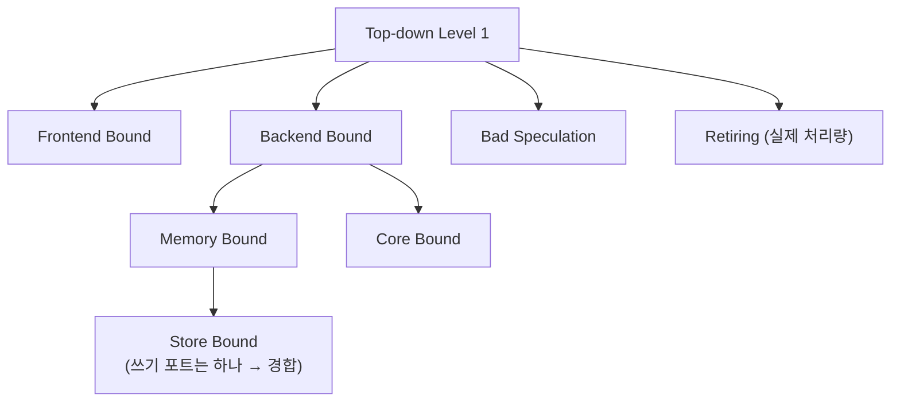

| | |
| --- | --- |
| 발표 | SLASH 24 |
| 연사 | 최준우 (토스 Server Platform Team, Server Developer) |
| 자료 | [발표 영상](https://www.youtube.com/watch?v=8xhVvn7Q8-I) · [SLASH 24](https://toss.im/slash-24) |

"하이퍼스레드 환경에서 CPU 사용률 50% 이상이면 경합으로 성능 이슈가 난다"는 제조사 권고 하나가 내년도 클러스터 증설 예산을 흔들었다. 발표자는 하이퍼스레드가 왜 존재하는지 CPU 마이크로아키텍처(파이프라이닝, 비순차 실행, 슈퍼스칼라, 스톨)부터 설명하고, CPU 사용률로는 오버헤드를 잴 수 없다는 Brendan Gregg의 글을 따라 perf로 인스트럭션 처리량을 재고, Elasticsearch 벤치마크에서 하이퍼스레드가 30% 유리함을 확인한 뒤, 문제를 수치화하기 위해 퍼포먼스 카운터 기반 Top-down 분석과 pmu-tools까지 내려간다. 내용은 발표 영상과 자동 생성 자막을 근거로 했고, 표현은 내 말로 바꿨다.

## 발단

평화로운 어느 날 사내에 글이 올라왔다. "하이퍼스레드 환경에서 애플리케이션 CPU 사용률이 50% 이상일 때 경합으로 성능 이슈가 발생하니 확인해 주세요." 발표자는 "그냥 쓰면 좋은 거 아닌가"라고 넘겼다. 그러다 시스템 엔지니어의 답변이 왔다. 제조사 확인 결과 CPU 사용률이 50%를 넘으면 하이퍼스레드에 적합한 모델이 아니니 **사용을 권고하지 않는다**는 것이다. 이때부터 뭔가 잘못됐다는 생각과 함께 내년도 클러스터 증설 계획이 떠올랐다. 50%에서 성능 이슈가 난다면 증설 규모를 더 크게 잡을 수밖에 없고 예산이 문제가 된다. 예산을 지키려면 하이퍼스레드를 더 잘 알아야 했다.

## 하이퍼스레드는 왜 있나

하나의 물리 코어를 두 개의 논리 코어로 써서 같은 시간에 두 프로세스를 한 코어에서 돌린다. 왜 나누는지 이해하려면 CPU 구조를 알아야 한다. 최근 마이크로아키텍처는 한 사이클에 여러 명령어를 수행한다.

| 기술 | 내용 |
| --- | --- |
| 파이프라이닝 | 명령어가 fetch·decode되는 동안 기다리지 않고 다음 명령어를 fetch. 높은 클럭 수용 |
| 비순차 실행 | 지연이나 분기 예측 실패로 스테이지가 놀 때 명령을 적절히 재배치해 빈 공간을 줄임 |
| 슈퍼스칼라 | 명령어 수준 병렬성. 실행 장치에 동시에 디스패치해 한 사이클에 둘 이상 수행. Intel Alder Lake의 Golden Cove는 디코더 6개로 사이클당 최대 6개 명령 |

그럼에도 여러 이유로 **스톨(버블)**이라 부르는, 스테이지가 노는 구간이 생긴다. CPU는 하나의 프로세스가 꽉 채워 쓰기에는 이미 너무 커진 도로다. 이 빈 스테이지를 줄이려고 나온 것이 하이퍼스레드다. 두 작업을 따로 수행하는 것보다 빈 공간을 쓰면 더 적은 사이클로 둘 다 끝낼 수 있다.

### 단점

코어를 쪼개 쓰니 단점도 있다. 첫째, 하이퍼스레드는 코어의 모든 부분을 파티셔닝하지 않는다. 일부를 제외한 캐시와 레지스터를 대부분 공유하므로 형제 프로세스가 자원을 점유하면 실행이 지연된다. **시끄러운 이웃**이다. 하나뿐인 화장실에서 이웃이 나오지 않으면 기다릴 수밖에 없다. 그래서 ML 플랫폼처럼 CPU 바운드 작업에서는 비활성화를 권고하기도 한다. PyTorch 문서가 하이퍼스레드 비활성화를 권고하며 올린 그림이 있는데, 하이퍼스레드는 파이프라인이 빌 때 이점을 얻지만 CPU 작업은 I/O에 비해 스톨이 적고 지연이 발생할 확률이 높기 때문이다. 둘째, **보안 오버헤드**다. 하이퍼스레드 보안 패치가 처음 적용됐을 때 심각한 성능 이슈로 Linus Torvalds가 보낸 분노의 메일이 있다. 악의적 사용자가 형제 프로세스의 명령을 예측해 악성 코드를 실행하는 것을 막기 위한 오버헤드가 어느 정도 발생한다. 그 외에 동기화가 많거나 병렬성을 개선할 수 없는 애플리케이션 특성에 따라 도움이 안 될 수 있다. 세상 모든 일이 그렇듯 공짜 점심은 없다.

## 무엇을 측정할 것인가

우리 서비스가 하이퍼스레드에 적합한지 알아봐야 했다. 대상은 **Elasticsearch**다. Java·Netty 기반의 Elasticsearch가 적합하다면 토스가 쓰는 서비스 애플리케이션 대부분이 문제없을 거라 생각했다. 무엇을 측정하나. 전 Netflix 엔지니어 Brendan Gregg의 글을 요약하면 **CPU 사용률은 정확한 정보를 주지 못한다.** 하이퍼스레드의 오버헤드를 재야 하는데 스톨은 사용률 측정에서 busy로 나오므로 사용률로는 성능을 잴 수 없다. 그래서 **인스트럭션 처리량**을 기준으로 분석했다. 도구는 리눅스 커널 프로파일링 도구 perf(시스템의 여러 메트릭을 수집해 제공)와 Linux KI다.

시나리오는 둘이다. 서로 다른 노드에서 하이퍼스레드 켜고 끄기, 바이어스 측정을 위해 같은 노드에서 켜고 끄기. 다른 설정은 동일하게 맞췄다.

**다른 노드, CPU 100%.** 초당 인덱싱 속도가 끈 노드 약 6만, 켠 노드 약 8만 7천으로 켠 쪽이 좋았다. Linux KI로 보면 둘 다 idle 없이 꽉 채워 쓴다. perf의 인스트럭션 처리량은 켠 노드가 **30% 정도** 더 많았다. 사이클은 거의 두 배로 나오는데 논리 CPU의 모든 사이클을 포함하기 때문이라 실제 물리 코어 사이클은 이보다 적다. 캐시 미스, 페이지 폴트 등 성능 지표는 다소 떨어졌지만 그럼에도 더 좋은 성능이었다. 논리 사이클은 두 배가 됐지만 인스트럭션 처리량이 두 배가 되지 않는 것도 확인했다.

**같은 노드.** 역시 켜는 것이 좋았지만 차이가 다소 줄었다. 켰을 때 CPU 사용률에 살짝 여유가 있어서다. 반면 같은 작업량에서 끄면 여전히 꽉 채워 쓴다. 인스트럭션 처리량은 이전과 동일하게 30% 정도 더 좋았고, 사이클당 인스트럭션도 비슷한 수준이었다. Java 서버 프레임워크에서 두 시나리오 모두 하이퍼스레드가 좋은 성능을 보였다.

## 문제를 수치화하기: Top-down 분석

그렇다고 마음 놓고 쓸 수 있나. 아니다. 문제가 되는 부분을 알았으니 수치화하고 모니터링할 수 있어야 한다. 문제는 두 프로세스가 같은 작업을 할 때 CPU 자원 경합으로 스톨이 생겨 사이클이 더 많아지는 것이다. 간단한 예로 변수 6개를 100억 번 더하고 빼는 프로그램을 `taskset`으로 코어를 조정해 돌리니 **다른 코어에서 1분, 같은 코어에서 2분**이 걸렸다. 하이퍼스레드가 영향을 주는 것은 확실하다. 그러면 병목을 확인할 지표는 무엇인가.

Brendan Gregg의 블로그에서 **CPU 퍼포먼스 카운터**를 알게 됐다. Intel CPU에서 특정 이벤트가 발생하면 퍼포먼스 카운터 레지스터에 기록하고 OS가 읽어 애플리케이션에 제공한다. perf에 이미 들어 있어 CPU별 메트릭을 읽을 수 있다. 퍼포먼스 카운터로 CPU 프론트엔드부터 백엔드까지 병목을 단계별로 확인하는 것이 **Top-down 분석**이다. CPU는 명령어를 fetch·정렬하는 프론트엔드와 연산·저장을 수행하는 백엔드로 나뉘고, 병목은 "바운드"로 표현되어 CPU 주기 중 어느 부분에 얼마나 오래 머물렀는지 퍼센트로 나온다.

예제로 돌아가면, 프로세스 하나가 한 코어에서 동작할 때 65초 걸렸고 **백엔드 바운드가 전체 주기의 32%**였다. 레벨을 높이면 **Store Bound**에서 병목이 있었다. 백엔드의 포트는 여러 개지만 메모리에 쓰는 포트는 하나라 경합이 생긴 것이다. 두 프로세스를 같은 코어에서 돌리면 백엔드 바운드가 늘 거라 기대했는데 **반대로 줄고 Retiring(인스트럭션 처리량)이 늘었다.** 같은 일에 1분이 더 걸렸는데 바운드가 적어진다? 이유는 사용 중인 CPU인 **Skylake가 코어 단위로 메트릭을 수집**해 스레드 단위 병목이 가려질 수 있기 때문이다. `Bound_Likely` 메트릭이 하이퍼스레드로 인해 백엔드 병목이 가려졌을 확률을 보여주는데 0.98이 나왔다. 확실히 잘못 측정되고 있었다. 여담으로 Skylake 다음 세대인 Ice Lake는 Top-down 메트릭을 스레드별로 가져올 수 있다.

도구를 바꿨다. **pmu-tools**는 perf처럼 퍼포먼스 카운터를 측정하되 Top-down 분석에 초점을 맞춘 옵션을 제공한다. 예제 코드는 코어 하나에서 동작하므로 single-thread 옵션으로 코어 단위 측정을 하니 프로세스 하나일 때 백엔드 바운드 32%(perf와 같음), 둘을 같이 돌리면 **50%**였다. 하이퍼스레드로 백엔드에 과부하가 걸리는 것을 확인했다.

이 내용으로 Elasticsearch를 다시 측정했다. 같은 노드, CPU 100%. 하이퍼스레드를 끄면 백엔드 바운드 **42%**, 켜면 예상대로 **감소**했다. 프로세스가 스톨되는 동안 형제 프로세스가 파이프라인을 쓸 수 있기 때문이다. 백엔드 바운드가 줄고 프론트엔드 바운드가 좀 더 늘었다.

팀은 이를 바탕으로 쿠버네티스 전체 클러스터의 퍼포먼스 카운터를 측정해 CPU 병목을 확인할 계획이다. PCM 데몬을 띄워 Prometheus에 쓰는 PCM exporter와 [eBPF exporter](/posts/slash24-kernel-observability-ebpf/)로 클러스터의 퍼포먼스 카운터를 수집·모니터링하려 준비 중이다.

결론: 네트워크 I/O나 메모리 I/O가 많은 대부분의 MSA 서비스 워크로드에서 하이퍼스레드를 켜면 좋다. 물론 워크로드 특성을 잘 파악하고 써야 한다.

## 리뷰

**"CPU 사용률은 스톨을 busy로 센다"가 발표의 축이다.** 제조사 권고의 "50%"는 사용률 기준인데, 사용률 자체가 하이퍼스레드 오버헤드를 재지 못하는 지표다. 그래서 인스트럭션 처리량으로 갈아탔고, 그것으로도 부족해 어느 스테이지가 병목인지 Top-down으로 내려갔다. 같은 날 [eBPF 발표](/posts/slash24-kernel-observability-ebpf/)가 "CPU 사용률 안에 메모리 stall이 들어 있다"고 한 것과 정확히 같은 출발점이고, 두 발표는 서버 플랫폼 팀이 CPU 사용률이라는 지표를 얼마나 불신하게 됐는지 보여준다.

**Skylake의 코어 단위 카운터 때문에 결과가 뒤집혀 보인 대목이 가장 교육적이다.** 측정 도구가 측정 대상의 특성(하이퍼스레드)에 의해 왜곡되는 것을 `Bound_Likely` 0.98로 잡아내고 pmu-tools로 교차 검증했다. "측정값이 직관과 다르면 측정 방법을 의심하라"는 원칙의 구체적 사례다.

**예산이라는 동기가 정직하다.** 하이퍼스레드를 끄면 증설 규모가 커진다는 현실적 이유가 마이크로아키텍처 공부의 출발점이었고, 결론은 "우리 워크로드에서는 켜도 된다"였다. 학문적 호기심이 아니라 IDC 예산 방어가 CPU 카운터까지 내려가게 만들었다는 점이 토스 플랫폼 팀의 일하는 방식을 보여준다.

## 남는 질문

- Elasticsearch가 "대표 워크로드"라는 가정은 Netty 기반 서비스에는 맞지만 Kafka 컨슈머나 배치처럼 CPU 바운드가 큰 워크로드에는 다를 수 있다. 워크로드 유형별로 하이퍼스레드 정책을 나눌 계획인지.
- 30% 이득은 CPU 100% 상황에서 측정됐다. 평시 30~50% 사용률에서는 이득이 더 작거나 없을 텐데, 제조사가 말한 "50% 이상에서 문제"와 실측이 왜 다른지에 대한 해석.
- 보안 패치(Spectre/MDS 계열) 오버헤드는 이번 측정에 포함됐는지. 커널 버전과 완화 설정에 따라 결과가 달라질 수 있다.
- PCM exporter로 클러스터 전체 퍼포먼스 카운터를 수집하면 카디널리티가 매우 커진다. 어떤 메트릭만 남길지 정했는지.

## 참고

- [발표 영상](https://www.youtube.com/watch?v=8xhVvn7Q8-I)
- [SLASH 24](https://toss.im/slash-24)
- [Brendan Gregg - CPU Utilization is Wrong](https://www.brendangregg.com/blog/2017-05-09/cpu-utilization-is-wrong.html)
- [pmu-tools (toplev)](https://github.com/andikleen/pmu-tools)
