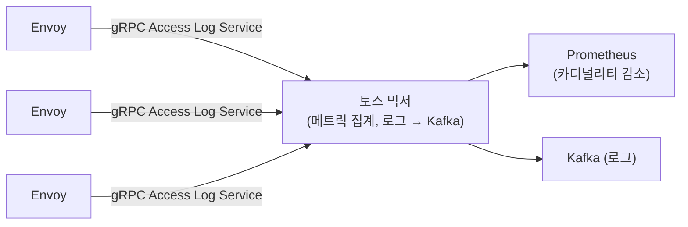

| | |
| --- | --- |
| 발표 | SLASH 24 |
| 연사 | 김동석 (토스뱅크 DevOps Team Leader), 이재성 (토스 DevOps Team Leader) |
| 자료 | [발표 영상](https://www.youtube.com/watch?v=WdikCm_CYms) · [SLASH 24](https://toss.im/slash-24) |

2023년 비용 절감의 해에 토스뱅크와 토스 DevOps가 쿠버네티스 CPU를 어떻게 줄였는지 두 파트로 나눠 발표한다. 토스뱅크 파트는 IDC 환경의 원칙이다. CFS 쿼타 때문에 사용량이 리미트보다 낮아도 생기는 스로틀링, 대고객 서비스는 리미트 없이 리퀘스트를 평시 최대의 2배로, 오토스케일링 대신 프로젝션과 알림, `max_over_time`을 중첩해 7일 최댓값을 싸게 구하는 PromQL. 토스 파트는 클라우드 라이트사이징(노드 스펙업으로 데몬셋 비율 축소, 40% 절감), Istio Mixer를 대체한 토스 믹서(Istio 3/4, Prometheus 1/4 절감), Prometheus 카디널리티·업그레이드, 토폴로지 분산으로 노드 간 사용률 괴리를 40%p → 20%p로. 내용은 발표 영상과 자동 생성 자막을 근거로 했고, 표현은 내 말로 바꿨다.

## 자원 최적화의 전제와 순서

쿠버네티스에서 CPU **리퀘스트**는 컨테이너가 최소한 이만큼은 쓸 수 있다는 보장이고(여유가 있으면 더 쓸 수 있다), **리미트**는 최대 허용량이라 넘으려 하면 **스로틀링**(CPU를 할당받지 못해 기다리는 현상)이 난다. 자원 최적화의 전제 조건은 **서비스 안정성**이다. 안정성을 유지하면서 줄여야 의미가 있다. 순서는 (1) 자원 할당량 최소화(IDC면 할당량에 맞춰 서버를 준비하고 클라우드면 할당량에 요금이 청구되며, 보통 여유를 둬서 할당량이 사용량보다 크므로 줄일 여지가 있다), (2) 자원 사용량 최소화와 분산. CPU에 대입하면 스로틀링 방지 → 리퀘스트·리미트 최소화 → 사용량 최소화·분산이다.

## 1부: 토스뱅크, IDC에서의 원칙

### 사용량이 리미트보다 낮은데 스로틀링이 난다

CPU 지표를 보면 사용량 추이가 리미트보다 낮은데도 스로틀링이 나는 특이한 현상이 있다. 사용량이 5 이하인데 리미트가 15인데도 발생한다. 이해하려면 **CFS**를 봐야 한다. 컨테이너가 워커 노드의 CPU를 공유하기 위한 스케줄러로, 각 컨테이너는 노드의 모든 CPU를 쓰면서 타임슬라이스를 할당량 비율대로 나눠 받는다. 리미트를 설정하면 CFS 쿼타가 사용량이 할당량을 넘는지 **100ms 주기**로 확인한다. 할당량 50%인 컨테이너가 50ms를 썼으면 이미 다 채웠으니 나머지 시간 동안 기다려야 한다. 그래서 전체 추세는 할당량보다 낮아도 **한순간 많이 쓰면** 스로틀링이 난다.

완화하려면 `cfs_quota_period`를 줄인다. 10ms로 줄이면 최대 스로틀링 시간도 10ms로 준다. 완전히 막으려면 kubelet에서 쿼타를 비활성화하거나 특정 컨테이너에 리미트를 설정하지 않으면 쿼타가 동작하지 않는다. 확실하지만 CPU 사용 제한이 없어지는 만큼 모니터링에 더 신경 써야 한다. 또 **병렬성 설정**을 봐야 한다. 컨테이너는 워커 노드의 OS 커널을 공유해 CPU 코어를 노드와 똑같이 인식하므로(자기가 서버를 다 쓴다고 생각한다), 병렬성이 코어 수에 연동되면 과도한 부하가 생기고 스로틀링도 쉽게 난다. 애플리케이션 종류와 버전에 따라 병렬성 설정을 확인해야 한다.

### 라이트사이징 정책

할당량 최적화를 흔히 라이트사이징이라 한다. 부족하면 불안정하고 과도하면 비용이 나므로 균형 정책이 필요하고, 토스뱅크는 **워크로드 성격에 따라** 다른 정책을 쓴다.

| 워크로드 | 리퀘스트 | 리미트 | 이유 |
| --- | --- | --- | --- |
| 대고객 서비스 | 평상시 최대 사용량의 **2배** | **설정하지 않음** | 두 DC 액티브-액티브라 한 곳이 죽으면 나머지가 2배 트래픽을 받아야 함. 스로틀링 방지 |
| 인프라 성격 | 하루 최대 사용량과 비슷하게 | 조금 여유 있게 | 안정성이 상대적으로 덜 중요 |

오토스케일링을 떠올릴 수 있지만 토스뱅크는 IDC라 **오히려 위험**하다. 부하가 많을 때 Pod가 늘어나면 서버를 즉시 늘릴 수 없어 기존 서버 자원 대부분이 점유되고, 그때 꼭 필요한 배포가 있으면 못 할 수 있다. 그래서 오토스케일링 대신 **프로젝션**(최대 부하를 추산해 자원을 할당)으로 접근하고, 사용량이 항상 변하므로 알림으로 미리 조정한다.

### 알림: 기준 메트릭과 노이즈

알림은 둘이다. 할당량이 너무 낮아 여유가 부족할 때, 너무 높아 낭비될 때. 기준 메트릭은 **리퀘스트 대비 사용량 비율**이다. 리퀘스트를 넘는 사용량은 보장되지 않으므로 이보다 낮게 유지하기 위해서다. 노이즈(정확하지 않거나 중요하지 않은 알림)가 많으면 주목도가 떨어지므로 제거가 중요하다.

- 토스뱅크는 대부분 Kotlin·Spring이라 **웜업 동안 CPU를 아주 많이 쓴다.** 그때마다 노이즈가 나므로 PromQL `clamp`로 초기 부하를 무시한다.
- 대한민국에서만 서비스해 **새벽과 주말에 트래픽이 아주 적다.** "사용률이 너무 낮다(할당량이 높다)" 알림이 실시간 값 기준이면 새벽·주말마다 노이즈다. 최근 일주일 최댓값을 기준으로 하면 주기적 저하를 무시할 수 있어 `max_over_time`으로 7일 최댓값을 쓴다.

그런데 1분 단위로 7일의 `max_over_time`을 계산하면 10,080개 데이터가 쓰여 연산이 매우 많다. Prometheus·Thanos에 과부하가 걸리고 Grafana에 타임아웃이 난다. 시간 해상도를 낮추면 데이터는 줄지만 최댓값 계산 방식이 달라져 적절하지 않다. 그래서 **`max_over_time`을 중첩**한다. 레코딩 룰로 1분 단위로 30분 동안의 최댓값을 계산해 저장하고, 그 결과로 15분 단위로 7일 최댓값을 계산한다. 1분 단위 최댓값과 동일한 결과를 얻으면서 최종 계산에 쓰이는 데이터 양은 크게 준다. 이런 방법으로 토스뱅크는 CPU 할당량을 **200코어 이상** 줄였고 지금도 계속 줄이고 있다.

## 2부: 토스, 클라우드와 IDC의 최적화

### 클라우드 라이트사이징: 노드 스펙과 데몬셋

클라우드는 종량제라 오버 프로비저닝이 즉시 비용 낭비다. 토스는 신규 사업·서비스에서 클라우드를 쓰다 보니 초기에 작은 EC2로 시작해 성장에 따라 늘려야 하는데 비율이 안 맞아 **리소스 프래그멘테이션**이 생겼다. 메모리 16GB·CPU 4코어 노드에 Pod A·B가 CPU 4코어와 메모리 6GB를 할당하면 CPU가 더 없어 새 컨테이너가 못 뜨는데 메모리 10GB는 낭비된다. 이런 조각을 인스턴스 타입 변경이나 사이즈 확대로 효율화할 수 있다. 추가로 **데몬셋**이 모든 워커 노드에 고정으로 뜬다. 토스는 Filebeat, kube-proxy, CSI, CNI 등 9개의 고정 리소스가 뜨는데, 노드 스펙을 올리면 데몬셋이 차지하는 비율이 준다. 클러스터가 커지는데 EC2 스펙이 따라 오르지 않아 비율이 컸고, **노드를 4배 정도 스케일업하니 전체 리소스 사용률이 40% 줄어** EC2 비용 40%를 절감했다. EC2 스펙을 잘 산정하지 못해 벌어진 이슈였다.

### IDC CPU 최적화: 왜 트래픽이 MAU의 제곱으로 느나

토스는 2022→2023년 MAU가 약 20% 늘었는데 트래픽과 CPU는 약 **40%** 늘었다. IDC를 매년 수백억씩 증설하는데 이런 증가는 재무적으로 민감하다. 유저가 두 배면 트래픽도 두 배여야 하는데 제곱으로 늘면 비효율이 있다고 추측할 수 있고, 그 비효율을 잡으면 증설 없이 견딜 수 있겠다는 기회를 포착했다. 라이트사이징이 할당과 사용률의 갭을 줄이는 것이라면 **CPU 최적화**는 연산 중 불필요한 것을 제거해 완전히 최적인 사이즈를 만드는 것이다. 영역은 둘이다. 클러스터 운영 컴포넌트(Istio, Thanos, Prometheus, Logstash 등 오픈소스, 주로 Go 애플리케이션이라 pprof·GOMAXPROCS로 튜닝)와 사일로가 개발하는 마이크로서비스(JVM·Kotlin이라 async-profiler로 튜닝, Istio 사이드카 Envoy는 gdb 등으로). 마이크로서비스 튜닝은 시간상 내년 발표로 넘겼다.

### 토스 믹서

인프라 영역에서 리소스가 가장 높은 것은 Istio였다. 초기 버전부터 쓰다 보니 컴포넌트가 복잡했다(설정 관리 Pilot·Galley, 인증서 Citadel, 메트릭 Mixer). 이후 버전에서 istiod로 통합되고 Mixer가 사라지며 **각 Envoy가 메트릭을 수집하는 구조**가 됐는데, 여기에 비효율이 있다. 모든 Envoy가 자기 메모리에 메트릭을 올려 서빙하므로 모든 Envoy의 리소스가 늘고, 메트릭이 GC되지 않아 메모리가 선형 증가하거나 OOM으로 죽을 확률이 있으며, Prometheus가 모든 Envoy를 스크랩해야 해 카디널리티가 증가해 Prometheus 리소스도 는다. 업그레이드를 못 하니 오픈소스 최적화를 못 누리고, 업그레이드하자니 리소스가 늘어 DevOps가 밤낮으로 고민했다.

그래서 Istio Mixer를 대체하는 **토스 믹서**를 만들었다. Envoy Access Log Service로 트래픽 정보를 전부 받아 메트릭으로 집계하고 로그는 Kafka로 프로듀싱한다. 중간에서 집계하니 Prometheus 카디널리티 이슈가 해결되고, 각 Envoy가 메트릭을 쌓을 필요가 없어 Envoy 리소스 이슈도 해결됐다. 기존 Istio 텔레메트리의 비효율도 있었다. Istio 메트릭은 헤더 추가는 쉬운데 지연 시간을 구간별로 쪼개거나 세분화하기 어려웠는데 이제 세분화할 수 있고, OpenTelemetry를 따르느라 중복된 JSON 직렬화가 많아 CPU·메모리를 더 썼고 SIMD 벡터 연산을 안 해 성능을 더 낼 수 있었음에도 불필요하게 연산하던 부분을 해결했다. 결과 **Istio 리소스 3/4 감소, Prometheus 1/4 감소**, CPU 약 400코어와 메모리 약 300GB를 절감했다.

### Prometheus·Thanos

메트릭을 저장·서빙하는 컴포넌트라 불필요한 메트릭을 없애면 효율화된다. (1) Prometheus의 TSDB status 기능으로 어떤 메트릭 이름·라벨·값이 메모리를 많이 차지하는지 본다. 예를 들어 `istio_requests_total`에 URL을 수집하면 RESTful API의 URL에 유저 ID가 들어가고, 토스는 2천만 유저라 ID 값이 2천만 개다. 이 값을 잘못 넣으면 카디널리티가 엄청나게 늘고, 메트릭 하나만 빼도 Prometheus 리소스가 **15%** 준다. (2) 오픈소스라 TSDB·API·스토리지 버퍼 성능 개선이 자주 일어나므로 팔로우해 업그레이드한다. 2.3x → 2.39에서 CPU 40% 절감, 2.4x → 2.45에서 또 40% 절감. 오픈소스는 바로바로 업그레이드해야 한다. (3) pprof로 리소스가 높은 부분을 보고 GOGC·GOMAXPROCS를 적절히 세팅한다.

### 사용량 분산: 토폴로지 스프레드

CPU 워크로드가 많다 보니 사용량이 잘 분산되면 좋겠지만 안 됐다. 특정 타이밍에 **피크 타이밍이 비슷한 서비스들이 같은 노드에** 몰려 리소스를 같이 많이 쓰면 그 노드의 과부하로 서비스가 같이 지연됐다. 파보니 최저·최고 CPU 워커 노드의 사용률 괴리가 **40%p**였다. 매일 피크 때 장애를 맞으니 시급했다. 원인은 스케줄러 분배다. 라벨 셀렉터와 어피니티로 필터링한 뒤 노드의 리퀘스트 값과 받을 수 있는 유휴 리퀘스트 양을 스코어링해 정렬하고 첫 노드에 Pod를 놓는데, 실제 부하 타이밍 관점의 스케줄링이 아니라 같은 시점에 피크를 받는 서비스가 몰릴 수 있다. **Topology Spread Constraints**로 같은 라벨이나 조건으로 묶은 서비스군을 모든 노드에 같은 개수로 분배했다. 피크가 비슷한 광고·홈 같은 서비스를 묶어 노드에 균등 분산하니 바로 해소되어 괴리가 **40%p → 20%p**로 개선됐다. 앞으로 부하 기반 스케줄러 스코어링과 부하를 재조정하는 descheduler를 점점 도입하려 한다.

2023년에 이런 노력으로 수백억의 증설 없이 유저 증가를 감당했다. 기억할 것 넷: CPU 리퀘스트·리미트 라이트사이징으로 오버 프로비저닝 방지, 노드 스펙업으로 데몬셋 비율과 프래그멘테이션 축소, 불필요한 연산과 모니터링 아키텍처 개선으로 사용률 최소화, 토폴로지 인식으로 사용률 분산.

## 리뷰

**"대고객 서비스는 리미트를 두지 않는다"는 정책이 이 발표에서 가장 명확한 결정이다.** CFS 쿼타의 100ms 단위 동작을 이해하면 리미트가 "평균은 낮지만 순간 스파이크가 있는" 서비스의 지연 원인이 된다는 것을 알게 되고, 안정성이 최우선인 워크로드에서는 리미트를 없애고 리퀘스트를 2배로 잡는 것이 답이 된다. 리미트 없이 운영하려면 노드 과부하를 막을 다른 장치가 필요한데, 그것이 2부의 토폴로지 분산이다. 두 파트가 서로를 보완한다.

**`max_over_time` 중첩은 작은 PromQL 기법이지만 "노이즈 없는 알림"을 만드는 데 필수였다.** 웜업은 clamp로, 새벽·주말은 7일 최댓값으로, 그 계산 비용은 레코딩 룰 중첩으로. 알림이 무시당하지 않게 만드는 세 겹의 처리가 라이트사이징을 사람이 지속할 수 있게 한다. 오토스케일링을 IDC에서 거부한 이유(배포할 자원이 없어질 수 있다)도 실무적이다.

**토스 믹서는 "업그레이드 못 하는 오픈소스"의 대안으로 자체 컴포넌트를 만든 사례다.** Mixerless Istio가 텔레메트리를 사이드카로 밀어낸 것은 중앙 병목을 없앤 설계지만, 만 개의 사이드카가 각자 메트릭을 들고 있는 것은 토스 규모에서 더 비쌌다. 2년 전 [토스뱅크 서비스 메시 발표](/posts/slash22-bank-service-mesh/)가 Envoy ALS로 로그를 모은 것과 같은 경로를 메트릭까지 확장한 것이고, 400코어·300GB라는 수치가 결정을 정당화한다. MAU 20% 증가에 CPU 40% 증가라는 관찰에서 "제곱이면 비효율이 있다"고 추론한 출발점도 기억할 만하다.

## 남는 질문

- 리미트 없는 대고객 서비스가 버그로 CPU를 폭주시키면 같은 노드의 다른 서비스가 영향을 받는다. 리퀘스트 기반 CFS share만으로 충분히 격리되는지, 노드 단위 알림이 따로 있는지.
- 리퀘스트를 평시 최대의 2배로 잡으면 평시 노드 사용률은 50% 이하가 된다. DC 장애 대비를 위해 항상 절반을 비워두는 비용과, 장애 시 일부 서비스만 스케일 아웃하는 대안 사이의 판단.
- 토스 믹서가 모든 Envoy의 ALS 스트림을 받으면 그 자체가 대용량 스트림 처리 컴포넌트다. 이중화와 백프레셔는 어떻게 하는지, 믹서가 죽으면 메트릭이 사라지는지.
- Topology Spread로 균등 분배한 "피크가 비슷한 서비스군"의 그룹핑은 수동인지. 새 서비스가 생기면 누가 어느 군에 넣는지.

## 참고

- [발표 영상](https://www.youtube.com/watch?v=WdikCm_CYms)
- [SLASH 24](https://toss.im/slash-24)
- [Kubernetes CFS quota와 스로틀링 이슈](https://github.com/kubernetes/kubernetes/issues/67577)
- [Pod Topology Spread Constraints](https://kubernetes.io/docs/concepts/scheduling-eviction/topology-spread-constraints/)
- 같은 팀의 NUMA 최적화: [SLASH 24 Kernel까지 Observability 향상시키기 리뷰](/posts/slash24-kernel-observability-ebpf/)
