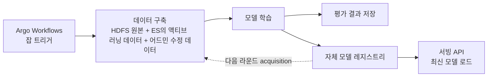

| | |
| --- | --- |
| 발표 | SLASH 23, Data 트랙 |
| 연사 | 조중현 (토스증권 Data Scientist) |
| 자료 | [세션 페이지](https://toss.im/slash-23/session-detail/B2-4) · [발표 영상](https://www.youtube.com/watch?v=dnxaTrKJr0c) |

하루 수천·수만 건 나오는 증권 뉴스에서 사용자에게 필요한 것만 골라 주기 위해 만든 모델 세 개의 이야기다. 뉴스가 어떤 종목의 뉴스인지 맞히는 종목 매칭, 어떤 뉴스가 중요한지 정하는 중요도 측정, 해외 뉴스를 한국어로 옮기는 번역. 세 모델 모두에서 반복되는 주제가 하나 있다. 모델을 바꾸는 것보다 **어떤 데이터를 학습에 넣을지 고르는 방법**이 성능을 좌우했다는 것이다. 내용은 발표 영상과 자동 생성 자막을 근거로 했고, 표현은 내 말로 바꿨다.

## 종목 매칭: 언론사 매칭을 믿을 수 없어서

사용자는 모든 뉴스가 아니라 자기가 가진 종목, 관심 있는 종목의 뉴스만 본다. 그러니 뉴스마다 관련 종목을 알아야 한다. 언론사가 종목 매칭을 붙여 보내 주기는 하는데 두 가지 문제가 있다. 모든 뉴스에 매칭을 붙이지는 않고(일부 언론사는 아예 안 한다), 붙인 것도 틀린다. 석유 단위 "배럴"이 들어간 뉴스를 수영복 브랜드 배럴 종목에 매칭한 예가 나왔다. 그대로 쓰면 품질을 통제할 수 없어서 자체 모델을 만들었다.

문제 정의는 뉴스 제목과 본문을 입력으로 약 3,000개 종목에 대한 **멀티 레이블 분류**다. RoBERTa, ELECTRA, BERT 계열의 한국어 사전학습 모델을 실험해 결과가 가장 좋은 것을 골랐고, 종목별 뉴스 수 차이가 큰 불균형 문제는 클래스별 loss weighting으로 다뤘다.

전반적으로 준수했지만 일부에서 틀렸다. 금리 인상을 뜻하는 "자이언트 스텝"이 나온 뉴스를 국내 종목 자이언트스텝에, 야구 뉴스의 "삼진"을 국내 종목 삼진에 매칭했다. 모델을 바꾸거나 학습 방식을 바꿀 수도 있었지만 가장 큰 원인은 **학습 데이터 구축 과정**에 있다고 봤다.

### 하드 네거티브가 데이터셋에 없었다

학습 데이터는 언론사가 매칭해 준 뉴스인데, 종목이 하나 이상 매칭된 뉴스만 쓸 수 있다. 종목이 하나도 없는 뉴스는 "정말 관련 종목이 없는지" "언론사가 매칭을 안 한 것인지" 구분할 수 없기 때문이다. 그러면 야구 뉴스나 전체 시황 뉴스처럼 종목이 없는 일반 뉴스는 데이터셋에 들어가지 않는다. 그런데 바로 그런 뉴스에 종목명과 비슷한 단어가 자주 나온다. 모델이 판단하기 어려운 **하드 네거티브 샘플**이 학습에서 빠져 있었던 것이다.

이것을 구하려고 **액티브 러닝**을 썼다. 레이블 없는 데이터 중 informative한 것을 acquisition function으로 고르고, 레이블러에게 보내 레이블링한 뒤 추가 학습하는 방법이다. Acquisition function은 **엔트로피 기반**을 골랐다. 각 종목에 대한 예측값이 임계치보다 확실히 크거나 작으면 엔트로피가 낮고, 임계치 근처에 몰려 있으면 엔트로피가 높다. 높다는 것은 모델이 확신하지 못한다는 뜻이고 그것이 하드 샘플이다. 여기에 **종목별 난이도 점수**를 더했다. "삼진", "자이언트 스텝"처럼 동음이의어가 많은 종목은 매칭이 어렵기 때문이다. 난이도는 데이터셋의 뉴스 수 대비 실제 예측된 뉴스 수의 비율로 잡았다. 실제보다 예측이 많다면 잘못된 매칭이 많다고 가정할 수 있다.

### 학습 파이프라인 자동화

액티브 러닝으로 주기적으로 데이터가 쌓이고, 신규 상장 종목의 뉴스도 주기적으로 학습해야 하므로 전체 과정을 자동화했다.

파이프라인 관리는 Kubernetes 친화적이라는 이유로 Argo Workflows를 골랐다. 잡이 트리거되면 HDFS의 원본, Elasticsearch에 적재된 액티브 러닝 데이터, 어드민에서 수정된 데이터를 합쳐 데이터셋을 만들고, 학습 결과를 평가 저장소에, 모델을 자체 레지스트리에 저장한다. 학습된 모델은 다시 액티브 러닝에 쓰이고, 서빙 API는 최신 모델을 받아 간다. 이 1년의 과정으로 매칭 모델이 지속적으로 개선되고 신규 상장 종목도 자동으로 매칭된다.

## 중요도: 사용자 데이터 대신 주가 변동률로 정의한다

관심 가질 만한 뉴스를 추천하거나 주요 뉴스를 상단에 올리려면 랭킹이 필요하다. 흔한 방법은 CTR 같은 사용자 데이터 기반인데, 데이터가 쌓여 신뢰할 만해질 때까지 시간이 걸린다. 주식 뉴스는 **시의성**이 생명이라 발행 즉시 추천돼야 한다. 그래서 사용자 데이터가 아니라 **뉴스 자체만으로** 중요도를 판단하기로 했다.

그러려면 중요도를 나타내는 수치가 있어야 한다. 주식 도메인의 특성을 썼다. 주요 뉴스일수록 발행 뒤 언급된 종목의 주가가 크게 움직이는 경향이 있다. 그래서 **뉴스의 중요도 = 발행 후 언급 종목의 주가 변동률**로 정의했다. 발행 시점 가격 대비 영업일 1~5일 뒤 종가의 변동률을 타깃으로 놓고, 제목과 본문을 입력으로 변동률을 예측하는 **회귀** 문제로 풀었다.

점수를 뽑아 보니 주요 뉴스는 높고, 낮은 뉴스는 대부분 투자에 영향이 없는 것들이었다. 이 점수로 종목별 뉴스 랭킹을 매기고, 주요 뉴스를 추출해 푸시를 보내거나 추천에 쓴다.

## 번역: 일반 말뭉치는 고유명사를 모른다

해외 주식은 국내 언론사 뉴스만으로 부족해 원문을 번역해야 한다. 생성 태스크에 강하고 다국어 데이터로 사전학습된 mBART를 골랐고, 데이터는 AI 허브의 공개 번역 말뭉치를 썼다. 그대로 쓰기엔 문제가 있었다. 해외 종목 Snowflake를 "눈송이"로, Bank of America Securities의 약어를 "A 증권의 B"로 직역했다.

원인을 **데이터 원천**에서 찾았다. AI 허브 말뭉치는 한국어 문장을 영어로 번역해 만든 한영 코퍼스라 일반 문장 구조는 배우지만, 영어 금융 뉴스의 고유명사는 배울 수 없다. 해외 언론사 뉴스 전체로 추가 데이터를 만들려 했지만 번역 데이터 구축은 비용이 크다. 그래서 **최소 비용으로 최대 향상**을 얻을 informative한 데이터만 뽑기로 했다. 여기서도 액티브 러닝이다.

번역 태스크에서 흔히 쓰는 acquisition function은 생성 문장의 평균 confidence(least confidence), 각 단어 생성 시 1위와 2위 확률의 차이(minimal margin), 단어별 확률 분포의 엔트로피(token entropy), 긴 문장 선호를 없앤 total token entropy 등이다. 모두 "모델이 얼마나 확신하는가"를 본다. 그런데 문제는 중의적 고유명사라 모델 예측 기반만으로는 부족했고, **데이터셋 기반** 함수도 필요했다. 단어 빈도를 쓰는 **DLF(decay log frequency) score**를 더했다. 기존 학습 데이터에는 드물지만 새 데이터셋에는 자주 나오는 단어를 포함한 문장에 높은 점수를 주는 방식이다. 최종적으로 token entropy와 DLF를 함께 썼다.

추가 데이터로 학습한 뒤 BLEU가 약 1.5배 올랐다. Bank of America Securities는 "뱅크오브아메리카 증권"으로, "slack"은 "완만한"이 아니라 Slack으로, "Fed"는 "페드"가 아니라 "연준"으로 번역됐다. 국내 뉴스 위주 원천 때문에 한자어로 나오던 번역이 한글로 바뀌어 읽기도 쉬워졌다.

## 리뷰

**세 모델 중 둘의 성능 개선이 "모델"이 아니라 "데이터 선택"에서 왔다.** 종목 매칭은 하드 네거티브가 학습에 없다는 진단에서, 번역은 고유명사가 말뭉치에 없다는 진단에서 시작했고, 둘 다 액티브 러닝으로 "어떤 데이터를 사람에게 보낼지"를 고르는 함수를 설계하는 것이 작업의 핵심이었다. 그리고 두 번 다 모델 불확실성(엔트로피)만으로는 부족해서 **도메인 지식이 들어간 항**(종목별 난이도, 단어 빈도)을 더했다. 범용 acquisition function을 그대로 쓰지 않고 문제에 맞게 고친 지점이다.

**중요도의 정의가 이 발표에서 가장 과감한 결정이다.** "중요한 뉴스"라는 주관적 개념을 "발행 후 주가 변동률"이라는 관측 가능한 수치로 바꿨다. 사용자 반응을 기다릴 필요가 없어 시의성 문제가 풀리고, 레이블링 비용도 없다. 대신 "주가를 움직인 뉴스"와 "사용자에게 중요한 뉴스"가 같다는 가정을 받아들인 것이다.

**모델을 1년 굴리려면 파이프라인이 먼저다.** 액티브 러닝은 한 번 하는 것이 아니라 주기적으로 돌아야 의미가 있고, 신규 상장 종목은 계속 생긴다. 데이터 구축 → 학습 → 레지스트리 → 서빙 → 다시 acquisition으로 이어지는 루프를 자동화한 것이 "지속적으로 개선된다"는 말의 실체다.

## 남는 질문

- 중요도를 주가 변동률로 정의하면 변동성이 큰 종목의 뉴스가 구조적으로 높은 점수를 받는다. 종목의 기본 변동성으로 정규화했는지, 아니면 그 편향을 받아들였는지.
- 같은 정의 아래서 시장 전체가 움직인 날(지수 급락)의 뉴스는 전부 "중요"해진다. 시장 수익률을 뺀 초과 변동률을 썼는지.
- 종목 매칭의 액티브 러닝에서 레이블러는 누구이고 한 라운드에 몇 건을 보내는지. 어드민에서 수정된 데이터가 학습에 들어간다고 했으니 운영자가 레이블러 역할을 겸하는 것으로 보인다.
- 번역 모델의 BLEU 1.5배는 어떤 테스트셋 기준인지. 금융 뉴스 고유명사가 많은 셋이라면 개선 폭이 더 커 보일 수 있다.
- 세 모델의 서빙 지연. 뉴스 발행 즉시 매칭·점수·번역이 나와야 하는데 각 모델의 추론 시간과 순서(매칭 → 중요도 → 번역?)는 언급되지 않았다.

## 참고

- [세션 페이지](https://toss.im/slash-23/session-detail/B2-4)
- [발표 영상](https://www.youtube.com/watch?v=dnxaTrKJr0c)
