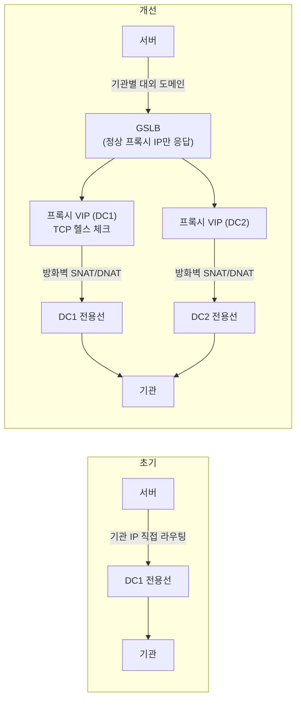

| | |
| --- | --- |
| 발표 | SLASH 24 |
| 연사 | 노두현, 이병건 (토스 Network Engineer) |
| 자료 | [발표 영상](https://www.youtube.com/watch?v=TgHueXsfcPg) · [SLASH 24](https://toss.im/slash-24) |

이 시리즈에서 유일한 네트워크 엔지니어 발표다. 앞부분은 인터넷 구간이라는 "구름"의 가시성을 확보하는 모니터링(통신 3사 LTE 단말, 클라우드 4개 리전, DC 서버를 ISP별로 고정한 11개 환경에서 curl·MTR로 RTT 수집)과 해외망 이슈 때 BGP를 조정해 우회한 사례, 뒷부분은 대외기관 전용선 통신(대외계)에서 백엔드가 기관 IP를 직접 라우팅하던 구조를 NAT → 프록시(L4 로드밸런서 헬스 체크) → GSLB로 개선해 회선 장애 시 자동 우회를 만든 과정이다. 내용은 발표 영상과 자동 생성 자막을 근거로 했고, 자막 품질이 낮아 구조 위주로 정리했다. 표현은 내 말로 바꿨다.

## 1부: 인터넷 구간의 가시성

인터넷은 구름으로 표현된다. 구름 안의 네트워크는 복잡하지만 구조를 몰라도 ISP에 연결되어 편리하게 쓸 수 있다. 그러나 네트워크 엔지니어에게 이 구름은 **그레이 영역**으로 모니터링과 장애 대응이 힘들다. 그 영역의 가시성을 확보해 장애 시 우회 경로를 마련하는 방법이다.

토스는 데이터센터뿐 아니라 네트워크 장비, 인터넷 회선, 인터넷 회선의 ISP까지 이중화되어 있고, 우회 경로 확보도 이중화로 가능해진다. 인터넷 연결은 ISP와 eBGP로 연결되어 토스의 IP를 인터넷에 광고하고, 데이터센터 간에는 iBGP로 연결되어 네트워크 정보를 교환하며 eBGP 경로의 백업 역할을 한다.

### 모니터링 구성

서비스는 외부에서 토스로 오는 인바운드와 토스 내부에서 외부 연계 서비스로 가는 아웃바운드가 있고 모니터링도 구분한다.

| 방향 | 관측 지점 | 대상 |
| --- | --- | --- |
| 인바운드 | 국내 통신 3사 LTE 단말, 클라우드 4개 리전 | 토스 서비스. 물리적으로 분리된 외부에서 수집한 메트릭을 방화벽·프록시·웹서버·모니터링 인프라를 거쳐 보안을 강화한 채 인터넷으로 전달 |
| 아웃바운드 | 두 데이터센터의 서버 4대씩 총 8대 | 외부 연계 서비스(API 등). 프록시를 경유하는 경로도 두어 프록시의 TCP 이슈를 확인 |

핵심은 **프록시·NAT·BGP를 조정해 1번 서버는 ISP A, 2번 서버는 ISP B**로 고정된 회선을 통해 모니터링되도록 경로를 조정한 것이다. 서비스는 두 ISP를 모두 쓰므로 ISP 회선에 이슈가 있으면 문제가 50% 정도로 나타나지만, 모니터링은 **100%** 나타나 더 빠른 확인과 대응이 가능하다.

메트릭은 curl과 MTR로 RTT와 네트워크 경로를 수집하고, NMS로 수집해 Grafana로 시각화한다. curl로 DNS 룩업 시간, TCP·SSL 핸드셰이크 시간, 전체 완료 시간 네 가지 RTT와 HTTP 코드를 측정하고 TCP RTT와 HTTP 코드 기준으로 알림을 받는다. NMS 수집이 가능하도록 `-w` 옵션으로 JSON 형식을 만든다. MTR도 같은 이유로 JSON 옵션을 쓰고 경로 추적을 위해 평균 RTT와 IP·AS 번호를 수집한다. 대시보드는 데이터센터·ISP 회선별 도메인 RTT를 상위에 두고 상세로 내려가 한 도메인의 네 RTT를 환경별로 비교하는 구조다. 총 **11개 모니터링 환경**이 있고, 많아 보일 수 있지만 다양한 환경에서 보면 인터넷 구간에 문제가 생겼을 때 환경별 변화로 흐름을 파악해 정상적인 우회 경로를 확보하는 데 도움이 된다.

### 사례: 해외망 이슈와 BGP 우회

몇 달 전 약 1주일 동안 20시~0시 사이에 해외 연계 서비스 중 하나가 간헐적으로 타임아웃됐다. DC1의 ISP A에서만 RTT 지연이 확인됐고 DC2도 지연 빈도가 있었다. MTR을 보면(위에서 아래로 경로, RTT 값에 따라 색 구분) 특정 홉 이후로 경로 변화가 많았고, AS 번호로 조회하니 그 홉부터 해외 경로였다. 해외망 이슈로 내부 판단했다. ISP B의 MTR은 RTT가 대부분 안정적이고 변화가 많지 않았다.

ISP에 문의하고 해결을 기다리지 않고, 분석대로 RTT 지연이 없는 **ISP B로 모든 인터넷 통신이 되도록 네트워크 장비를 조정**했다. 지연이 많은 DC2만 ISP B로 통신되도록 경로를 조정했고, 해외 이슈가 해결되지 않았지만 우회가 가능했으며, 며칠 뒤 ISP가 해외 이슈임을 확인해 주고 해결됐을 때 설정을 복구했다. 다양한 메트릭 확보와 이중화 구성으로 **문제 해결 전에** 안정적인 우회 경로를 확보할 수 있었다.

지금은 BGP 조정 자동화에 초점을 맞추고 있다. 현재는 장애 시 실수를 방지하기 위해 BGP 상태 체크를 자동으로 하고 조정 확인 스크립트를 실행한다. 여기서 더 나아가 임계치를 정확히 설정할 수 있게 되면 시스템이 유동적으로 경로를 조정하는 것을 목표로 한다.

## 2부: 대외계 구조 개선

대외계는 회사와 회사 간 계약을 공개적인 결혼식에 비유하면, 결혼식 이후 신랑과 신부의 사적인 대화다. 외부에 공개되지 않는 안전한 공간에서 대화를 주고받으며 신뢰를 쌓는 것이 대외기관과의 통신과 비슷하다. 정의하면 **전용선을 통해 타 기관과 API 또는 전문 통신을 하는 별도 시스템**이다. 필요한 장비는 전용선을 연결하는 라우터, 트래픽 통로인 스위치, 서버 접근 제어를 위한 방화벽, 필수는 아니지만 암호화를 위한 VPN, 트래픽을 분산하는 로드밸런서와 GSLB다. 토스 대외계 운영의 포인트는 두 데이터센터를 모두 활용해 통신 장애에 유연하게 대처하고, VPN으로 암호화하며 추가 보안이 필요하면 VPN 장비의 IPsec을 쓰고, 로드밸런서로 트래픽을 분산해 가용성을 보장하는 것이다. 전통적 방법과 다른 접근을 하는 가장 큰 이유는 **보다 완벽한 액티브-액티브 데이터센터**를 만들기 위해서다. 아직 대외계 가동률 100%를 향해 가는 중이지만 지금까지의 여정을 공유한다.

### 초기 구성의 문제

기본 형식은 갖췄지만 운영 경험 부족으로 문제가 있었다. 대표적으로 **백엔드가 기관 서버 IP를 직접 라우팅**해 설정이 복잡하고 관리가 까다로웠다. 한번은 IP가 비슷한 기관의 서버 IP를 삭제해 장애가 났고, 신규 기관의 서버 IP가 다른 기관과 동일해 라우팅에 어려움을 겪었다. 데이터센터마다 별도 전용선을 구성해 회선 이중화는 됐지만, 한쪽 센터의 전용선에 장애가 나면 서버는 트래픽 우회가 되지 않고 회선이 복구될 때까지 장애가 지속됐다.

### NAT

출발지를 바꾸는 SNAT과 도착지를 바꾸는 DNAT을 적용했다. 방화벽의 NAT으로 백엔드는 기관 서버 IP를 직접 라우팅하지 않고 **내부 NAT 대역만** 라우팅한다. 센터마다 별도 IP를 쓰는 NAT을 통해 기관과 통신한다. 라우팅이 단순해지고 중복되는 기관 서버 IP 문제가 해결됐다. 하지만 여전히 특정 센터의 전용선에 문제가 있을 때 서버는 장애를 인지하지 못하고 계속 재시도한다. 애플리케이션 로직을 개선하는 방법도 있지만 **네트워크 레벨에서** 해결하고 싶었다.

### 프록시

여러 솔루션 중 L4/L7 스위치라 불리는 로드밸런서를 택했고 결과는 만족스러웠다. 보통 로드밸런서는 외부에서 유입되는 대량 트래픽을 분산하는 리버스 프록시로 이중화 구성되어 운영된다. 주 역할은 분산이지만 주기적으로 서버 상태를 확인해 정상인 서버에만 트래픽을 보내 안정성을 보장한다. 이 점을 **대외 아웃바운드 통신에** 적용했다. 서버는 프록시로 통신하고 프록시는 방화벽의 NAT을 이용해 기관과 통신한다.

헬스 체크는 ping을 이용한 ICMP, TCP 연결을 이용한 방식, 애플리케이션을 모니터링하는 L7 세 가지가 있는데 토스는 **TCP 방식**으로 기관 서버 상태를 모니터링한다. 일반적인 L7보다 빠르게 조회해 프록시와 서버 부하를 줄이고, 무엇보다 헬스 체크 세션이 **기관 서버의 애플리케이션까지 도달하지 않도록** 하는 목적도 있다. 이제 토스 서버는 한결 단순해졌다. 기관 연결을 위해 프록시의 VIP로 통신하면 되고, 각 센터 방화벽의 NAT으로 두 전용선을 모두 활용하며, 프록시 헬스 체크로 전용선뿐 아니라 다양한 장애가 나면 자동으로 트래픽에서 제외해 정상 경로로만 운영한다.

### GSLB

DNS 기반으로 동작하며 상태 모니터링으로 서버가 정상일 때만 IP를 전달한다. 토스 서버는 양 센터의 프록시를 통해 기관과 통신할 수 있는데 어느 프록시를 쓸지 GSLB가 돕는다. 서버는 프록시 VIP를 몰라도 **기관별로 할당된 대외 도메인**을 호출해 GSLB가 응답하는 IP로 통신하고, 프록시에 문제가 있으면 GSLB가 그 장비의 IP를 전달하지 않아 정상 프록시를 통해 통신한다.

정리하면 NAT으로 백엔드 라우팅을 단순화하고 중복되는 기관 IP를 해결했고, 프록시로 서버 상태를 체크하고 로드밸런싱하며 기관으로의 세션과 응답 속도를 확인할 수 있게 됐고, GSLB로 서버 간 통신을 IP가 아닌 도메인 기반으로 바꾸고 프록시 장애를 감지해 우회하는 수단을 만들었다. 발표자는 이 통신 방식을 많은 기관이 함께한다면 금융 안정화에 도움이 되지 않을까 조심스럽게 예상했다.

## 리뷰

**모니터링 서버를 ISP별로 고정한 것이 1부의 핵심 설계다.** 서비스 트래픽은 두 ISP에 섞여 흐르므로 한쪽 문제가 절반의 증상으로 희석되지만, 관측 지점을 ISP에 고정하면 증상이 100%로 나타난다. 관측을 위해 일부러 이중화를 해제한 셈이고, 이 대비가 없었다면 "20시부터 0시 사이 간헐적 타임아웃"의 원인이 ISP A의 해외 경로라는 것을 일주일 안에 특정하기 어려웠을 것이다. ISP를 기다리지 않고 BGP를 조정해 우회한 것은 [Zero Trust 발표](/posts/slash23-istio-zero-trust/)에서 계열사 트래픽을 GSLB로 위임한 것과 같은 "우리가 제어할 수 있는 지점을 만든다"는 태도다.

**2부는 인바운드용 도구를 아웃바운드에 뒤집어 쓴 이야기다.** 로드밸런서의 헬스 체크는 원래 "우리 서버가 살았는가"를 보는 것인데, 이를 "기관 서버가 살았는가"에 적용해 전용선 장애 시 자동 우회를 만들었다. 애플리케이션이 재시도로 버티던 문제를 네트워크 계층이 흡수했고, 그 결과 [모던 FEP](/posts/slash23-bank-external-linkage/)나 [대출 시스템](/posts/slash22-tossbank-loan-system/)이 다루던 "기관이 죽었을 때"의 일부가 서버 코드 밖으로 나갔다. TCP 헬스 체크를 고른 이유(기관 애플리케이션에 도달하지 않게)는 상대 시스템에 흔적을 남기지 않으려는 대외계다운 배려다.

**"기관 서버 IP가 서로 같다"는 문제는 전용선 대외계에서만 나오는 현실이다.** 사설 대역을 각 기관이 임의로 쓰니 겹칠 수 있고, NAT으로 내부 대역에 매핑해야 라우팅이 성립한다. 클라우드나 인터넷 API에서는 볼 수 없는 제약이라 이 발표의 기록 가치가 있다.

## 남는 질문

- BGP 우회를 자동화하면 오탐으로 인한 경로 플래핑이 위험하다. 임계치 외에 히스테리시스나 최소 유지 시간 같은 안전장치를 어떻게 둘 계획인지.
- TCP 헬스 체크는 포트가 열려 있으면 정상으로 보므로 기관 애플리케이션이 죽었는데 포트만 살아 있는 경우를 못 잡는다. 그 경우는 애플리케이션 서킷([마이데이터 코디네이터](/posts/slash24-mydata-operations/) 같은)에 맡기는지.
- 전문(TCP 장기 세션) 통신은 프록시를 거치면 세션 관리가 달라진다. FEP의 요청·응답 세션 분리 구조와 프록시 헬스 체크가 어떻게 공존하는지.
- 11개 모니터링 환경에서 curl·MTR을 얼마나 자주 돌리는지. 해외 도메인에 대한 잦은 MTR이 상대에게 부담이 되지는 않는지.

## 참고

- [발표 영상](https://www.youtube.com/watch?v=TgHueXsfcPg)
- [SLASH 24](https://toss.im/slash-24)
- [MTR](https://github.com/traviscross/mtr)
- 애플리케이션 계층의 대외기관 연동: [SLASH 23 토스뱅크의 모던 FEP 리뷰](/posts/slash23-bank-external-linkage/)
